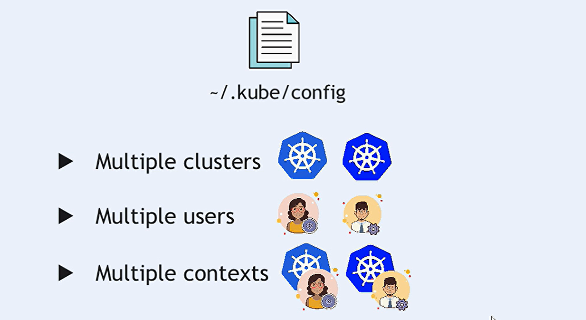
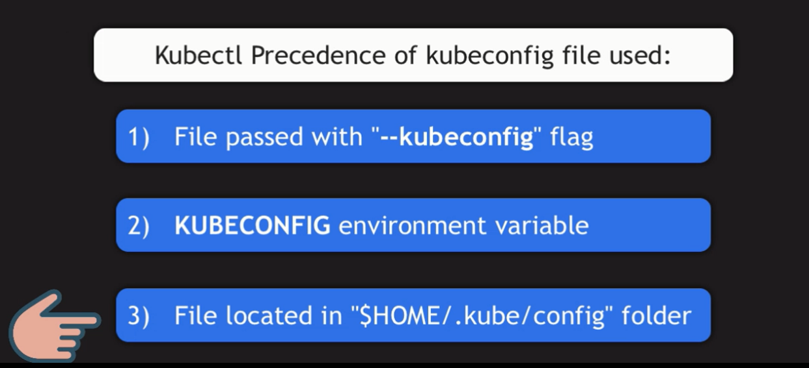

# Context with Multi Clusters in Kubernetes

A `context` in Kubernetes combines a `cluster`, `user`, and `namespace`. It allows users to switch between different configurations easily, enabling efficient management of multiple clusters. ser details.



## Components of a Context

A context consists of three main components:

- **Cluster**: The API server of the Kubernetes cluster.
- **User**: The credentials used to authenticate with the cluster.
- **Namespace**: The default namespace for commands if not specified.

## The `~/.kube/config` File

The `kubeconfig` file, typically located at `~/.kube/config`, contains information about clusters, users, contexts, and the current context. Its structure includes:

### 1. Clusters Section

Defines the clusters available for connection.

```yaml
clusters:
  - name: <cluster-name>
    cluster:
      server: https://<api-server>:6443
      certificate-authority: /path/to/ca.crt
      insecure-skip-tls-verify: false
```

### 2. Users Section

Defines user credentials and authentication methods.

```yaml
users:
  - name: <user-name>
    user:
      client-certificate: /path/to/client.crt
      client-key: /path/to/client.key
      token: <token>
```

### 3. Contexts Section

Links users and clusters.

```yaml
contexts:
  - name: <context-name>
    context:
      cluster: <cluster-name>
      user: <user-name>
      namespace: <namespace>
```

### 4. Current Context

Indicates the active context.

```yaml
current-context: <context-name>
```

## Connecting to a Cluster



## Managing Multiple Contexts

```bash
# view all available contexts
kubectl config get-contexts
```

```bash
# switch to a different context, use:
kubectl config use-context <context-name>
```

```bash
# create a new context
kubectl config set-context <context-name> \
--cluster=<cluster-name> \
--user=<user-name> \
--namespace=<namespace>
```

```bash
# You can specify the context directly in commands:
kubectl --context=<context-name> get deployments

kubectl --context=prod-context get deployments
```

## Example Workflow with Multiple Clusters

### 1. **Add Clusters and Users**

Ensure clusters and user credentials are added to your kubeconfig.

```bash
kubectl config set-cluster <cluster-name> --server=https://<api-server>:6443
kubectl config set-credentials <user-name> --token=<your-token>
```

### 2. **Create Contexts**

Create a context for each cluster.

```bash
kubectl config set-context dev-context --cluster=dev-cluster --user=dev-user --namespace=dev-namespace
kubectl config set-context prod-context --cluster=prod-cluster --user=prod-user --namespace=prod-namespace
```

### 3. **Switch Contexts**

Change the current context as needed

```bash
kubectl config use-context dev-context
```

### 4. **Run Commands**

Execute commands in the context of the currently active cluster

```bash
kubectl get pods  # Runs in the dev-namespace of the dev-cluster.
```

## Best Practices

- **Descriptive Context Names**: Use clear names for easy identification.
- **Regular Cleanup**: Periodically remove unused contexts to avoid clutter.
- **Version Control**: Consider version-controlling your kubeconfig file, especially in team environments.

## Conclusion

Managing contexts in Kubernetes is essential for efficient operations across multiple clusters. By understanding the structure of the kubeconfig file and how to manipulate contexts, users can streamline their workflows and reduce the risk of errors when switching between environments. Mastering contexts enhances your ability to work effectively in a multi-cluster environment.
