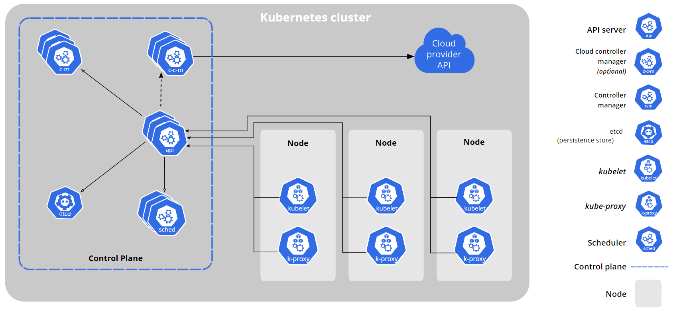

# Kubernetes Cluster Architecture

## **1. Master Node Components**

These components manage the Kubernetes cluster and are responsible for the overall control of the cluster.

### **a. API Server (`kube-apiserver`)**

- **Role**: Acts as the front-end for the Kubernetes control plane.
- **Function**: Exposes the Kubernetes API, handles RESTful operations, validates and configures data for the API objects.
- **Interaction**: All communication within the cluster goes through the API server.

### **b. etcd**

- **Role**: Key-value store for all cluster data.
- **Function**: Stores configuration data, state information, and metadata about the cluster.
- **Interaction**: Serves as the single source of truth for the cluster’s state.

### **c. Scheduler (`kube-scheduler`)**

- **Role**: Assigns pods to nodes.
- **Function**: Watches for newly created pods with no node assigned and selects nodes for them to run on.
- **Interaction**: Ensures that pods are scheduled based on resource requirements, constraints, and policies.

### **d. Controller Manager (`kube-controller-manager`)**

- **Role**: Runs controller processes.
- **Function**: Ensures that the cluster's desired state matches its actual state by managing various controllers.
- **Types of Controllers**:
  - **Node Controller**: Monitors and responds to node failures.
  - **Replication Controller**: Ensures the specified number of pod replicas are running.
  - **Deployment Controller**: Manages deployment updates.
  - **Job Controller**: Manages batch jobs.
  - **DaemonSet Controller**: Ensures that all (or some) nodes run a copy of a pod.
  - **StatefulSet Controller**: Manages stateful applications.
  - **Endpoint Controller**: Manages endpoint objects, mapping services to pods.
  - **Service Account & Token Controllers**: Manages service accounts and tokens.

### **e. Cloud Controller Manager**

- **Role**: Integrates with cloud service providers.
- **Function**: Manages cloud-specific controller logic such as node management, load balancing, and storage provisioning.

## **2. Node Components**

These components run on every node, both master and worker, and ensure that the necessary tasks are performed.

### **a. Kubelet**

- **Role**: Node agent.
- **Function**: Ensures that containers are running in a pod as expected.
- **Interaction**: Communicates with the API server, watches for pod specifications, and maintains pod health.

### **b. Kube-proxy**

- **Role**: Network proxy.
- **Function**: Maintains network rules on nodes to allow communication to pods.
- **Interaction**: Facilitates networking for services within and outside of the cluster.

### **c. Container Runtime**

- **Role**: Runs containers.
- **Function**: Provides the necessary runtime to run containers.
- **Examples**: Docker, containerd, CRI-O.

## **3. Cluster-Wide Components**

These components manage the configuration, networking, and storage for the entire cluster.

### **a. Services**

- **Role**: Abstracts and exposes a set of pods as a network service.
- **Function**: Provides a stable IP address and DNS name for a set of pods, enabling communication between components.
- **Types**: ClusterIP, NodePort, LoadBalancer, ExternalName.

### **b. ConfigMaps**

- **Role**: Stores configuration data.
- **Function**: Provides configuration information in the form of key-value pairs to be used by pods and other components.

### **c. Secrets**

- **Role**: Stores sensitive data.
- **Function**: Provides a mechanism to store and manage sensitive information such as passwords, OAuth tokens, and SSH keys.

### **d. Namespaces**

- **Role**: Provides a mechanism to partition resources.
- **Function**: Allows the separation of resources within a cluster to create isolated environments for different projects, teams, or applications.

## **4. Networking Components**

These components provide networking capabilities within the cluster.

### **a. CoreDNS**

- **Role**: Cluster DNS.
- **Function**: Provides DNS for services and pods.
- **Interaction**: Automatically assigns DNS names to services and pods.

### **b. Ingress**

- **Role**: Manages external access to services.
- **Function**: Provides load balancing, SSL termination, and name-based virtual hosting.
- **Interaction**: Uses Ingress controllers to manage and route external traffic.

## **5. Storage Components**

These components manage storage resources for the cluster.

### **a. Persistent Volume (PV)**

- **Role**: Abstracts storage resources.
- **Function**: Represents a piece of storage in the cluster.
- **Interaction**: Provisioned by an administrator or dynamically through a StorageClass.

### **b. Persistent Volume Claim (PVC)**

- **Role**: Requests storage.
- **Function**: Allows users to request specific storage resources.
- **Interaction**: Binds to a PV to use the storage.

## **6. Add-ons**

These are additional components that can be added to a Kubernetes cluster to enhance its capabilities.

- **Monitoring:** Tools like Prometheus and Grafana for metrics collection and visualization.
- **Logging:** Tools like Fluentd, Elasticsearch, and Kibana (EFK stack) for log aggregation, storage, and analysis.

### **a. Monitoring Tools**

- **Examples**: Prometheus, Grafana.
- **Function**: Collect metrics and visualize cluster performance.

### **b. Logging Tools**

- **Examples**: Fluentd, Elasticsearch, Kibana (EFK stack).
- **Function**: Aggregate, store, and analyze logs from the cluster.

### **c. Network Plugins (CNI):**

- Implements the Kubernetes networking model.
- Provides inter-pod communication and connectivity.
- Examples include Calico, Flannel, Weave, and Cilium.

### **d. Monitoring & Logging:**

## **7. Package Management**

These tools help manage Kubernetes applications and resources.

### **a. Helm**

- **Role**: Package manager for Kubernetes.
- **Function**: Manages Kubernetes applications using Helm charts, which are packages of pre-configured Kubernetes resources.

## **Cluster Architecture Summary**

## **Interaction Summary**

- **Master Node**: Manages the entire cluster through components like the API server, etcd, scheduler, and controller manager.
- **Worker Nodes**: Run the application workloads and have components like kubelet and kube-proxy to manage pod lifecycle and networking.
- **Cluster-Wide Components**: Services, ConfigMaps, Secrets, and Namespaces manage configuration, networking, and storage resources.
- **Networking and Storage**: CoreDNS, Ingress, PVs, and PVCs ensure efficient resource utilization and accessibility.
- **Add-ons and Package Management**: Enhance functionalities such as monitoring, logging, and application management with tools like Helm.

By understanding these components and their interactions, you will be better equipped to manage and troubleshoot a Kubernetes cluster effectively.
