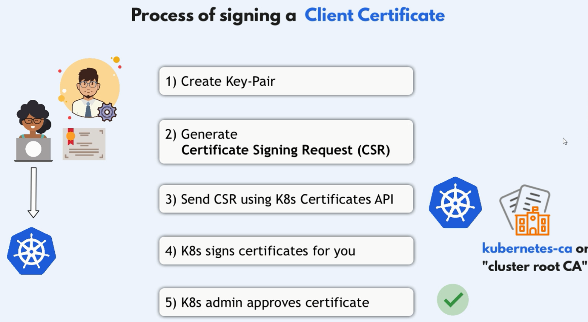

# Comprehensive Guide to Managing `kubeconfig` in Kubernetes

Managing Kubernetes clusters efficiently requires a solid understanding of the `kubeconfig` file. This guide delves into everything you need to know about `kubeconfig` in Kubernetes (k8s), including setting up user credentials, switching contexts between clusters, and configuring `kubeconfig` files. We'll organize the content systematically and provide practical examples to help you master `kubeconfig` management.

## Table of Contents

1. [Introduction to `kubeconfig`](#introduction-to-kubeconfig)
2. [Understanding `kubeconfig` Structure](#understanding-kubeconfig-structure)
3. [Setting Up User Credentials](#setting-up-user-credentials)
   - [Using Certificates](#1-using-certificates)
   - [Using Token-Based Authentication](#2-using-token-based-authentication)
   - [Using Username and Password](#3-using-username-and-password)
4. [Managing Multiple Clusters and Contexts](#managing-multiple-clusters-and-contexts)
   - [Adding a New Cluster](#adding-a-new-cluster)
   - [Adding a New User](#adding-a-new-user)
   - [Creating a New Context](#creating-a-new-context)
5. [Switching Between Contexts](#switching-between-contexts)
   - [Listing Available Contexts](#listing-available-contexts)
   - [Setting the Current Context](#setting-the-current-context)
6. [Merging Multiple `kubeconfig` Files](#merging-multiple-kubeconfig-files)
7. [Best Practices for Managing `kubeconfig`](#best-practices-for-managing-kubeconfig)
8. [Practical Examples](#practical-examples)
   - [Example 1: Configuring Access to Multiple Clusters](#example-1-configuring-access-to-multiple-clusters)
   - [Example 2: Automating Context Switching](#example-2-automating-context-switching)
9. [Troubleshooting `kubeconfig` Issues](#troubleshooting-kubeconfig-issues)
10. [Conclusion](#conclusion)

## Introduction to `kubeconfig`

The `kubeconfig` file is a YAML file used by `kubectl` and other Kubernetes tools to configure access to Kubernetes clusters. It contains information about clusters, users, and contexts, enabling seamless interaction with multiple Kubernetes environments.

### Key Components of `kubeconfig`

- **Clusters**: Define the Kubernetes API server endpoints.
- **Users**: Store credentials for authenticating to clusters.
- **Contexts**: Combine a cluster and a user to define access parameters.

By effectively managing the `kubeconfig` file, you can streamline operations across different Kubernetes clusters and environments.

## Understanding `kubeconfig` Structure

A typical `kubeconfig` file is structured into several sections:

```yaml
apiVersion: v1
kind: Config
clusters:
  - name: cluster-name
    cluster:
      server: https://api.cluster-domain.com
      certificate-authority: /path/to/ca.crt
users:
  - name: user-name
    user:
      client-certificate: /path/to/client.crt
      client-key: /path/to/client.key
contexts:
  - name: context-name
    context:
      cluster: cluster-name
      user: user-name
current-context: context-name
```

### Sections Explained:

- **clusters**: Lists the clusters with their API server addresses and CA certificates.
- **users**: Contains user credentials, which can include client certificates, tokens, or other authentication methods.
- **contexts**: Links a user to a cluster, effectively creating an access scenario.
- **current-context**: Specifies which context is active by default.

## Setting Up User Credentials

Setting up user credentials is crucial for authenticating with Kubernetes clusters. Depending on your security requirements, you can use various authentication methods.


### **1. Using Certificates**

Certificates provide a secure way to authenticate users.



1. **Generate key-pair for user using openssl**: `openssl genrsa -out hady.key 2048`
2. **Generate CSR**: `openssl req -new -key hady.key -subj "/CN=hady/O=dev-group" -out hady.csr`
3. **Send CSR using k8s Certificates API**: create a certification request yaml file and send it to k8s.
4. **K8s Signs Certificates for you**: by default, k8s will sign the certificate for 1 year
5. **K8s admin approves certificate**: `kubectl certificate approve hady`
6. **Create .crt file**

#### 1. **Generate a Key Pair for the User**

First, you'll generate a private key for the user "hady" using OpenSSL.

```bash
openssl genrsa -out hady.key 2048
```

> _**`hady.key`**: This is the private key that will be used to generate the CSR and later to establish a secure connection with the Kubernetes API server._

#### 2. **Generate a Certificate Signing Request (CSR)**

Next, create a CSR using the private key. This CSR will be submitted to Kubernetes for signing.

```bash
openssl req -new -key hady.key -subj "/CN=hady/O=dev-group" -out hady.csr
```

> **`/CN=hady`**: The Common Name (CN) field represents the username in Kubernetes.  
> **`/O=dev-group`**: The Organization (O) field is typically used for group membership in Kubernetes.  
> **`hady.csr`**: This is the CSR file that you'll submit to Kubernetes.

#### 3. **Create a [Certificate Signing Request](https://kubernetes.io/docs/reference/access-authn-authz/certificate-signing-requests/) (CSR) in Kubernetes**

Create a Kubernetes CSR resource by writing a YAML file that includes the Base64-encoded CSR. This CSR will request that Kubernetes signs the certificate.

##### **Example CSR YAML File (`hady-csr.yaml`)**

```yaml
apiVersion: certificates.k8s.io/v1
kind: CertificateSigningRequest
metadata:
  name: hady
spec:
  groups:
    - system:authenticated
  request: <Base64-encoded-hady.csr>
  signerName: kubernetes.io/kube-apiserver-client
  usages:
    - client auth
```

> **`metadata.name`**: The name of the CSR resource in Kubernetes, here set to "hady".  
> **`groups`**: The group that the user belongs to, which will be "system:authenticated" by default.  
> **`request`**: The Base64-encoded CSR from the previous step.  
> **`signerName`**: Specifies the signer, which is typically `kubernetes.io/kube-apiserver-client` for client authentication certificates.  
> **`usages`**: Specifies that this certificate will be used for client authentication.

##### **Command to Encode the CSR**

You can encode the CSR directly in your terminal and insert it into the YAML file:

```bash
cat hady.csr | base64 | tr -d '\n'
```

Replace the <Base64-encoded-hady.crt> placeholder in the YAML file with the actual Base64-encoded string.

##### **Apply the CSR to Kubernetes**:

Once the YAML file is ready, apply it to the Kubernetes cluster:

```bash
kubectl apply -f hady-csr.yaml
```

#### 4. **Kubernetes Signs the Certificate**

By default, Kubernetes will automatically sign the CSR once it's approved. The certificate is typically valid for one year unless otherwise configured.

#### 5. **Kubernetes Admin Approves the Certificate**

After submitting the CSR, a Kubernetes administrator (or the appropriate user with the right permissions) must approve the certificate:

```bash
kubectl get csr
kubectl certificate approve hady
```

> _**`hady`**: This is the name of the CSR you submitted (as defined in the `metadata.name` field of the YAML file)._

#### 6. **Create .crt file**

Once the CSR is approved, you can retrieve the signed certificate and save it to a file:

```bash
kubectl get csr hady -o jsonpath='{.status.certificate}' | base64 --decode > hady.crt
```

> _**`hady.crt`**: This file contains the signed certificate that you can use in your kubeconfig file._

#### 7. Test request

```bash
curl https://my-kube-playground:6443/api/v1/pods \
--key admin.key \
--cert admin.crt \
--cacert ca.crt
```

```bash
kubectl get pods \
--server my-kube-playground:6443 \
--client-key admin.key \
--client-certificate admin.crt \
--certificate-authority ca.crt
```

---

### **2. Using Token-Based Authentication**

**Token-Based Authentication** allows users or applications to authenticate to a Kubernetes cluster using a bearer token. This method is often used for service accounts, automation scripts, or integrating external systems.

- **Bearer Token**: A string that grants access to the Kubernetes API. It's typically associated with a service account.
- **Service Account**: An account for processes running inside pods. It provides an identity for processes that run in a Pod.

Before proceeding, ensure you have the following:

1. **Access to the Kubernetes Cluster**: Administrative privileges to create service accounts and role bindings.
2. **`kubectl` Installed**: The Kubernetes command-line tool should be installed on your machine.
3. **Proper Permissions**: Ability to create service accounts, roles, and role bindings within the cluster.

To use token-based authentication, you need a **Service Account** with the appropriate permissions and its associated token.

#### **Step 1: Create a Service Account**

```bash
kubectl create serviceaccount <service-account-name> -n <namespace>

kubectl create serviceaccount hady-sa -n token-auth
```

#### **Step 2: Retrieve the Service Account Token**

Depending on your Kubernetes version, the method to retrieve the token may vary.

##### **For Kubernetes v1.24 and Above**

Starting from Kubernetes v1.24, the older secrets method is deprecated. Instead, tokens are managed via the `TokenRequest` API.

```bash
kubectl create token <service-account-name> -n <namespace>

kubectl create token hady-sa -n token-auth
```

> **Output:** A JWT token string.  
> _Note: This command requires at least Kubernetes v1.24._

##### **For Kubernetes Versions Below v1.24**

###### 1. **List Secrets Associated with the Service Account**

```bash
kubectl get secrets -n token-auth
```

> _Look for a secret with the service account name, e.g., `hady-sa-token-xxxxx`._

###### 2. **Retrieve the Token from the Secret**

```bash
# _Look for the `token:` field in the output._
kubectl describe secret hady-sa-token-xxxxx -n token-auth

# Alternatively, to extract only the token:
kubectl get secret hady-sa-token-xxxxx -n token-auth -o jsonpath='{.data.token}' | base64 --decode
```

> _Ensure you replace `hady-sa-token-xxxxx` with the actual secret name._

---

### **3. Basic Authentication in Kubernetes**

Basic authentication can be configured in Kubernetes using two methods:

1. **Username and Password File**
2. **Username and Token File**

#### ⚠️ **Important Warning:**

Both **username/password** and **token-based authentication** using static files are **deprecated** and not recommended for production environments. Use them only for testing or controlled scenarios. For production, prefer **more secure authentication mechanisms** like **OIDC**, **service accounts**, or **client certificates**.

#### **1. Using User:Password File**

##### Step 1: Create the Password File

Create a file `/tmp/users/user-details.csv` to store user credentials.

```bash
sudo mkdir -p /tmp/users/
sudo nano /tmp/users/user-details.csv
```

Add user entries in the following format:

```plaintext
password123,user1,u0001
password123,user2,u0002
password123,user3,u0003
password123,user4,u0004
password123,user5,u0005
```

##### Step 2: Modify the API Server Configuration

1. Open the kube-apiserver manifest:

   ```bash
   sudo nano /etc/kubernetes/manifests/kube-apiserver.yaml
   ```

2. Add the `--basic-auth-file` flag to the API server configuration:

   ```yaml
   containers:
     - command:
         - kube-apiserver
         - --basic-auth-file=/tmp/users/user-details.csv
       # other configuration...
   ```

3. Save the file and exit the editor. The API server will restart automatically.

##### Step 3: Verify Authentication

Use the following `curl` command to authenticate using the username and password:

```bash
curl -v -k https://localhost:6443/api/v1/pods -u "user1:password123"
```

---

#### **2. Using User:Token File**

##### Step 1: Create the Token Authentication File

Create a file `/tmp/users/token-auth.csv` to store token-based credentials.

```bash
sudo nano /tmp/users/token-auth.csv
```

Add entries in the following format:

```plaintext
12345.token.user1,user1,u0001
67890.token.user2,user2,u0002
abcdef.token.user3,user3,u0003
```

- **`12345.token.user1`**: Token
- **`user1`**: Username
- **`u0001`**: User ID (optional)

##### Step 2: Modify the API Server Configuration

1. Edit the kube-apiserver manifest:

   ```bash
   sudo nano /etc/kubernetes/manifests/kube-apiserver.yaml
   ```

2. Add the `--token-auth-file` flag:

   ```yaml
   containers:
     - command:
         - kube-apiserver
         - --token-auth-file=/tmp/users/token-auth.csv
       # other configuration...
   ```

3. Save the file and exit the editor. The API server will restart automatically.

##### Step 3: Verify Authentication Using Token

Use the following `curl` command to authenticate using a token:

```bash
curl -v -k https://localhost:6443/api/v1/pods \
  -H "Authorization: Bearer 12345.token.user1"
```

---

#### **Security Considerations**

- Always use HTTPS when enabling basic or token authentication to prevent credential interception.
- Avoid using static credentials in production. Integrate **OIDC** or **service accounts** for secure, scalable authentication.
- Monitor the API server logs to ensure correct setup:
  ```bash
  sudo journalctl -u kubelet -f
  ```

## Managing Multiple Clusters and Contexts

Kubernetes environments often involve multiple clusters (e.g., development, staging, production). Managing these efficiently requires understanding how to add clusters, users, and create contexts.

### 1. Adding a New Cluster

```bash
kubectl config set-cluster new-cluster \
  --server=https://api.new-cluster-domain.com \
  --certificate-authority=path/to/new-cluster-ca.crt
```

### 2. Adding a New User

Depending on the authentication method:

#### **Using Certificates**

```bash
kubectl config set-credentials new-user \
  --client-certificate=path/to/new-user.crt \
  --client-key=path/to/new-user.key
```

#### **Using Token**

```bash
kubectl config set-credentials new-user --token=new-token
```

### 3. Creating a New Context

```bash
kubectl config set-context new-context \
  --cluster=new-cluster \
  --user=new-user \
  --namespace=your-namespace # default namespace for this context
```

## Switching Between Contexts

Contexts define the cluster and user combination. Switching contexts allows you to interact with different clusters seamlessly.

### 1. Listing Available Contexts

```bash
kubectl config get-contexts
```

**Example Output:**

```ini
CURRENT   NAME            CLUSTER         AUTHINFO        NAMESPACE
*         dev-context     dev-cluster     dev-user         dev
          prod-context    prod-cluster    prod-user        prod
```

### 2. Setting the Current Context

```bash
kubectl config use-context prod-context
```

To verify the current context:

```bash
kubectl config current-context
```

## Merging Multiple `kubeconfig` Files

When working with multiple clusters, you might have separate `kubeconfig` files. Merging them allows centralized management.

### Steps to Merge

1. **Set KUBECONFIG Environment Variable**:

   ```bash
   export KUBECONFIG=~/.kube/config:/path/to/other/config
   ```

2. **Merge Configurations**:

   ```bash
   kubectl config view --flatten > ~/.kube/merged-config
   mv ~/.kube/merged-config ~/.kube/config
   ```

Alternatively, use `kubectl config` commands to add clusters, users, and contexts manually as shown earlier.

## Best Practices for Managing `kubeconfig`

1. **Use Separate Contexts for Different Environments**: Clearly name contexts to reflect their purpose (e.g., `dev`, `staging`, `prod`).

2. **Secure Your `kubeconfig` Files**: Ensure that the `kubeconfig` file has appropriate file permissions to prevent unauthorized access.

3. **Leverage External Authentication Providers**: Integrate with OAuth, OIDC, or other identity providers for enhanced security.

4. **Automate Context Switching**: Use scripts or tools to streamline switching between contexts, especially in CI/CD pipelines.

5. **Regularly Rotate Credentials**: Periodically update certificates, tokens, and other credentials to maintain security.

6. **Backup Your `kubeconfig`**: Keep backups of your `kubeconfig` files to prevent loss of access.

## Practical Examples

### Example 1: Configuring Access to Multiple Clusters

Suppose you have two clusters: `development` and `production`. Here's how to configure access to both.

1. **Add Clusters**:

   ```bash
   kubectl config set-cluster development \
     --server=https://dev-api.cluster.local \
     --certificate-authority=~/.kube/ca-dev.crt

   kubectl config set-cluster production \
     --server=https://prod-api.cluster.local \
     --certificate-authority=~/.kube/ca-prod.crt
   ```

2. **Add Users**:

   ```bash
   kubectl config set-credentials dev-user \
     --client-certificate=~/.kube/dev-user.crt \
     --client-key=~/.kube/dev-user.key

   kubectl config set-credentials prod-user \
     --client-certificate=~/.kube/prod-user.crt \
     --client-key=~/.kube/prod-user.key
   ```

3. **Create Contexts**:

   ```bash
   kubectl config set-context development \
     --cluster=development \
     --user=dev-user \
     --namespace=dev

   kubectl config set-context production \
     --cluster=production \
     --user=prod-user \
     --namespace=prod
   ```

4. **Switch Between Contexts**:

   ```bash
   kubectl config use-context development
   # Now you're set to interact with the development cluster

   kubectl config use-context production
   # Switches to the production cluster
   ```

### Example 2: Automating Context Switching

For developers working across multiple contexts, automating context switching can save time.

1. **Create a Shell Function**:

   ```bash
   switch_kube_context() {
     if [ -z "$1" ]; then
       echo "Usage: switch_kube_context <context-name>"
       return 1
     fi
     kubectl config use-context "$1"
     if [ $? -eq 0 ]; then
       echo "Switched to context: $1"
     else
       echo "Failed to switch context to: $1"
     fi
   }
   ```

2. **Add to Shell Configuration**:

   - Add the function to your `.bashrc` or `.zshrc` file.
   - Reload the shell:

     ```bash
     source ~/.bashrc
     ```

3. **Use the Function**:

   ```bash
   switch_kube_context development
   ```

## Troubleshooting `kubeconfig` Issues

1. **Invalid Credentials**:

   - **Symptom**: Authentication errors when running `kubectl` commands.
   - **Solution**: Verify that the user credentials in `kubeconfig` are correct and not expired.

2. **Incorrect Context**:

   - **Symptom**: Commands affecting the wrong cluster.
   - **Solution**: Check the current context with `kubectl config current-context` and switch if necessary.

3. **Cluster Unreachable**:

   - **Symptom**: Unable to connect to the Kubernetes API server.
   - **Solution**: Ensure the `server` address is correct and that your network allows access.

4. **Certificate Issues**:

   - **Symptom**: TLS handshake errors.
   - **Solution**: Verify that the CA certificates and client certificates are correctly specified and valid.

5. **Merging Conflicts**:
   - **Symptom**: Duplicate entries or overwritten configurations after merging.
   - **Solution**: Use `kubectl config view --merge --flatten` to merge configurations carefully and avoid duplicates.

## Conclusion

Managing the `kubeconfig` file is a fundamental skill for anyone working with Kubernetes. By understanding the structure of `kubeconfig`, setting up user credentials, managing multiple clusters and contexts, and following best practices, you can streamline your Kubernetes workflows and enhance your operational efficiency. Use the examples provided to apply these concepts in real-world scenarios, and refer back to this guide as a comprehensive resource for all things related to `kubeconfig`.
