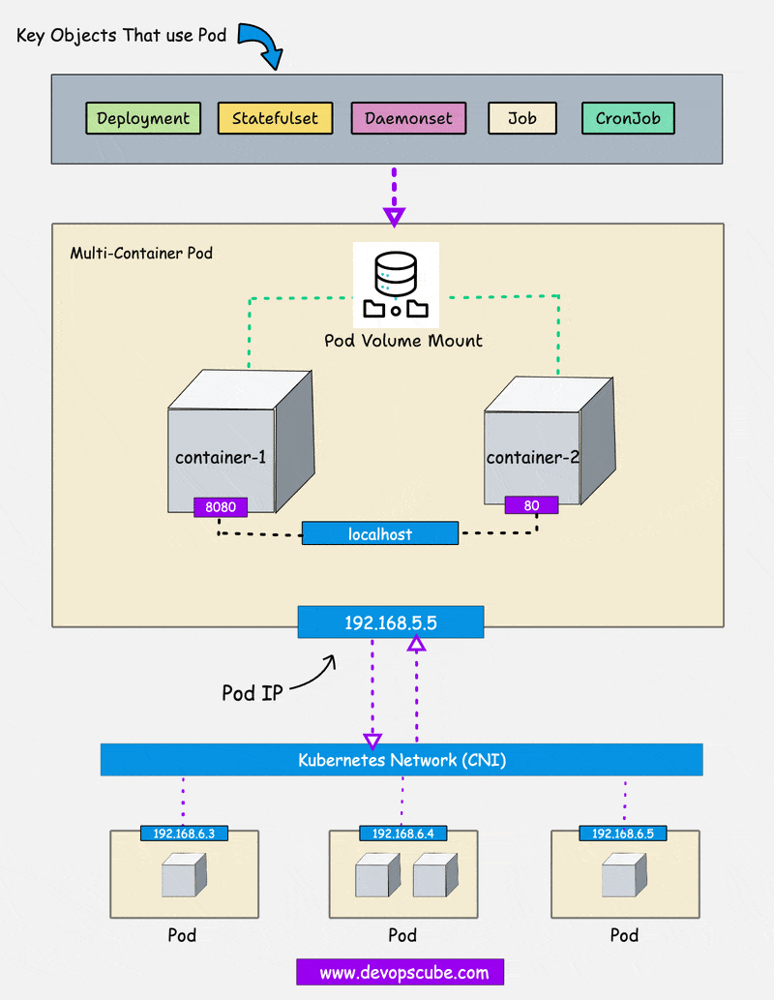

# Pod



- **Definition**: A Pod is the smallest and simplest unit in the Kubernetes object model. It represents a single instance of a running process in your cluster.
- **Composition**: A Pod can contain one or more containers, usually Docker containers, that share the same network namespace, IP address, and storage.
- **Purpose**: Pods are used to run applications in Kubernetes, and they encapsulate the application container(s) along with the storage resources, a unique network IP, and options that govern how the container(s) should run.

## Pod Information

When we refer to "Pod information" in Kubernetes, we're talking about the various details and metadata that describe a Pod's state, configuration, and behavior within a Kubernetes cluster. Understanding this information is essential for effectively managing and troubleshooting Pods.


### 1. **Metadata**

- **Name**: The unique name of the Pod within its namespace.
- **Namespace**: The logical grouping for the Pod, used to isolate different environments or teams.
- **UID**: A unique identifier assigned to the Pod, which remains consistent throughout the Pod's lifecycle.
- **Labels**: Key-value pairs that are attached to the Pod for organizing and selecting Pods (e.g., `app=nginx`).
- **Annotations**: Arbitrary metadata that can be attached to the Pod, often used for non-identifying information like build numbers or descriptions.

### 2. **Spec (Specification)**

- **Containers**: The list of containers that run inside the Pod, including their images, ports, and resource requests/limits.
- **Volumes**: Defines storage resources that are shared between containers in the Pod.
- **Service Account**: Specifies the service account used by the Pod for authentication to the Kubernetes API.
- **Node Selector**: Defines constraints on which node the Pod should run based on labels.
- **Affinity and Anti-affinity**: Rules that define where a Pod should be placed in relation to other Pods (e.g., on the same or different nodes).
- **Tolerations**: Allows the Pod to be scheduled on nodes with matching taints, often used for special node configurations.
- **Restart Policy**: Defines the conditions under which the Pod should be restarted (`Always`, `OnFailure`, or `Never`).

### 3. **Status**

- **Phase**: High-level summary of the Pod's current state (`Pending`, `Running`, `Succeeded`, `Failed`, `Unknown`).
- **Conditions**: Detailed conditions of the Pod’s state, such as `PodScheduled`, `ContainersReady`, `Initialized`, and `Ready`.
- **Host IP**: The IP address of the node where the Pod is running.
- **Pod IP**: The IP address assigned to the Pod within the cluster network.
- **Container Statuses**: Detailed information about the state of each container in the Pod, including:
  - **Running/Waiting/Terminated**: Current state of the container.
  - **Last State**: Previous state of the container, useful for debugging (e.g., if it recently crashed).
  - **Restart Count**: Number of times the container has been restarted.
  - **Logs**: Output and error logs from the container’s processes.

### 4. **Events**

- **Description**: Events provide a chronological record of what has happened to the Pod. This includes scheduling, image pulling, container starting, and errors.
- **Type**: Can be `Normal` or `Warning`, indicating the nature of the event.
- **Reason**: A short reason explaining the event (e.g., `FailedScheduling`, `Pulling`, `Started`).
- **Source**: Identifies which component (e.g., `kubelet`, `scheduler`) generated the event.
- **Message**: A human-readable description of the event.

## Common Pod Commands

Here are the most commonly used commands related to Pods in Kubernetes, along with explanations and examples:

### 1. **Creating Pods**

#### **Directly from a YAML file**

```yaml
apiVersion: v1
kind: Pod
metadata:
  name: my-pod
  namespace: default
spec:
  containers:
    - name: my-container
      image: nginx
```

```bash
kubectl apply -f pod.yaml
```

#### **Imperatively (for simple Pods)**:

```bash
kubectl run my-pod --image=nginx --restart=Never
```

- **Purpose**: Quickly create a Pod without a YAML file. The `--restart=Never` flag ensures that it creates a Pod instead of a Deployment.

### 2. **Listing and Describing Pods**

#### **List all Pods in the current namespace**

```bash
# Get Pods in the default namespace
kubectl get pods

# Get Pods in a specific namespace
kubectl get pods -n <namespace>

# Get Pods in all namespaces
kubectl get pods --all-namespaces
kubectl get pods -A
```

#### **Describe a specific Pod**

```bash
kubectl describe pod <pod-name>
```

- **Purpose**: View detailed information about a specific Pod, including events, container states, and more.

### 3. **Interacting with Pod Containers**

#### **View the logs of a Pod’s container**

```bash
# For single-container Pods
kubectl logs <pod-name>

# For multi-container Pods
kubectl logs <pod-name> -c <container-name>
```

#### **Execute a command inside a Pod’s container**

```bash
kubectl exec <pod-name> -- <command>

# Example: List the root directory
kubectl exec <pod-name> -- ls /

# For interactive sessions
kubectl exec -it <pod-name> -- /bin/bash
```

#### **Copy files to/from a container**

```bash
# Copy files to a Pod
kubectl cp /local/path <pod-name>:/container/path
kubectl cp /local/path <namespace>/<pod-name>:/container/path
# Example
kubectl cp index.html my-pod:/usr/share/nginx/html
kubectl cp index.html default/my-pod:/usr/share/nginx/html

# Copy files from a Pod
kubectl cp <pod-name>:/container/path /local/path
kubectl cp <namespace>/<pod-name>:/container/path /local/path
# Example
kubectl cp my-pod:/usr/share/nginx/html/index.html /tmp/index.html
kubectl cp default/my-pod:/usr/share/nginx/html/index.html /tmp/index.html
```

### 4. **Managing Pod Lifecycle**

#### **Scale Pods (in a Deployment, ReplicaSet, etc.)**

```bash
kubectl scale deployment <deployment-name> --replicas=<number>
```

- **Purpose**: Adjust the number of replicas for a Deployment, which in turn scales the Pods up or down.

#### **Delete a Pod**

```bash
kubectl delete pod <pod-name>

# Force delete a Pod that is stuck in the Terminating state
kubectl delete pod <pod-name> --grace-period=0 --force

# Delete all Pods in a namespace
kubectl delete pods --all -n <namespace>
```

### 5. **Debugging Pods**

#### **Run a temporary debug Pod**

```bash
kubectl run -i --tty debug-pod --image=busybox --restart=Never -- /bin/sh
```

- **Purpose**: Deploy a temporary Pod for debugging purposes.

#### **Attach to a running container**

```bash
kubectl attach <pod-name> -c <container-name>
```

- **Purpose**: Attach to a running container to view its live output or interact with it.

#### **Check Pod events**

```bash
kubectl describe pod <pod-name> | grep -i event
```

- **Purpose**: Investigate issues by viewing events related to the Pod.

### 6. **Advanced Pod Management**

#### **Label a Pod**

```bash
kubectl label pod <pod-name> <label-key>=<label-value>

# Example
kubectl label pod my-pod app=nginx
```

#### **Annotate a Pod**

```bash
kubectl annotate pod <pod-name> <annotation-key>=<annotation-value>
# Example
kubectl annotate pod my-pod description="my nginx pod"
```

- **Purpose**: Add metadata to Pods for better organization and management.

#### **Patch a Pod**

```bash
kubectl patch pod <pod-name> -p '{"spec": {"containers": [{"name": "nginx", "image": "nginx:latest"}]}}'
```

- **Purpose**: Make on-the-fly changes to a Pod’s specification.

#### **Port-forward to a Pod**

```bash
kubectl port-forward pod/<pod-name> <local-port>:<pod-port>
# Example
kubectl port-forward pod/my-pod 8080:80
```

- **Purpose**: Forward a local port to a Pod’s port, useful for accessing services running in the Pod.

## Conclusion

Pods are the foundational units in Kubernetes, encapsulating your application containers and their environment. Understanding and using the commands above will help you effectively manage Pods, troubleshoot issues, and optimize your Kubernetes deployments. Each command serves a specific purpose, from creating and interacting with Pods to scaling and debugging them, ensuring you can handle various scenarios in your Kubernetes environment.

## reference

- <https://devopscube.com/kubernetes-pod/>
