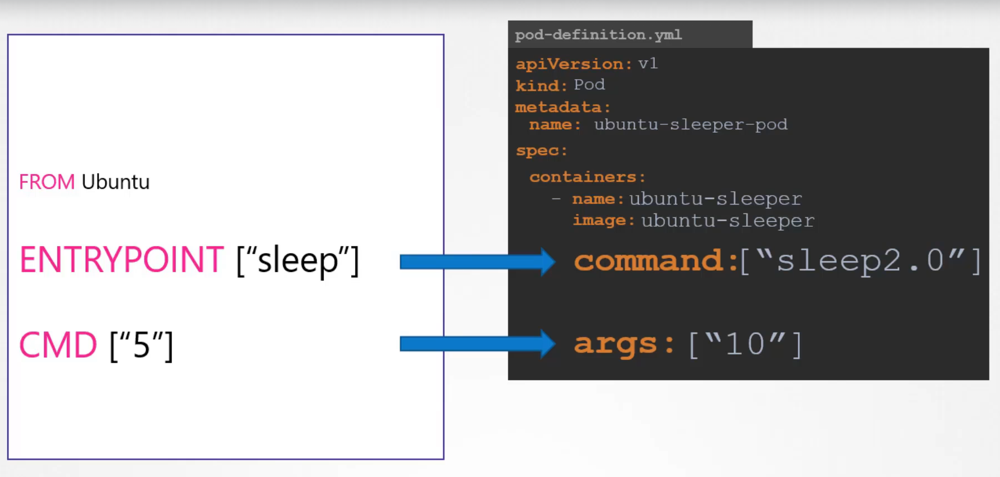

## Table of Contents

1. [Introduction](#introduction)
2. [Dockerfile: `ENTRYPOINT` vs. `CMD`](#dockerfile-entrypoint-vs-cmd)
   - [Understanding `ENTRYPOINT`](#understanding-entrypoint)
   - [Understanding `CMD`](#understanding-cmd)
   - [Differences Between `ENTRYPOINT` and `CMD`](#differences-between-entrypoint-and-cmd)
   - [Best Use Cases](#best-use-cases)
3. [Kubernetes Pod YAML: `command` and `args`](#kubernetes-pod-yaml-command-and-args)
   - [Understanding `command`](#understanding-command)
   - [Understanding `args`](#understanding-args)
4. [Comparing Docker and Kubernetes Specifications](#comparing-docker-and-kubernetes-specifications)
5. [Practical Examples](#practical-examples)
   - [Example 1: Dockerfile Configuration](#example-1-dockerfile-configuration)
   - [Example 2: `CMD` Without `ENTRYPOINT`](#example-2-cmd-without-entrypoint)
   - [Example 3: `ENTRYPOINT` with Additional Arguments](#example-3-entrypoint-with-additional-arguments)
   - [Example 4: Overriding in Kubernetes](#example-4-overriding-in-kubernetes)
6. [Best Practices](#best-practices)
7. [Conclusion](#conclusion)

## Introduction

When building and deploying containerized applications, specifying how containers start and behave is crucial. Docker provides `ENTRYPOINT` and `CMD` instructions in the `Dockerfile` to define the default executable and its parameters. Kubernetes extends this capability with `command` and `args` fields in Pod YAML files to override or supplement these defaults at deployment time. Understanding these configurations ensures flexibility and control over container behavior across different environments.

## Dockerfile: `ENTRYPOINT` vs. `CMD`

Both `ENTRYPOINT` and `CMD` are Dockerfile instructions that define how a container should execute. While they might seem similar, they serve distinct purposes and can be used in combination for powerful configurations.

### Understanding `ENTRYPOINT`

- **Purpose**: Defines the **main executable** for the container.
- **Behavior**: Ensures that the specified executable is always run when the container starts.
- **Syntax**:

  - **Exec form (preferred)**:

    ```dockerfile
    ENTRYPOINT ["executable", "param1", "param2"]
    ```

  - **Shell form**:

    ```dockerfile
    ENTRYPOINT executable param1 param2
    ```

### Understanding `CMD`

- **Purpose**: Provides **default arguments** to the `ENTRYPOINT` or defines a **default command** if `ENTRYPOINT` is not set.
- **Behavior**:
  - If used with `ENTRYPOINT`, `CMD` specifies the default parameters.
  - If `ENTRYPOINT` is not set, `CMD` defines the default executable and its parameters.
- **Syntax**:

  - **Exec form (preferred)**:

    ```dockerfile
    CMD ["param1", "param2"]
    ```

  - **Shell form**:

    ```dockerfile
    CMD param1 param2
    ```

- **Usage Considerations**:
  - `CMD` can be overridden at runtime using `docker run` by specifying additional arguments.

### Differences Between `ENTRYPOINT` and `CMD`

| Feature               | `ENTRYPOINT`                                         | `CMD`                                                     |
| --------------------- | ---------------------------------------------------- | --------------------------------------------------------- |
| **Primary Role**      | Sets the main executable for the container           | Provides default arguments or a fallback command          |
| **Override Behavior** | Overridden only when `--entrypoint` is used          | Can be overridden by specifying arguments in `docker run` |
| **Combination Use**   | Commonly paired with `CMD` to set default parameters | Complements `ENTRYPOINT` by providing defaults            |
| **Execution Context** | Exec form runs directly without a shell              | Shell form runs in `/bin/sh -c` by default                |

### Best Use Cases

- **`ENTRYPOINT`**:

  - When you want to **ensure a specific executable** is always run, regardless of what arguments are passed.
  - Ideal for containers designed to run a single application or service.

- **`CMD`**:

  - When you want to provide **default arguments** to the executable specified in `ENTRYPOINT`.
  - Useful for setting defaults that can be easily overridden without altering the Dockerfile.

- **Combined Use**:
  - Use `ENTRYPOINT` to define the main command and `CMD` to specify default arguments.
  - Example: Setting up a container where the main application is fixed, but its behavior can be customized via arguments.

## Kubernetes Pod YAML: `command` and `args`



Kubernetes allows you to override or extend the behavior defined in the Dockerfile by specifying `command` and `args` in the Pod's YAML configuration. These fields correspond to Docker’s `ENTRYPOINT` and `CMD`, respectively.

### Understanding `command`

- **Equivalent to Docker’s `ENTRYPOINT`**.
- **Purpose**: Specifies the executable that runs when the container starts.
- **Syntax**:

  ```yaml
  command: ["executable", "param1"]
  ```

- **Behavior**:
  - Overrides the Dockerfile’s `ENTRYPOINT`.
  - If not specified, uses the `ENTRYPOINT` from the Docker image.

### Understanding `args`

- **Equivalent to Docker’s `CMD`**.
- **Purpose**: Provides arguments to the `command` executable.
- **Syntax**:

  ```yaml
  args: ["arg1", "arg2"]
  ```

- **Behavior**:
  - Overrides the Dockerfile’s `CMD`.
  - If not specified, uses the `CMD` from the Docker image.

## Comparing Docker and Kubernetes Specifications

While both Docker and Kubernetes allow you to define commands and arguments for container execution, they operate at different stages and offer distinct flexibility.

| Aspect                     | Dockerfile (`ENTRYPOINT` & `CMD`)                        | Kubernetes (`command` & `args`)                                     |
| -------------------------- | -------------------------------------------------------- | ------------------------------------------------------------------- |
| **Definition Time**        | Build time (during image creation)                       | Deployment time (when creating Pods)                                |
| **Override Mechanism**     | `CMD` can be overridden at runtime with `docker run`     | `command` and `args` can be set or overridden in Pod YAML           |
| **Flexibility**            | Limited to image's predefined behavior unless overridden | Highly flexible, allowing dynamic changes without rebuilding images |
| **Primary Use**            | Define container's default behavior                      | Customize container behavior per deployment                         |
| **Layer of Specification** | Image layer                                              | Pod specification layer                                             |

## Practical Examples

### Example 1: Dockerfile Configuration

Let's create a Dockerfile that uses both `ENTRYPOINT` and `CMD`.

```dockerfile
# Use a base image
FROM ubuntu:latest

# Set the entrypoint to 'echo'
ENTRYPOINT ["echo"]

# Set the default argument to "Hello, World!"
CMD ["Hello, World!"]
```

#### **Behavior**

- **Default Execution**: When you run the container without additional arguments, it executes:

  ```bash
  echo "Hello, World!"
  ```

- **Overriding `CMD`**: You can override the default message:

  ```bash
  docker run your-image "Hello from Docker!"
  ```

  This results in:

  ```bash
  echo "Hello from Docker!"
  ```

- **Overriding `ENTRYPOINT`**: If you need to run a different command, use the `--entrypoint` flag:

  ```bash
  docker run --entrypoint /bin/bash your-image
  ```

  This starts a Bash shell instead of running `echo`.

### Example 2: `CMD` Without `ENTRYPOINT`

Demonstrating the behavior when only `CMD` is used in the Dockerfile.

```dockerfile
# Use a base image
FROM ubuntu:latest

# Set the default argument to "Hello, World!"
CMD ["echo", "Hello, World!"]
```

```bash
docker run your-image "Hello from Docker!"
```

**What Happens:**

**An error will occur.**

**Reason:**

- **`CMD` Without `ENTRYPOINT`**: The `CMD` instruction specifies the default command to run (`echo "Hello, World!"`).
- **Overriding `CMD`**: When you provide `"Hello from Docker!"` as an argument in the `docker run` command, it **replaces** the entire `CMD`.
- **Invalid Command**: Docker attempts to execute `"Hello from Docker!"` as the command, which is **not a valid executable**.

**Resulting Error:**

```ini
standard_init_linux.go:211: exec user process caused "no such file or directory"
```

**Summary:**

Running `docker run your-image "Hello from Docker!"` with the given Dockerfile will result in an error because Docker tries to execute `"Hello from Docker!"` as a command, which does not exist.

### Example 3: `ENTRYPOINT` with Additional Arguments

Demonstrating how `ENTRYPOINT` interacts with additional arguments provided during `docker run`.

```dockerfile
# Use a base image
FROM ubuntu:latest

# Set the entrypoint to 'echo' with a fixed argument
ENTRYPOINT ["echo", "hady wafa"]
```

```bash
docker run your-image ls "Hello from Docker!"
```

**What Happens:**

- **Executed Command:** `echo "hady wafa" "ls" "Hello from Docker!"`
- **Output:**

  ```ini
  hady wafa
  ls
  Hello from Docker!
  ```

**Explanation:**

- **`ENTRYPOINT` Defined:** The Dockerfile sets `ENTRYPOINT` to `["echo", "hady wafa"]`, meaning `echo hady wafa` is always executed when the container starts.
- **Additional Arguments:** When running `docker run your-image ls "Hello from Docker!"`, the arguments `ls` and `"Hello from Docker!"` are appended to the `ENTRYPOINT`.
- **Final Command Executed:** `echo hady wafa ls "Hello from Docker!"`, which successfully prints the concatenated string without any errors.

**Summary:**

Running `docker run your-image ls "Hello from Docker!"` with the given Dockerfile will output:

```ini
hady wafa
ls
Hello from Docker!
```

No error occurs because `echo` is the executable defined by `ENTRYPOINT`, and all additional arguments are treated as parameters to `echo`.

### Example 4: Overriding in Kubernetes

Assume you have built the Docker image from **Example 1** and want to customize its behavior in Kubernetes.

**Kubernetes Pod YAML (Overriding `CMD`)**

```yaml
apiVersion: v1
kind: Pod
metadata:
  name: echo-pod
spec:
  containers:
    - name: echo-container
      image: your-docker-image
      args: ["Hello from Kubernetes!"]
```

**Behavior**:

- **Execution**: The container runs:

  ```bash
  echo "Hello from Kubernetes!"
  ```

- **Note**: Since `command` is not specified, it uses the Dockerfile’s `ENTRYPOINT` (`echo`), and `args` override the Dockerfile’s `CMD`.

**Kubernetes Pod YAML (Overriding `ENTRYPOINT`)**

```yaml
apiVersion: v1
kind: Pod
metadata:
  name: bash-pod
spec:
  containers:
    - name: bash-container
      image: your-docker-image
      command: ["/bin/bash", "-c"]
      args: ["echo 'Overridden EntryPoint in Kubernetes!'"]
```

**Behavior**:

- **Execution**: The container runs:

  ```bash
  /bin/bash -c "echo 'Overridden EntryPoint in Kubernetes!'"
  ```

- **Note**: Here, both `command` and `args` are specified, completely overriding both `ENTRYPOINT` and `CMD` from the Dockerfile.

## Best Practices

1. **Define Clear Responsibilities**:

   - Use `ENTRYPOINT` for the main executable that should always run.
   - Use `CMD` for default arguments that can be overridden as needed.

2. **Prefer Exec Form**:

   - Always use the exec form (`["executable", "param1"]`) for `ENTRYPOINT` and `CMD` to avoid unnecessary shell layers and ensure proper signal handling.

3. **Leverage Kubernetes Flexibility**:

   - Utilize Kubernetes `command` and `args` to tailor container behavior per deployment without altering the Docker image.
   - This promotes reusability and separation of concerns between image creation and deployment configuration.

4. **Avoid Confusion**:

   - Be cautious when combining `ENTRYPOINT` and `CMD` to prevent unexpected behaviors.
   - Clearly document the intended use within your Dockerfile and Kubernetes configurations.

5. **Use Immutable Images**:
   - Keep Docker images immutable by defining `ENTRYPOINT` and `CMD` appropriately, allowing Kubernetes to manage environment-specific configurations.

## Conclusion

Understanding the distinction between Docker’s `ENTRYPOINT` and `CMD` and Kubernetes’ `command` and `args` is essential for effective container management and deployment. Docker provides a foundation for defining container behavior at build time, while Kubernetes offers dynamic control at deployment time. By leveraging these tools appropriately, you can create versatile, maintainable, and scalable containerized applications that adapt seamlessly to various environments and requirements.
