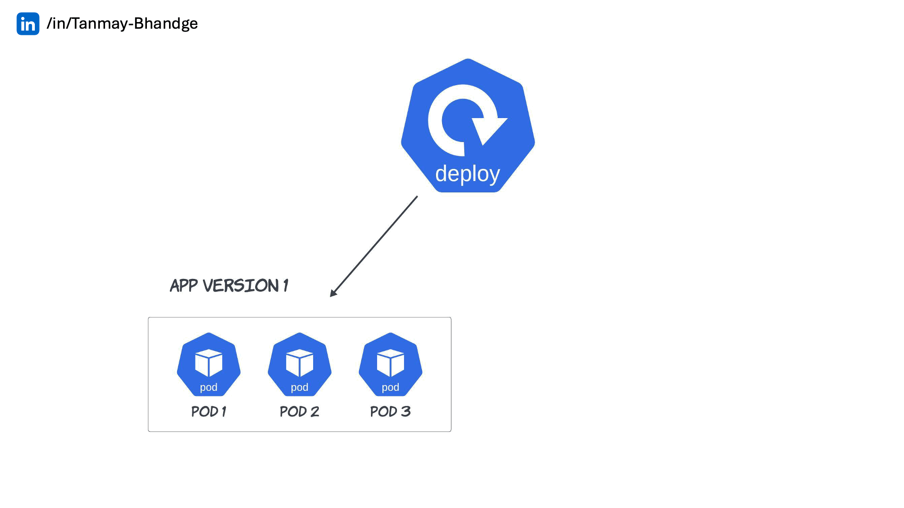

# Deployment

Certainly! A Kubernetes Deployment is a higher-level abstraction that manages the deployment of applications by defining the desired state of your application in a declarative manner. Here’s a detailed technical explanation of Deployments, covering their components, lifecycle, and various features.

## Key Components of a Deployment

1. **Pod Template**: This defines the specification for the Pods created by the Deployment, including the containers, environment variables, ports, volumes, and more. The Pod template is essentially a blueprint for the Pods.

2. **ReplicaSet**: Each Deployment manages a ReplicaSet, which ensures that a specified number of Pods are running at any given time. The ReplicaSet will create new Pods or delete existing ones to match the desired number of replicas.

3. **Selectors**: The Deployment uses selectors to identify which Pods it manages. The selector specifies how to identify the Pods based on labels.

4. **Strategy**: Deployments allow you to specify the update strategy. This determines how updates are rolled out (e.g., RollingUpdate, Recreate).

5. **Revision History**: Deployments keep track of previous revisions, allowing you to roll back to a previous version if needed.

## Deployment YAML Structure

Here’s a breakdown of the structure of a Deployment YAML file:

```yaml
apiVersion: apps/v1 # API version of the Deployment
kind: Deployment # Specifies the type of resource
metadata:
  name: nginx-deployment # Name of the Deployment
spec:
  replicas: 3 # Desired number of replicas
  selector:
    matchLabels: # Selector for identifying Pods
      app: nginx # Label used to match Pods
  template:
    metadata:
      labels: # Labels for Pods
        app: nginx
    spec:
      containers: # List of containers
        - name: nginx # Container name
          image: nginx:1.14.2 # Container image
          ports:
            - containerPort: 80 # Port exposed by the container
```

## Deployment Lifecycle

1. **Creation**: When you create a Deployment, Kubernetes will create a new ReplicaSet and the specified number of Pods based on the Pod template.

2. **Scaling**: You can change the number of replicas at any time. The Deployment controller will adjust the number of Pods accordingly.

3. **Updating**: When you update a Deployment (e.g., changing the container image), Kubernetes will create a new ReplicaSet with the updated Pods while gradually scaling down the old Pods, ensuring zero downtime (if using the default rolling update strategy).

4. **Rollback**: If there is a failure or an issue with the new version, you can roll back to the previous version of the Deployment, reverting the Pods to the state defined in the previous ReplicaSet.

5. **Deletion**: When you delete a Deployment, Kubernetes will also delete the associated ReplicaSet and all Pods managed by that ReplicaSet.

## Common Deployment Operations

### Creating a Deployment

You can create a Deployment using a YAML file or by running a `kubectl create` command. Here’s an example of creating a Deployment using a YAML file:

```bash
# Create a Deployment YAML file
kubectl create deployment nginx-deployment --image=nginx:1.14.2 --port=80 --replicas=3 --dry-run=client -o yaml > nginx-deployment.yaml

# Edit the YAML file as needed
vim nginx-deployment.yaml

# Apply the Deployment
kubectl apply -f nginx-deployment.yaml
```

### Monitoring Deployment

- **Status**: You can monitor the status of your Deployment to see how many replicas are available, updated, and unavailable using the following command:

  ```bash
  kubectl get deployments
  ```

- **Events**: You can check events related to a Deployment, which can provide insights into issues during rollout or scaling:

  ```bash
  kubectl describe deployment nginx-deployment
  ```

### Scaling a Deployment

You can scale a Deployment by updating the number of replicas in the Deployment configuration:

```bash
kubectl scale deployment nginx-deployment --replicas=5
```

### Updating a Deployment

#### File is present

```bash
kubectl apply -f nginx-deployment.yaml
```

#### File is not present

```bash
kubectl set image deployment/nginx-deployment nginx=nginx:1.16.1

# or
kubectl edit deployment/nginx-deployment # Update the image version

# or
kubectl patch deployment nginx-deployment -p '{"spec": {"template": {"spec": {"containers": [{"name": "nginx", "image": "nginx:1.16.1"}]}}}}'

# or
kubectl replace -f nginx-deployment.yaml
```

### Rolling Back a Deployment

You can roll back a Deployment to a previous revision using the `kubectl rollout undo` command:

```bash
kubectl rollout undo deployment/nginx-deployment
```

### Deleting a Deployment

You can delete a Deployment using the `kubectl delete` command:

```bash
kubectl delete deployment nginx-deployment
```

## Update Strategies

Kubernetes supports two update strategies for Deployments:

### 1. **Rolling Update (default)**



This is the default strategy. It gradually replaces Pods one by one, ensuring that the desired number of Pods is available during the update process. You can control the maximum number of Pods that can be unavailable during the update (`maxUnavailable`) and the maximum number of new Pods that can be created above the desired number (`maxSurge`).

Example configuration for rolling update:

```yaml
strategy:
  type: RollingUpdate
  rollingUpdate:
    maxUnavailable: 1 # Maximum number of Pods that can be unavailable
    maxSurge: 1 # Maximum number of Pods that can be created above the desired count
```

### 2. **Recreate**


This strategy terminates all existing Pods before creating new ones. This approach is useful when you cannot run the old and new versions simultaneously.

Example configuration for recreate strategy:

```yaml
strategy:
  type: Recreate
```

## Deployment Rollback

Kubernetes makes it relatively simple to roll back to a previous version of your application. When you perform a deployment, Kubernetes automatically maintains a history of previous ReplicaSets, allowing you to revert to an earlier state if necessary.

### Rolling Back with `kubectl`

You can roll back to the previous version of your application using the following command:

```bash
kubectl rollout undo deployment/my-app
```

This command will revert your Deployment to the previous revision. If you want to roll back to a specific revision rather than just the last one, you can specify the revision number:

```bash
kubectl rollout undo deployment/my-app --to-revision=2
```

### What Happens During a Rollback

- **Recreate Old ReplicaSet:** Kubernetes scales up the old ReplicaSet that corresponds to the specified revision.
- **Scale Down Current ReplicaSet:** The current ReplicaSet managing the new version of the application is scaled down.
- **Rollback in Progress:** Kubernetes manages this process seamlessly, ensuring that the application’s state is consistent and that a minimum number of pods are unavailable during the rollback.

### Tracking Deployment History

Kubernetes keeps a history of all changes made to a Deployment. This allows you to see the history of revisions, including when updates were made, the changes that were applied, and the ability to roll back to any previous state.

#### Viewing Deployment History

You can view the history of a Deployment using the following command:

```bash
kubectl rollout history deployment/my-app
```

This command provides an overview of all the revisions that have been made to the Deployment, showing each revision’s number and a short description of the changes.

#### Detailed View of a Specific Revision

To get more detailed information about a specific revision, use:

```bash
kubectl rollout history deployment/my-app --revision=2
```

This will display the exact state of the Deployment at the time of that revision, including the configuration of the pods, environment variables, and other settings.

#### Example of Rollback

Imagine you have deployed version `v2` of your application, but it has introduced a bug. You want to roll back to version `v1`. Here's how it works:

1. **Check Current Status:**

   ```bash
   kubectl get deployments
   ```

2. **View Deployment History:**

   ```bash
   kubectl rollout history deployment/my-app
   ```

   Output might look something like this:

   ```ini
   REVISION  CHANGE-CAUSE
   1         kubectl apply --filename=my-app-v1.yaml
   2         kubectl apply --filename=my-app-v2.yaml
   ```

3. **Roll Back to Previous Revision:**

   ```bash
   kubectl rollout undo deployment/my-app --to-revision=1
   ```

4. **Verify the Rollback:**

   ```bash
   kubectl get deployments
   ```

   You should now see that the Deployment has reverted to the configuration defined in `my-app-v1.yaml`.

### How Kubernetes Tracks History

- **Annotations:** Kubernetes uses annotations within the Deployment's ReplicaSets to store information about each revision, such as the timestamp of the change, the reason for the update, and what specifically changed.
- **ReplicaSets:** Each update to a Deployment creates a new ReplicaSet with a unique revision number. These ReplicaSets are preserved even after the update, allowing Kubernetes to roll back to a previous state if needed.
- **Deployment Status:** The status of each Deployment, including the current revision and available revisions, is stored and can be queried at any time.

## Conclusion

Kubernetes Deployments are a critical component for managing applications in a Kubernetes cluster. They provide a robust mechanism for ensuring application availability, enabling easy updates and rollbacks, and offering flexibility in deployment strategies. By understanding how Deployments work, you can effectively manage your application's lifecycle and ensure a smooth user experience. If you have specific questions or need examples of particular scenarios, feel free to ask!
