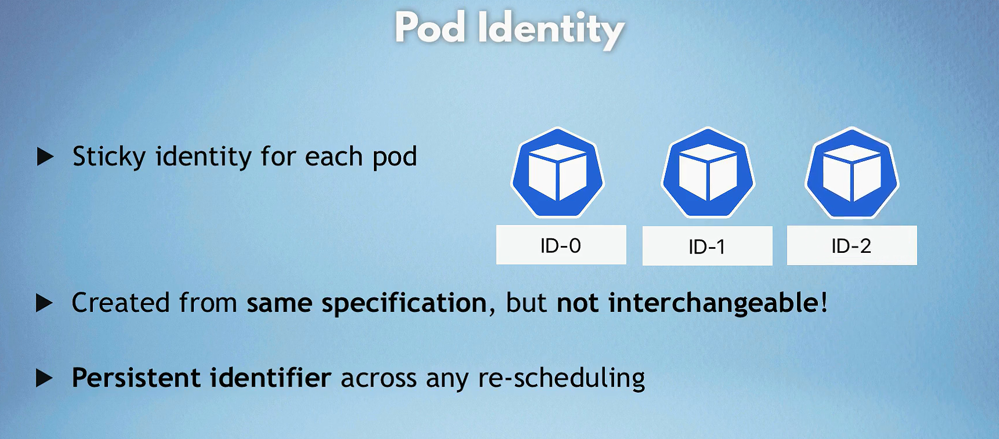
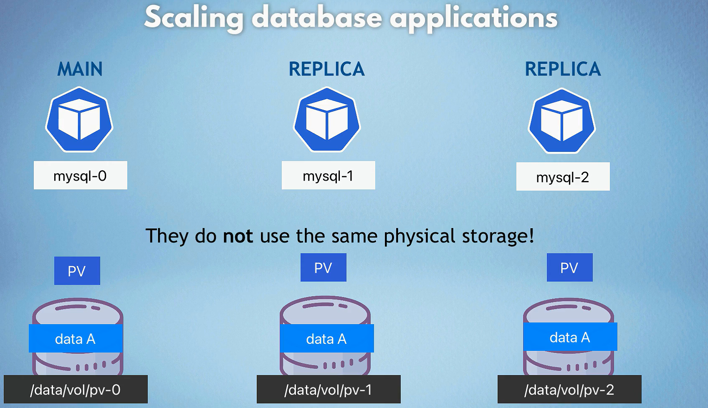
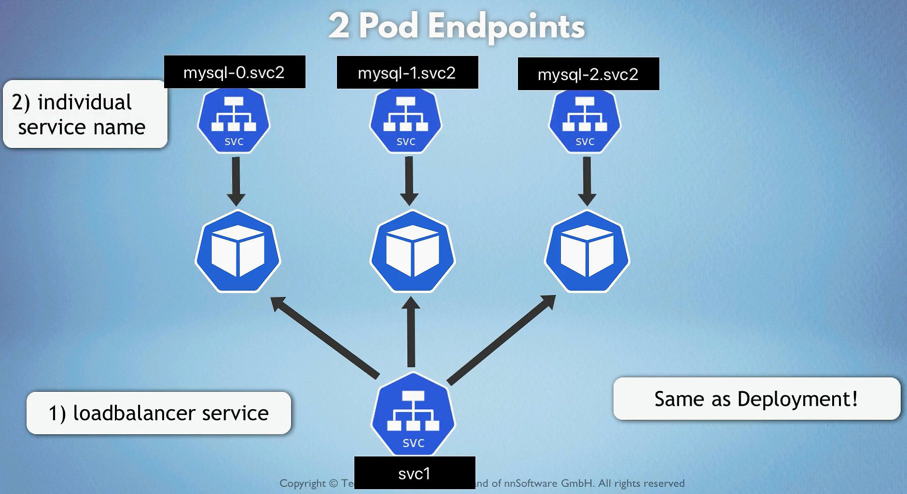

# Stateful Set Deployment (K8s)

In Kubernetes, a StatefulSet is a specialized controller designed to manage stateful applications. Unlike Deployments, which are intended for stateless applications, StatefulSets maintain the identity and state of each Pod across rescheduling, scaling, and updates. Here’s a detailed technical overview of StatefulSets, covering their components, lifecycle, and use cases.

## Key Features of StatefulSets

1. **Stable, Unique Network Identifiers**: Each Pod in a StatefulSet gets a stable hostname derived from the StatefulSet name and a unique ordinal index (e.g., `myapp-0`, `myapp-1`).

2. **Stable Persistent Storage**: StatefulSets can be associated with Persistent Volumes, ensuring that storage remains consistent across Pod restarts and rescheduling.

3. **Ordered Deployment and Scaling**: StatefulSets maintain the order in which Pods are deployed and scaled. Pods are created and deleted in a specific sequence, which is essential for many stateful applications.

4. **Ordered Pod Management**: When scaling down, StatefulSets terminate Pods in reverse order of their ordinal index.

## StatefulSet YAML Structure

A StatefulSet is defined in a YAML file, similar to Deployments. Here’s a breakdown of a basic StatefulSet configuration:

```yaml
apiVersion: apps/v1
kind: StatefulSet
metadata:
  name: myapp
spec:
  serviceName: "myapp" # Headless service for network identity
  replicas: 3 # Desired number of replicas
  selector:
    matchLabels:
      app: myapp # Selector to identify Pods
  template:
    metadata:
      labels:
        app: myapp
    spec:
      containers:
        - name: myapp
          image: myapp-image:latest # Application container image
          ports:
            - containerPort: 8080 # Port exposed by the container
          volumeMounts:
            - name: myapp-storage
              mountPath: /data # Path where storage is mounted
  volumeClaimTemplates: # Template for persistent volume claims
    - metadata:
        name: myapp-storage
      spec:
        accessModes:
          - ReadWriteOnce # Access mode for the PVC
        resources:
          requests:
            storage: 1Gi # Requested storage size
```

## StatefulSet vs Deployment

### stateless app vs stateful app


### deployment vs statefulset


### pod entity



### scaling database apps




- statefulset replicas are created in order, one by one
- statefulset replicas are deleted in reverse order, one by one
- statefulset replicas are not created until the previous one is running
- statefulset replicas are not deleted until the next one is terminated
- To ensure that replicas stay up to date, they need to be aware of any changes.
- statefulset replicas don't use the same physical storage!, as each replica gets its own persistent volume (PV) but shares the same persistent volume claim (PVC) with other replicas. This ensures that each replica has its own storage but can access the same data.

### each pod gets its own dns endpoint from service




## Key Components of a StatefulSet

1. **Service**: A headless service (without a ClusterIP) is required for network identity. This service facilitates direct access to the Pods.

2. **Pod Template**: Similar to Deployments, the Pod template defines the configuration for the Pods in the StatefulSet.

3. **VolumeClaimTemplates**: This section defines how Persistent Volume Claims (PVCs) are created for each Pod in the StatefulSet, ensuring that each Pod has its own storage.

## StatefulSet Lifecycle

1. **Creation**: When a StatefulSet is created, Kubernetes creates a headless service and the specified number of Pods sequentially. Each Pod is assigned a unique identifier.

2. **Scaling**: You can scale a StatefulSet up or down, but Pods are created and terminated in order (e.g., `myapp-0`, then `myapp-1`, etc.). This order is important for maintaining application state.

3. **Rolling Updates**: StatefulSets can be updated similarly to Deployments, but the update process is ordered. Pods are updated one at a time, maintaining the identity of each Pod.

4. **Termination**: When terminating Pods, StatefulSets remove them in reverse order of their ordinal index (last created first).

## Persistent Storage

StatefulSets typically use Persistent Volumes to manage storage. Each Pod in a StatefulSet can have its own dedicated volume, which provides persistent storage even if the Pod is rescheduled to another node.

- **VolumeClaimTemplates**: These templates are used to automatically create PVCs for each Pod. Each PVC is unique and ensures that data remains consistent across restarts.

## Use Cases for StatefulSets

1. **Databases**: Stateful applications like databases (e.g., MongoDB, PostgreSQL) require stable network identities and persistent storage, making StatefulSets ideal for these scenarios.

2. **Distributed Systems**: StatefulSets are suitable for managing distributed applications that require consistent identity and storage, such as Kafka or Zookeeper.

3. **Applications with Stateful Behavior**: Any application that relies on maintaining state, such as caching systems (e.g., Redis), can benefit from the capabilities of StatefulSets.

## Limitations of StatefulSets

1. **More Complex Management**: StatefulSets require careful management due to their ordering and identity features, which can complicate operations compared to stateless applications.

2. **Not Suitable for All Applications**: Not all applications need the features provided by StatefulSets. Stateless applications should use Deployments for simpler management.

3. **Scaling Constraints**: Scaling operations must be handled with care, as Pods are added or removed in a specific order.

## Common StatefulSet Operations

### Creating a StatefulSet

You can create a StatefulSet using a YAML file or by running a `kubectl create` command. Here’s an example of creating a StatefulSet using a YAML file:

```bash
# Create a StatefulSet YAML file
kubectl create statefulset myapp --image=myapp-image:latest --replicas=3 --port=8080 --dry-run=client -o yaml > myapp-statefulset.yaml

# Edit the YAML file as needed
vim myapp-statefulset.yaml

# Apply the StatefulSet
kubectl apply -f myapp-statefulset.yaml
```

### Monitoring StatefulSet

- **Status**: You can monitor the status of your StatefulSet to see how many replicas are available and their current state using the following command:

  ```bash
  kubectl get statefulsets
  ```

- **Events**: You can check events related to a StatefulSet, which can provide insights into issues during rollout or scaling:

  ```bash
  kubectl describe statefulset myapp
  ```

### Scaling a StatefulSet

You can scale a StatefulSet by updating the number of replicas in the StatefulSet configuration:

```bash
kubectl scale statefulset myapp --replicas=5
```

### Updating a StatefulSet

#### File is present

```bash
kubectl apply -f myapp-statefulset.yaml
```

#### File is not present

```bash
kubectl set image statefulset/myapp myapp=myapp-image:latest

# or
kubectl edit statefulset myapp # Update the image version

# or
kubectl patch statefulset myapp -p '{"spec": {"template": {"spec": {"containers": [{"name": "myapp", "image": "myapp-image:latest"}]}}}}}'

# or
kubectl replace -f myapp-statefulset.yaml
```

### Rolling Back a StatefulSet

You can roll back a StatefulSet to a previous revision using the `kubectl rollout undo` command:

```bash
kubectl rollout undo statefulset/myapp
```

### Deleting a StatefulSet

You can delete a StatefulSet using the `kubectl delete` command:

```bash
kubectl delete statefulset myapp
```

## Conclusion

StatefulSets are a powerful Kubernetes resource for managing stateful applications, providing features such as stable identities, persistent storage, and ordered deployment and scaling. By understanding how StatefulSets work, you can effectively manage stateful workloads in your Kubernetes environment. If you have specific questions or scenarios you'd like to discuss further, feel free to ask!
