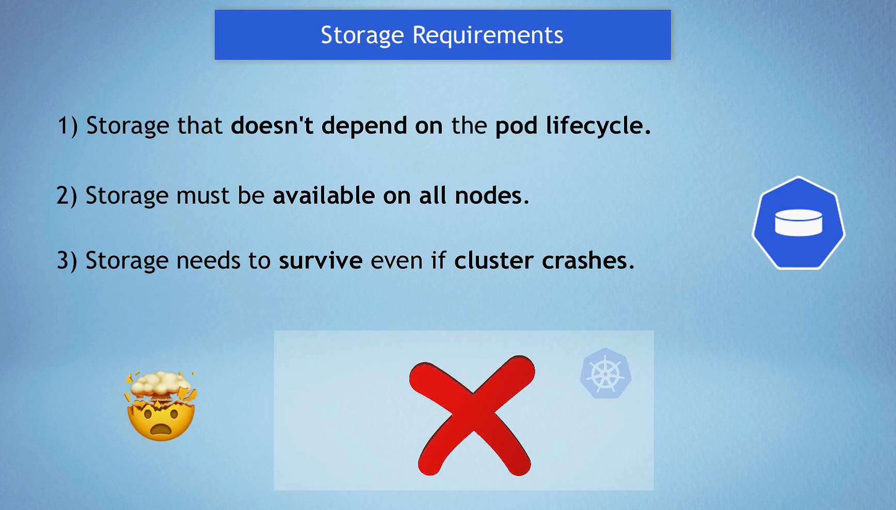
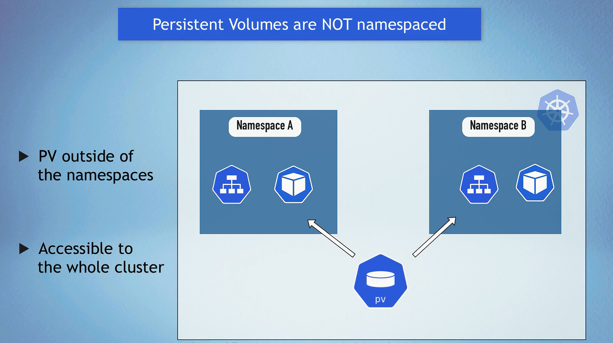
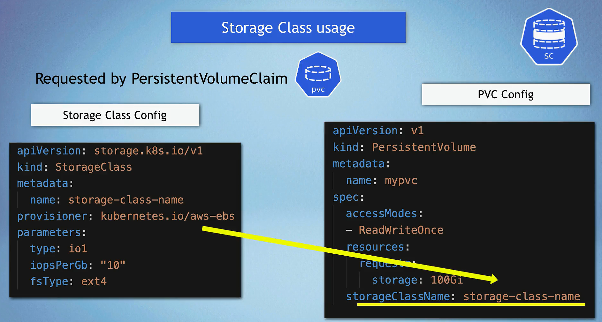

# Persistent Volumes in Kubernetes

Persistent Volumes (PVs) in Kubernetes provide a way to manage durable storage resources. Unlike ephemeral storage that is tied to the lifecycle of a pod, PVs persist beyond the life of an individual pod, allowing data to be retained and shared across multiple pods and applications.



## Key Components and Layers

### 1. **PersistentVolume (PV)**




- A resource in the cluster that represents a piece of storage in the cluster.
- Managed by the Kubernetes administrator.
- Lifecycle is independent of any individual pod that uses the PV.
- Can be backed by various storage systems like **AWS EBS**, **NFS**, **GCE Persistent Disk**, etc.

### 2. **PersistentVolumeClaim (PVC)**


- A request for storage by a user.
- Can specify the size and access modes (e.g., ReadWriteOnce, ReadOnlyMany, ReadWriteMany).
- Binds to a suitable PV, or if none exist, dynamically provisions a new one (if StorageClasses are used).

### 3. **StorageClass (SC)**




- Defines a "class" of storage.
- Provides a way to describe different types of storage and their parameters (like performance characteristics).
- Used for dynamic provisioning of PVs.
- Specifies a provisioner (e.g., AWS EBS, NFS, etc.) and parameters specific to that provisioner.

### 4. **Dynamic Provisioning**

- Uses StorageClasses to automatically provision storage as needed.
- Simplifies the process of requesting and managing storage.
- Removes the need for cluster administrators to pre-create and manage PVs.

## How Persistent Volumes Work

1. **Static Provisioning**:

   - The cluster administrator creates a PV that defines storage details and capabilities.
   - Users create PVCs that request storage.
   - Kubernetes matches the PVC with an appropriate PV based on size and access modes.

2. **Dynamic Provisioning**:
   - Users create PVCs that specify a StorageClass.
   - Kubernetes uses the StorageClass to dynamically provision a new PV.
   - The provisioner specified in the StorageClass creates the actual storage resource (e.g., an EBS volume in AWS).

## Use Cases

1. **Database Storage**:

   - Databases like MySQL, PostgreSQL, and MongoDB require persistent storage for data retention.
   - PVs ensure that data is not lost even if the pod running the database restarts.

2. **Shared Storage**:

   - Applications that require shared access to the same data can use PVs with access modes like ReadWriteMany.
   - NFS-backed PVs are commonly used for shared storage scenarios.

3. **Stateful Applications**:

   - Applications that maintain state across restarts, such as content management systems, CI/CD tools, and analytics platforms.
   - PVs ensure that application state is preserved.

4. **Backup and Restore**:
   - PVs can be used for taking backups of important data and restoring them as needed.
   - Persistent storage is essential for disaster recovery plans.

## YAML Examples

### AWS EBS StorageClass

```yaml
apiVersion: storage.k8s.io/v1
kind: StorageClass
metadata:
  name: ebs-sc
provisioner: kubernetes.io/aws-ebs
parameters:
  type: gp2
  fsType: ext4
---
apiVersion: v1
kind: PersistentVolumeClaim
metadata:
  name: ebs-pvc
spec:
  accessModes:
    - ReadWriteOnce
  resources:
    requests:
      storage: 10Gi
  storageClassName: ebs-sc
```

### NFS StorageClass

```yaml
apiVersion: storage.k8s.io/v1
kind: StorageClass
metadata:
  name: nfs-sc
provisioner: example.com/nfs
parameters:
  server: nfs-server.example.com
  path: /exported/path
---
apiVersion: v1
kind: PersistentVolumeClaim
metadata:
  name: nfs-pvc
spec:
  accessModes:
    - ReadWriteMany
  resources:
    requests:
      storage: 10Gi
  storageClassName: nfs-sc
```

### Local StorageClass

```yaml
apiVersion: storage.k8s.io/v1
kind: StorageClass
metadata:
  name: local-storage
provisioner: kubernetes.io/no-provisioner
volumeBindingMode: WaitForFirstConsumer
---
apiVersion: v1
kind: PersistentVolume
metadata:
  name: local-pv
spec:
  capacity:
    storage: 10Gi
  accessModes:
    - ReadWriteOnce
  persistentVolumeReclaimPolicy: Retain
  storageClassName: local-storage
  local:
    path: /mnt/disks/ssd1
  nodeAffinity:
    required:
      nodeSelectorTerms:
        - matchExpressions:
            - key: kubernetes.io/hostname
              operator: In
              values:
                - node1
---
apiVersion: v1
kind: PersistentVolumeClaim
metadata:
  name: local-pvc
spec:
  accessModes:
    - ReadWriteOnce
  resources:
    requests:
      storage: 10Gi
  storageClassName: local-storage
```
