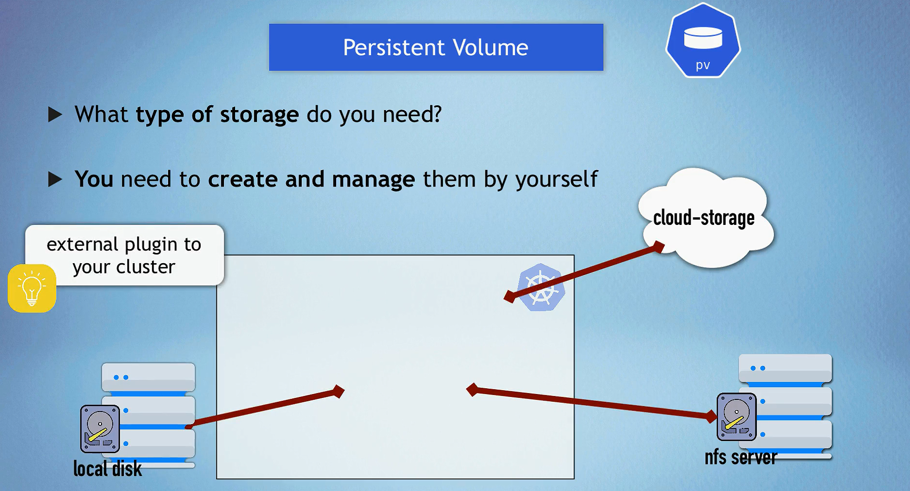
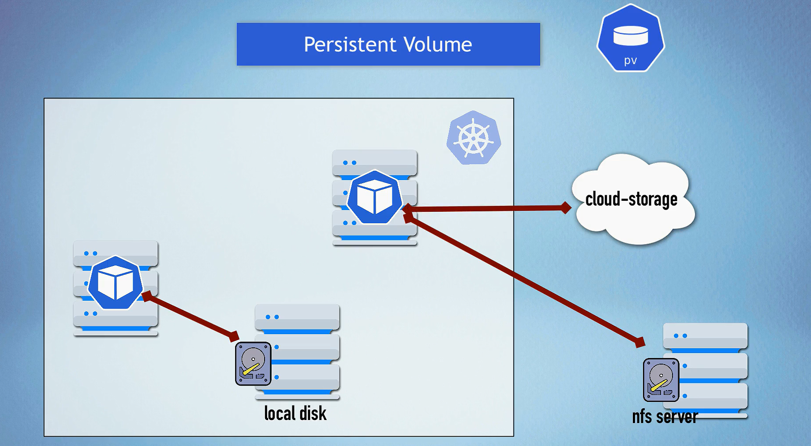
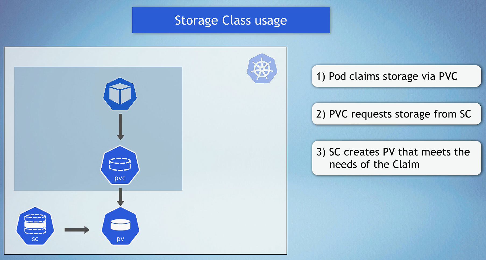

# Persistent Volumes in Kubernetes

Persistent Volumes (PVs) in Kubernetes provide a way to manage durable storage resources. Unlike ephemeral storage that is tied to the lifecycle of a pod, PVs persist beyond the life of an individual pod, allowing data to be retained and shared across multiple pods and applications.


## Key Components and Layers

### 1. **PersistentVolume (PV)**





- A resource in the cluster that represents a piece of storage in the cluster.
- Managed by the Kubernetes administrator.
- Lifecycle is independent of any individual pod that uses the PV.
- Can be backed by various storage systems like **AWS EBS**, **NFS**, **GCE Persistent Disk**, etc.

### 2. **PersistentVolumeClaim (PVC)**


- A request for storage by a user.
- Can specify the size and access modes (e.g., ReadWriteOnce, ReadOnlyMany, ReadWriteMany).
- Binds to a suitable PV, or if none exist, dynamically provisions a new one (if StorageClasses are used).

### 3. **StorageClass (SC)**




- Defines a "class" of storage.
- Provides a way to describe different types of storage and their parameters (like performance characteristics).
- Used for dynamic provisioning of PVs.
- Specifies a provisioner (e.g., AWS EBS, NFS, etc.) and parameters specific to that provisioner.

### 4. **Dynamic Provisioning**

- Uses StorageClasses to automatically provision storage as needed.
- Simplifies the process of requesting and managing storage.
- Removes the need for cluster administrators to pre-create and manage PVs.

## How Persistent Volumes Work

1. **Static Provisioning**:

   - The cluster administrator creates a PV that defines storage details and capabilities.
   - Users create PVCs that request storage.
   - Kubernetes matches the PVC with an appropriate PV based on size and access modes.

2. **Dynamic Provisioning**:
   - Users create PVCs that specify a StorageClass.
   - Kubernetes uses the StorageClass to dynamically provision a new PV.
   - The provisioner specified in the StorageClass creates the actual storage resource (e.g., an EBS volume in AWS).

## Use Cases

1. **Database Storage**:

   - Databases like MySQL, PostgreSQL, and MongoDB require persistent storage for data retention.
   - PVs ensure that data is not lost even if the pod running the database restarts.

2. **Shared Storage**:

   - Applications that require shared access to the same data can use PVs with access modes like ReadWriteMany.
   - NFS-backed PVs are commonly used for shared storage scenarios.

3. **Stateful Applications**:

   - Applications that maintain state across restarts, such as content management systems, CI/CD tools, and analytics platforms.
   - PVs ensure that application state is preserved.

4. **Backup and Restore**:
   - PVs can be used for taking backups of important data and restoring them as needed.
   - Persistent storage is essential for disaster recovery plans.

## YAML Examples

### AWS EBS StorageClass

```yaml
apiVersion: storage.k8s.io/v1
kind: StorageClass
metadata:
  name: ebs-sc
provisioner: kubernetes.io/aws-ebs
parameters:
  type: gp2
  fsType: ext4
---
apiVersion: v1
kind: PersistentVolumeClaim
metadata:
  name: ebs-pvc
spec:
  accessModes:
    - ReadWriteOnce
  resources:
    requests:
      storage: 10Gi
  storageClassName: ebs-sc
```

### NFS StorageClass

```yaml
apiVersion: storage.k8s.io/v1
kind: StorageClass
metadata:
  name: nfs-sc
provisioner: example.com/nfs
parameters:
  server: nfs-server.example.com
  path: /exported/path
---
apiVersion: v1
kind: PersistentVolumeClaim
metadata:
  name: nfs-pvc
spec:
  accessModes:
    - ReadWriteMany
  resources:
    requests:
      storage: 10Gi
  storageClassName: nfs-sc
```

### Local StorageClass

```yaml
apiVersion: storage.k8s.io/v1
kind: StorageClass
metadata:
  name: local-storage
provisioner: kubernetes.io/no-provisioner
volumeBindingMode: WaitForFirstConsumer
---
apiVersion: v1
kind: PersistentVolume
metadata:
  name: local-pv
spec:
  capacity:
    storage: 10Gi
  accessModes:
    - ReadWriteOnce
  persistentVolumeReclaimPolicy: Retain
  storageClassName: local-storage
  local:
    path: /mnt/disks/ssd1
  nodeAffinity:
    required:
      nodeSelectorTerms:
        - matchExpressions:
            - key: kubernetes.io/hostname
              operator: In
              values:
                - node1
---
apiVersion: v1
kind: PersistentVolumeClaim
metadata:
  name: local-pvc
spec:
  accessModes:
    - ReadWriteOnce
  resources:
    requests:
      storage: 10Gi
  storageClassName: local-storage
```

## Mounting Volumes in Deployments

In Kubernetes, you can mount various types of volumes in a Deployment to provide storage for your Pods. Below is a comprehensive list of the different volume types supported in Kubernetes, along with examples of how to use them in a Deployment YAML file.

### 1. EmptyDir

An `EmptyDir` volume is created when a Pod is assigned to a node. It is initially empty and persists as long as the Pod is running.

```yaml
apiVersion: apps/v1
kind: Deployment
metadata:
  name: emptydir-deployment
spec:
  replicas: 1
  selector:
    matchLabels:
      app: emptydir
  template:
    metadata:
      labels:
        app: emptydir
    spec:
      containers:
        - name: my-container
          image: my-image:latest
          volumeMounts:
            - mountPath: /mnt/emptydir
              name: emptydir-volume
      volumes:
        - name: emptydir-volume
          emptyDir: {}
```

### 2. HostPath

A `HostPath` volume mounts a file or directory from the host node’s filesystem into your Pod.

```yaml
apiVersion: apps/v1
kind: Deployment
metadata:
  name: hostpath-deployment
spec:
  replicas: 1
  selector:
    matchLabels:
      app: hostpath
  template:
    metadata:
      labels:
        app: hostpath
    spec:
      containers:
        - name: my-container
          image: my-image:latest
          volumeMounts:
            - mountPath: /mnt/hostpath
              name: hostpath-volume
      volumes:
        - name: hostpath-volume
          hostPath:
            path: /data # Path on the host node
```

### 3. PersistentVolumeClaim

A `PersistentVolumeClaim` (PVC) allows you to request storage from a `PersistentVolume` (PV) that has been provisioned in your cluster.

```yaml
apiVersion: apps/v1
kind: Deployment
metadata:
  name: pvc-deployment
spec:
  replicas: 1
  selector:
    matchLabels:
      app: pvc
  template:
    metadata:
      labels:
        app: pvc
    spec:
      containers:
        - name: my-container
          image: my-image:latest
          volumeMounts:
            - mountPath: /mnt/pvc
              name: pvc-volume
      volumes:
        - name: pvc-volume
          persistentVolumeClaim:
            claimName: my-pvc # The name of your PVC
```

### 4. ConfigMap

A `ConfigMap` allows you to inject configuration data into your Pods.

```yaml
apiVersion: v1
kind: ConfigMap
metadata:
  name: my-config
data:
  config-key: config-value
---
apiVersion: apps/v1
kind: Deployment
metadata:
  name: configmap-deployment
spec:
  replicas: 1
  selector:
    matchLabels:
      app: configmap
  template:
    metadata:
      labels:
        app: configmap
    spec:
      containers:
        - name: my-container
          image: my-image:latest
          volumeMounts:
            - mountPath: /mnt/config
              name: config-volume
      volumes:
        - name: config-volume
          configMap:
            name: my-config # The name of your ConfigMap
```

```yaml
apiVersion: v1
kind: ConfigMap
metadata:
  name: my-config
data:
  APP_ENV: production
  APP_DEBUG: "false"
---
apiVersion: apps/v1
kind: Deployment
metadata:
  name: configmap-env-deployment
spec:
  replicas: 1
  selector:
    matchLabels:
      app: configmap-env
  template:
    metadata:
      labels:
        app: configmap-env
    spec:
      containers:
        - name: my-container
          image: my-image:latest
          env:
            - name: APP_ENV
              valueFrom:
                configMapKeyRef:
                  name: my-config # Name of the ConfigMap
                  key: APP_ENV # Key in the ConfigMap
            - name: APP_DEBUG
              valueFrom:
                configMapKeyRef:
                  name: my-config # Name of the ConfigMap
                  key: APP_DEBUG # Key in the ConfigMap
```

### 5. Secret

A `Secret` is used to store sensitive information, such as passwords, OAuth tokens, and SSH keys.

```yaml
apiVersion: v1
kind: Secret
metadata:
  name: my-secret
type: Opaque
data:
  secret-key: c2VjcmV0LXZhbHVl # Base64 encoded value

---
apiVersion: apps/v1
kind: Deployment
metadata:
  name: secret-deployment
spec:
  replicas: 1
  selector:
    matchLabels:
      app: secret
  template:
    metadata:
      labels:
        app: secret
    spec:
      containers:
        - name: my-container
          image: my-image:latest
          volumeMounts:
            - mountPath: /mnt/secret
              name: secret-volume
      volumes:
        - name: secret-volume
          secret:
            secretName: my-secret # The name of your Secret
```

```yaml
apiVersion: v1
kind: Secret
metadata:
  name: my-secret
type: Opaque
data:
  SECRET_USERNAME: c3VwZXJ1c2Vy # Base64 encoded value
  SECRET_PASSWORD: cGFzc3dvcmQ= # Base64 encoded value
---
apiVersion: apps/v1
kind: Deployment
metadata:
  name: secret-env-deployment
spec:
  replicas: 1
  selector:
    matchLabels:
      app: secret-env
  template:
    metadata:
      labels:
        app: secret-env
    spec:
      containers:
        - name: my-container
          image: my-image:latest
          env:
            - name: SECRET_USERNAME
              valueFrom:
                secretKeyRef:
                  name: my-secret # Name of the Secret
                  key: SECRET_USERNAME # Key in the Secret
            - name: SECRET_PASSWORD
              valueFrom:
                secretKeyRef:
                  name: my-secret # Name of the Secret
                  key: SECRET_PASSWORD # Key in the Secret
```

### 6. NFS (Network File System)

An NFS volume allows you to mount a remote NFS share into your Pod.

```yaml
apiVersion: apps/v1
kind: Deployment
metadata:
  name: nfs-deployment
spec:
  replicas: 1
  selector:
    matchLabels:
      app: nfs
  template:
    metadata:
      labels:
        app: nfs
    spec:
      containers:
        - name: my-container
          image: my-image:latest
          volumeMounts:
            - mountPath: /mnt/nfs
              name: nfs-volume
      volumes:
        - name: nfs-volume
          nfs:
            server: nfs-server-ip # The IP of your NFS server
            path: /path/to/nfs/share # The path on the NFS server
```

### 7. Azure Disk

An Azure Disk volume allows you to use Azure managed disks as storage for your Pods.

```yaml
apiVersion: apps/v1
kind: Deployment
metadata:
  name: azuredisk-deployment
spec:
  replicas: 1
  selector:
    matchLabels:
      app: azuredisk
  template:
    metadata:
      labels:
        app: azuredisk
    spec:
      containers:
        - name: my-container
          image: my-image:latest
          volumeMounts:
            - mountPath: /mnt/azuredisk
              name: azuredisk-volume
      volumes:
        - name: azuredisk-volume
          azureDisk:
            diskName: my-disk # The name of the Azure Disk
            diskURI: /subscriptions/... # The URI of the Azure Disk
            kind: Managed
```

### 8. AWS EBS (Elastic Block Store)

An AWS EBS volume allows you to use Amazon EBS as storage for your Pods.

```yaml
apiVersion: apps/v1
kind: Deployment
metadata:
  name: awsebs-deployment
spec:
  replicas: 1
  selector:
    matchLabels:
      app: awsebs
  template:
    metadata:
      labels:
        app: awsebs
    spec:
      containers:
        - name: my-container
          image: my-image:latest
          volumeMounts:
            - mountPath: /mnt/awsebs
              name: awsebs-volume
      volumes:
        - name: awsebs-volume
          awsElasticBlockStore:
            volumeID: aws://volume-id # The EBS volume ID
            fsType: ext4
```
