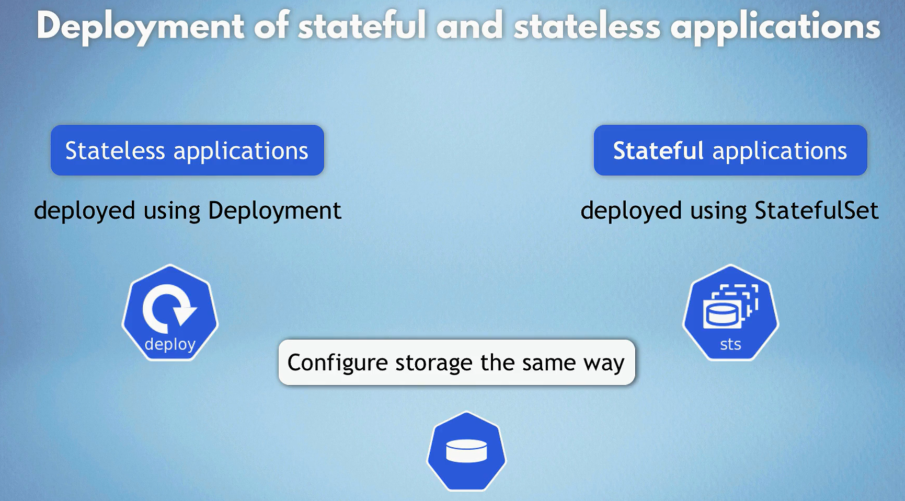
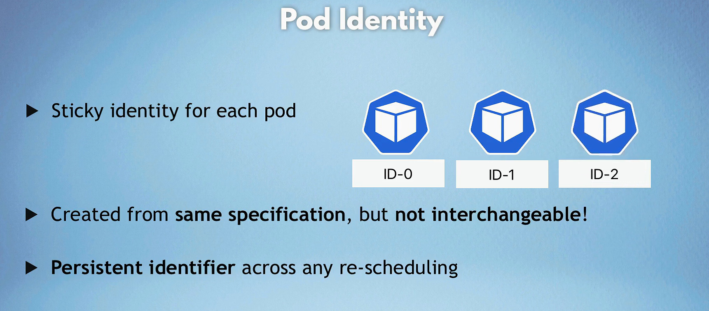
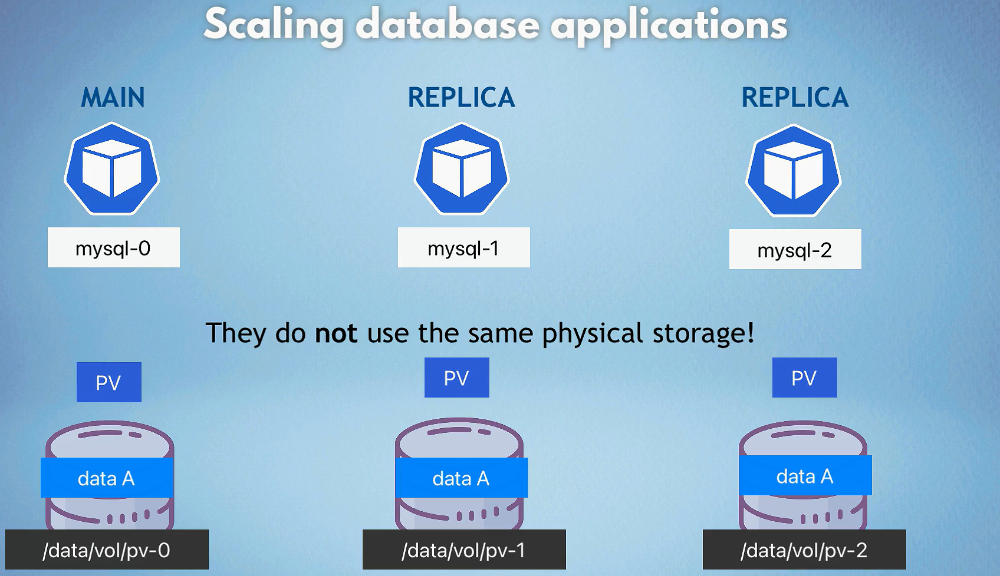
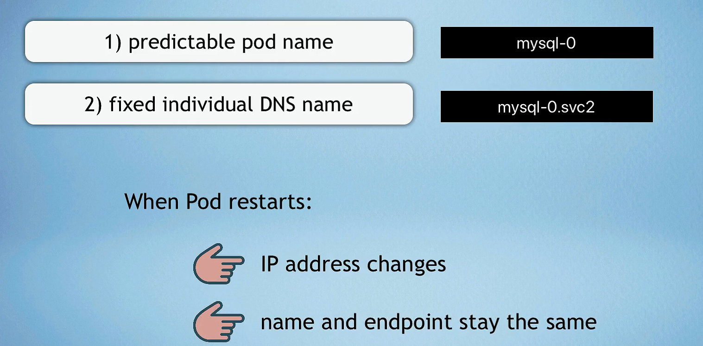

# Stateful Set Deployment (K8s)

- stateless app vs stateful app
    

- deployment vs statefulset
    

- pod entity
    

- scaling database apps
    
    
  - statefulset replicas don't use the same physical storage!
  - statefulset replicas use the same persistent volume claim (PVC) but different persistent volumes (PV)
  - statefulset replicas are created in order, one by one
  - statefulset replicas are deleted in reverse order, one by one
  - statefulset replicas are not created until the previous one is running
  - statefulset replicas are not deleted until the next one is terminated
  - To ensure that replicas stay up to date, they need to be aware of any changes.

- each pod gets its own dns endpoint from service
    
    
