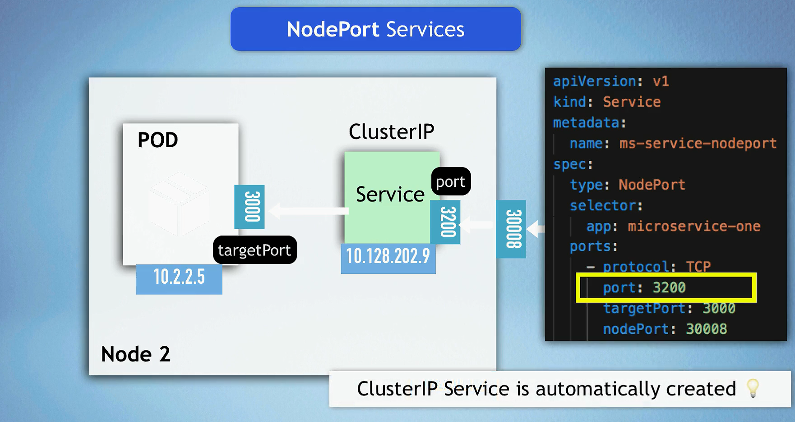
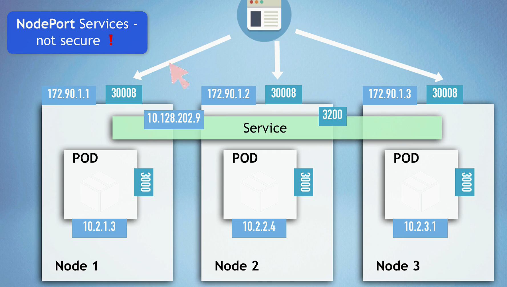

# Services in Kubernetes

In Kubernetes, a Service is an abstraction that defines a logical set of Pods and a policy by which to access them. Services enable communication between different parts of an application and external clients without exposing the underlying details of the Pod's location.

## Key Concepts


- pods are identified by labels
- services select pods based on labels and register them as endpoints.
- service has a stable IP address and DNS name
- service can be accessed by other pods in the cluster
- kube-proxy keeps track of which pods are members of the service and routes traffic to them
- kube-proxy is a network proxy that runs on each node in the cluster
- loadBalancer service is an extension of NodePort service
- nodePort service is an extension of ClusterIP service

## Why Services are Important

- **Dynamic Pod Management**: Pods are ephemeral and can be created, destroyed, and recreated dynamically. Services provide a stable endpoint for accessing these Pods, even as they change over time.
- **Load Balancing**: Services can distribute traffic across multiple Pods, ensuring even load distribution and improving application reliability.
- **Decoupling**: Services decouple the logic of accessing the Pods from their physical implementation, allowing easier scaling and management.

## Service Types

Kubernetes supports several types of Services, each suited for different use cases:

### 1. **ClusterIP (default)**

- **Description**: Exposes the Service on a cluster-internal IP from node ip range. This means the Service is only accessible from within the cluster.
  
  
  
- **Use Case**: Ideal for internal communication between Pods.
- **Example**:

  ```yaml
  apiVersion: v1
  kind: Service
  metadata:
    name: my-service
  spec:
    selector:
      app: MyApp
    ports:
      - protocol: TCP
        port: 80
        targetPort: 8080
    type: ClusterIP
  ```

### 2. **NodePort**

- **Description**: Exposes the Service on each Node's IP at a static port (the NodePort). A ClusterIP Service, to which the NodePort Service routes, is automatically created.
  
  
- **Use Case**: Enables access to the Service from outside the cluster by accessing any Node's IP address and the specific NodePort.
- **Example**:

  ```yaml
  apiVersion: v1
  kind: Service
  metadata:
    name: my-service
  spec:
    type: NodePort
    selector:
      app: MyApp
    ports:
      - protocol: TCP
        port: 80
        targetPort: 8080
        nodePort: 30007
  ```

### 3. **LoadBalancer**

- **Description**: Exposes the Service externally using a cloud provider's load balancer. The cloud provider assigns an external IP address to the Service.
  
  
- **Use Case**: Ideal for services that need to be accessible from outside the cluster, with built-in load balancing provided by the cloud provider.
- **Example**:

  ```yaml
  apiVersion: v1
  kind: Service
  metadata:
    name: my-service
  spec:
    type: LoadBalancer
    selector:
      app: MyApp
    ports:
      - protocol: TCP
        port: 80
        targetPort: 8080
  ```

### 4. **ExternalName**

- **Description**: Maps a Service to a DNS name, returning a CNAME record with the specified name.
- **Use Case**: Useful for integrating external services by using Kubernetes-native Service names.
- **Example**:

  ```yaml
  apiVersion: v1
  kind: Service
  metadata:
    name: my-service
  spec:
    type: ExternalName
    externalName: my.database.example.com
  ```

## Multi-Port Services

A Service can expose multiple ports, each with its own configuration. This is useful when a Pod exposes multiple services or when different services require different configurations.


- **Example**:

  ```yaml
  apiVersion: v1
  kind: Service
  metadata:
    name: my-service
  spec:
    selector:
      app: MyApp
    ports:
      - protocol: TCP
        port: 80
        targetPort: 8080
      - protocol: TCP
        port: 443
        targetPort: 8443
    type: ClusterIP
  ```

## Example Scenarios

1. **Internal Communication (ClusterIP)**

   - An internal service, like a backend API, accessible only within the cluster.
   - Pods can communicate with this service using its DNS name, e.g., `my-service.default.svc.cluster.local`.

2. **External Traffic Handling (LoadBalancer)**

   - A public-facing web application.
   - Users access the application via the external IP provided by the cloud load balancer.

3. **Limited External Access (NodePort)**
   - Useful for limited external access, such as debugging or accessing a test environment.
   - Users access the service using the Node's IP and the NodePort, e.g., `http://<NodeIP>:<NodePort>`.

## Benefits and Use Cases

1. **ClusterIP**

   - **Benefits**: Simple, internal-only access; easy to manage.
   - **Use Cases**: Internal microservices, backend systems.

2. **NodePort**

   - **Benefits**: External access without a load balancer; useful for debugging.
   - **Use Cases**: Development, testing, or limited external access needs.

3. **LoadBalancer**

   - **Benefits**: External access with built-in load balancing.
   - **Use Cases**: Production services requiring high availability and scalability.

4. **ExternalName**
   - **Benefits**: Integrates external services using native DNS names.
   - **Use Cases**: Accessing external databases or APIs from within the cluster.

## Conclusion

Kubernetes Services are crucial for managing network access to Pods, providing stable endpoints, and enabling load balancing. Understanding the different Service types and their use cases allows for better application architecture and easier management of network traffic within and outside the Kubernetes cluster.
