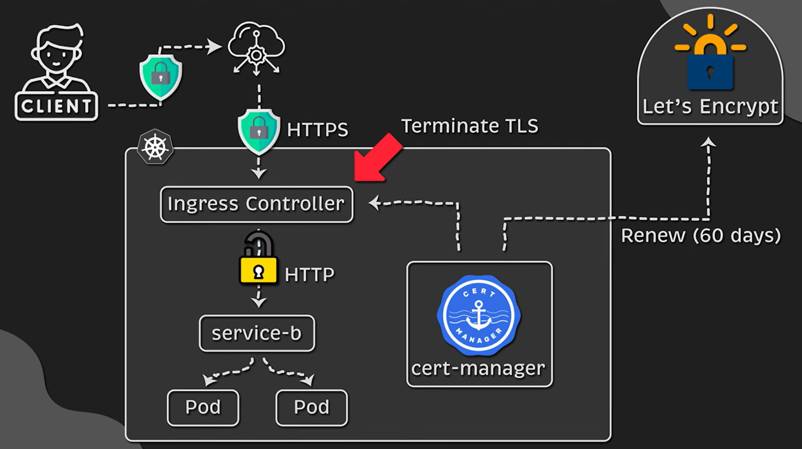

# nginx

## SSL Certificates

### nginx controller with cert-manager and Let's Encrypt

#### cert-manager

- **Role**: Manages certificates in Kubernetes.
- **Function**: Automatically requests, renews, and deploys certificates.
- **Interaction**: Uses Issuers to request certificates from Certificate Authorities.

#### Let's Encrypt

- **Role**: Certificate Authority.
- **Function**: Provides free SSL certificates.
- **Interaction**: Used by cert-manager to request and renew certificates.

### cloud controller (aws-elb) with ACM

#### elb Load Balancer

- **Role**: Distributes incoming traffic across multiple targets.
- **Function**: Provides high availability and fault tolerance.
- **Interaction**: Routes traffic to backend services based on configured rules.

#### AWS Certificate Manager (ACM)

- **Role**: Manages SSL/TLS certificates in AWS.
- **Function**: Provides free SSL certificates for use with AWS services.
- **Interaction**: Used by AWS load balancers to manage SSL certificates.

## Monitoring with Prometheus and Grafana

### monitoring using nginx controller

- can use Prometheus and Grafana with nginx controller
- use Prometheus to collect metrics from nginx controller
- use Grafana to visualize and analyze metrics

### monitoring using cloud controller

- can't use Prometheus and Grafana with AWS ELB
- you can use Prometheus but it will be a bit complex to setup and so expensive
- instead use CloudWatch for monitoring and use AWS X-Ray for tracing
