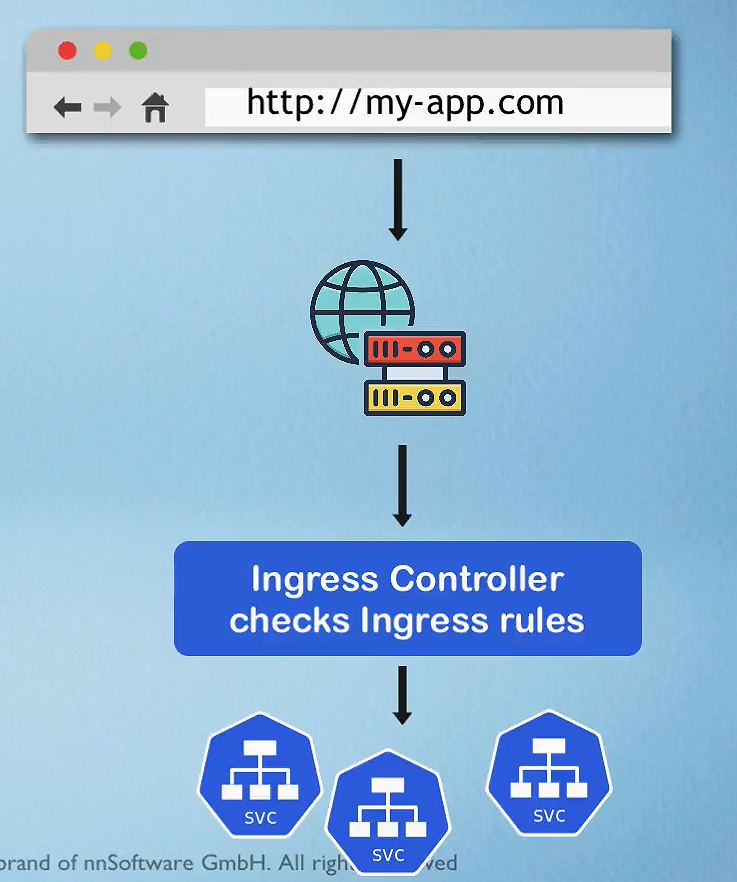
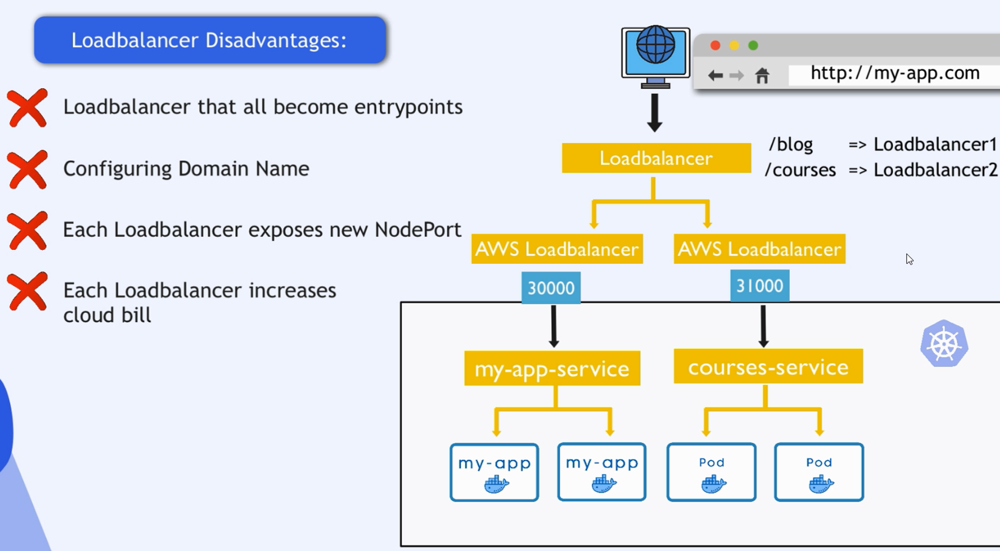
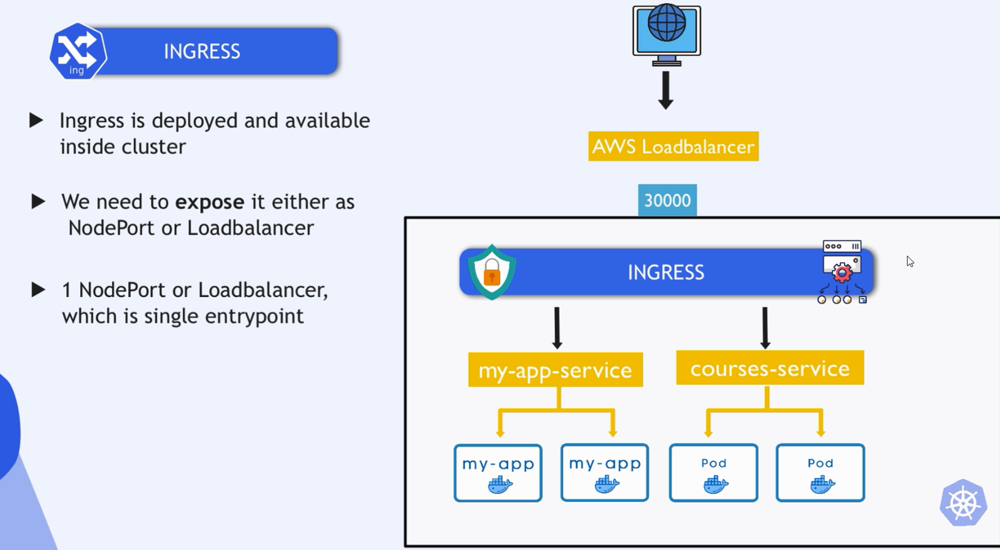
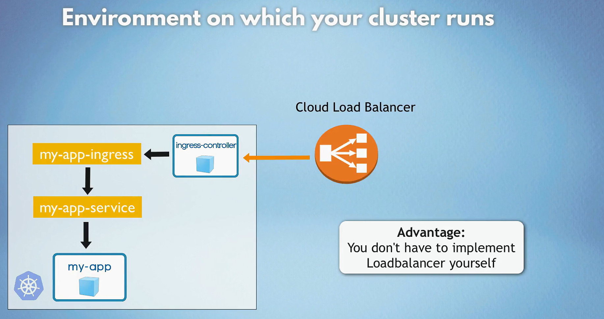
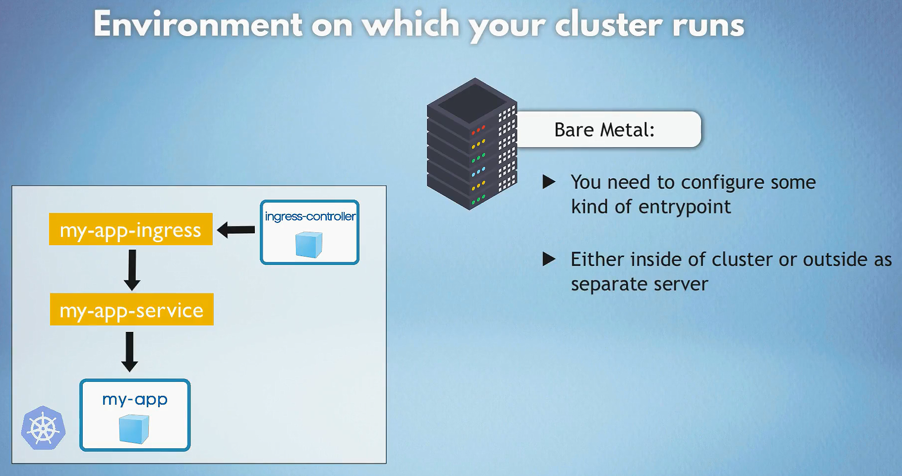

# **Ingress in Kubernetes**

## 1. **What is Ingress in Kubernetes?**

**Ingress** is an API object in Kubernetes that manages external HTTP/HTTPS access to services within a Kubernetes cluster. It provides routing rules that define how external traffic (from users) should be directed to internal services running in the cluster.

1. **Ingress Resource**: Defines the desired routing rules and configurations.
2. **Ingress Controller**: Implements the Ingress resources by configuring a load balancer to route traffic based on the Ingress rules.

- Ingress is just routing to services inside cluster.
  

- Ingress vs Load Balancer:
  
  
- Load balancer is just a proxy server that forwards requests to services inside cluster.
  

- You can implement your own load balancer server (proxy server) either inside or outside the cluster using Bar Metal to route requests to services inside the cluster.
  

### Key Features of Ingress

- **Host-based Routing**: Routes traffic based on hostnames, such as `myapp.com`.
- **Path-based Routing**: Routes traffic based on URL paths, such as `/api` or `/web`.
- **SSL Termination**: Can handle SSL/TLS termination for HTTPS traffic.
- **Multiple Backends**: Routes traffic to different services based on rules.

## 2. **What is an Ingress Controller?**

The **Ingress Controller** is a pod or service running inside the cluster that implements the Ingress rules. It's responsible for receiving external traffic, processing the rules defined in the Ingress resources, and forwarding the traffic to the appropriate Kubernetes services.

Common Ingress Controllers include:

- **NGINX Ingress Controller**
- **Traefik**
- **HAProxy**
- **Contour**

The Ingress Controller is required to make the Ingress object functional. Without it, the Ingress object alone doesn't perform any routing.

## 3. **How Does the Traffic Flow Work with Ingress in Kubernetes?**

When traffic enters a Kubernetes cluster through Ingress, the flow is as follows:

1. **User Sends a Request**: A user sends an HTTP/HTTPS request to a domain (e.g., `https://myapp.com`).

2. **External Load Balancer**: The request first hits the external load balancer provided by the cloud provider (e.g., AWS ELB, GCP Load Balancer). The load balancer forwards traffic to the Ingress Controller, which are pods that runs inside the Kubernetes cluster in multiple worker nodes.

3. **Ingress Controller Processes the Request**: The Ingress Controller inspects the request and matches it against the rules defined in the Ingress resource. Based on the request’s hostname or URL path, it forwards the traffic to the appropriate service in the cluster.

4. **Kubernetes Service Routes Traffic to Pods**: Once the service receives the request, it forwards it to one of the backend pods, which processes the request and sends the response.

5. **Response Returns to the User**: The response follows the reverse path and is sent back to the user through the Ingress Controller and external load balancer.

## 4. **Why Do We Need a Load Balancer with Ingress?**

The **Load Balancer** is necessary to expose the **Ingress Controller** to the external world. The Ingress Controller runs inside the Kubernetes cluster and does not have a direct external IP address.

The external load balancer plays two key roles:

1. **Expose Ingress to the Internet**: It provides an external IP (or DNS) that users can access, forwarding traffic to the Ingress Controller running inside the cluster.

2. **High Availability**: If the Ingress Controller is running on multiple nodes for redundancy, the load balancer can distribute traffic across those nodes to ensure availability.

In summary, without a load balancer, there’s no way for external users to access the Ingress Controller, and hence the services in the cluster.

## 5. **Why Not Just Use the Master Node’s Public IP to Handle Traffic?**

You **cannot** use the master node’s public IP to handle external application traffic for the following reasons:

- **Master Node's Role**: The master node is responsible for managing the Kubernetes control plane (e.g., scheduling pods, running the API server). It is not meant to handle application traffic.

- **Ingress Controller Runs on Worker Nodes**: The Ingress Controller is typically deployed on worker nodes, which handle the application workloads. Sending traffic directly to the master node bypasses the Ingress Controller and can affect the control plane’s performance.

**Best Practice**: The master node should not be exposed to external application traffic. Instead, the Ingress Controller should run on worker nodes, and a load balancer should forward traffic to the Ingress Controller.

## 6. **What if I Run the Ingress Controller on the Master Node?**

Technically, you can run the **Ingress Controller** on the master node, but it is not recommended for the following reasons:

1. **Overloading the Master Node**: The master node is responsible for critical cluster operations. Running an Ingress Controller on it could lead to performance issues and affect the health of the entire cluster.

2. **Single Point of Failure**: If you only run the Ingress Controller on the master node, that node becomes a single point of failure. If the master node goes down, all external traffic will be disrupted.

3. **Best Practice Violation**: Kubernetes best practices recommend isolating the master node from application workloads. Running application-level traffic through the master node breaks this isolation.

## 9. **What Are Some Alternatives If You Don’t Want to Use a Load Balancer?**

If you're running Kubernetes in an environment where a cloud-managed load balancer is not available (e.g., on-premise or bare-metal), you can use alternatives such as:

1. **NodePort**: Expose the Ingress Controller using a NodePort service. This makes the Ingress Controller accessible on a specific port of each node. You can manually send traffic to any node’s IP and the exposed NodePort.

2. **MetalLB**: In bare-metal environments, **MetalLB** is a popular solution for providing load balancer functionality. It assigns external IP addresses to services in the cluster, making them accessible from outside the cluster.

3. **Custom LB Server**: You can set up a separate VM or server as a load balancer using tools like **NGINX** or **HAProxy**. This server would forward traffic to the Ingress Controller running inside the cluster.

## Summary: How Ingress and Load Balancers Work Together

- **Ingress** is used to route external HTTP/HTTPS traffic to services inside the Kubernetes cluster based on hostnames or paths.
- **Ingress Controller** is a necessary component that implements the rules defined in the Ingress resource.
- **Load Balancers** are used to expose the Ingress Controller to the outside world, providing an external IP or domain that users can access.
- **Best Practice**: The Ingress Controller should run on worker nodes, and traffic should be forwarded through a load balancer to avoid overloading the master node.

This concludes the full guide on **Ingress in Kubernetes**, covering key questions and best practices to help you understand how it works and why certain configurations are recommended. Let me know if you'd like to discuss any specific section further!
