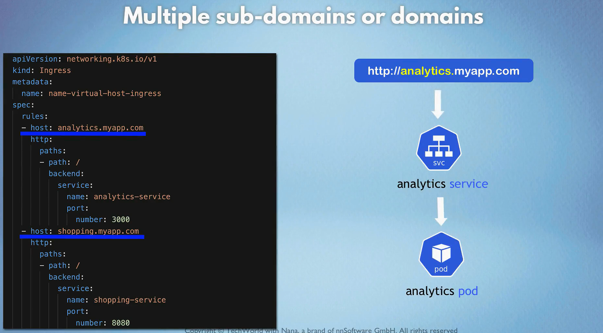
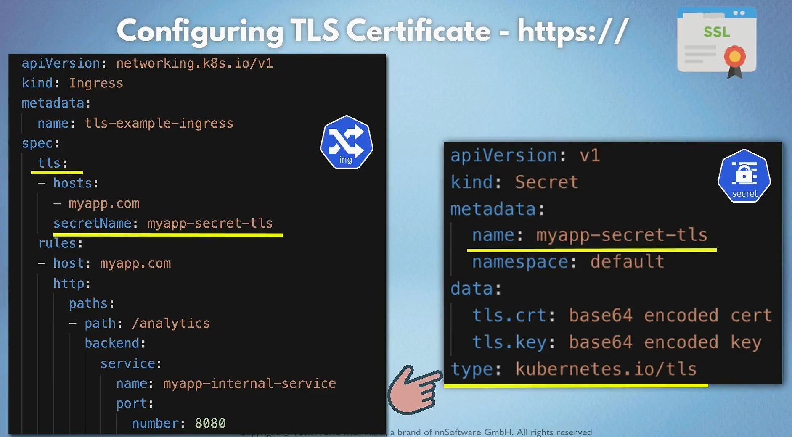
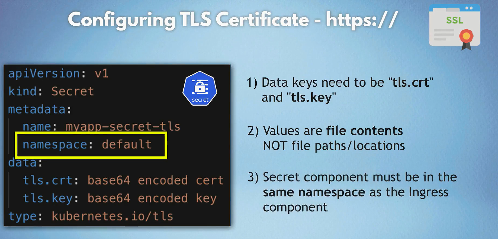

# Ingress in Kubernetes

In Kubernetes, an Ingress is an API object that manages external access to services within a cluster, typically HTTP and HTTPS traffic. An Ingress Controller is a specialized load balancer for handling Ingress resources, usually providing features such as SSL termination, path-based routing, and virtual host-based routing.

## Ingress Controller Architecture

1. **Ingress Resource**: Defines the desired routing rules and configurations.
2. **Ingress Controller**: Implements the Ingress resources by configuring a load balancer to route traffic based on the Ingress rules.

- Multiple sub domains can be used to route requests to different services inside the cluster.
  

- Configure tls/ssl certificates for secure communication.
  
  

## Why Use Ingress?

- **Consolidation**: Instead of exposing each service with its own LoadBalancer, you can consolidate multiple services behind a single external IP.
- **Advanced Routing**: Ingress allows for advanced routing configurations like path-based and host-based routing.
- **TLS/SSL Termination**: Ingress can manage SSL certificates and handle TLS termination, offloading this from individual services.

### Popular Ingress Controllers

- **NGINX Ingress Controller**
- **Traefik Ingress Controller**
- **HAProxy Ingress Controller**
- **AWS ALB Ingress Controller**
- **GCE Ingress Controller**

## Setting Up Nginx Ingress Controller

Imagine you have two services running in your cluster:

- A frontend web application (`frontend-service`) on port 80
- A backend API (`backend-service`) on port 80

You want to expose both services under the same domain with path-based routing.

### Step-by-Step Example

#### 1. Install an Ingress Controller

```bash
kubectl apply -f https://raw.githubusercontent.com/kubernetes/ingress-nginx/main/deploy/static/provider/cloud/deploy.yaml
```

This command deploys the NGINX Ingress Controller in your cluster.

#### 2. Create Deployment and Service for Frontend and Backend

- frontend-deployment.yaml

  ```yaml
  apiVersion: apps/v1
  kind: Deployment
  metadata:
  name: frontend-deployment
  spec:
  replicas: 3
  selector:
      matchLabels:
      app: frontend
  template:
      metadata:
      labels:
          app: frontend
      spec:
      containers:
          - name: frontend
          image: my-frontend-image
          ports:
              - containerPort: 80
  ---
  apiVersion: v1
  kind: Service
  metadata:
  name: frontend-service
  spec:
  selector:
      app: frontend
  ports:
      - protocol: TCP
      port: 80
      targetPort: 80
  ```

- backend-deployment.yaml

  ```yaml
  apiVersion: apps/v1
  kind: Deployment
  metadata:
  name: backend-deployment
  spec:
  replicas: 3
  selector:
      matchLabels:
      app: backend
  template:
      metadata:
      labels:
          app: backend
      spec:
      containers:
          - name: backend
          image: my-backend-image
          ports:
              - containerPort: 80
  ---
  apiVersion: v1
  kind: Service
  metadata:
  name: backend-service
  spec:
  selector:
      app: backend
  ports:
      - protocol: TCP
      port: 80
      targetPort: 80
  ```

- Apply these configurations:

  ```bash
  kubectl apply -f frontend-deployment.yaml
  kubectl apply -f backend-deployment.yaml
  ```

#### 3. Create an Ingress Resource

- ingress.yaml

  ```yaml
  apiVersion: networking.k8s.io/v1
  kind: Ingress
  metadata:
  name: example-ingress
  annotations:
      nginx.ingress.kubernetes.io/rewrite-target: /
  spec:
  rules:
      - host: example.com
      http:
          paths:
          - path: /frontend
              pathType: Prefix
              backend:
              service:
                  name: frontend-service
                  port:
                  number: 80
          - path: /backend
              pathType: Prefix
              backend:
              service:
                  name: backend-service
                  port:
                  number: 80
  tls:
      - hosts:
          - example.com
      secretName: example-tls
  ```

- Apply the Ingress resource:

  ```bash
  kubectl apply -f ingress.yaml
  ```

## Install Ingress Controller in Minikube

### 1. Enable Ingress Addon

```bash
minikube addons enable ingress
```

### 2. Create an Ingress Resource

Create a file `dashboard-ingress.yaml` with the following content:

```yaml
apiVersion: networking.k8s.io/v1
kind: Ingress
metadata:
  name: dashboard-ingress
spec:
  rules:
    - host: dashboard.com
      http:
        paths:
          - path: /
            pathType: Prefix
            backend:
              service:
                name: kubernetes-dashboard
                port:
                  number: 80
```

### 3. Apply the Ingress Resource

```bash
kubectl apply -f dashboard-ingress.yaml
```

### 4. Configure Local DNS or Hosts File

1. Open a text editor with administrative privileges.
2. Locate the hosts file:
   - **Windows**: `C:\Windows\System32\drivers\etc\hosts`
   - **Mac/Linux**: `/etc/hosts`
3. Add the following entry:

   ```text
   127.0.0.1 dashboard.com
   ```

4. Save the hosts file.

### 5. Run `minikube tunnel`

The `minikube tunnel` command sets up a network tunnel between your local machine and the Minikube cluster. It allows you to access services exposed through an Ingress resource as if they were running locally.

```bash
minikube tunnel
```

Now you can access the Ingress resource by opening a web browser and navigating to `http://dashboard.com`.

## **Kubernetes Ingress Resources Are Namespaced**

### **Key Points**

1. **Namespace Scope**

   - **Ingress Resources** are confined to the **namespace** they are created in.
   - They **can only** reference and route traffic to services **within the same namespace**.

2. **Ingress Controller**

   - A single **Ingress Controller** can manage Ingress Resources across **multiple namespaces**.
   - Despite multiple namespaces, each Ingress Resource maintains its **namespace isolation**.

3. **Isolation and Security**
   - Ensures **separation of concerns** and **security boundaries** between different applications or teams.
   - Prevents accidental or unauthorized access across namespaces.

### **Why Namespacing Matters**

- **Organizational Clarity:** Helps in organizing resources logically (e.g., by team, environment, or application).
- **Security:** Limits the scope of access and potential impact of misconfigurations.
- **Resource Management:** Facilitates resource allocation and quota management per namespace.

### **1. Ingress Resource Within a Namespace**

**Namespace:** `frontend`

**Service:** `frontend-service` on port `80`

```yaml
apiVersion: networking.k8s.io/v1
kind: Ingress
metadata:
  name: frontend-ingress
  namespace: frontend
spec:
  rules:
    - host: frontend.example.com
      http:
        paths:
          - path: /
            pathType: Prefix
            backend:
              service:
                name: frontend-service
                port:
                  number: 80
```

**Explanation:**

- **Ingress Resource:** `frontend-ingress` is defined in the `frontend` namespace.
- **Routing:** Directs traffic from `frontend.example.com` to `frontend-service` within the same namespace.

### **2. Ingress Resource in Another Namespace**

**Namespace:** `backend`

**Service:** `backend-service` on port `8080`

```yaml
apiVersion: networking.k8s.io/v1
kind: Ingress
metadata:
  name: backend-ingress
  namespace: backend
spec:
  rules:
    - host: backend.example.com
      http:
        paths:
          - path: /
            pathType: Prefix
            backend:
              service:
                name: backend-service
                port:
                  number: 8080
```

**Explanation:**

- **Ingress Resource:** `backend-ingress` is defined in the `backend` namespace.
- **Routing:** Directs traffic from `backend.example.com` to `backend-service` within the `backend` namespace.

### **3. Attempting Cross-Namespace Routing**

**Not Supported Directly:** An Ingress Resource **cannot** route to services in **other namespaces**.

**Example of What **Doesn't Work:\*\*

```yaml
apiVersion: networking.k8s.io/v1
kind: Ingress
metadata:
  name: invalid-ingress
  namespace: frontend
spec:
  rules:
    - host: cross.example.com
      http:
        paths:
          - path: /
            pathType: Prefix
            backend:
              service:
                name: backend-service # Assuming backend-service is in 'backend' namespace
                port:
                  number: 8080
```

**Outcome:**

- **Error:** Kubernetes will throw an error because `backend-service` is not in the `frontend` namespace.

---

### **Best Practices**

1. **Use Namespace-Specific Ingress Resources**

   - Define an Ingress Resource within each namespace for its services.

2. **Leverage a Shared Ingress Controller**

   - Deploy a single Ingress Controller to manage all namespace-specific Ingress Resources.

3. **Maintain Clear Naming Conventions**

   - Use distinct hostnames or paths to avoid conflicts across namespaces.

4. **Automate Ingress Management**
   - Utilize tools like Helm or CI/CD pipelines to manage Ingress configurations consistently.

---

### **Conclusion**

- **Ingress Resources** are **namespaced** and **cannot** directly route to services in other namespaces.
- **Use separate Ingress Resources** within each namespace, managed by a **shared Ingress Controller**.
- This approach ensures **isolation**, **security**, and **organizational clarity** within your Kubernetes cluster.
