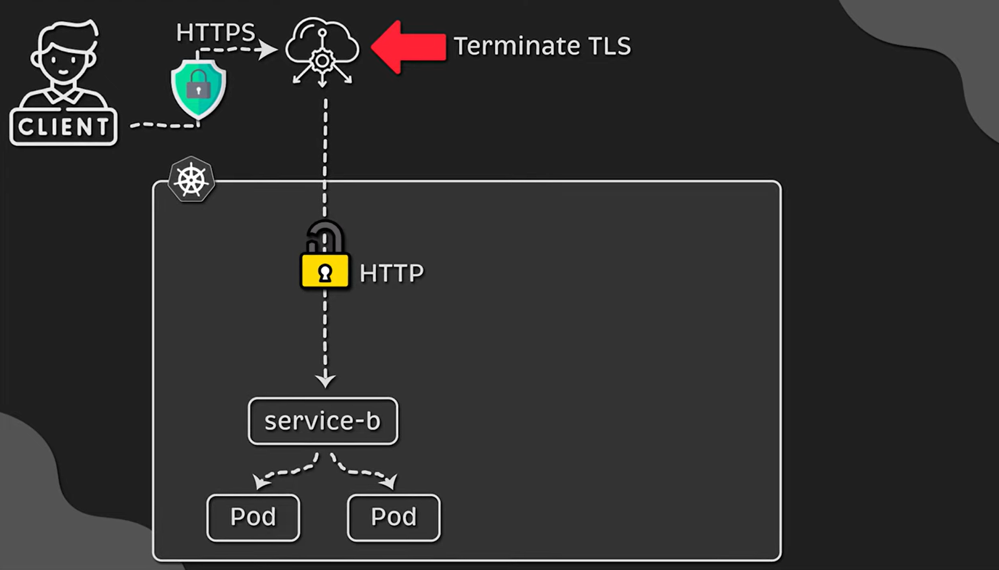

# SSL Certificates

## Nginx controller with cert-manager and Let's Encrypt

### cert-manager

- **Role**: Manages certificates in Kubernetes.
- **Function**: Automatically requests, renews, and deploys certificates.
- **Interaction**: Uses Issuers to request certificates from Certificate Authorities.

### Let's Encrypt

- **Role**: Certificate Authority.
- **Function**: Provides free SSL certificates.
- **Interaction**: Used by cert-manager to request and renew certificates.

## Cloud controller (aws-elb) with ACM

### elb Load Balancer

- **Role**: Distributes incoming traffic across multiple targets.
- **Function**: Provides high availability and fault tolerance.
- **Interaction**: Routes traffic to backend services based on configured rules.

### AWS Certificate Manager (ACM)

- **Role**: Manages SSL/TLS certificates in AWS.
- **Function**: Provides free SSL certificates for use with AWS services.
- **Interaction**: Used by AWS load balancers to manage SSL certificates.
