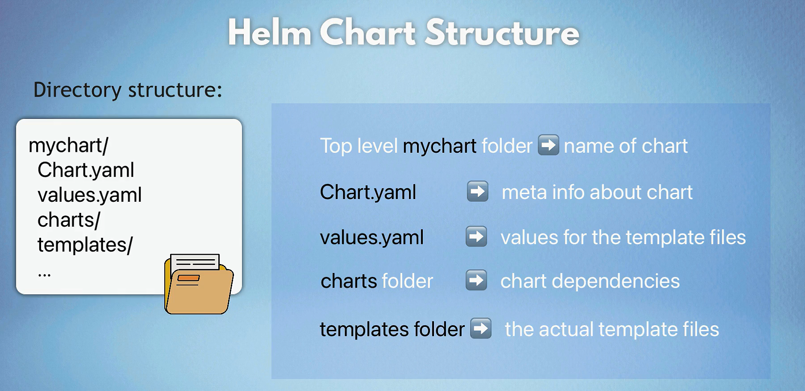
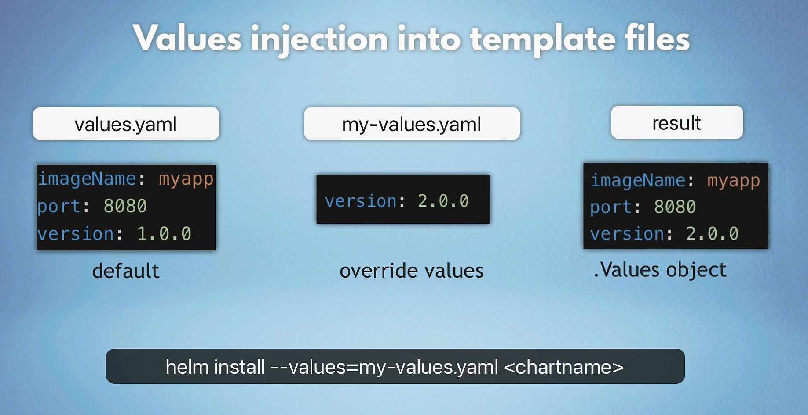

# Helm

Helm is a package manager for Kubernetes that simplifies the deployment and management of applications. It enables users to define, install, and upgrade even the most complex Kubernetes applications. Think of Helm as the "apt" or "yum" for Kubernetes.

## Core Helm Information

### What is Helm?

Helm is a package manager for Kubernetes that simplifies the deployment and management of applications through "charts," which are packages of pre-configured Kubernetes resources.

### Helm Components

1. **Helm CLI**: Command-line interface for managing Helm charts and releases.
2. **Helm Chart**: A collection of files that describe a related set of Kubernetes resources.
3. **Chart Repository**: A location where charts can be stored and shared.
4. **Helm Release**: An instance of a chart running in a Kubernetes cluster.

### Benefits of Using Helm

1. **Simplifies Deployment and Management**:

   - Packages all Kubernetes resources into a single chart.
   - Ensures consistent deployment across different environments.

2. **Versioning and Rollbacks**:

   - Tracks changes with versioned charts.
   - Easily upgrades and reverts applications to previous versions.

3. **Reusability and Sharing**:

   - Reusable charts promote standardization.
   - Store and share charts in repositories for easy distribution and collaboration.

4. **Configuration Management**:

   - Separate configuration values from templates using values files.
   - Override values for flexible and environment-specific configurations.

5. **Powerful Templating Engine**:

   - Use variables and conditionals in resource definitions for dynamic configuration.

6. **Dependency Management**:

   - Specify and manage dependencies between charts.
   - Organize complex applications with subcharts.

7. **Community and Ecosystem**:
   - Access a large community with pre-built charts for common applications.
   - Integrate with CI/CD tools and cloud providers for enhanced capabilities.

### Installing Helm

**Download and Install Helm**: Follow the installation instructions from the [official Helm website](https://helm.sh/docs/intro/install/).

```bash
curl https://baltocdn.com/helm/signing.asc | gpg --dearmor | sudo tee /usr/share/keyrings/helm.gpg > /dev/null

sudo apt-get install apt-transport-https --yes

echo "deb [arch=$(dpkg --print-architecture) signed-by=/usr/share/keyrings/helm.gpg] https://baltocdn.com/helm/stable/debian/ all main" | sudo tee /etc/apt/sources.list.d/helm-stable-debian.list

sudo apt-get update
sudo apt-get install helm
```

## Creating Your Own Helm Chart

### Step-by-Step Process

1. **Create a New Chart**:

   ```sh
   helm create myapp
   ```

2. **Directory Structure**:

   ```text
   myapp/
   ├── Chart.yaml
   ├── values.yaml
   ├── charts/
   ├── templates/
   └── ...
   ```

   

3. **Edit Chart.yaml**: Define metadata about your chart.

   ```yaml
   apiVersion: v2
   name: myapp
   description: A Helm chart for Kubernetes
   version: 0.1.0
   ```

4. **Define Values in values.yaml**: Store `default` configuration values.

   ```yaml
   replicaCount: 2

   image:
     repository: nginx
     tag: stable

   service:
     type: ClusterIP
     port: 80
   ```

5. **Create Kubernetes Manifests in templates/**: Use templates to define your Kubernetes resources.

   ```yaml
   # templates/deployment.yaml
   apiVersion: apps/v1
   kind: Deployment
   metadata:
     name: {{ .Release.Name }}-deployment
   spec:
     replicas: {{ .Values.replicaCount }}
     selector:
       matchLabels:
         app: {{ .Release.Name }}
     template:
       metadata:
         labels:
           app: {{ .Release.Name }}
       spec:
         containers:
           - name: {{ .Release.Name }}
             image: "{{ .Values.image.repository }}:{{ .Values.image.tag }}"
             ports:
               - containerPort: 80
   ```

6. **Deploy the Chart**:

   ```sh
   helm install myapp ./myapp
   ```

## Deploy releases from Helm Charts (Online or Local)

### Deploy releases from Online Helm Chart

```sh
# Add Helm Chart Repository
helm repo add bitnami https://charts.bitnami.com/bitnami
helm repo update

# Deploy a Releases
helm install myApp bitnami/nginx -f app-values.yaml
```

### Deploy releases From Local Helm Chart

```sh
# App1 Release
helm install myApp1 <./chartDirPath> -f app1-values.yaml
# App2 Release
helm install myApp2 <./chartDirPath> -f app2-values.yaml
```

### Overriding Default Values




#### 1. **Using `--set` Flag**:

```sh
helm install myrelease bitnami/nginx --set service.type=LoadBalancer
```

#### 2. **Using a Custom values.yaml File**:

```sh
# custom-values.yaml
service:
  type: LoadBalancer
```

```sh
helm install myrelease bitnami/nginx -f custom-values.yaml
```

#### 3. **Combining `--set` and Custom values.yaml**:

```sh
helm install myrelease bitnami/nginx -f custom-values.yaml --set service.port=8080
```

## Common Helm Commands

Helm is a powerful package manager for Kubernetes, simplifying the deployment and management of applications. Below is a curated list of essential Helm commands, organized for easy reference.

### 1. **Helm Installation**

Ensure Helm is installed and configured to interact with your Kubernetes cluster.

#### **Install Helm**

Follow the [official installation guide](https://helm.sh/docs/intro/install/) for your operating system.

### 2. **Managing Repositories**

Helm uses repositories to store and distribute charts.

#### **Add a Repository**

```bash
helm repo add [repo_name] [repo_url]
```

_Example:_

```bash
helm repo add stable https://charts.helm.sh/stable
```

#### **Remove a Repository**

```bash
helm repo remove [repo_name]
```

_Example:_

```bash
helm repo remove stable
```

#### **Update Repositories**

```bash
helm repo update
```

### 3. **Searching for Charts**

Find charts available in your repositories.

#### **Search by Keyword**

```bash
helm search repo [keyword]
```

_Example:_

```bash
helm search repo nginx
```

#### **Search on Helm Hub**

```bash
helm search hub [keyword]
```

_Example:_

```bash
helm search hub postgres
```

### 4. **Installing Charts**

Deploy applications using Helm charts.

#### **Install a Chart**

```bash
helm install [release_name] [chart] [flags]
```

_Example:_

```bash
helm install my-release stable/nginx
```

#### **Install with Custom Values**

```bash
helm install [release_name] [chart] -f [values_file]
```

_Example:_

```bash
helm install my-release stable/nginx -f custom-values.yaml
```

#### **Install with Set Flags**

```bash
helm install [release_name] [chart] --set [key=value]
```

_Example:_

```bash
helm install my-release stable/nginx --set replicaCount=3
```

### 5. **Upgrading Releases**

Update existing deployments with new chart versions or configurations.

#### **Upgrade a Release**

```bash
helm upgrade [release_name] [chart] [flags]
```

_Example:_

```bash
helm upgrade my-release stable/nginx
```

#### **Upgrade with Custom Values**

```bash
helm upgrade [release_name] [chart] -f [values_file]
```

_Example:_

```bash
helm upgrade my-release stable/nginx -f custom-values.yaml
```

#### **Upgrade with Set Flags**

```bash
helm upgrade [release_name] [chart] --set [key=value]
```

_Example:_

```bash
helm upgrade my-release stable/nginx --set replicaCount=5
```

### 6. **Uninstalling Releases**

Remove applications deployed via Helm.

#### **Uninstall a Release**

```bash
helm uninstall [release_name]
```

_Example:_

```bash
helm uninstall my-release
```

### 7. **Listing Releases**

View deployed Helm releases.

#### **List All Releases**

```bash
helm list --all-namespaces
```

#### **List Releases in a Namespace**

```bash
helm list -n [namespace]
```

_Example:_

```bash
helm list -n production
```

### 8. **Viewing Release Information**

Get detailed information about a specific release.

#### **Get Release Status**

```bash
helm status [release_name]
```

_Example:_

```bash
helm status my-release
```

#### **Get Release History**

```bash
helm history [release_name]
```

_Example:_

```bash
helm history my-release
```

### 9. **Rolling Back Releases**

Revert to a previous state if needed.

#### **Rollback to a Revision**

```bash
helm rollback [release_name] [revision] [flags]
```

_Example:_

```bash
helm rollback my-release 2
```

### 10. **Template Rendering**

Preview Kubernetes manifests without deploying.

#### **Render Templates**

```bash
helm template [release_name] [chart] [flags]
```

_Example:_

```bash
helm template my-release stable/nginx
```

### 11. **Linting Charts**

Validate chart structure and content.

#### **Lint a Chart**

```bash
helm lint [chart_path]
```

_Example:_

```bash
helm lint ./mychart
```

### 12. **Creating and Packaging Charts**

Develop and distribute your own charts.

#### **Create a New Chart**

```bash
helm create [chart_name]
```

_Example:_

```bash
helm create mychart
```

#### **Package a Chart**

```bash
helm package [chart_path] [flags]
```

_Example:_

```bash
helm package ./mychart
```

### 13. **Additional Useful Commands**

#### **Inspect a Chart**

```bash
helm inspect [subcommand] [chart]
```

_Subcommands:_ `chart`, `values`, `readme`, `all`  
 _Example:_

```bash
helm inspect values stable/nginx
```

#### **Manage Dependencies**

- **Update Dependencies**

  ```bash
  helm dependency update [chart_path]
  ```

  _Example:_

  ```bash
  helm dependency update ./mychart
  ```

- **List Dependencies**

  ```bash
  helm dependency list [chart_path]
  ```

  _Example:_

  ```bash
  helm dependency list ./mychart
  ```

#### **Manage Plugins**

- **List Plugins**

  ```bash
  helm plugin list
  ```

- **Install a Plugin**

  ```bash
  helm plugin install [plugin_url]
  ```

  _Example:_

  ```bash
  helm plugin install https://github.com/databus23/helm-diff
  ```

- **Remove a Plugin**

  ```bash
  helm plugin remove [plugin_name]
  ```

  _Example:_

  ```bash
  helm plugin remove diff
  ```

### Best Practices

1. **Version Control**: Store your Helm charts in a version-controlled repository.
2. **Environment-Specific Values**: Use different `values.yaml` files for different environments.
3. **Template Simplicity**: Keep your templates simple and manageable.
4. **Security**: Regularly scan Helm charts for vulnerabilities.
5. **Automation**: Use CI/CD pipelines to automate Helm operations like testing, linting, and deployment.
