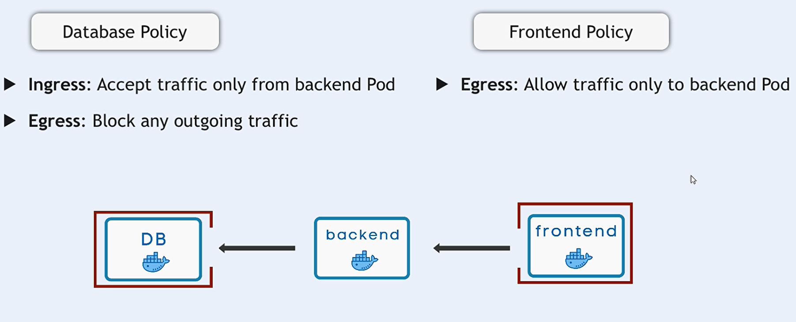

# Network Policies Examples

Make sure you install `calico` cni plugin or any other cni plugin that supports network policies before you can use network policies in your Kubernetes cluster.

## Example 1: Allow/Deny Ingress/Egress Traffic

```yaml
# Allow All Ingress Traffic
apiVersion: networking.k8s.io/v1
kind: NetworkPolicy
metadata:
  name: allow-all-ingress
  namespace: default
spec:
  podSelector: {}
  policyTypes:
    - Ingress
  ingress:
    - {}
---
# Deny All Egress Traffic
apiVersion: networking.k8s.io/v1
kind: NetworkPolicy
metadata:
  name: deny-all-egress
  namespace: default
spec:
  podSelector:
    matchLabels:
      app: secure-app
  policyTypes:
    - Egress
  egress: []
```

## Example 2: Allow Ingress from a Specific Namespace

```yaml
apiVersion: networking.k8s.io/v1
kind: NetworkPolicy
metadata:
  name: allow-namespace-ingress
  namespace: default
spec:
  podSelector:
    matchLabels:
      app: my-app
  policyTypes:
    - Ingress
  ingress:
    - from:
        - namespaceSelector:
            matchLabels:
              project: my-namespace
```

## Example 3: Allow Egress to a Specific IP Range

```yaml
apiVersion: networking.k8s.io/v1
kind: NetworkPolicy
metadata:
  name: allow-egress-to-ip
  namespace: default
spec:
  podSelector:
    matchLabels:
      app: my-app
  policyTypes:
    - Egress
  egress:
    - to:
        - ipBlock:
            cidr: 192.168.1.0/24
```

## Example 4: Allow Ingress Traffic on Specific Ports

```yaml
apiVersion: networking.k8s.io/v1
kind: NetworkPolicy
metadata:
  name: allow-ingress-specific-ports
  namespace: default
spec:
  podSelector:
    matchLabels:
      app: web-app
  policyTypes:
    - Ingress
  ingress:
    - ports:
        - protocol: TCP
          port: 80
        - protocol: TCP
          port: 443
```

## Example 5: Full Example



### Deployments

```yaml
---
# database deployment
apiVersion: apps/v1
kind: Deployment
metadata:
  name: database
  namespace: "ns-staging"
spec:
  replicas: 2
  selector:
    matchLabels:
      app: database
  template:
    metadata:
      labels:
        app: database
    spec:
      containers:
        - name: redis
          image: redis:6-alpine
          ports:
            - containerPort: 6379
          resources:
            limits:
              cpu: "500m"
              memory: "512Mi"
---
# backend deployment
apiVersion: apps/v1
kind: Deployment
metadata:
  name: backend
  namespace: "ns-staging"
spec:
  replicas: 2
  selector:
    matchLabels:
      app: backend
  template:
    metadata:
      labels:
        app: backend
    spec:
      containers:
        - name: nginx
          image: nginx:1.21-alpine
          ports:
            - containerPort: 80
          resources:
            limits:
              cpu: "500m"
              memory: "512Mi"
            requests:
              cpu: "200m"
              memory: "256Mi"
---
# frontend deployment
apiVersion: apps/v1
kind: Deployment
metadata:
  name: frontend
  namespace: "ns-staging"
spec:
  replicas: 2
  selector:
    matchLabels:
      app: frontend
  template:
    metadata:
      labels:
        app: frontend
    spec:
      containers:
        - name: nginx
          image: nginx:1.21-alpine
          ports:
            - containerPort: 80
          resources:
            limits:
              cpu: "1"
              memory: "512Mi"
```

### Services

```yaml
---
# database service
apiVersion: v1
kind: Service
metadata:
  name: database-service
  namespace: "ns-staging"
spec:
  selector:
    app: database
  ports:
    - protocol: TCP
      port: 6379
      targetPort: 6379
  type: ClusterIP

---
# backend service
apiVersion: v1
kind: Service
metadata:
  name: backend-service
  namespace: "ns-staging"
spec:
  selector:
    app: backend
  ports:
    - protocol: TCP
      port: 80
      targetPort: 80
  type: ClusterIP

---
# frontend service
apiVersion: v1
kind: Service
metadata:
  name: frontend-service
  namespace: "ns-staging"
spec:
  selector:
    app: frontend
  ports:
    - protocol: TCP
      port: 80
      targetPort: 80
  type: ClusterIP
```

### Network Policy

```yaml
---
# np-frontend
apiVersion: networking.k8s.io/v1
kind: NetworkPolicy
metadata:
  name: np-frontend
  namespace: ns-staging
spec:
  podSelector:
    matchLabels:
      app: frontend
  policyTypes:
    - Egress
  egress:
    - to:
        - podSelector:
            matchLabels:
              app: backend
      ports:
        - protocol: TCP
          port: 80
---
# np-backend
apiVersion: networking.k8s.io/v1
kind: NetworkPolicy
metadata:
  name: np-backend
  namespace: ns-staging
spec:
  podSelector:
    matchLabels:
      app: backend
  policyTypes:
    - Ingress
    - Egress
  ingress:
    - from:
        - podSelector:
            matchLabels:
              app: frontend
      ports:
        - protocol: TCP
          port: 80
  egress:
    - to:
        - podSelector:
            matchLabels:
              app: database
      ports:
        - protocol: TCP
          port: 6379
---
# np-database
apiVersion: networking.k8s.io/v1
kind: NetworkPolicy
metadata:
  name: np-database
  namespace: ns-staging
spec:
  podSelector:
    matchLabels:
      app: database
  policyTypes:
    - Ingress
    - Egress
  ingress:
    - from:
        - podSelector:
            matchLabels:
              app: backend
      ports:
        - protocol: TCP
          port: 6379
```

### Testing

```bash
# Set namespace to ns-staging
kubectl config set-context --current --namespace=ns-staging
kubectl get pod -o wide

# NOTE: Define the IP addresses of the services
# export DATABASE_SERVICE_IP=$(kubectl get svc database-service -n ns-staging -o jsonpath='{.spec.clusterIP}')
# export BACKEND_SERVICE_IP=$(kubectl get svc backend-service -n ns-staging -o jsonpath='{.spec.clusterIP}')
# export FRONTEND_SERVICE_IP=$(kubectl get svc frontend-service -n ns-staging -o jsonpath='{.spec.clusterIP}')

# NOTE: Define the IP addresses of the pods
export DATABASE_POD_NAME=$(kubectl get pod -l app=database -n ns-staging  -o jsonpath='{.items[0].metadata.name}')
export BACKEND_POD_NAME=$(kubectl get pod -l app=backend -n ns-staging  -o jsonpath='{.items[0].metadata.name}')
export FRONTEND_POD_NAME=$(kubectl get pod -l app=frontend -n ns-staging  -o jsonpath='{.items[0].metadata.name}')

# NOTE: Define the IP addresses of the pods
export DATABASE_POD_IP=$(kubectl get pod -l app=database -n ns-staging  -o jsonpath='{.items[0].status.podIP}')
export BACKEND_POD_IP=$(kubectl get pod -l app=backend -n ns-staging  -o jsonpath='{.items[0].status.podIP}')
export FRONTEND_POD_IP=$(kubectl get pod -l app=frontend -n ns-staging  -o jsonpath='{.items[0].status.podIP}')


## Before creating network policies

### all of these works

kubectl exec $BACKEND_POD_NAME -- sh -c "nc -v $DATABASE_POD_IP 6379"
kubectl exec $FRONTEND_POD_NAME -- sh -c "nc -v $BACKEND_POD_IP 80"
kubectl exec $FRONTEND_POD_NAME -- sh -c "nc -v $DATABASE_POD_IP 6379"
kubectl exec $DATABASE_POD_NAME -- sh -c "nc -v $FRONTEND_POD_IP 80"
kubectl exec $DATABASE_POD_NAME -- sh -c "nc -v $BACKEND_POD_IP 80"

## After creating network policies

### still works

kubectl exec $BACKEND_POD_NAME -- sh -c "nc -v $DATABASE_POD_IP 6379"
kubectl exec $FRONTEND_POD_NAME -- sh -c "nc -v $BACKEND_POD_IP 80"

### don't work any more

kubectl exec $FRONTEND_POD_NAME -- sh -c "nc -v $DATABASE_POD_IP 6379"
kubectl exec $DATABASE_POD_NAME -- sh -c "nc -v $FRONTEND_POD_IP 80"
kubectl exec $DATABASE_POD_NAME -- sh -c "nc -v $BACKEND_POD_IP 80"
```

### Cleanup

```bash
kubectl delete -f ./deployments.yaml
kubectl delete -f ./services.yaml
kubectl delete -f ./network-policy.yaml
kubectl delete ns ns-staging
```
