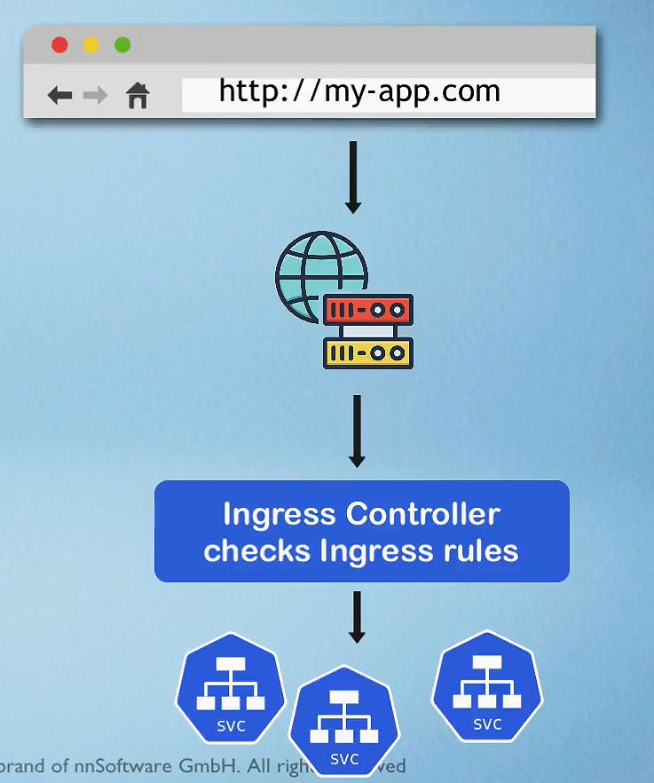
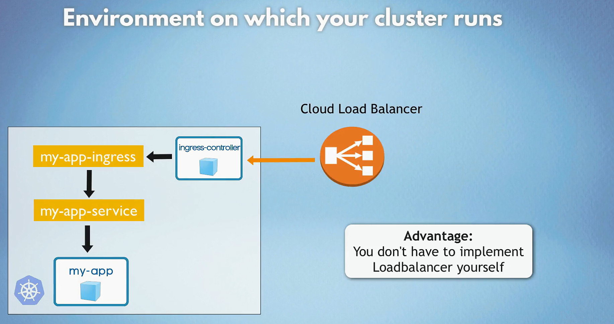
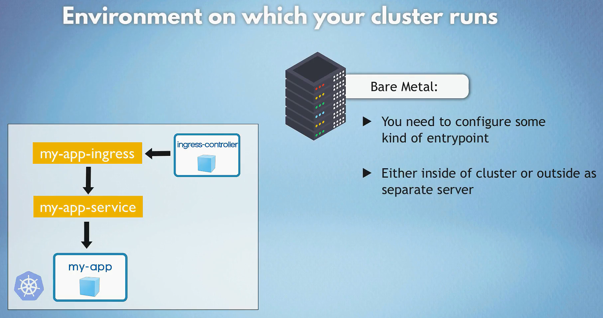
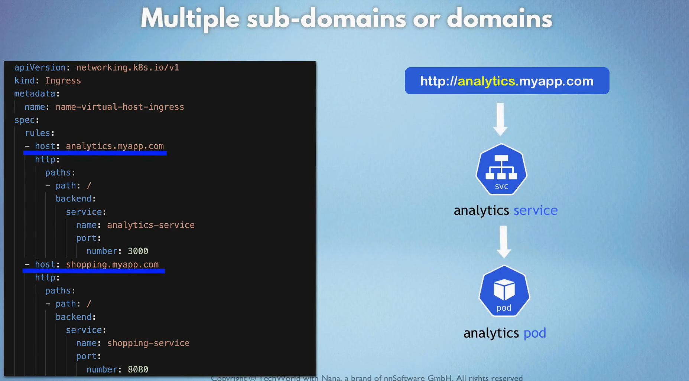
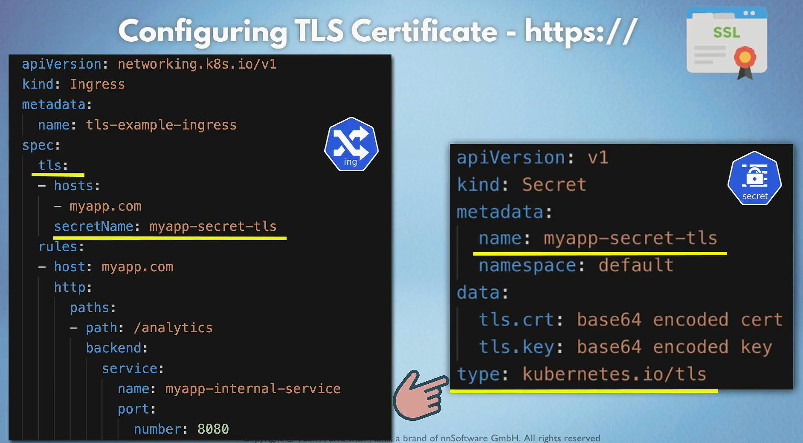
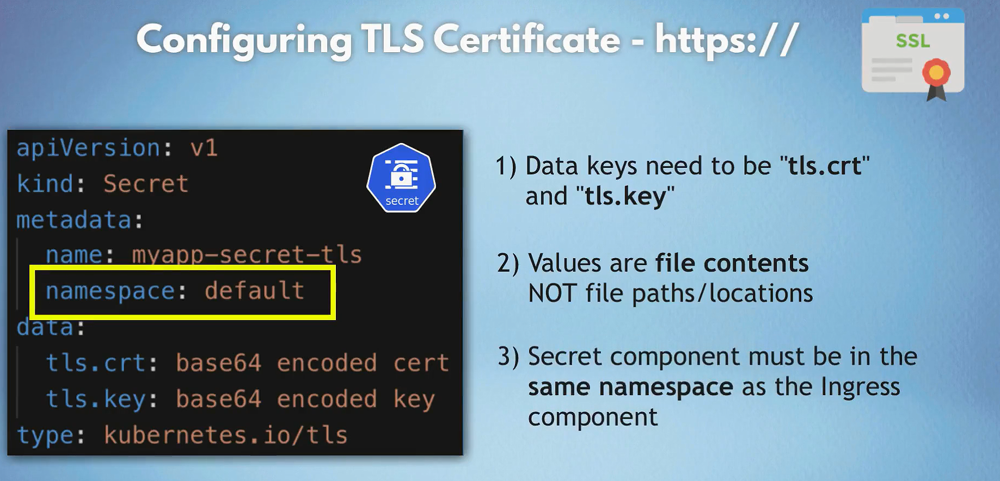

# Ingress in Kubernetes

In Kubernetes, an Ingress is an API object that manages external access to services within a cluster, typically HTTP and HTTPS traffic. An Ingress Controller is a specialized load balancer for handling Ingress resources, usually providing features such as SSL termination, path-based routing, and virtual host-based routing.

## Ingress Controller Architecture

1. **Ingress Resource**: Defines the desired routing rules and configurations.
2. **Ingress Controller**: Implements the Ingress resources by configuring a load balancer to route traffic based on the Ingress rules.

- ingress is just routing to services inside cluster.
  

- load balancer is just a proxy server that forwards requests to services inside cluster.
  

- you can implement your own load balancer server (proxy server) either inside or outside the cluster using Bar Metal to route requests to services inside the cluster.
  

- multiple sub domains can be used to route requests to different services inside the cluster.
  

- configure tls/ssl certificates for secure communication.
  
  

## Why Use Ingress?

- **Consolidation**: Instead of exposing each service with its own LoadBalancer, you can consolidate multiple services behind a single external IP.
- **Advanced Routing**: Ingress allows for advanced routing configurations like path-based and host-based routing.
- **TLS/SSL Termination**: Ingress can manage SSL certificates and handle TLS termination, offloading this from individual services.

### Popular Ingress Controllers

- **NGINX Ingress Controller**
- **Traefik Ingress Controller**
- **HAProxy Ingress Controller**
- **AWS ALB Ingress Controller**
- **GCE Ingress Controller**

## Example Scenario

Imagine you have two services running in your cluster:

- A frontend web application (`frontend-service`) on port 80
- A backend API (`backend-service`) on port 80

You want to expose both services under the same domain with path-based routing.

### Step-by-Step Example

#### 1. Install an Ingress Controller

```bash
kubectl apply -f https://raw.githubusercontent.com/kubernetes/ingress-nginx/main/deploy/static/provider/cloud/deploy.yaml
```

This command deploys the NGINX Ingress Controller in your cluster.

#### 2. Create Deployment and Service for Frontend and Backend

- frontend-deployment.yaml

  ```yaml
  apiVersion: apps/v1
  kind: Deployment
  metadata:
  name: frontend-deployment
  spec:
  replicas: 3
  selector:
      matchLabels:
      app: frontend
  template:
      metadata:
      labels:
          app: frontend
      spec:
      containers:
          - name: frontend
          image: my-frontend-image
          ports:
              - containerPort: 80
  ---
  apiVersion: v1
  kind: Service
  metadata:
  name: frontend-service
  spec:
  selector:
      app: frontend
  ports:
      - protocol: TCP
      port: 80
      targetPort: 80
  ```

- backend-deployment.yaml

  ```yaml
  apiVersion: apps/v1
  kind: Deployment
  metadata:
  name: backend-deployment
  spec:
  replicas: 3
  selector:
      matchLabels:
      app: backend
  template:
      metadata:
      labels:
          app: backend
      spec:
      containers:
          - name: backend
          image: my-backend-image
          ports:
              - containerPort: 80
  ---
  apiVersion: v1
  kind: Service
  metadata:
  name: backend-service
  spec:
  selector:
      app: backend
  ports:
      - protocol: TCP
      port: 80
      targetPort: 80
  ```

- Apply these configurations:

  ```bash
  kubectl apply -f frontend-deployment.yaml
  kubectl apply -f backend-deployment.yaml
  ```

#### 3. Create an Ingress Resource

- ingress.yaml

  ```yaml
  apiVersion: networking.k8s.io/v1
  kind: Ingress
  metadata:
  name: example-ingress
  annotations:
      nginx.ingress.kubernetes.io/rewrite-target: /
  spec:
  rules:
      - host: example.com
      http:
          paths:
          - path: /frontend
              pathType: Prefix
              backend:
              service:
                  name: frontend-service
                  port:
                  number: 80
          - path: /backend
              pathType: Prefix
              backend:
              service:
                  name: backend-service
                  port:
                  number: 80
  tls:
      - hosts:
          - example.com
      secretName: example-tls
  ```

- Apply the Ingress resource:

  ```bash
  kubectl apply -f ingress.yaml
  ```

## Example of Ingress Controller in Minikube

### 1. Enable Ingress Addon

```bash
minikube addons enable ingress
```

### 2. Create an Ingress Resource

Create a file `dashboard-ingress.yaml` with the following content:

```yaml
apiVersion: networking.k8s.io/v1
kind: Ingress
metadata:
  name: dashboard-ingress
spec:
  rules:
    - host: dashboard.com
      http:
        paths:
          - path: /
            pathType: Prefix
            backend:
              service:
                name: kubernetes-dashboard
                port:
                  number: 80
```

### 3. Apply the Ingress Resource

```bash
kubectl apply -f dashboard-ingress.yaml
```

### 4. Configure Local DNS or Hosts File

1. Open a text editor with administrative privileges.
2. Locate the hosts file:
   - **Windows**: `C:\Windows\System32\drivers\etc\hosts`
   - **Mac/Linux**: `/etc/hosts`
3. Add the following entry:

   ```text
   127.0.0.1 dashboard.com
   ```

4. Save the hosts file.

### 5. Run `minikube tunnel`

The `minikube tunnel` command sets up a network tunnel between your local machine and the Minikube cluster. It allows you to access services exposed through an Ingress resource as if they were running locally.

```bash
minikube tunnel
```

Now you can access the Ingress resource by opening a web browser and navigating to `http://dashboard.com`.
