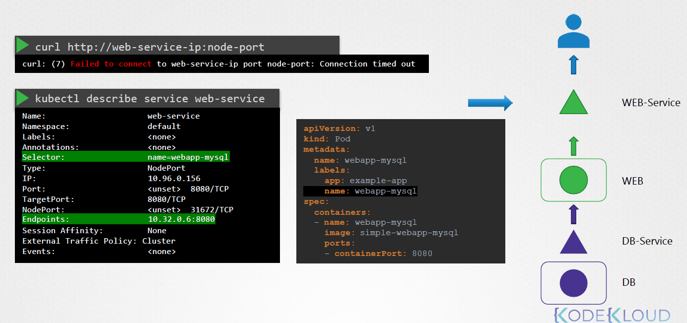
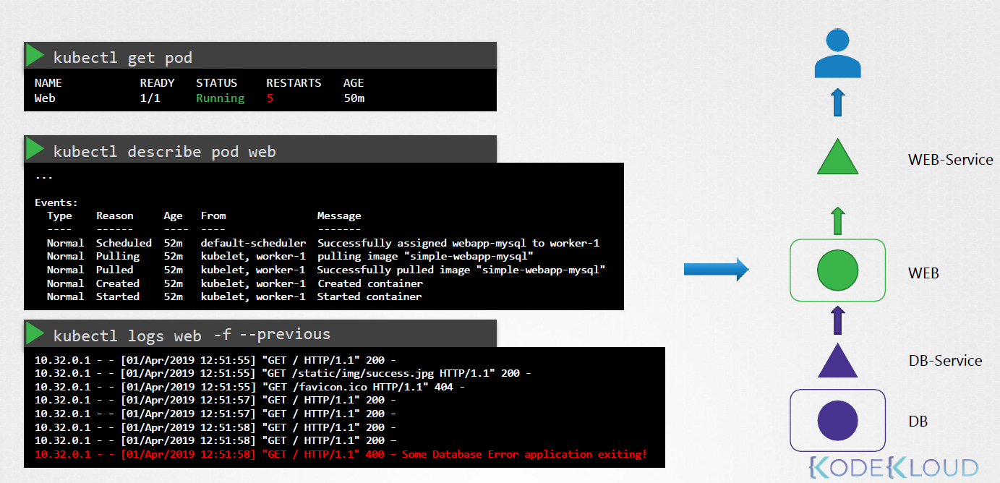
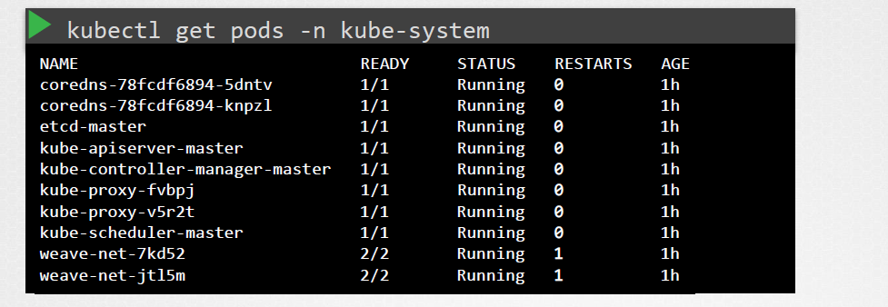
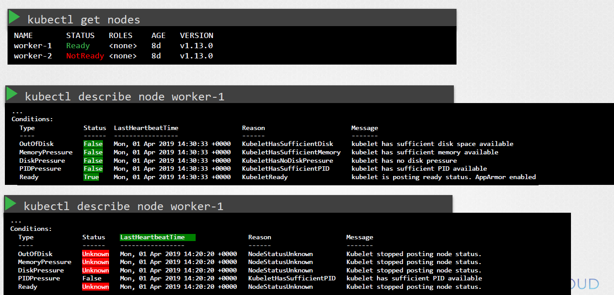
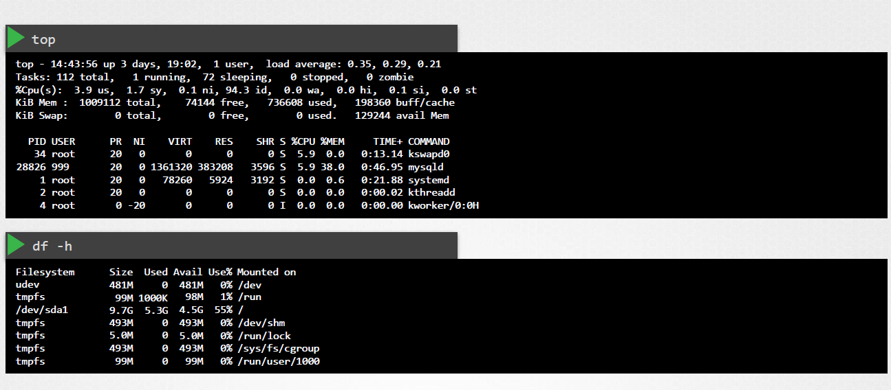
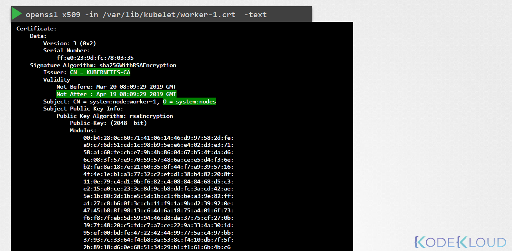

# 🛠️ Comprehensive Kubernetes (K8s) Troubleshooting Guide

Kubernetes (K8s) is a robust container orchestration platform that simplifies deploying, scaling, and managing containerized applications. However, its complexity can lead to various issues. This guide provides an in-depth approach to troubleshooting common Kubernetes problems, categorized into four main areas:

1. 🐞 **Application Failure**
2. ⚙️ **Control Plane Failure**
3. 🖥️ **Worker Node Failure**
4. 🌐 **Network Troubleshooting**

## 📑 Table of Contents

- [🐞 Application Failure](#application-failure)
  - [Common Causes](#common-causes)
  - [Detailed Troubleshooting Steps](#detailed-troubleshooting-steps)
  - [Advanced Cases](#advanced-cases)
  - [Solutions and Best Practices](#solutions-and-best-practices)
- [⚙️ Control Plane Failure](#control-plane-failure)
  - [Common Issues](#common-issues)
  - [Detailed Troubleshooting Steps](#detailed-troubleshooting-steps-1)
  - [Advanced Cases](#advanced-cases-1)
  - [Recovery Strategies](#recovery-strategies)
- [🖥️ Worker Node Failure](#worker-node-failure)
  - [Common Issues](#common-issues-1)
  - [Detailed Troubleshooting Steps](#detailed-troubleshooting-steps-2)
  - [Advanced Cases](#advanced-cases-2)
  - [Remediation](#remediation)
- [🌐 Network Troubleshooting](#network-troubleshooting)
  - [Common Network Problems](#common-network-problems)
  - [Diagnostic Tools and Techniques](#diagnostic-tools-and-techniques)
  - [Advanced Cases](#advanced-cases-3)
  - [Solutions](#solutions)
- [🔍 Conclusion](#conclusion)
- [📚 Additional Resources](#additional-resources)

---

## 🐞 Application Failure

**Application failures** occur when the deployed applications or services within the Kubernetes cluster do not function as expected. These issues can stem from misconfigurations, resource limitations, code-related bugs, or external dependencies.

### How to Find Problem

#### 1. Check Web Service



#### 2. Check Web Pod



#### 3. Check Dependant Service

like database service

#### 4. Check Dependant pod

like database pod

### Common Causes

- **Pod CrashLoopBackOff:** Pods continuously crash and restart.
- **Image Pull Errors:** Kubernetes fails to pull the container image.
- **Resource Limits:** Containers exceed CPU or memory limits.
- **Configuration Errors:** Incorrect environment variables or secrets.
- **Dependency Failures:** Services or databases that the application depends on are unavailable.
- **Insufficient Replica Count:** Not enough pod replicas to handle the load.
- **Volume Mount Issues:** Problems with persistent storage volumes.
- **Startup Probe Failures:** Application takes longer to start than allowed by probes.

### Detailed Troubleshooting Steps

#### a. Inspect Pod Status and Logs

- **Check Pod Status:**

  ```bash
  kubectl get pods -o wide
  ```

- **Describe the Pod for Detailed Information:**

  ```bash
  kubectl describe pod <pod-name>
  ```

- **View Logs:**

  ```bash
  kubectl logs <pod-name>
  kubectl logs <pod-name> -c <container-name> # For multi-container pods
  ```

- **Check Previous Logs (for CrashLoopBackOff):**

  ```bash
  kubectl logs <pod-name> --previous
  ```

#### b. Check Events

- **List Events in the Namespace:**

  ```bash
  kubectl get events --sort-by=.metadata.creationTimestamp
  ```

- **Filter Events for Specific Pod:**

  ```bash
  kubectl describe pod <pod-name> | grep -i events -A 10
  ```

#### c. Validate Configuration

- **Review Deployment YAML:**
  Ensure that all configurations, such as environment variables, secrets, and config maps, are correctly set.

  ```bash
  kubectl get deployment <deployment-name> -o yaml
  ```

- **Check Resource Definitions:**
  Verify that resource requests and limits are appropriate.

  ```yaml
  resources:
    requests:
      memory: "64Mi"
      cpu: "250m"
    limits:
      memory: "128Mi"
      cpu: "500m"
  ```

#### d. Inspect Dependencies

- **Check Service Availability:**
  Ensure that dependent services like databases are up and accessible.

  ```bash
  kubectl get svc
  kubectl describe svc <service-name>
  ```

- **Test Connectivity:**
  Deploy a temporary pod to test connectivity.

  ```bash
  kubectl run tmp-shell --rm -i --tty --image=busybox -- /bin/sh
  # Inside the pod
  wget -qO- http://<dependency-service>:<port>
  ```

#### e. Examine Volume Mounts

- **Check Persistent Volume Claims (PVCs):**

  ```bash
  kubectl get pvc
  kubectl describe pvc <pvc-name>
  ```

- **Verify Volume Binding:**
  Ensure that volumes are correctly bound to pods.

  ```bash
  kubectl describe pod <pod-name> | grep -i volume
  ```

#### f. Analyze Probes

- **Check Probe Configuration:**
  Ensure that liveness and readiness probes are correctly configured.

  ```yaml
  livenessProbe:
    httpGet:
      path: /healthz
      port: 8080
    initialDelaySeconds: 3
    periodSeconds: 3
  readinessProbe:
    httpGet:
      path: /ready
      port: 8080
    initialDelaySeconds: 3
    periodSeconds: 3
  ```

- **Review Probe Failures:**

  ```bash
  kubectl describe pod <pod-name>
  ```

### Advanced Cases

#### 1. **Image Compatibility Issues**

- **Symptom:** Application crashes due to incompatible library versions.
- **Solution:**
  - Verify the container image version.
  - Check compatibility with the Kubernetes version.
  - Update the image to a compatible version.

#### 2. **Configuration Drift**

- **Symptom:** Inconsistent configurations across environments.
- **Solution:**
  - Use GitOps tools like ArgoCD or Flux to maintain configuration consistency.
  - Regularly audit configurations using tools like `kubectl diff`.

#### 3. **Application-Specific Errors**

- **Symptom:** Errors related to application logic or dependencies.
- **Solution:**
  - Dive into application logs for stack traces.
  - Use debugging tools and remote debugging if necessary.
  - Collaborate with development teams to resolve code-related issues.

### Solutions and Best Practices

- **Implement Health Checks:**
  Use liveness and readiness probes to ensure application health.

  ```yaml
  livenessProbe:
    httpGet:
      path: /healthz
      port: 8080
    initialDelaySeconds: 3
    periodSeconds: 3
  readinessProbe:
    httpGet:
      path: /ready
      port: 8080
    initialDelaySeconds: 3
    periodSeconds: 3
  ```

- **Proper Resource Allocation:**
  Set appropriate resource requests and limits to prevent resource contention.
- **Use Robust Image Repositories:**
  Ensure container images are stored in reliable repositories and are accessible.
- **Implement Logging and Monitoring:**
  Use tools like Prometheus, Grafana, and the ELK stack for better visibility.
- **Automate Rollbacks:**
  Use Kubernetes deployment strategies to rollback in case of failures.

  ```bash
  kubectl rollout undo deployment/<deployment-name>
  ```

- **Leverage Helm Charts:**
  Manage complex applications using Helm for consistent deployments.
- **Adopt GitOps Practices:**
  Maintain desired state configurations in version control for easier management.

## ⚙️ Control Plane Failure

The **Control Plane** manages the Kubernetes cluster, handling scheduling, maintaining the desired state, and responding to cluster events. Issues here can disrupt the entire cluster's operations.

### How to Find Problem

#### 1. Check Nodes Status

```bash
kubectl get nodes
```

#### 2. Check ControlPlan Pods

```bash
kubectl get pods -n kube-system
```



#### 3. Check ControlPlan Service Status

```bash
# kube-apiserver
service kube-apiserver status

# kube-control-manager
service kube-control-manager status

# kube-scheduler
service kube-scheduler status

# kubelet
service kubelet status

# kube-proxy
service kube-proxy status
```

#### 4. Check ControlPlan Service Logs

```bash
# from service
sudo journalctl -u -r kube-apiserver

# from pod
kubectl logs kube-apiserver-master -n kube-system
```

### Common Issues

- **API Server Unavailability:** The Kubernetes API server is down or unreachable.
- **etcd Issues:** Problems with the etcd datastore can lead to state inconsistencies.
- **Scheduler and Controller Manager Failures:** These components may fail, affecting pod scheduling and cluster state management.
- **Authentication/Authorization Failures:** Issues with user or service account permissions.
- **Certificate Expiry:** Expired certificates can prevent communication between components.

### Detailed Troubleshooting Steps

#### a. Check Control Plane Component Status

- **Using `kubectl`:**

  ```bash
  kubectl get componentstatuses
  ```

- **Inspect Logs:**
  Access logs for each control plane component (API Server, Scheduler, Controller Manager).

  ```bash
  journalctl -u kube-apiserver
  journalctl -u kube-scheduler
  journalctl -u kube-controller-manager
  ```

#### b. Validate etcd Health

- **Check etcd Cluster Health:**

  ```bash
  etcdctl endpoint health
  ```

- **Review etcd Logs:**

  ```bash
  journalctl -u etcd
  ```

- **Check etcd Metrics:**
  Use Prometheus to monitor etcd metrics for anomalies.

#### c. Verify API Server Connectivity

- **Test API Server Reachability:**

  ```bash
  curl -k https://<api-server>:6443/healthz
  ```

- **Check API Server Certificates:**
  Ensure certificates are valid and not expired.

  ```bash
  openssl x509 -in /etc/kubernetes/pki/apiserver.crt -noout -text | grep -i 'Not After'
  ```

#### d. Inspect Authentication and Authorization

- **Check API Server Authentication Config:**
  Review flags like `--authentication-token-webhook` and `--authorization-mode`.
- **Test Access with `kubectl`:**

  ```bash
  kubectl auth can-i get pods --as=<user>
  ```

- **Review RBAC Policies:**
  Ensure RoleBindings and ClusterRoleBindings are correctly configured.

  ```bash
  kubectl get roles,rolebindings,clusterroles,clusterrolebindings -A
  ```

#### e. Examine Scheduler and Controller Manager

- **Check Scheduler Status:**

  ```bash
  kubectl get pods -n kube-system | grep scheduler
  kubectl logs <scheduler-pod-name> -n kube-system
  ```

- **Check Controller Manager Status:**

  ```bash
  kubectl get pods -n kube-system | grep controller-manager
  kubectl logs <controller-manager-pod-name> -n kube-system
  ```

### Advanced Cases

#### 1. **High etcd Latency**

- **Symptom:** Slow API responses and delayed scheduling.
- **Solution:**
  - Optimize etcd performance by ensuring it runs on SSDs and has sufficient memory.
  - Reduce the size of etcd data by cleaning up unused resources.
  - Scale etcd horizontally if necessary.

#### 2. **Control Plane Resource Exhaustion**

- **Symptom:** Control plane components are slow or unresponsive.
- **Solution:**
  - Allocate more CPU and memory resources to control plane nodes.
  - Use dedicated nodes for control plane components.
  - Implement resource quotas to prevent overconsumption.

#### 3. **Certificate Authority Compromise**

- **Symptom:** Unusual certificate activities or unauthorized access.
- **Solution:**
  - Rotate all certificates immediately.
  - Revoke and reissue certificates as needed.
  - Implement stricter certificate management policies.

### Recovery Strategies

- **Restore etcd from Backup:**
  Regularly back up etcd and restore from backups if necessary.

  ```bash
  etcdctl snapshot restore <backup-file>
  ```

- **Implement High Availability:**
  Deploy multiple replicas of control plane components to prevent single points of failure.
  - Use tools like kubeadm for HA setups.
  - Distribute control plane nodes across different availability zones.
- **Monitor Control Plane Metrics:**
  Use monitoring tools to keep an eye on control plane performance and health.
  - **Prometheus:** Collect metrics.
  - **Grafana:** Visualize metrics.
- **Automate Recovery:**
  Use tools like Kubernetes Operators to automate the recovery of control plane components.

## 🖥️ Worker Node Failure

**Worker nodes** run the containerized applications. Failures here can lead to application downtime or degraded performance.

### How to Find Problem

#### 1. Check Node Status




```bash
# check swap
free -h
```

#### 2. Check kubelet Status

```bash
service kubelet status

sudo journalctl -u -r kubelet
```

#### 3. Check Certification



### Common Issues

- **Node Not Ready:** The node is not in a ready state, making it unavailable for scheduling.
- **Resource Exhaustion:** High CPU or memory usage leading to performance issues.
- **Hardware Failures:** Physical issues with the node's hardware components.
- **Kubelet Issues:** Kubelet service is down or malfunctioning.
- **Container Runtime Failures:** Issues with Docker, containerd, or other runtimes.
- **Disk Pressure:** Insufficient disk space on the node.
- **Network Plugin Failures:** Problems with the CNI plugin affecting pod networking.

### Detailed Troubleshooting Steps

#### a. Check Node Status

- **List Nodes and Their Status:**

  ```bash
  kubectl get nodes
  ```

- **Describe the Node:**

  ```bash
  kubectl describe node <node-name>
  ```

  - Look for conditions like `Ready`, `MemoryPressure`, `DiskPressure`, `PIDPressure`, and `NetworkUnavailable`.

#### b. Inspect Node Logs and Metrics

- **Access System Logs:**

  ```bash
  journalctl -u kubelet
  journalctl -u docker # If using Docker
  ```

- **Monitor Resource Usage:**
  Use tools like `top`, `htop`, or Kubernetes metrics server.

  ```bash
  kubectl top node <node-name>
  ```

#### c. Verify Kubelet Functionality

- **Check Kubelet Status:**

  ```bash
  systemctl status kubelet
  ```

- **Restart Kubelet if Necessary:**

  ```bash
  systemctl restart kubelet
  ```

- **Check Kubelet Logs for Errors:**

  ```bash
  journalctl -u kubelet -f
  ```

#### d. Inspect Container Runtime

- **Check Container Runtime Status:**

  ```bash
  systemctl status docker # For Docker
  systemctl status containerd # For containerd
  ```

- **Restart Container Runtime if Necessary:**

  ```bash
  systemctl restart docker
  systemctl restart containerd
  ```

- **Review Container Runtime Logs:**

  ```bash
  journalctl -u docker
  journalctl -u containerd
  ```

#### e. Examine Disk Usage

- **Check Disk Space:**

  ```bash
  df -h
  ```

- **Identify Large Files or Directories:**

  ```bash
  du -sh /* | sort -h
  ```

#### f. Review Network Plugin

- **Check CNI Plugin Status:**

  ```bash
  kubectl get pods -n kube-system | grep -E 'calico|flannel|cilium|weave'
  ```

- **Inspect CNI Logs:**

  ```bash
  kubectl logs <cni-pod-name> -n kube-system
  ```

### Advanced Cases

#### 1. **Node Partitioning**

- **Symptom:** Network partition causes nodes to become isolated.
- **Solution:**
  - Diagnose network issues using tools like `ping`, `traceroute`, or network monitoring tools.
  - Ensure network redundancy and high availability.
  - Implement proper network segmentation and firewall rules.

#### 2. **Kubelet Configuration Errors**

- **Symptom:** Kubelet fails to communicate with the API server.
- **Solution:**
  - Verify kubelet configuration files (e.g., `/var/lib/kubelet/config.yaml`).
  - Ensure correct API server endpoints and authentication tokens.
  - Restart kubelet after configuration changes.

#### 3. **Container Runtime Incompatibilities**

- **Symptom:** Containers fail to start or behave unexpectedly.
- **Solution:**
  - Ensure compatibility between Kubernetes version and container runtime.
  - Upgrade or downgrade container runtime as needed.
  - Test with a different container runtime to isolate issues.

### Remediation

- **Restart Node Services:**
  Restart kubelet and container runtime services.

  ```bash
  systemctl restart kubelet
  systemctl restart docker
  ```

- **Drain and Recycle Nodes:**
  Safely evict all pods and cordon the node before maintenance.

  ```bash
  kubectl drain <node-name> --ignore-daemonsets --delete-local-data
  kubectl cordon <node-name>
  ```

- **Scale Out Nodes:**
  Add more nodes to the cluster to handle increased load.
  - **For Managed Clusters:**
    Use cloud provider tools or Kubernetes autoScalers.
  - **For Self-Managed Clusters:**
    Provision new nodes and join them to the cluster.
- **Implement Node Auto-repair:**
  Use cluster autoScalers and self-healing mechanisms to automatically replace faulty nodes.
- **Ensure Proper Hardware Maintenance:**
  Regularly maintain and monitor physical hardware to prevent failures.
  - Schedule routine hardware checks.
  - Use monitoring tools to detect hardware anomalies early.

## 🌐 Network Troubleshooting

Networking issues can prevent pods from communicating, disrupt service discovery, and affect external access to applications.

### How to Find Problem

#### Network Plugin in Kubernetes

There are several plugins available and these are some.

1. **Weave Net:**

   **To install:**

   ```bash
   kubectl apply -f https://github.com/weaveworks/weave/releases/download/v2.8.1/weave-daemonset-k8s.yaml
   ```

You can find details about the network plugins in the following documentation:

[Kubernetes Networking and Network Policy](https://kubernetes.io/docs/concepts/cluster-administration/addons/#networking-and-network-policy)

1. **Flannel:**

   **To install:**

   ```bash
   kubectl apply -f https://raw.githubusercontent.com/coreos/flannel/2140ac876ef134e0ed5af15c65e414cf26827915/Documentation/kube-flannel.yml
   ```

   **Note:** As of now, Flannel does not support Kubernetes network policies.

1. **Calico:**

   **To install:**

   ```bash
   curl https://raw.githubusercontent.com/projectcalico/calico/v3.25.0/manifests/calico.yaml -O
   kubectl apply -f calico.yaml
   ```

   Calico is said to have the most advanced CNI network plugin.

   In the CKA and CKAD exams, you won't be asked to install the CNI plugin. But if asked, you will be provided with the exact URL to install it.

   **Note:** If there are multiple CNI configuration files in the directory, the kubelet uses the configuration file that comes first by name in lexicographic order.

#### DNS in Kubernetes

Kubernetes uses CoreDNS. CoreDNS is a flexible, extensible DNS server that can serve as the Kubernetes cluster DNS.

##### **Memory and Pods**

In large-scale Kubernetes clusters, CoreDNS's memory usage is predominantly affected by the number of Pods and Services in the cluster. Other factors include the size of the filled DNS answer cache and the rate of queries received (QPS) per CoreDNS instance.

Kubernetes resources for CoreDNS are:

- A service account named `coredns`
- ClusterRoles named `coredns` and `kube-dns`
- ClusterRoleBindings named `coredns` and `kube-dns`
- A deployment named `coredns`
- A ConfigMap named `coredns`
- A service named `kube-dns`

While analyzing the CoreDNS deployment, you can see that the Corefile plugin consists of important configuration which is defined as a ConfigMap.

Port 53 is used for DNS resolution.

```plaintext
kubernetes cluster.local in-addr.arpa ip6.arpa {
   pods insecure
   fallthrough in-addr.arpa ip6.arpa
   ttl 30
}
```

This is the backend to Kubernetes for `cluster.local` and reverse domains.

```plaintext
proxy . /etc/resolv.conf
```

Forward out-of-cluster domains directly to the right authoritative DNS server.

##### **Troubleshooting Issues Related to CoreDNS**

1. **CoreDNS Pods in Pending State**

   - First, check if the network plugin is installed.

2. **CoreDNS Pods Have CrashLoopBackOff or Error State**

   If you have nodes running SELinux with an older version of Docker, you might experience a scenario where the CoreDNS pods are not starting. To solve this, you can try one of the following options:

   1. **Upgrade to a newer version of Docker.**

   1. **Disable SELinux.**

   1. **Modify the CoreDNS deployment to set `allowPrivilegeEscalation` to true:**

      ```bash
      kubectl -n kube-system get deployment coredns -o yaml | \
          sed 's/allowPrivilegeEscalation: false/allowPrivilegeEscalation: true/g' | \
          kubectl apply -f -
      ```

   1. **Another Cause: CoreDNS Pod Detects a Loop**

   There are several ways to work around this issue:

   - **Update Kubelet Configuration:**

     Add the following to your kubelet config YAML:

     ```yaml
     resolvConf: <path-to-your-real-resolv-conf-file>
     ```

     This flag tells kubelet to pass an alternate `resolv.conf` to Pods. For systems using `systemd-resolved`, `/run/systemd/resolve/resolv.conf` is typically the location of the "real" `resolv.conf`, although this can vary depending on your distribution.

   - **Disable Local DNS Cache on Host Nodes:**

     Restore `/etc/resolv.conf` to the original state.

   - **Quick Fix: Edit Corefile**

     Replace `forward . /etc/resolv.conf` with the IP address of your upstream DNS, for example:

     ```plaintext
     forward . 8.8.8.8
     ```

     **Note:** This only fixes the issue for CoreDNS. Kubelet will continue to forward the invalid `resolv.conf` to all default `dnsPolicy` Pods, leaving them unable to resolve DNS.

3. **Check Kube-DNS Service Endpoints**

   If CoreDNS pods and the `kube-dns` service are working fine, check if the `kube-dns` service has valid endpoints:

   ```bash
   kubectl -n kube-system get ep kube-dns
   ```

   If there are no endpoints for the service, inspect the service and ensure it uses the correct selectors and ports.

#### Kube-Proxy

kube-proxy is a network proxy that runs on each node in the cluster. It maintains network rules on nodes, allowing network communication to the Pods from network sessions inside or outside of the cluster.

In a cluster configured with kubeadm, you can find kube-proxy as a DaemonSet.

kube-proxy is responsible for watching services and endpoints associated with each service. When a client connects to the service using the virtual IP, kube-proxy sends traffic to the actual Pods.

To view the kube-proxy configuration, run:

```bash
kubectl describe ds kube-proxy -n kube-system
```

You can see that the kube-proxy binary runs with the following command inside the kube-proxy container:

**Command:**

```bash
/usr/local/bin/kube-proxy
--config=/var/lib/kube-proxy/config.conf
--hostname-override=$(NODE_NAME)
```

This command fetches the configuration from the configuration file `/var/lib/kube-proxy/config.conf` and overrides the hostname with the node name where the pod is running.

In the config file, the following are defined:

- `clusterCIDR`
- kube-proxy mode (`ipvs`, `iptables`)
- `bindAddress`
- `kubeConfig`
- etc.

**Troubleshooting Issues Related to kube-proxy**

1. **Check if the kube-proxy Pod is Running:**

   ```bash
   kubectl get pods -n kube-system | grep kube-proxy
   ```

2. **Check kube-proxy Logs:**

   ```bash
   kubectl logs -n kube-system <kube-proxy-pod-name>
   ```

3. **Verify ConfigMap:**

   Ensure the ConfigMap is correctly defined and the configuration file for the kube-proxy binary is accurate.

4. **Check kubeConfig:**

   Ensure `kubeConfig` is defined in the ConfigMap.

5. **Verify kube-proxy is Running Inside the Container:**

   ```bash
   kubectl exec -n kube-system <kube-proxy-pod-name> -- netstat -plan | grep kube-proxy
   ```

   **Example Output:**

   ```plaintext
   tcp        0      0 0.0.0.0:30081           0.0.0.0:*               LISTEN      1/kube-proxy
   tcp        0      0 127.0.0.1:10249         0.0.0.0:*               LISTEN      1/kube-proxy
   tcp        0      0 172.17.0.12:33706       172.17.0.12:6443        ESTABLISHED 1/kube-proxy
   tcp6       0      0 :::10256                :::*                    LISTEN      1/kube-proxy
   ```

#### References

- [Debug Service Issues](https://kubernetes.io/docs/tasks/debug-application-cluster/debug-service/)
- [DNS Troubleshooting](https://kubernetes.io/docs/tasks/administer-cluster/dns-debugging-resolution/)

### Common Network Problems

- **Pod-to-Pod Communication Failures:** Pods cannot communicate with each other as expected.
- **DNS Resolution Issues:** Services cannot resolve DNS names.
- **Ingress and Egress Problems:** External traffic cannot reach the services, or services cannot access external resources.
- **Network Latency and Packet Loss:** High latency or packet loss affecting application performance.
- **Service Mesh Issues:** Problems with service meshes like Istio or Linkerd disrupting traffic routing.
- **CNI Plugin Misconfigurations:** Errors in the Container Network Interface (CNI) plugin setup.

### Diagnostic Tools and Techniques

#### a. Use `kubectl` for Network Inspection

- **Check Services and Endpoints:**

  ```bash
  kubectl get svc
  kubectl get endpoints
  ```

* **Test Connectivity Between Pods:**
  Deploy a debug pod and use `ping`, `curl`, or `telnet`.

  ```bash
  kubectl run debug --image=busybox --restart=Never -- sh
  # Inside the pod
  ping <target-pod-ip>
  curl http://<service-name>:<port>
  ```

#### b. Leverage Network Plugin Logs

- **Check CNI Plugin Logs:**
  Depending on the CNI (e.g., Calico, Flannel), access their logs for errors.

  ```bash
  kubectl logs <cni-pod-name> -n kube-system
  ```

- **Inspect CNI Configuration:**

  ```bash
  kubectl get configmap -n kube-system <cni-configmap-name> -o yaml
  ```

#### c. Utilize Network Utilities

- **DNS Testing:**

  ```bash
  nslookup <service-name>
  dig <service-name>
  ```

- **Port Connectivity:**

  ```bash
  telnet <service-ip> <port>
  nc -zv <service-ip> <port>
  ```

- **Traceroute:**

  ```bash
  traceroute <destination>
  ```

#### d. Monitor Network Traffic

- **Use Packet Sniffers:**
  Deploy tools like `tcpdump` or `Wireshark` within pods to capture network traffic.

  ```bash
  kubectl exec -it <pod-name> -- tcpdump -i eth0
  ```

- **Leverage Service Mesh Observability:**
  Use built-in observability features of service meshes like Istio for traffic insights.

#### e. Check Firewall and Security Groups

- **Verify Firewall Rules:**
  Ensure that necessary ports are open between nodes and services.

  ```bash
  sudo iptables -L -v -n
  ```

- **Review Cloud Security Groups:**
  Check cloud provider firewall settings to allow necessary traffic.

### Advanced Cases

#### 1. **Overlay Network Failures**

- **Symptom:** Pods cannot communicate across different nodes.
- **Solution:**
  - Verify the overlay network configuration (e.g., VXLAN settings).
  - Check for any conflicts in subnet allocations.
  - Ensure that necessary ports for the overlay network are open.

#### 2. **Service Mesh Misconfigurations**

- **Symptom:** Traffic routing issues, such as failed service-to-service communication.
- **Solution:**
  - Review service mesh configurations and policies.
  - Check sidecar proxies (e.g., Envoy) for errors.
  - Validate mutual TLS (mTLS) settings if enabled.

#### 3. **Intermittent Network Issues**

- **Symptom:** Sporadic connectivity problems affecting application stability.
- **Solution:**
  - Monitor network performance metrics for patterns.
  - Investigate underlying network hardware or virtualization issues.
  - Optimize network configurations to handle bursts in traffic.

### Solutions

- **Configure Network Policies Correctly:**
  Ensure that network policies allow the necessary traffic between pods and services.

  ```yaml
  apiVersion: networking.k8s.io/v1
  kind: NetworkPolicy
  metadata:
    name: allow-app
  spec:
    podSelector:
      matchLabels:
        app: myapp
    ingress:
      - from:
          - podSelector:
              matchLabels:
                app: frontend
    policyTypes:
      - Ingress
  ```

- **Ensure Proper DNS Setup:**
  Verify that CoreDNS is running and properly configured.

  ```bash
  kubectl get pods -n kube-system -l k8s-app=kube-dns
  kubectl logs -n kube-system -l k8s-app=kube-dns
  ```

- **Manage Ingress Controllers Effectively:**
  Ensure that ingress controllers are correctly configured to handle incoming traffic.

  - **Check Ingress Controller Logs:**

    ```bash
    kubectl logs <ingress-controller-pod> -n ingress-nginx
    ```

  - **Validate Ingress Resource Definitions:**

    ```bash
    kubectl describe ingress <ingress-name>
    ```

- **Optimize Network Performance:**
  - Use Quality of Service (QoS) settings to prioritize critical traffic.
  - Implement traffic shaping and load balancing to manage traffic efficiently.
- **Implement Redundancy and High Availability:**
  - Deploy multiple instances of network components to prevent single points of failure.
  - Use redundant network paths to ensure continuous connectivity.
- **Regularly Update CNI Plugins:**
  Keep CNI plugins up-to-date to benefit from performance improvements and bug fixes.

  ```bash
  kubectl apply -f https://docs.projectcalico.org/manifests/calico.yaml
  ```

- **Utilize Network Monitoring Tools:**
  Deploy tools like Prometheus, Grafana, and specialized network monitors to gain insights into network health and performance.

## 🔍 Conclusion

Effective troubleshooting in Kubernetes requires a systematic approach and a deep understanding of the cluster's components and interactions. By categorizing issues into **Application Failure**, **Control Plane Failure**, **Worker Node Failure**, and **Network Troubleshooting**, you can streamline the diagnostic process and implement targeted solutions.

### Best Practices for Proactive Troubleshooting

- **Implement Comprehensive Monitoring:**
  Use tools like Prometheus, Grafana, and the ELK stack to monitor cluster health and application performance.
- **Set Up Alerts:**
  Configure alerts for critical metrics to detect issues early.
- **Maintain Regular Backups:**
  Regularly back up etcd and important configurations to facilitate recovery.
- **Document Procedures:**
  Keep detailed documentation of common issues and their resolutions to expedite troubleshooting.
- **Automate Recovery:**
  Use Kubernetes features like self-healing and autoscaling to mitigate failures automatically.
- **Conduct Regular Audits:**
  Periodically review cluster configurations, security policies, and resource allocations to identify potential issues before they escalate.
- **Stay Updated:**
  Keep Kubernetes and its components updated to benefit from the latest features, performance improvements, and security patches.
- **Educate Your Team:**
  Ensure that your team is well-versed in Kubernetes fundamentals and troubleshooting techniques through regular training and knowledge sharing.

By adhering to these practices and utilizing the structured approach outlined in this guide, you can effectively manage and resolve common Kubernetes issues, ensuring a stable and reliable container orchestration environment.

## 📚 Additional Resources

- [Kubernetes Official Documentation](https://kubernetes.io/docs/)
- [Kubernetes Troubleshooting Guide](https://kubernetes.io/docs/tasks/debug-application-cluster/troubleshooting/)
- [Prometheus Monitoring](https://prometheus.io/)
- [Grafana Monitoring](https://grafana.com/)
- [Calico Networking](https://www.projectcalico.org/)
- [Istio Service Mesh](https://istio.io/)
- [Helm Package Manager](https://helm.sh/)
- [GitOps with ArgoCD](https://argo-cd.readthedocs.io/en/stable/)
- [Kubeadm HA Setup Guide](https://kubernetes.io/docs/setup/production-environment/tools/kubeadm/high-availability/)
- [CoreDNS Documentation](https://coredns.io/)
