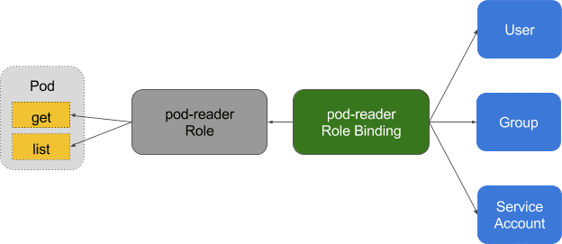

# Users, Groups and Service Account in k8s

In Kubernetes, user and group management is typically handled externally and not directly managed by the Kubernetes API. This is because Kubernetes does not have a built-in user management system. Instead, it relies on external identity providers for authentication. Here’s how you can manage users and groups and integrate them with Kubernetes.



## Creating Users

To create users in Kubernetes, you typically use one of the following methods:

1. **Client Certificate Authentication**:

   - Generate a client certificate for each user.
   - Configure the Kubernetes API server to trust the Certificate Authority (CA) that issued the client certificates.

2. **Static Token File**:

   - Use a static token file to manage users.
   - Define tokens for each user in a file and configure the API server to use this file.

3. **External Identity Providers**:
   - Use external systems like LDAP, Active Directory, or OAuth2 to manage user authentication.
   - Integrate these systems with Kubernetes through an Identity Provider (IdP).

## Method 1: Client Certificate Authentication

### 1. **Generate a Certificate Authority (CA)**

```sh
openssl genrsa -out ca.key 2048
openssl req -x509 -new -nodes -key ca.key -subj "/CN=kube-ca" -days 10000 -out ca.crt
```

### 2. **Generate a User Certificate**

- **Client Certificates**: Use the `O` field to specify groups.

  - `CN=username`
  - `O=group1,group2`

```sh
openssl genrsa -out user.key 2048
openssl req -new -key user.key -subj "/CN=username/O=groupname" -out user.csr
openssl x509 -req -in user.csr -CA ca.crt -CAkey ca.key -CAcreateserial -out user.crt -days 10000
```

### 3. **Configure kubectl to Use the Certificate**

```sh
kubectl config set-credentials username --client-certificate=user.crt --client-key=user.key
kubectl config set-context username-context --cluster=kubernetes-cluster --namespace=default --user=username
kubectl config use-context username-context
```

## Method 2: Static Token File

1. **Create a Token File**:

   ```sh
   echo "token,username,uid,groups" > token.csv
   echo "my-token,user1,uid1,group1" >> token.csv
   ```

2. **Configure the API Server**:
   Add the following flag to the API server startup arguments:

   ```sh
   --token-auth-file=/path/to/token.csv
   ```

## Method 3: External Identity Providers

Using an external identity provider is a robust way to manage users and groups. Here’s an example using OpenID Connect (OIDC):

- **External Identity Provider**: Define groups within the provider and assign users to these groups.

1. **Configure the OIDC Provider** (e.g., Keycloak, Auth0, Dex):

   - Set up an OIDC provider and create a client application for Kubernetes.

2. **Configure the Kubernetes API Server**:
   Add the following flags to the API server startup arguments:

   ```sh
   --oidc-issuer-url=https://issuer-url.com
   --oidc-client-id=kubernetes
   --oidc-username-claim=email
   --oidc-groups-claim=groups
   ```

## Summary

- **Users**: Managed externally (e.g., client certificates, static token files, external identity providers).
- **Groups**: Defined within client certificates or external identity providers.
- **RoleBindings and ClusterRoleBindings**: Used to assign permissions to users and groups within Kubernetes.

Once users and groups are set up, you can create RoleBindings and ClusterRoleBindings to manage permissions.
