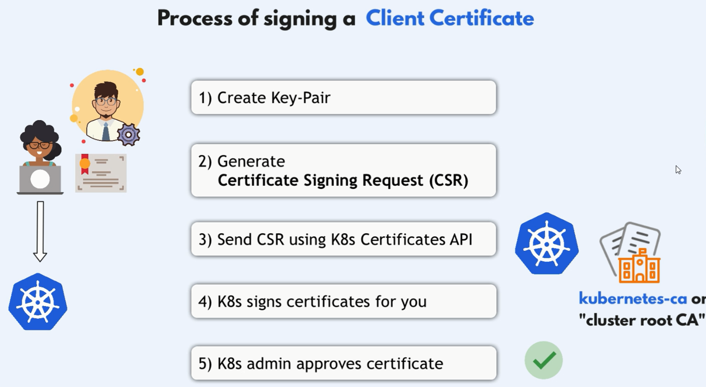
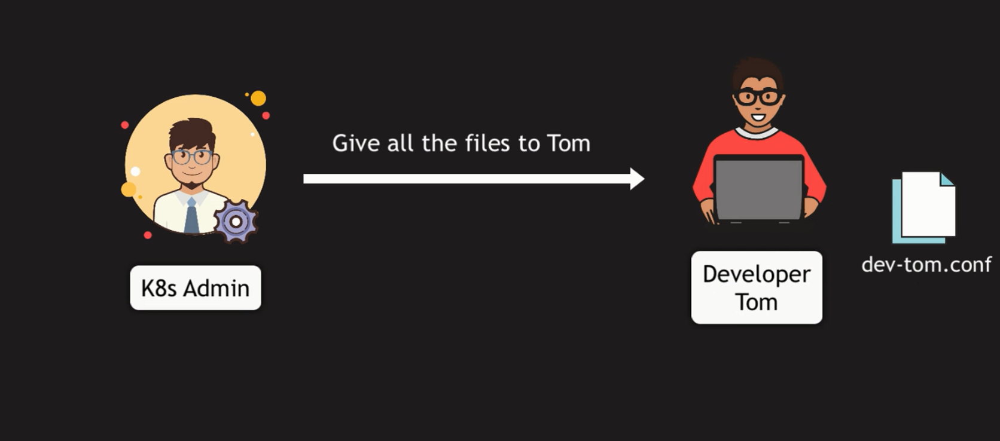

# Users, Groups and Service Account in k8s

In Kubernetes, user and group management is typically handled externally and not directly managed by the Kubernetes API. This is because Kubernetes does not have a built-in user management system. Instead, it relies on external identity providers for authentication. Here’s how you can manage users and groups and integrate them with Kubernetes.

## Creating Users

To create users in Kubernetes, you typically use one of the following methods:

1. **Client Certificate Authentication**:

   - Generate a client certificate for each user.
   - Configure the Kubernetes API server to trust the Certificate Authority (CA) that issued the client certificates.

2. **Static Token File**:

   - Use a static token file to manage users.
   - Define tokens for each user in a file and configure the API server to use this file.

3. **External Identity Providers**:
   - Use external systems like LDAP, Active Directory, or OAuth2 to manage user authentication.
   - Integrate these systems with Kubernetes through an Identity Provider (IdP).

## Method 1: Client Certificate Authentication

`User Must be inside the cluster to communicate with the API server`



1. **Generate key-pair for user using openssl**: `openssl genrsa -out hady.key 2048`
2. **Generate CSR**: `openssl req -new -key hady.key -subj "/CN=hady/O=dev-group" -out hady.csr`
3. **Send CSR using k8s Certificates API**: create a certification request yaml file and send it to k8s.
4. **K8s Signs Certificates for you**: by default, k8s will sign the certificate for 1 year
5. **K8s admin approves certificate**: `kubectl certificate approve hady`

### 1. **Generate a Key Pair for the User**

First, you'll generate a private key for the user "hady" using OpenSSL.

```bash
openssl genrsa -out hady.key 2048
```

- **`hady.key`**: This is the private key that will be used to generate the CSR and later to establish a secure connection with the Kubernetes API server.

### 2. **Generate a Certificate Signing Request (CSR)**

Next, create a CSR using the private key. This CSR will be submitted to Kubernetes for signing.

```bash
openssl req -new -key hady.key -subj "/CN=hady/O=dev-group" -out hady.csr
```

- **`/CN=hady`**: The Common Name (CN) field represents the username in Kubernetes.
- **`/O=dev-group`**: The Organization (O) field is typically used for group membership in Kubernetes.
- **`hady.csr`**: This is the CSR file that you'll submit to Kubernetes.

### 3. **Create a [Certificate Signing Request](https://kubernetes.io/docs/reference/access-authn-authz/certificate-signing-requests/) (CSR) in Kubernetes**

Create a Kubernetes CSR resource by writing a YAML file that includes the Base64-encoded CSR. This CSR will request that Kubernetes signs the certificate.

#### **Example CSR YAML File (`hady-csr.yaml`)**:

```yaml
apiVersion: certificates.k8s.io/v1
kind: CertificateSigningRequest
metadata:
  name: hady
spec:
  groups:
    - system:authenticated
  request: <Base64-encoded-hady.csr>
  signerName: kubernetes.io/kube-apiserver-client
  usages:
    - client auth
```

- **`metadata.name`**: The name of the CSR resource in Kubernetes, here set to "hady".
- **`groups`**: The group that the user belongs to, which will be "system:authenticated" by default.
- **`request`**: The Base64-encoded CSR from the previous step.
- **`signerName`**: Specifies the signer, which is typically `kubernetes.io/kube-apiserver-client` for client authentication certificates.
- **`usages`**: Specifies that this certificate will be used for client authentication.

#### **Command to Encode the CSR**

You can encode the CSR directly in your terminal and insert it into the YAML file:

```bash
cat hady.csr | base64 | tr -d '\n'
```

Replace the <Base64-encoded-hady.crt> placeholder in the YAML file with the actual Base64-encoded string.

#### **Apply the CSR to Kubernetes**:

Once the YAML file is ready, apply it to the Kubernetes cluster:

```bash
kubectl apply -f hady-csr.yaml
```

### 4. **Kubernetes Signs the Certificate**

By default, Kubernetes will automatically sign the CSR once it's approved. The certificate is typically valid for one year unless otherwise configured.

### 5. **Kubernetes Admin Approves the Certificate**

After submitting the CSR, a Kubernetes administrator (or the appropriate user with the right permissions) must approve the certificate:

```bash
kubectl get csr
kubectl certificate approve hady
```

- **`hady`**: This is the name of the CSR you submitted (as defined in the `metadata.name` field of the YAML file).

### 6. **Retrieve the Signed Certificate**

Once the CSR is approved, you can retrieve the signed certificate and save it to a file:

```bash
kubectl get csr hady -o jsonpath='{.status.certificate}' | base64 --decode > hady.crt
```

- **`hady.crt`**: This file contains the signed certificate that you can use in your kubeconfig file.

### 7. **Test the Certificate**

You can test the certificate by using it to authenticate with the Kubernetes API server:

```bash
kubectl get pods --server=https://<api-server-endpoint>:6443 --certificate-authority=/etc/kubernetes/pki/ca.crt  --client-key=hady.key --client-certificate=hady.crt
```

### 8. **Create a kubeconfig File**

With the signed certificate (`hady.crt`), the private key (`hady.key`), and the CA certificate (already available from your cluster setup), you can now create a kubeconfig file that the user "hady" will use to authenticate with the Kubernetes cluster.

#### **Send kubeconfig to user with external key/pair files**


```yaml
apiVersion: v1
kind: Config
clusters:
  - name: kubernetes-cluster
    cluster:
      server: https://<api-server-endpoint>:6443
      certificate-authority-data: <Base64-encoded-ca.crt>
contexts:
  - name: hady-context
    context:
      cluster: kubernetes-cluster
      namespace: default
      user: hady
current-context: hady-context
users:
  - name: hady
    user:
      client-certificate: <path-to-hady.crt>
      client-key: <path-to-hady.key>
```

Replace the placeholders:

- **`<api-server-endpoint>`**: The Kubernetes API server endpoint.
- **`<Base64-encoded-ca.crt>`**: The Base64-encoded CA certificate.
- **`<path-to-hady.crt>`**: The path to the `hady.crt` file.
- **`<path-to-hady.key>`**: The path to the `hady.key` file.

#### **Send kubeconfig to user with impeded key/pair**



```yaml
apiVersion: v1
kind: Config
clusters:
  - name: kubernetes-cluster
    cluster:
      server: https://<api-server-endpoint>:6443
      certificate-authority-data: <Base64-encoded-ca.crt>
contexts:
  - name: hady-context
    context:
      cluster: kubernetes-cluster
      namespace: default
      user: hady
current-context: hady-context
users:
  - name: hady
    user:
      client-certificate-data: <Base64-encoded-hady.crt>
      client-key-data: <Base64-encoded-hady.key>
```

Replace the placeholders:

- **`<api-server-endpoint>`**: The Kubernetes API server endpoint (public IP or domain name).
- **`<Base64-encoded-ca.crt>`**: The Base64-encoded CA certificate.
- **`<Base64-encoded-hady.crt>`**: The Base64-encoded `hady.crt` file.
- **`<Base64-encoded-hady.key>`**: The Base64-encoded `hady.key` file.

```bash
# Encode the ca.crt
cat /etc/kubernetes/pki/ca.crt | base64 | tr -d '\n'
# Encode the hady.crt
cat hady.crt | base64 | tr -d '\n'
# Encode the hady.key
cat hady.key | base64 | tr -d '\n'
```

## Method 2: Static Token File

Certainly! Here’s a streamlined and organized guide to accessing the Kubernetes API server using a **Static Token File**.

---

## Accessing the Kubernetes API Server Using a Static Token File

### Step 1: Create the Static Token File

1. **Create the Token File**:

   - Create a file named `tokens.csv` in a secure location on the master node.

   ```bash
   sudo nano /etc/kubernetes/tokens.csv
   ```

2. **Add Token Information**:

   - Add a line to the file in the format `<token>,<username>,<userid>,<group>`.
   - Example:

   ```plaintext
   abcdef1234567890,hady,uid123,system:masters
   ```

   - **`token`**: A unique string used for authentication.
   - **`username`**: The user's name.
   - **`userid`**: A unique identifier for the user.
   - **`group`**: The group the user belongs to, such as `system:masters` for cluster-admin privileges.

3. **Save and Close** the file.

### Step 2: Configure the API Server to Use the Static Token File

1. **Edit the API Server Manifest**:

   - Open the API server manifest file located at `/etc/kubernetes/manifests/kube-apiserver.yaml`.

   ```bash
   sudo nano /etc/kubernetes/manifests/kube-apiserver.yaml
   ```

2. **Add the Token File Argument**:

   - Find the `spec.containers.args` section and add:

   ```yaml
   - --token-auth-file=/etc/kubernetes/tokens.csv
   ```

   - Example section:

   ```yaml
   containers:
     - name: kube-apiserver
       image: k8s.gcr.io/kube-apiserver:v1.30.4
       command:
         - kube-apiserver
       args:
         - --advertise-address=192.168.0.1
         - --allow-privileged=true
         - --authorization-mode=Node,RBAC
         - --token-auth-file=/etc/kubernetes/tokens.csv
   ```

3. **Save and Close** the file.

   - The API server will automatically restart because it’s managed by `kubelet`. Monitor the restart process:

   ```bash
   kubectl get pods -n kube-system -w
   ```

### Step 3: Use the Token to Access the API Server

#### Option A: Using `kubectl` with the Token Directly

1. **Access the API server** using the token:

   ```bash
   kubectl --token=abcdef1234567890 get pods -A
   ```

   - Replace `abcdef1234567890` with your actual token.

#### Option B: Create a kubeconfig File for Easier Access

1. **Create a kubeconfig File**:

   ```yaml
   apiVersion: v1
   kind: Config
   clusters:
     - name: kubernetes-cluster
       cluster:
         server: https://<api-server-endpoint>:6443
         certificate-authority: /etc/kubernetes/pki/ca.crt
   contexts:
     - name: hady-context
       context:
         cluster: kubernetes-cluster
         user: hady
   current-context: hady-context
   users:
     - name: hady
       user:
         token: abcdef1234567890
   ```

   - Replace `<api-server-endpoint>` with your API server's address.
   - Replace `abcdef1234567890` with your actual token.

2. **Use the Kubeconfig File**:

   - Specify the kubeconfig file in your commands:

   ```bash
   kubectl --kubeconfig=/path/to/your/kubeconfig.yaml get nodes
   ```

   - Or set it as the default configuration:

   ```bash
   export KUBECONFIG=/path/to/your/kubeconfig.yaml
   ```

### Step 4: Verify Access and Security Considerations

1. **Verify Access**:

   - Test your setup by running a few `kubectl` commands:

   ```bash
   kubectl get nodes
   kubectl get pods -A
   ```

2. **Security Considerations**:
   - **Token Security**: Ensure the token is stored securely as it provides access to your cluster.
   - **Limited Use**: Static tokens are better suited for testing and should not be used in production.
   - **Monitor Usage**: Regularly audit and monitor access to the API server to ensure tokens are being used appropriately.

---

By following these steps, you can securely access your Kubernetes API server using a static token file, making it easy to authenticate and manage your cluster.

## Method 3: External Identity Providers

Using an external identity provider is a robust way to manage users and groups. Here’s an example using OpenID Connect (OIDC):

- **External Identity Provider**: Define groups within the provider and assign users to these groups.

1. **Configure the OIDC Provider** (e.g., Keycloak, Auth0, Dex):

   - Set up an OIDC provider and create a client application for Kubernetes.

2. **Configure the Kubernetes API Server**:
   Add the following flags to the API server startup arguments:

   ```sh
   --oidc-issuer-url=https://issuer-url.com
   --oidc-client-id=kubernetes
   --oidc-username-claim=email
   --oidc-groups-claim=groups
   ```

## Summary

- **Users**: Managed externally (e.g., client certificates, static token files, external identity providers).
- **Groups**: Defined within client certificates or external identity providers.
- **RoleBindings and ClusterRoleBindings**: Used to assign permissions to users and groups within Kubernetes.

Once users and groups are set up, you can create RoleBindings and ClusterRoleBindings to manage permissions.
