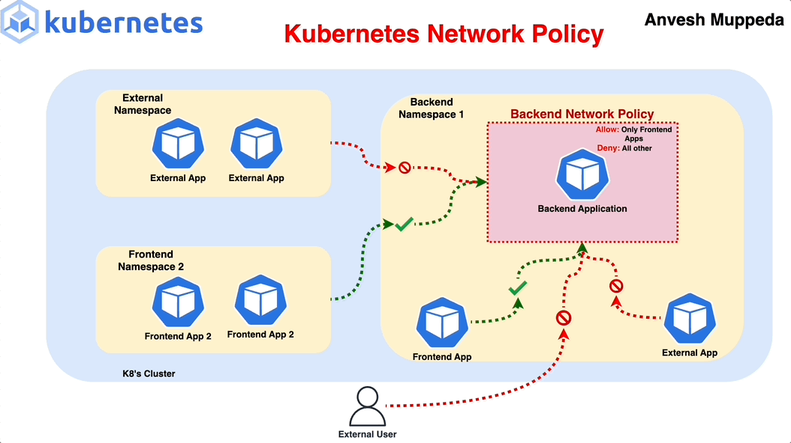
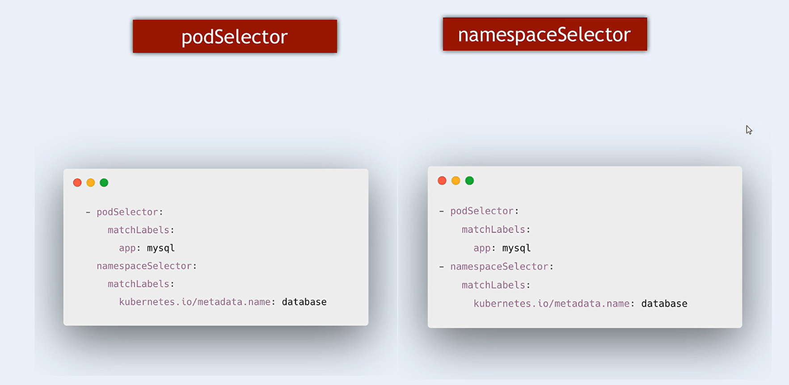
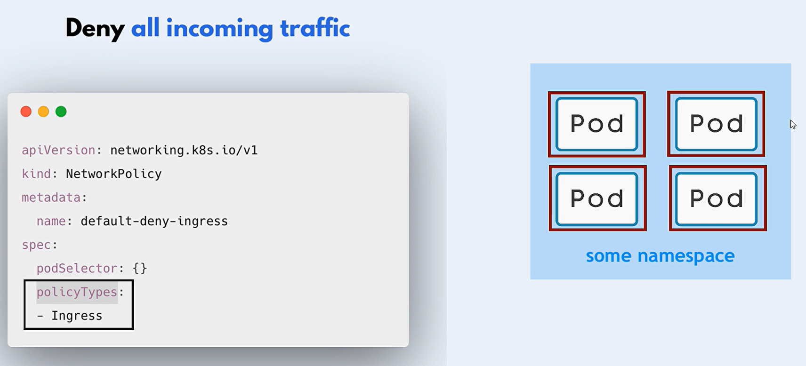

# What is Network Policy in K8s



- Network policies in Kubernetes are a way to **control the traffic** flow between pods in a cluster.
- They act as a **firewall** for controlling both **inbound** and **outbound** traffic at the pod level.
- **By default**, all pods in a Kubernetes cluster can communicate with each other without any restrictions.

## How it Works in k8s

- Network policies are implemented by the network plugin such as Calico, Weave Net, or Cilium.

- Not All CNI plugins support network policies such as Flannel.

## Main Features

1. **Policy Types**: There are two types of network policies:

   1. **Ingress**: Controls the incoming traffic to the pods.
   1. **Egress**: Controls the outgoing traffic from the pods.

1. **Namespaces**: Network policies use namespaces to specify the namespaces to which the policy applies.
1. **Labels**: Network policies use labels to specify the labels to which the policy applies.
1. **Protocols**: Network policies use protocols to specify the protocols to which the policy applies.
1. **Ports**: Network policies use ports to specify the ports to which the policy applies.
1. **CIDR Blocks**: Network policies use CIDR blocks to specify the IP ranges to which the policy applies.

## Configure Network Policy

### Step 1: Which application?

First, you need to decide which application you want to apply the network policy to.

```yaml
apiVersion: apps/v1
kind: NetworkPolicy
metadata:
  name: np-backend
  namespace: default
spec:
  podSelector:
    matchLabels:
      app: my-backend-app
    policyTypes:
      - Ingress

    ingress:
      - from:
          - podSelector:
              matchLabels:
                app: my-frontend-app
```

- By default, when namespaceSelector is not specified, the network policy applies to the pods in the same namespace that network policy is created.

- if you want to apply the network policy to all the pods in the namespace, you can use the `matchLabels` field with an empty value.

### Step 2: Which rule type?

You need to decide which rule type you want to apply to the network policy.

```yaml
# ingress rule

apiVersion: networking.k8s.io/v1
kind: NetworkPolicy
metadata:
  name: np-db
  namespace: default
spec:
  podSelector:
    matchLabels:
      app: mysql
  policyTypes:
    - Ingress
  ingress:
    - from: # first rule
        - podSelector:
            matchLabels:
              app: my-backend-app
      ports:
        - protocol: TCP
          port: 3306
    - from: # second rule
        - podSelector:
            matchLabels:
              app: php-my-admin
      ports:
        - protocol: TCP
          port: 3306
# Allow traffic from the pods with the label app: my-backend-app and app: php-my-admin to the pods with the label app: mysql.
```

```yaml
# egress rule

apiVersion: networking.k8s.io/v1
kind: NetworkPolicy
metadata:
  name: np-backend
  namespace: default
spec:
  podSelector:
    matchLabels:
      app: my-backend-app
  policyTypes:
    - Egress
  egress:
    - to: # first rule
        - podSelector:
            matchLabels:
              app: mysql
      ports:
        - protocol: TCP
          port: 3306
    - to: # second rule
        - podSelector:
            matchLabels:
              app: redis
      ports:
        - protocol: TCP
          port: 6379
# Allow traffic from the pods with the label app: my-backend-app to the pods with the label app: mysql and app: redis.
```

### Step 3: Which namespace?

You can also specify the namespace to which the network policy applies.

```yaml
apiVersion: apps/v1
kind: NetworkPolicy
metadata:
  name: np-database
  namespace: database-namespace
spec:
  podSelector:
    matchLabels:
      app: my-backend-app
    policyTypes:
      - Ingress

    ingress:
      - from:
          - podSelector:
              matchLabels:
                app: my-frontend-app
            namespaceSelector:
              matchLabels:
              name: staging-namespace
```

- By default podSelector is used to select the pods in the same namespace.
- NOTE: `AND` operator is used between the podSelector and namespaceSelector.

### Notes

- **AND** operator is used between the podSelector and namespaceSelector.
  

- **undefined** "ingress" attribute means no traffic is allowed to the pods.
  
  
- defined "ingress" attribute with **- {}** means all traffic is allowed to the pods.
  
