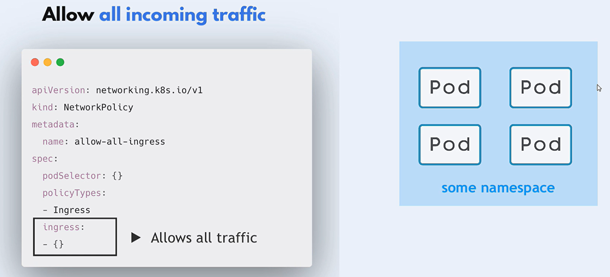

# What is Network Policy in K8s


- Network policies in Kubernetes are a way to **control the traffic** flow between pods in a cluster.
- They act as a **firewall** for controlling both **inbound** and **outbound** traffic at the pod level.
- **By default**, all pods in a Kubernetes cluster can communicate with each other without any restrictions.

## How it Works in k8s

- Network policies are implemented by the network plugin such as Calico, Weave Net, or Cilium.

- Not All CNI plugins support network policies such as Flannel.

## Main Features

1. **Policy Types**: There are two types of network policies:

   1. **Ingress**: Controls the incoming traffic to the pods.
   1. **Egress**: Controls the outgoing traffic from the pods.

1. **Namespaces**: Network policies use namespaces to specify the namespaces to which the policy applies.
1. **Labels**: Network policies use labels to specify the labels to which the policy applies.
1. **Protocols**: Network policies use protocols to specify the protocols to which the policy applies.
1. **Ports**: Network policies use ports to specify the ports to which the policy applies.
1. **CIDR Blocks**: Network policies use CIDR blocks to specify the IP ranges to which the policy applies.

## Configure Network Policy


### Step 1: Which application?

First, you need to decide which application you want to apply the network policy to.

```yaml
apiVersion: apps/v1
kind: NetworkPolicy
metadata:
  name: np-backend
  namespace: default
spec:
  podSelector:
    matchLabels:
      app: my-backend-app
    policyTypes:
      - Ingress

    ingress:
      - from:
          - podSelector:
              matchLabels:
                app: my-frontend-app
```

- By default, when namespaceSelector is not specified, the network policy applies to the pods in the same namespace that network policy is created.

- if you want to apply the network policy to all the pods in the namespace, you can use the `matchLabels` field with an empty value.

### Step 2: Which rule type?

You need to decide which rule type you want to apply to the network policy.

```yaml
# ingress rule

apiVersion: networking.k8s.io/v1
kind: NetworkPolicy
metadata:
  name: np-db
  namespace: default
spec:
  podSelector:
    matchLabels:
      app: mysql
  policyTypes:
    - Ingress
  ingress:
    - from: # first rule
        - podSelector:
            matchLabels:
              app: my-backend-app
      ports:
        - protocol: TCP
          port: 3306
    - from: # second rule
        - podSelector:
            matchLabels:
              app: php-my-admin
      ports:
        - protocol: TCP
          port: 3306
# Allow traffic from the pods with the label app: my-backend-app and app: php-my-admin to the pods with the label app: mysql.
```

```yaml
# egress rule

apiVersion: networking.k8s.io/v1
kind: NetworkPolicy
metadata:
  name: np-backend
  namespace: default
spec:
  podSelector:
    matchLabels:
      app: my-backend-app
  policyTypes:
    - Egress
  egress:
    - to: # first rule
        - podSelector:
            matchLabels:
              app: mysql
      ports:
        - protocol: TCP
          port: 3306
    - to: # second rule
        - podSelector:
            matchLabels:
              app: redis
      ports:
        - protocol: TCP
          port: 6379
# Allow traffic from the pods with the label app: my-backend-app to the pods with the label app: mysql and app: redis.
```

### Step 3: Which namespace?

You can also specify the namespace to which the network policy applies.

```yaml
apiVersion: apps/v1
kind: NetworkPolicy
metadata:
  name: np-database
  namespace: database-namespace
spec:
  podSelector:
    matchLabels:
      app: my-backend-app
    policyTypes:
      - Ingress

    ingress:
      - from:
          - podSelector:
              matchLabels:
                app: my-frontend-app
            namespaceSelector:
              matchLabels:
              name: staging-namespace
```

- By default podSelector is used to select the pods in the same namespace.
- NOTE: `AND` operator is used between the podSelector and namespaceSelector.

### Notes

- **AND** operator is used between the podSelector and namespaceSelector.
  

- **undefined** "ingress" attribute means no traffic is allowed to the pods.
  

- defined "ingress" attribute with **- {}** means all traffic is allowed to the pods.
  

## Examples

### Example 1: Allow/Deny Ingress/Egress Traffic

```yaml
# Allow All Ingress Traffic
apiVersion: networking.k8s.io/v1
kind: NetworkPolicy
metadata:
  name: allow-all-ingress
  namespace: default
spec:
  podSelector: {}
  policyTypes:
    - Ingress
  ingress:
    - {}
---
# Deny All Egress Traffic
apiVersion: networking.k8s.io/v1
kind: NetworkPolicy
metadata:
  name: deny-all-egress
  namespace: default
spec:
  podSelector:
    matchLabels:
      app: secure-app
  policyTypes:
    - Egress
  egress: []
```

### Example 2: Allow Ingress from a Specific Namespace

```yaml
apiVersion: networking.k8s.io/v1
kind: NetworkPolicy
metadata:
  name: allow-namespace-ingress
  namespace: default
spec:
  podSelector:
    matchLabels:
      app: my-app
  policyTypes:
    - Ingress
  ingress:
    - from:
        - namespaceSelector:
            matchLabels:
              project: my-namespace
```

### Example 3: Allow Egress to a Specific IP Range

```yaml
apiVersion: networking.k8s.io/v1
kind: NetworkPolicy
metadata:
  name: allow-egress-to-ip
  namespace: default
spec:
  podSelector:
    matchLabels:
      app: my-app
  policyTypes:
    - Egress
  egress:
    - to:
        - ipBlock:
            cidr: 192.168.1.0/24
```

### Example 4: Allow Ingress Traffic on Specific Ports

```yaml
apiVersion: networking.k8s.io/v1
kind: NetworkPolicy
metadata:
  name: allow-ingress-specific-ports
  namespace: default
spec:
  podSelector:
    matchLabels:
      app: web-app
  policyTypes:
    - Ingress
  ingress:
    - ports:
        - protocol: TCP
          port: 80
        - protocol: TCP
          port: 443
```

### Example 5: Full Example

#### Deployments

```yaml
---
# database deployment
apiVersion: apps/v1
kind: Deployment
metadata:
  name: database
  namespace: "ns-staging"
spec:
  replicas: 2
  selector:
    matchLabels:
      app: database
  template:
    metadata:
      labels:
        app: database
    spec:
      containers:
        - name: redis
          image: redis:6-alpine
          ports:
            - containerPort: 6379
          resources:
            limits:
              cpu: "500m"
              memory: "512Mi"
---
# backend deployment
apiVersion: apps/v1
kind: Deployment
metadata:
  name: backend
  namespace: "ns-staging"
spec:
  replicas: 2
  selector:
    matchLabels:
      app: backend
  template:
    metadata:
      labels:
        app: backend
    spec:
      containers:
        - name: nginx
          image: nginx:1.21-alpine
          ports:
            - containerPort: 80
          resources:
            limits:
              cpu: "500m"
              memory: "512Mi"
            requests:
              cpu: "200m"
              memory: "256Mi"
---
# frontend deployment
apiVersion: apps/v1
kind: Deployment
metadata:
  name: frontend
  namespace: "ns-staging"
spec:
  replicas: 2
  selector:
    matchLabels:
      app: frontend
  template:
    metadata:
      labels:
        app: frontend
    spec:
      containers:
        - name: node
          image: node:16-alpine
          command: ["sh", "-c", "sleep 3000"]
          resources:
            limits:
              cpu: "1"
              memory: "512Mi"
          ports:
            - containerPort: 3000
```

#### Services

```yaml
---
# database service
apiVersion: v1
kind: Service
metadata:
  name: database-service
  namespace: "ns-staging"
spec:
  selector:
    app: database
  ports:
    - protocol: TCP
      port: 6379
      targetPort: 6379
  type: ClusterIP

---
# backend service
apiVersion: v1
kind: Service
metadata:
  name: backend-service
  namespace: "ns-staging"
spec:
  selector:
    app: backend
  ports:
    - protocol: TCP
      port: 80
      targetPort: 80
  type: ClusterIP

---
# frontend service
apiVersion: v1
kind: Service
metadata:
  name: frontend-service
  namespace: "ns-staging"
spec:
  selector:
    app: frontend
  ports:
    - protocol: TCP
      port: 3000
      targetPort: 3000
  type: ClusterIP
```

#### Network Policy

```yaml
---
# np-database
apiVersion: networking.k8s.io/v1
kind: NetworkPolicy
metadata:
  name: np-database
  namespace: myapp
spec:
  podSelector:
    matchLabels:
      app: database
  policyTypes:
    - Ingress
    - Egress
  ingress:
    - from:
        - podSelector:
            matchLabels:
              app: backend
      ports:
        - protocol: TCP
          port: 6379
---
# np-frontend
apiVersion: networking.k8s.io/v1
kind: NetworkPolicy
metadata:
  name: np-frontend
  namespace: myapp
spec:
  podSelector:
    matchLabels:
      app: frontend
  policyTypes:
    - Egress
  egress:
    - to:
        - podSelector:
            matchLabels:
              app: backend
      ports:
        - protocol: TCP
          port: 80
---
# np-backend
apiVersion: networking.k8s.io/v1
kind: NetworkPolicy
metadata:
  name: np-backend
  namespace: myapp # namespace for pod that gets the policy
spec:
  podSelector:
    matchLabels:
      app: backend
  policyTypes:
    - Egress
  egress:
    - to: # first rule
        - podSelector:
            matchLabels:
              app: mysql
          namespaceSelector:
            matchLabels:
              kubernetes.io/metadata.name: database
      ports:
        - protocol: TCP
          port: 3306
    - to: # second rule
        - podSelector:
            matchLabels:
              app: redis
          namespaceSelector:
            matchLabels:
              kubernetes.io/metadata.name: database
      ports:
        - protocol: TCP
          port: 6379
```

#### Testing

```bash
# Set namespace to ns-staging
kubectl config set-context --current --namespace=ns-staging
kubectl get pod -o wide

# NOTE: Define the IP addresses of the services
# export DATABASE_SERVICE_IP=$(kubectl get svc database-service -n ns-staging -o jsonpath='{.spec.clusterIP}')
# export BACKEND_SERVICE_IP=$(kubectl get svc backend-service -n ns-staging -o jsonpath='{.spec.clusterIP}')
# export FRONTEND_SERVICE_IP=$(kubectl get svc frontend-service -n ns-staging -o jsonpath='{.spec.clusterIP}')

# NOTE: Define the IP addresses of the pods
export DATABASE_POD_NAME=$(kubectl get pod -l app=database -n ns-staging  -o jsonpath='{.items[0].metadata.name}')
export BACKEND_POD_NAME=$(kubectl get pod -l app=backend -n ns-staging  -o jsonpath='{.items[0].metadata.name}')
export FRONTEND_POD_NAME=$(kubectl get pod -l app=frontend -n ns-staging  -o jsonpath='{.items[0].metadata.name}')

# NOTE: Define the IP addresses of the pods
export DATABASE_POD_IP=$(kubectl get pod -l app=database -n ns-staging  -o jsonpath='{.items[0].status.podIP}')
export BACKEND_POD_IP=$(kubectl get pod -l app=backend -n ns-staging  -o jsonpath='{.items[0].status.podIP}')
export FRONTEND_POD_IP=$(kubectl get pod -l app=frontend -n ns-staging  -o jsonpath='{.items[0].status.podIP}')


## Before creating network policies

### all of these works
kubectl exec $BACKEND_POD_NAME -- sh -c "nc -v $DATABASE_POD_IP 6379"
kubectl exec $FRONTEND_POD_NAME -- sh -c "nc -v $BACKEND_POD_IP 80"
kubectl exec $FRONTEND_POD_NAME -- sh -c "nc -v $DATABASE_POD_IP 6379"
kubectl exec $DATABASE_POD_NAME -- sh -c "nc -v $FRONTEND_POD_IP 3000"
kubectl exec $DATABASE_POD_NAME -- sh -c "nc -v $BACKEND_POD_IP 80"

## After creating network policies

### still works
kubectl exec $BACKEND_POD_NAME -- sh -c "nc -v $DATABASE_POD_IP 6379"
kubectl exec $FRONTEND_POD_NAME -- sh -c "nc -v $BACKEND_POD_IP 80"

### don't work any more
kubectl exec $FRONTEND_POD_NAME -- sh -c "nc -v $DATABASE_POD_IP 6379"
kubectl exec $DATABASE_POD_NAME -- sh -c "nc -v $FRONTEND_POD_IP 3000"
kubectl exec $DATABASE_POD_NAME -- sh -c "nc -v $BACKEND_POD_IP 80"
```

#### Cleanup

```bash
kubectl delete -f ./deployments.yaml
kubectl delete -f ./services.yaml
kubectl delete -f ./network-policy.yaml
```
