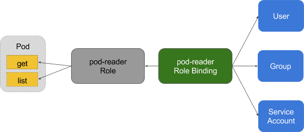
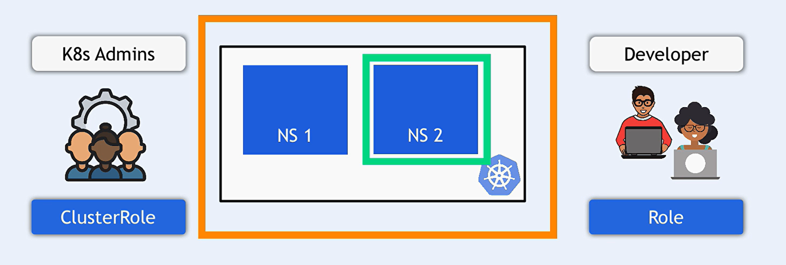
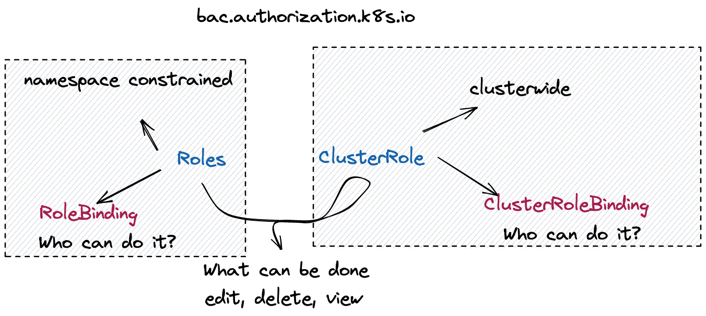
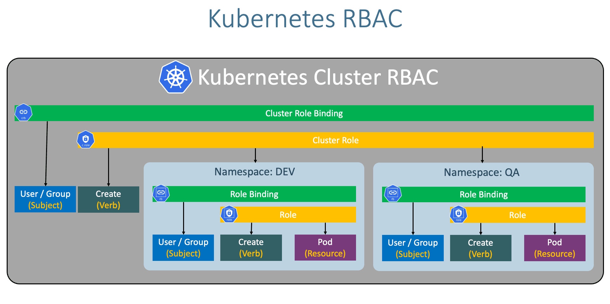

# RBAC (Role-Based Access Control) in Kubernetes

Role-Based Access Control (RBAC) is a method of regulating/organize access to resources based on the roles of individual users within an organization. In Kubernetes, RBAC allows you to control who can access what within your cluster, providing a way to manage permissions and enforce security policies.






## RBAC Resources

1. **Role**: Defines a set of permissions (rules) within a namespace. It grants access to specific resources (like pods, services) and actions (like get, list, create).

1. **RoleBinding**: Associates a Role with a user, group, or service account within a namespace. It grants the permissions defined in the Role to the subjects specified in the binding.

1. **ClusterRole**: Similar to Role, but applicable cluster-wide across all namespaces.

1. **ClusterRoleBinding**: Associates a ClusterRole with a user, group, or service account cluster-wide.

### **Role**

```yaml
apiVersion: rbac.authorization.k8s.io/v1
kind: Role
metadata:
  name: pod-reader
  namespace: default
rules:
  - apiGroups: [""]
    resources: ["pods"]
    verbs: ["get", "watch", "list"]
```

### **RoleBinding**

```yaml
apiVersion: rbac.authorization.k8s.io/v1
kind: RoleBinding
metadata:
  name: read-pods
  namespace: default
subjects:
  - kind: User
    name: "jane"
    apiGroup: rbac.authorization.k8s.io
roleRef:
  kind: Role
  name: pod-reader
  apiGroup: rbac.authorization.k8s.io
```

### **ClusterRole**

```yaml
apiVersion: rbac.authorization.k8s.io/v1
kind: ClusterRole
metadata:
  name: pod-reader
rules:
  - apiGroups: [""]
    resources: ["pods"]
    verbs: ["get", "watch", "list"]
```

### **ClusterRoleBinding**

```yaml
apiVersion: rbac.authorization.k8s.io/v1
kind: ClusterRoleBinding
metadata:
  name: read-pods-global
subjects:
  - kind: User
    name: "jane"
    apiGroup: rbac.authorization.k8s.io
roleRef:
  kind: ClusterRole
  name: pod-reader
  apiGroup: rbac.authorization.k8s.io
```

## Understanding API Groups

When creating roles and role bindings in Kubernetes, you use the `apiGroups` field to specify which API groups the role applies to. This allows you to define permissions for resources within specific API groups.

In Kubernetes, API groups are a way to categorize and organize API resources and their associated operations. They allow Kubernetes to manage and evolve its APIs in a modular fashion. When defining roles in Kubernetes using Role-Based Access Control (RBAC), API groups are used to specify which resources and actions the role applies to.

1. **Core API Group**: The core API group, also known as the "legacy" API group, does not have a prefix and includes essential resources like Pods, Services, and Nodes. For example, the resource **pods**,**service** belongs to the core API group.

2. **Named API Groups**: Named API groups are prefixed with a specific group name. These groups help organize Kubernetes resources that are not part of the core API group. Examples include:

   - `apps`: Contains resources like **Deployments**, **ReplicaSets**, and **StatefulSets**.
   - `batch`: Contains resources like **Jobs** and **CronJobs**.
   - `rbac.authorization.k8s.io`: Contains resources like **Roles**, **RoleBindings**, **ClusterRoles**, and **ClusterRoleBindings**.
   - `networking.k8s.io`: Contains resources like **NetworkPolicies** and **Ingresses**.

3. **apiGroups** Field
   - **Empty String (`""`)**: Refers to the core API group.
   - **Specific Group Names**: Refers to named API groups like `apps`, `batch`, `rbac.authorization.k8s.io`, etc.
   - **Wildcards**: The use of wildcards (e.g., `["*"]`) is generally not supported in API group specifications for roles. You need to specify each API group explicitly.

### Role Definition Example

```bash
kubectl create role ci-cd-role \
--verb=create,update,list \
--resource=pods.service,deployments.apps \
--namespace=dev \
--dry-run=client -o yaml > ci-cd-role.yaml
```

```yaml
# ci-cd-role.yaml
apiVersion: rbac.authorization.k8s.io/v1
kind: Role
metadata:
  name: ci-cd-role
  namespace: dev
rules:
  - apiGroups: ["apps"]
    resources: ["deployments"]
    verbs: ["create", "update", "list"]
  - apiGroups: [""]
    resources: ["pods", "service"]
    verbs: ["create", "update", "list"]
```

## Example Use Case

### 1. **Create a Role to Allow Pod Reading**

```yaml
apiVersion: rbac.authorization.k8s.io/v1
kind: Role
metadata:
  namespace: default
  name: pod-reader
rules:
  - apiGroups: [""]
    resources: ["pods"]
    verbs: ["get", "watch", "list"]
```

```sh
# Apply the Role:
kubectl apply -f role.yaml
```

### 2. **Create a RoleBinding to Bind the Role to a User**

```yaml
apiVersion: rbac.authorization.k8s.io/v1
kind: RoleBinding
metadata:
  name: read-pods
  namespace: default
subjects:
  - kind: User
    name: "jane"
    apiGroup: rbac.authorization.k8s.io
roleRef:
  kind: Role
  name: pod-reader
  apiGroup: rbac.authorization.k8s.io
```

```sh
# Apply the RoleBinding:
kubectl apply -f role-binding.yaml
```
