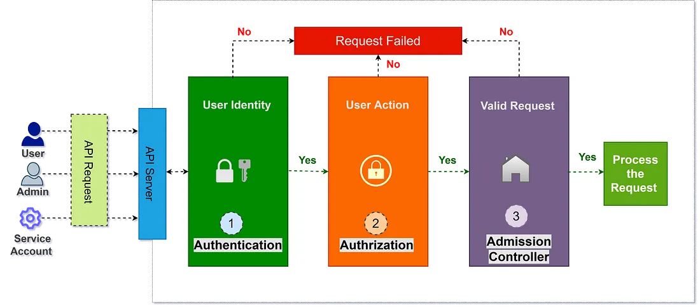

# RBAC (Role-Based Access Control) in Kubernetes

Role-Based Access Control (RBAC) is a method of regulating/organize access to resources based on the roles of individual users within an organization. In Kubernetes, RBAC allows you to control who can access what within your cluster, providing a way to manage permissions and enforce security policies.




## Key Concepts

1. **Role**: Defines a set of permissions (rules) within a namespace. It grants access to specific resources (like pods, services) and actions (like get, list, create).

1. **RoleBinding**: Associates a Role with a user, group, or service account within a namespace. It grants the permissions defined in the Role to the subjects specified in the binding.

1. **ClusterRole**: Similar to Role, but applicable cluster-wide across all namespaces.

1. **ClusterRoleBinding**: Associates a ClusterRole with a user, group, or service account cluster-wide.

## RBAC Resources


1. **Role**:


```yaml
apiVersion: rbac.authorization.k8s.io/v1
kind: Role
metadata:
  name: pod-reader
  namespace: default
rules:
  - apiGroups: [""]
    resources: ["pods"]
    verbs: ["get", "watch", "list"]
```

1. **RoleBinding**:

   ```yaml
   apiVersion: rbac.authorization.k8s.io/v1
   kind: RoleBinding
   metadata:
     name: read-pods
     namespace: default
   subjects:
     - kind: User
       name: "jane"
       apiGroup: rbac.authorization.k8s.io
   roleRef:
     kind: Role
     name: pod-reader
     apiGroup: rbac.authorization.k8s.io
   ```

1. **ClusterRole**:

   ```yaml
   apiVersion: rbac.authorization.k8s.io/v1
   kind: ClusterRole
   metadata:
     name: pod-reader
   rules:
     - apiGroups: [""]
       resources: ["pods"]
       verbs: ["get", "watch", "list"]
   ```

1. **ClusterRoleBinding**:

   ```yaml
   apiVersion: rbac.authorization.k8s.io/v1
   kind: ClusterRoleBinding
   metadata:
     name: read-pods-global
   subjects:
     - kind: User
       name: "jane"
       apiGroup: rbac.authorization.k8s.io
   roleRef:
     kind: ClusterRole
     name: pod-reader
     apiGroup: rbac.authorization.k8s.io
   ```

## Example Use Case

### 1. **Create a Role to Allow Pod Reading**

```yaml
apiVersion: rbac.authorization.k8s.io/v1
kind: Role
metadata:
  namespace: default
  name: pod-reader
rules:
  - apiGroups: [""]
    resources: ["pods"]
    verbs: ["get", "watch", "list"]
```

```sh
# Apply the Role:
kubectl apply -f role.yaml
```

### 2. **Create a RoleBinding to Bind the Role to a User**

```yaml
apiVersion: rbac.authorization.k8s.io/v1
kind: RoleBinding
metadata:
  name: read-pods
  namespace: default
subjects:
  - kind: User
    name: "jane"
    apiGroup: rbac.authorization.k8s.io
roleRef:
  kind: Role
  name: pod-reader
  apiGroup: rbac.authorization.k8s.io
```

```sh
# Apply the RoleBinding:
kubectl apply -f role-binding.yaml
```
