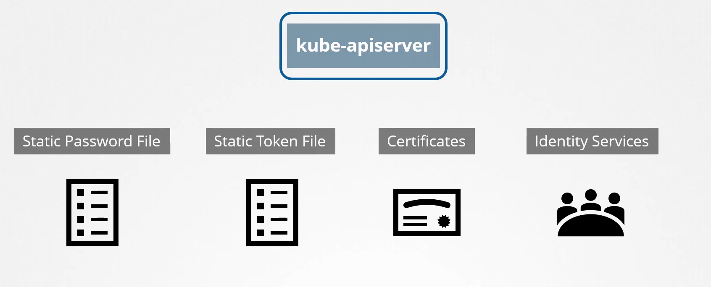

# Authentication in Kubernetes

Authentication in Kubernetes is essential for ensuring that only authorized users and processes can interact with the Kubernetes API server. It is the first line of defense in securing a Kubernetes cluster, controlling access to the API server and the actions that can be performed.

## 1. **Overview of Authentication in Kubernetes**

- **Purpose**: Authentication verifies the identity of users or processes interacting with the Kubernetes API server.
- **Scope**: Kubernetes supports multiple authentication methods, which can be used simultaneously to cater to different use cases.

---

## 2. **Authentication Methods in Kubernetes**

Kubernetes provides several authentication mechanisms, each suited to different scenarios:

### 2.1 **Client Certificates**

- **Usage**: Commonly used for securing communication between the API server and kubelets or other API clients.
- **How it Works**: The client presents a certificate signed by a trusted Certificate Authority (CA) when making a request. The API server verifies this certificate to authenticate the client.
- **Configuration**: Certificates are managed by an external PKI system, and the API server is configured to trust a specific CA.

### 2.2 **Bearer Tokens**

- **Usage**: Often used for service accounts within the cluster or external users.
- **How it Works**: A token is passed in the `Authorization` header of the HTTP request. The API server checks the validity of this token against a set of known tokens.
- **Configuration**: Tokens can be static (hard-coded) or dynamically generated by an external identity provider.

### 2.3 **HTTP Basic Authentication**

- **Usage**: Typically used for simplicity during testing or development.
- **How it Works**: A username and password are sent with each request in the `Authorization` header. The API server compares these credentials against a known list.
- **Configuration**: Basic auth credentials are specified in a file on the API server, but this method is generally discouraged in production environments due to security risks.

### 2.4 **OpenID Connect (OIDC)**

- **Usage**: Commonly used for integrating Kubernetes with external identity providers like Google, Okta, or Azure AD.
- **How it Works**: OIDC allows Kubernetes to delegate authentication to an external identity provider. Users authenticate via the identity provider, which issues an ID token that is passed to the Kubernetes API server.
- **Configuration**: The API server is configured with the OIDC provider’s information, including the issuer URL and client credentials.

### 2.5 **Service Accounts**

- **Usage**: Used by pods and controllers within the Kubernetes cluster to authenticate with the API server.
- **How it Works**: Each pod is assigned a service account, which provides a JWT token that the API server verifies against its internal database.
- **Configuration**: Service accounts are managed within Kubernetes, and tokens are automatically mounted into pods.

### 2.6 **Webhook Token Authentication**

- **Usage**: Allows integration with custom authentication systems.
- **How it Works**: The API server sends authentication requests to an external webhook service, which verifies the credentials and returns a success or failure response.
- **Configuration**: The webhook endpoint is defined in the API server’s configuration.

---

## 3. **Authentication Flow in Kubernetes**

Understanding the typical flow of authentication in Kubernetes helps clarify how these mechanisms work together:

1. **Client Request**: A client (user or service) sends a request to the Kubernetes API server, including authentication credentials.
2. **API Server Verification**: The API server verifies the credentials using one of the supported authentication methods.
3. **Identity Establishment**: If the credentials are valid, the API server establishes the client's identity.
4. **Authorization and Admission Control**: After authentication, the request undergoes authorization and admission control to determine if the action is allowed.

---

## 4. **Best Practices for Kubernetes Authentication**

To enhance security in Kubernetes, follow these best practices:

- **Use Strong Authentication Methods**: Prefer using client certificates, OIDC, or webhook authentication over basic auth or static tokens, especially in production environments.
- **Integrate with External Identity Providers**: Use OIDC to leverage existing enterprise identity management systems.
- **Rotate Credentials Regularly**: Regularly rotate tokens, certificates, and passwords to reduce the risk of compromised credentials.
- **Limit Scope of Service Accounts**: Use Role-Based Access Control (RBAC) to limit what service accounts can do, reducing the impact if a service account token is compromised.

---

## 5. **Security Considerations in Kubernetes Authentication**

To ensure robust security for your Kubernetes cluster, consider the following:

- **Securing Communication**: Ensure all communication between clients and the API server is encrypted using TLS.
- **Monitoring and Auditing**: Implement logging and auditing to monitor authentication attempts and detect any suspicious activity.
- **Token Expiry**: Use short-lived tokens where possible to minimize the window of opportunity for attackers.

---

## Conclusion

Authentication in Kubernetes is a foundational aspect of securing a cluster. By selecting the appropriate authentication methods, adhering to best practices, and implementing strong security measures, you can effectively control access to your Kubernetes API server and protect your cluster from unauthorized access.
