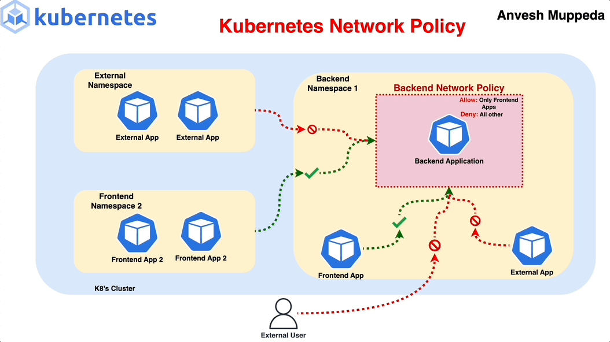

# What is Network Policy in K8s

## 📑 Table of Contents

1. [🔍 Introduction to NetworkPolicies](#introduction)
2. [🔧 Prerequisites](#prerequisites)
3. [🧩 The NetworkPolicy resource](#networkpolicy-resource)
4. [🌐 Default Behavior in Kubernetes Networking](#default-behavior)
5. [🛠 Example Scenarios](#example-scenario)
6. [✅ Verifying NetworkPolicies](#verifying)
7. [💡 Best Practices](#best-practices)
8. [🐞 Troubleshooting Common Issues](#troubleshooting)
9. [🎯 Conclusion](#conclusion)
10. [🔗 Additional Resources](#additional-resources)

## introduction

Kubernetes NetworkPolicies are Kubernetes resources that define rules for how pods are allowed to communicate with each other and with other network endpoints. They act as virtual firewalls, enabling fine-grained control over both ingress (incoming) and egress (outgoing) traffic at the pod level.



- **By default**, all pods in a Kubernetes cluster can communicate with each other without any restrictions.
- Network policies in Kubernetes are a way to **control the traffic** flow between pods in a cluster.
- They act as a **firewall** for controlling both **inbound** and **outbound** traffic at the pod level.

## Prerequisites

- **Network Plugin Support**: Not all Kubernetes network plugins support NetworkPolicies. Ensure you're using one that does, such as:

  - Calico
  - Cilium
  - Weave Net
  - Kube-router

- Not All CNI plugins support network policies such as Flannel.

## 🧩 The NetworkPolicy resource<a id="networkpolicy-resource"></a>


```yaml
# Example Structure:
apiVersion: networking.k8s.io/v1
kind: NetworkPolicy
metadata:
  name: test-network-policy
  namespace: default
spec:
  podSelector:
    matchLabels:
      role: db
  policyTypes:
    - Ingress
    - Egress
  ingress:
    - from:
        - ipBlock:
            cidr: 172.17.0.0/16
            except:
              - 172.17.1.0/24
        - namespaceSelector:
            matchLabels:
              project: myproject
        - podSelector:
            matchLabels:
              role: frontend
      ports:
        - protocol: TCP
          port: 6379
  egress:
    - to:
        - ipBlock:
            cidr: 10.0.0.0/24
      ports:
        - protocol: TCP
          port: 5978
```

- **namespace**: The namespace in which the network policy is created.
- **podSelector:** Selects the pods to which the network policy applies based on their labels.

- **policyTypes:** Specifies whether the policy applies to **ingress**, **egress**, or both.

- **ingress:** Defines the rules for incoming traffic.

  - **from:** Specifies the sources allowed to send traffic to the selected pods.

    - **ipBlock:** Allows traffic from a specific IP block.
    - **namespaceSelector:** Allows traffic from pods in a specific namespace.
    - **podSelector:** Allows traffic from pods with specific labels.

  - **ports:** Specifies the ports and protocols allowed for incoming traffic.
    - **protocol:** Specifies the protocol (TCP, UDP, etc.).
    - **port:** Specifies the port number.

- **egress:** Defines the rules for outgoing traffic.

  - **to:** Specifies the destinations allowed to receive traffic from the selected pods.

    - **ipBlock:** Allows traffic to a specific IP block.
    - **namespaceSelector:** Allows traffic to pods in a specific namespace.
    - **podSelector:** Allows traffic to pods with specific labels.

  - **ports:** Specifies the ports and protocols allowed for outgoing traffic.
    - **protocol:** Specifies the protocol (TCP, UDP, etc.).
    - **port:** Specifies the port number.

## 🌐 Default Behavior in Kubernetes Networking <a id="default-behavior"></a>

Understanding the default networking behavior is essential to effectively apply NetworkPolicies.

### **Default Behavior:**

- **Without NetworkPolicies:**

  - **All Traffic Allowed:** Pods can communicate freely with each other and external services.

- **With NetworkPolicies:**

  - **Selective Restriction:** Traffic is restricted based on defined rules.
  - **Implicit Deny:** If a NetworkPolicy applies to a pod, any traffic not explicitly allowed is denied.
  - By default, when namespaceSelector is not specified, the network policy applies to the pods in the same namespace that network policy is created.

  - if you want to apply the network policy to all the pods in the namespace, you can use the `matchLabels` field with an empty value `podSelector: {}`.

### **Policy Enforcement Rules:**

- **Additive Nature:** Multiple NetworkPolicies targeting the same pod will have their rules combined (logical OR).

- **No Implicit Ordering:** Policies are evaluated collectively; there's no precedence.

### **Default Deny:**

The "default deny" policy is a common practice to block all traffic unless explicitly allowed. This can be set for ingress, egress, or both.

1. **Default Deny Ingress Traffic:** Blocks all incoming traffic to a pod unless explicitly allowed by a Network Policy.

1. **Default Deny Egress Traffic**: Blocks all outgoing traffic from a pod unless explicitly allowed by a Network Policy.

> _You can create "default deny" policies to ensure that no pod can communicate unless the traffic is explicitly allowed._

The following policy applies a default deny policy for all pods in the default namespace. This means that no pod can accept any incoming traffic unless a more specific policy allows it.

```yaml
# Example: Default Deny Ingress Policy
apiVersion: networking.k8s.io/v1
kind: NetworkPolicy
metadata:
  name: default-deny-ingress
  namespace: default
spec:
  podSelector: {}
  policyTypes:
    - Ingress
```

**Explanation**:

1. **podSelector: {}** means the policy applies to all pods in the default namespace.
1. **policyTypes: [Ingress]** means the policy only affects incoming traffic (ingress).
1. policy blocks all inbound traffic to the pods in the namespace unless another policy explicitly allows it.

## 🛠 Examples Scenarios <a id="example-scenario"></a>

This section covers the step-by-step creation of NetworkPolicies with practical examples.

### 1. Basic Ingress Policy <a name="basic-ingress"></a>

**Objective:** Allow HTTP traffic to frontend pods from any source.

```yaml
apiVersion: networking.k8s.io/v1
kind: NetworkPolicy
metadata:
  name: allow-http-ingress
  namespace: my-app
spec:
  podSelector:
    matchLabels:
      app: frontend
  policyTypes:
    - Ingress
  ingress:
    - from:
        - ipBlock:
            cidr: 0.0.0.0/0 # Any IP
      ports:
        - protocol: TCP
          port: 80
```

**Explanation:**

- **Targets:** Pods labeled `app=frontend`.
- **Allows:** TCP traffic on port 80 from any IP address.

### 2. Basic Egress Policy <a name="basic-egress"></a>

**Objective:** Restrict frontend pods to only communicate with backend pods on port 8080.

```yaml
apiVersion: networking.k8s.io/v1
kind: NetworkPolicy
metadata:
  name: frontend-egress
  namespace: my-app
spec:
  podSelector:
    matchLabels:
      app: frontend
  policyTypes:
    - Egress
  egress:
    - to:
        - podSelector:
            matchLabels:
              app: backend
      ports:
        - protocol: TCP
          port: 8080
```

**Explanation:**

- **Targets:** Pods labeled `app=frontend`.
- **Allows:** TCP traffic on port 8080 only to pods labeled `app=backend`.

### 3. Namespace and Pod Selectors <a name="namespace-pod-selectors"></a>

**Objective:** Allow backend pods to communicate with the database service only from the `backend-namespace`.

```yaml
apiVersion: networking.k8s.io/v1
kind: NetworkPolicy
metadata:
  name: db-access
  namespace: database-namespace
spec:
  podSelector:
    matchLabels:
      app: database
  policyTypes:
    - Ingress
  ingress:
    - from:
        - namespaceSelector:
            matchLabels:
              name: backend-namespace
          podSelector:
            matchLabels:
              role: backend
      ports:
        - protocol: TCP
          port: 5432 # PostgreSQL
```

**Explanation:**

- **Targets:** Pods labeled `app=database` in `database-namespace`.
- **Allows:** TCP traffic on port 5432 from pods labeled `role=backend` within `backend-namespace`.
- By default podSelector is used to select the pods in the same namespace.
- NOTE: `AND` operator is used between the podSelector and namespaceSelector.

### 4. Example: Securing a Multi-Tier Application <a name="multi-tier-example"></a>

**Application Layers:**

1. **Frontend:** Accessible to users.
2. **Backend:** Only accessible by Frontend.
3. **Database:** Only accessible by Backend.

**Step-by-Step Policies:**

#### a. Apply Default Deny Policies

```yaml
apiVersion: networking.k8s.io/v1
kind: NetworkPolicy
metadata:
  name: default-deny-all
  namespace: my-app
spec:
  podSelector: {}
  policyTypes:
    - Ingress
    - Egress
```

**Explanation:**

- **Targets:** All pods in the `my-app` namespace.
- **Effect:** Denies all ingress and egress traffic unless explicitly allowed by other policies.

**Outcome:**

- **Frontend:** Accessible externally on ports 80 and 443.
- **Backend:** Only accessible by Frontend on port 8080.
- **Database:** Only accessible by Backend on port 5432.
- **All Other Traffic:** Denied by default.

#### b. Allow External Access to Frontend

```yaml
apiVersion: networking.k8s.io/v1
kind: NetworkPolicy
metadata:
  name: allow-frontend-ingress
  namespace: my-app
spec:
  podSelector:
    matchLabels:
      app: frontend
  policyTypes:
    - Ingress
  ingress:
    - from:
        - ipBlock:
            cidr: 0.0.0.0/0
      ports:
        - protocol: TCP
          port: 80
        - protocol: TCP
          port: 443
```

**Explanation:**

- **Targets:** Pods labeled `app=frontend`.
- **Allows:** TCP traffic on ports 80 and 443 from any IP address.

#### c. Allow Frontend to Communicate with Backend

```yaml
apiVersion: networking.k8s.io/v1
kind: NetworkPolicy
metadata:
  name: allow-frontend-to-backend
  namespace: my-app
spec:
  podSelector:
    matchLabels:
      app: backend
  policyTypes:
    - Ingress
  ingress:
    - from:
        - podSelector:
            matchLabels:
              app: frontend
      ports:
        - protocol: TCP
          port: 8080
```

**Explanation:**

- **Targets:** Pods labeled `app=backend`.
- **Allows:** TCP traffic on port 8080 only from pods labeled `app=frontend`.

#### d. Allow Backend to Access Database

```yaml
apiVersion: networking.k8s.io/v1
kind: NetworkPolicy
metadata:
  name: allow-backend-to-db
  namespace: my-app
spec:
  podSelector:
    matchLabels:
      app: database
  policyTypes:
    - Ingress
  ingress:
    - from:
        - podSelector:
            matchLabels:
              app: backend
      ports:
        - protocol: TCP
          port: 5432 # PostgreSQL
```

**Explanation:**

- **Targets:** Pods labeled `app=database`.
- **Allows:** TCP traffic on port 5432 only from pods labeled `app=backend`.

### Notes

- **AND** operator is used between the podSelector and namespaceSelector.
  

- **undefined** "ingress" attribute means no traffic is allowed to the pods.
  

- defined "ingress" attribute with **- {}** means all traffic is allowed to the pods.
  

- if you didn't specify the **policyTypes** attribute, the default value is **Ingress** and **Egress** are allowed.

## ✅ Verifying and Testing NetworkPolicies <a name="verifying"></a>

Ensuring that your NetworkPolicies function as intended is critical for maintaining cluster security.

### Steps to Verify

1. **Deploy Test Pods:**

   - Create pods that represent different roles (e.g., frontend, backend, database).

2. **Test Allowed Communications:**

   - **Example:** From Frontend pod, access Backend service.
   - **Command:**

     ```bash
     kubectl exec -it frontend-pod -- curl backend:8080
     ```

   - **Expected Result:** Successful connection.

3. **Test Blocked Communications:**

   - **Example:** From an external source, attempt to access Database service.
   - **Command:**

     ```bash
     curl database:5432
     ```

   - **Expected Result:** Connection should be refused or timed out.

4. **Use Network Tools:**

   - Utilize tools like **`netcat`** or **`telnet`** to test specific ports.
   - **Example:**

     ```bash
     kubectl exec -it frontend-pod -- nc -zv backend 8080
     ```

5. **Monitor Logs:**

   - Check logs from your network plugin (e.g., Calico logs) for denied or allowed traffic.

6. **Automated Testing:**
   - Incorporate NetworkPolicy verification into CI/CD pipelines using tools like **`kube-bench`** or **`polaris`**.

### Example Verification Scenario

**Attempt to Access Backend from Unauthorized Pod:**

1. **Deploy Unauthorized Pod:**

   ```bash
   kubectl run unauthorized-pod --image=busybox --command -- sleep 3600
   ```

2. **Attempt Communication:**

   ```bash
   kubectl exec -it unauthorized-pod -- curl backend:8080
   ```

3. **Expected Result:** Connection should fail, confirming the NetworkPolicy is enforcing restrictions.

## 💡 Best Practices <a name="best-practices"></a>

1. **Principle of Least Privilege:**

   - Only allow the minimum necessary traffic required for each component to function.

2. **Use Specific Selectors:**

   - Leverage precise pod and namespace selectors to target policies accurately.

3. **Apply Default Deny Policies:**

   - Start with a default deny stance and explicitly open necessary communication channels.

4. **Consistent Labeling:**

   - Implement a clear and consistent labeling strategy to simplify NetworkPolicy management.

5. **Namespace Segmentation:**

   - Use namespaces to group related services and apply policies at the namespace level where appropriate.

6. **Regular Audits and Reviews:**

   - Periodically review NetworkPolicies to ensure they align with the current application architecture and security requirements.

7. **Document Policies:**

   - Maintain thorough documentation of all NetworkPolicies for transparency and easier troubleshooting.

8. **Automate Policy Management:**

   - Utilize Infrastructure as Code (IaC) tools like **Helm**, **Kustomize**, or **Terraform** to manage NetworkPolicies consistently across environments.

9. **Monitor and Alert:**

   - Implement monitoring solutions to track NetworkPolicy changes and alert on unexpected traffic patterns.

10. **Test Policies Thoroughly:**
    - Before deploying to production, rigorously test NetworkPolicies in staging environments to prevent disruptions.

## 🐞 Troubleshooting Common Issues <a name="troubleshooting"></a>

1. **Policies Not Taking Effect:**

   - **Check Network Plugin:** Ensure your network plugin supports NetworkPolicies and is correctly configured.
   - **Verify Pod Labels:** Confirm that pods are correctly labeled to match the `podSelector` in your policies.

2. **Unexpected Traffic Blocks:**

   - **Review All Applicable Policies:** Multiple policies can cumulatively affect traffic. Ensure no unintended deny rules are present.
   - **Use Diagnostic Tools:** Utilize `kubectl describe networkpolicy` and network plugin logs for insights.

3. **Egress Traffic Issues:**

   - **Default Deny Egress:** If a default deny egress policy is applied, ensure that necessary egress rules are explicitly defined.
   - **DNS Resolution:** Ensure that egress policies allow traffic to DNS services if pods rely on name resolution.

4. **Inter-Namespace Communication Failures:**

   - **Namespace Selectors:** Verify that `namespaceSelector` labels are correctly applied and policies reference the correct namespaces.

5. **Overlapping Policies:**

   - **Policy Order:** Remember that policies are additive. Conflicting policies can cause unexpected behavior.
   - **Consolidate Policies:** Where possible, combine similar rules into a single policy to reduce complexity.

6. **Connectivity from External Sources:**
   - **Ingress Rules:** Ensure that ingress rules correctly allow traffic from intended external sources.
   - **Firewall Settings:** Check external firewall settings or cloud security groups that might be blocking traffic.

### Example Debugging Steps:

1. **Identify Affected Pods:**

   ```bash
   kubectl get pods -n my-app -l app=backend
   ```

2. **Describe NetworkPolicies:**

   ```bash
   kubectl describe networkpolicy allow-frontend-to-backend -n my-app
   ```

3. **Test Connectivity:**

   ```bash
   kubectl exec -it unauthorized-pod -- curl backend:8080
   ```

4. **Check Network Plugin Logs:**
   - Access logs specific to your network plugin (e.g., Calico) to identify blocked traffic.

## 🎯 Conclusion <a name="conclusion"></a>

Kubernetes NetworkPolicies are essential for securing your Kubernetes clusters by controlling pod-to-pod and pod-to-external traffic. By meticulously defining ingress and egress rules, you can significantly reduce the attack surface of your microservices architecture. Implementing NetworkPolicies requires careful planning and a thorough understanding of your application's communication patterns, but the security benefits they offer are invaluable in today's threat landscape.

**Key Takeaways:**

- **Start with a Default Deny Stance:** Apply default deny policies and open only necessary communication channels.
- **Leverage Labels and Selectors:** Use Kubernetes labels to accurately target pods and namespaces.
- **Regularly Audit and Update Policies:** As your application evolves, ensure that NetworkPolicies remain aligned with your security requirements.
- **Integrate with Advanced Tools:** Combine NetworkPolicies with service meshes and monitoring tools for enhanced security and visibility.

## 🔗 Additional Resources <a name="additional-resources"></a>

- **Kubernetes Official Documentation:**

  - [NetworkPolicy](https://kubernetes.io/docs/concepts/services-networking/network-policies/)

- **Network Plugin Documentation:**

  - [Calico NetworkPolicy](https://docs.projectcalico.org/security/calico-network-policy)
  - [Cilium NetworkPolicy](https://docs.cilium.io/en/stable/policy/)
  - [Weave Net NetworkPolicy](https://www.weave.works/docs/net/latest/kubernetes/kube-addon/)
  - [Kube-router NetworkPolicy](https://www.kube-router.io/docs/network-policy/)

- **Service Mesh Documentation:**

  - [Istio Security Concepts](https://istio.io/latest/docs/concepts/security/)
  - [Linkerd Security Overview](https://linkerd.io/2.11/tasks/securing-traffic/)

- **Tools and Utilities:**

  - [Kube-bench](https://github.com/aquasecurity/kube-bench) – Kubernetes security checks.
  - [Polaris](https://github.com/FairwindsOps/polaris) – Kubernetes configuration validation.
  - [Kiali](https://kiali.io/) – Service mesh observability.

- **Tutorials and Guides:**
  - [Securing Kubernetes with NetworkPolicies](https://www.weave.works/blog/securing-kubernetes-networking-with-weave-net)
  - [Advanced Kubernetes NetworkPolicy Examples](https://github.com/ahmetb/kubernetes-network-policy-recipes)
