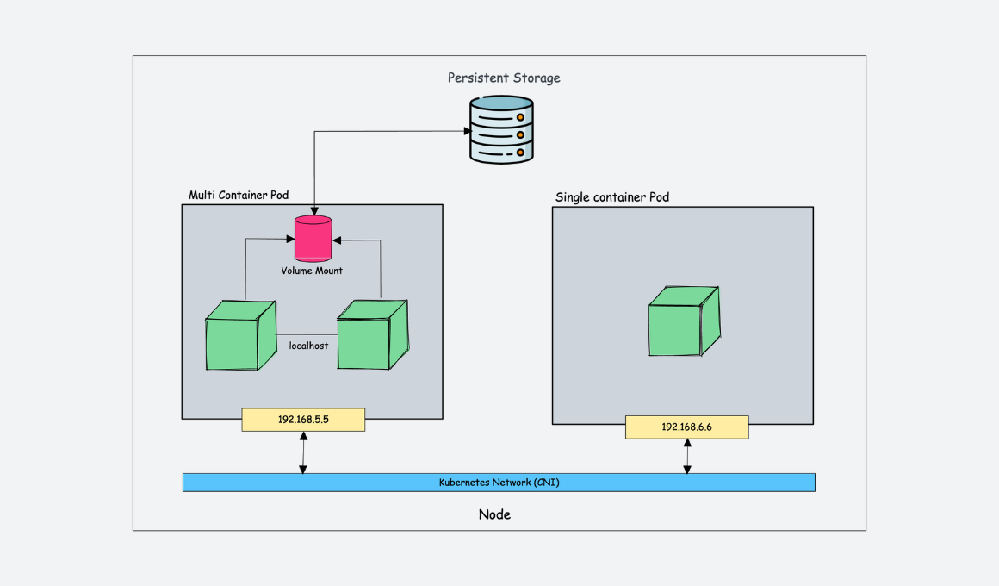
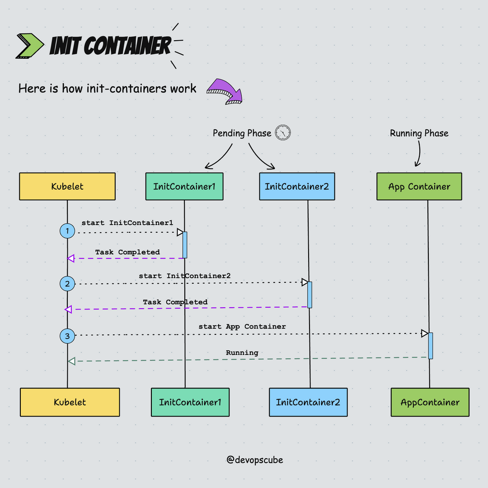
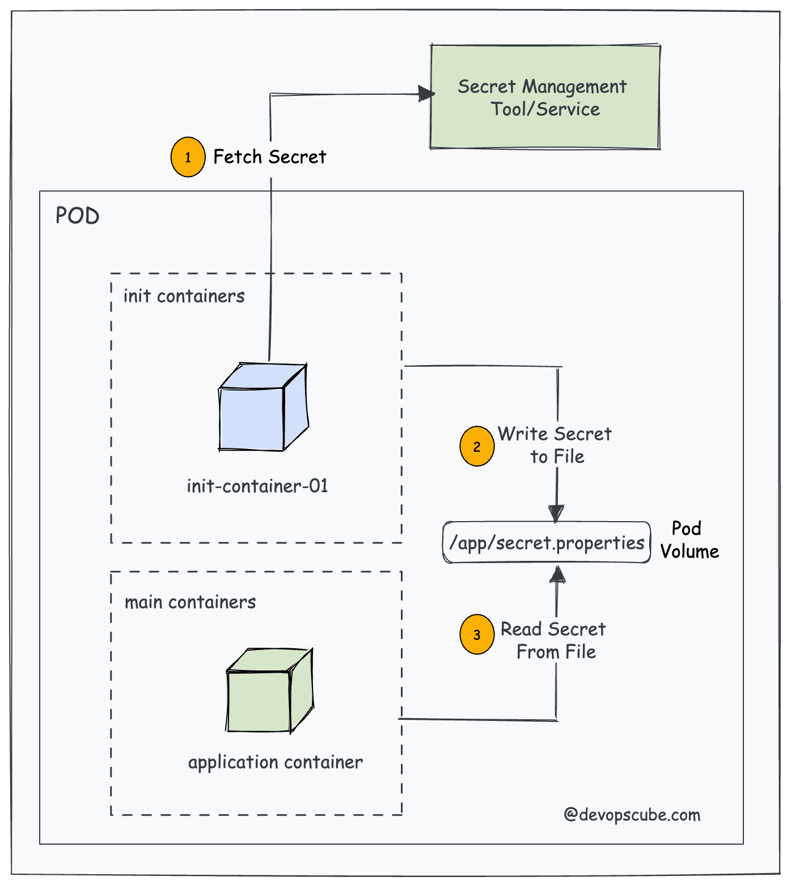
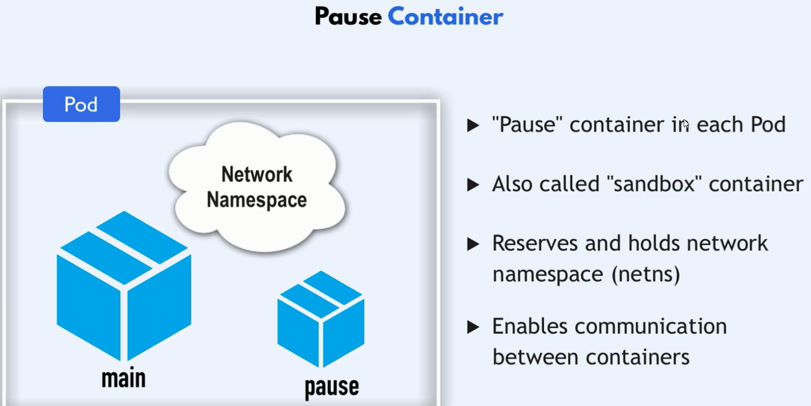

# Multi Container in Pod

A pod in Kubernetes can have multiple containers running within it, sharing the same network and storage. These containers are managed as a single entity, scheduled and running on the same node. They can be utilized to implement various patterns such as sidecar, adapter, and ambassador. Additionally Init Containers can be used to perform tasks before the main container starts.



## patterns

### 1. Sidecar Pattern

The sidecar pattern is a container that runs alongside the main application container, providing additional functionality. The sidecar container can be used for logging, monitoring, health checks, and other tasks that are not part of the main application. The sidecar container can be used to extend the functionality of the main application without modifying it.


#### Example

```yaml
# sidecar-pattern.yaml
apiVersion: v1
kind: Pod
metadata:
  name: backend
  namespace: default
spec:
  containers:
    - name: main-container
      image: nginx:1.20
      ports:
        - containerPort: 80
    - name: sidecar-container
      image: busybox:1.28
      command: ["sh", "-c", "while true; do echo sync app logs; sleep 20; done"]
```

```bash
# Apply the configuration
kubectl apply -f sidecar-pattern.yaml
# Check the status of the pod
kubectl get pods
# Check the logs of the sidecar container
kubectl logs backend -c sidecar-container
# Access the shell of the sidecar container
kubectl exec -it backend -c sidecar-container -- sh
```

### 2. Adapter Pattern

The adapter pattern is a container that acts as an interface between the main application container and the external world. The adapter container can be used to translate data formats, protocols, or APIs between the main application and external services. The adapter container can be used to integrate the main application with external services without modifying it.

### 3. Ambassador Pattern

The ambassador pattern is a container that acts as a proxy server or reverse proxy for the main application container. The ambassador container can be used to route traffic, load balance requests, or cache responses between the main application and external services. The ambassador container can be used to provide additional functionality to the main application without modifying it.

## Init Container

An init container is a container that runs before the main container in a pod. It can be used to perform tasks such as setting up environment variables, downloading configuration files, or waiting for other services to be ready. The init container runs to completion before the main container starts. If the init container fails, the pod will not start.





```yaml
apiVersion: v1
kind: Pod
metadata:
  name: init-container
spec:
    containers:
    - name: main-container
        image: nginx:1.20
        ports:
        - containerPort: 80
    initContainers:
    - name: init-container
        image: busybox:1.28
        command: ['sh', '-c', 'until nslookup my-db-service; do echo waiting for my-db-service; sleep 4; done']
```

## Pause Container

A **pause container** is a special, lightweight container used by Kubernetes to set up the shared network and IPC (Inter-Process Communication) namespaces for all the containers within a Pod. It acts as the "parent" container for all other containers in the Pod, providing the necessary infrastructure that allows them to share resources.



### Key Roles of the Pause Container

1. **Namespace Sharing**:

   - **Network Namespace**: The pause container creates and holds the network namespace that is shared by all other containers in the Pod. This allows the containers to communicate with each other over `localhost` and share the same IP address.
   - **IPC Namespace**: It also holds the IPC namespace, enabling containers to share inter-process communication mechanisms like semaphores, message queues, and shared memory.

2. **Lifecycle Management**:

   - The pause container is the first container to be started when a Pod is launched. It remains running for the entire lifespan of the Pod, even if other containers are restarted.
   - If the pause container stops for any reason, Kubernetes treats it as a signal to restart the entire Pod because the namespaces it manages would be lost.

3. **Resource Isolation**:
   - By acting as the root container for namespaces, the pause container ensures that all containers in the Pod can share resources like the network stack and IPC mechanisms while remaining isolated from containers in other Pods.

### How the Pause Container Works

When a Pod is created, the following sequence occurs:

1. **Pause Container Launch**: Kubernetes first launches the pause container, which sets up the network and IPC namespaces.
2. **Container Initialization**: After the pause container is running, Kubernetes launches the other containers defined in the Pod, all of which join the namespaces established by the pause container.
3. **Namespace Management**: The pause container remains idle, consuming minimal resources, but it holds the namespaces together. Other containers in the Pod can now communicate through the shared network namespace.

### Benefits of Using a Pause Container

1. **Namespace Lifecycle Management**: The pause container ensures that the network and IPC namespaces persist as long as the Pod exists, even if individual containers within the Pod are restarted.
2. **Simplified Networking**: By using a shared network namespace, containers within a Pod can easily communicate using `localhost`, simplifying the application design.
3. **Resource Efficiency**: The pause container is lightweight and consumes very few resources, making it an efficient way to manage shared resources within a Pod.

### Summary

- **Pause Container**: A lightweight container that creates and holds the shared network and IPC namespaces for all containers in a Pod.
- **Namespace Sharing**: Allows containers within a Pod to share the same IP address and communicate over `localhost`.
- **Lifecycle Management**: Ensures the namespaces persist throughout the lifecycle of the Pod.
- **Resource Efficiency**: Consumes minimal resources while managing the Pod's shared resources.

The pause container plays a crucial role in Kubernetes' Pod architecture, enabling efficient and seamless resource sharing between containers within the same Pod.
