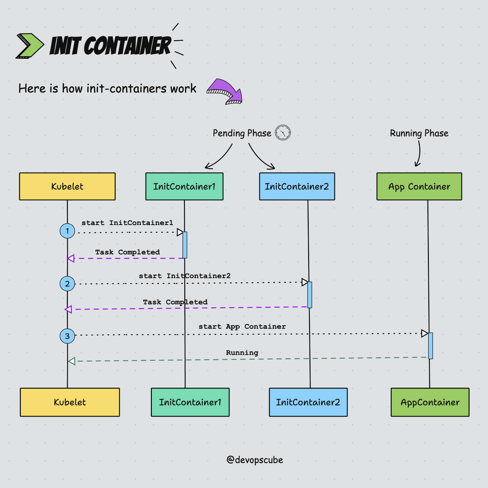
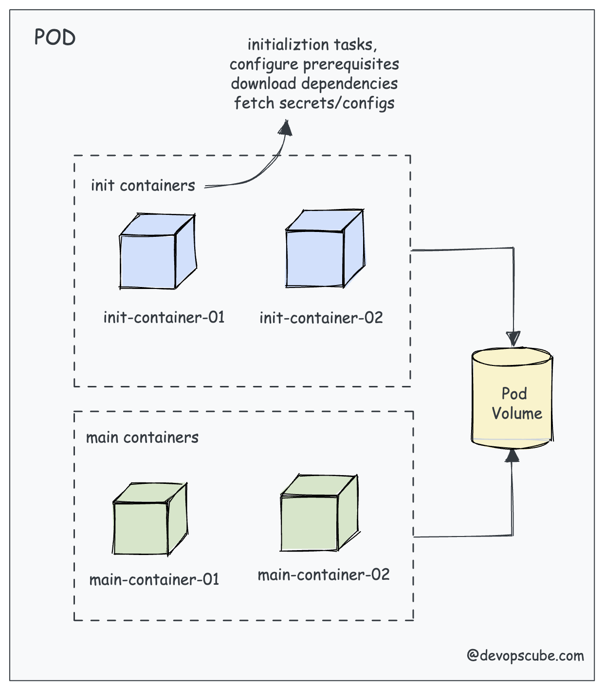
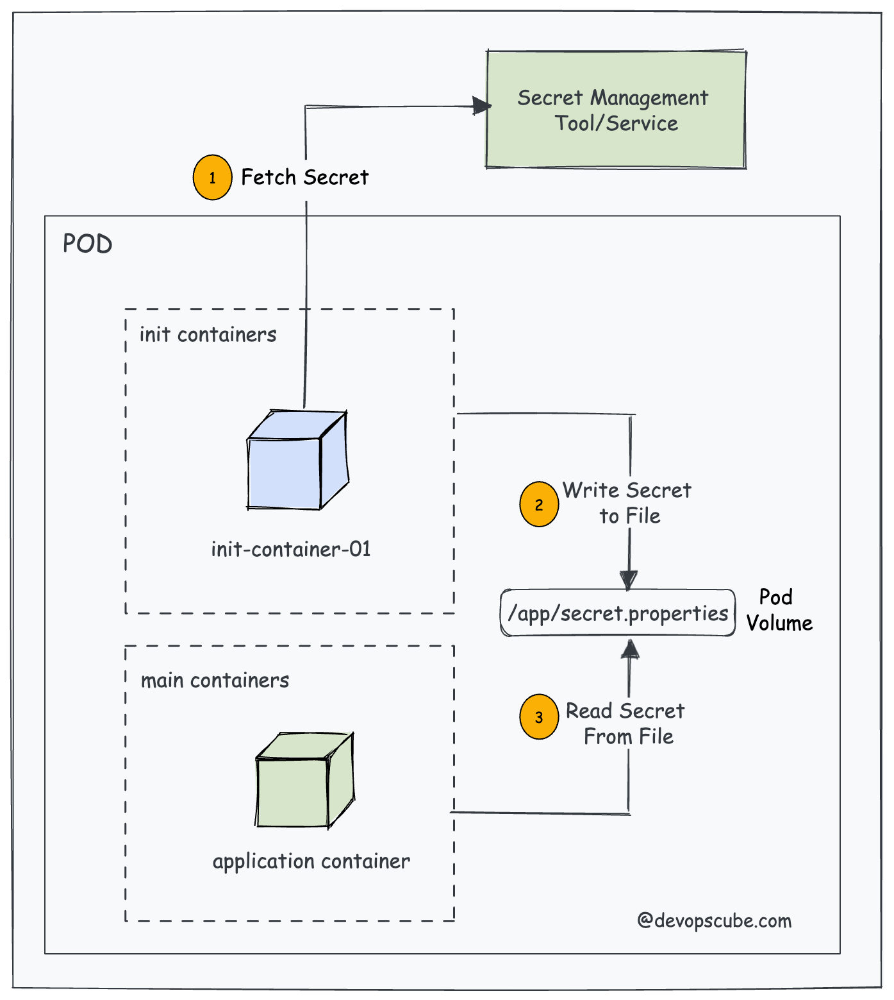

# Init Containers in Kubernetes



## Table of Contents

1. [What Are Init Containers?](#what-are-init-containers)
2. [How Init Containers Work](#how-init-containers-work)
3. [Differences Between Init Containers and Regular Containers](#differences-between-init-containers-and-regular-containers)
4. [Use Cases for Init Containers](#use-cases-for-init-containers)
5. [Example: Defining Init Containers in a Pod](#example-defining-init-containers-in-a-pod)
6. [Best Practices](#best-practices)
7. [Conclusion](#conclusion)

## What Are Init Containers?

**Init Containers** are specialized containers that run **before** the main application containers in a Kubernetes Pod. They perform initialization tasks that must be completed successfully before the Pod’s main containers start running.

### Key Characteristics

- **Sequential Execution**: Init Containers run one after another in the order they are defined.
- **Isolation**: They can have different configurations, images, and permissions compared to the main containers.
- **Failure Handling**: If any Init Container fails, Kubernetes will retry running it until it succeeds, preventing the main containers from starting.
- **Ephemeral**: Once an Init Container completes successfully, it is terminated and removed; it does not restart like regular containers.

## How Init Containers Work

1. **Pod Creation**: When a Pod is created, Kubernetes first initializes all defined Init Containers sequentially.
2. **Execution Order**: Init Containers run in the order they are specified. The next Init Container starts only after the previous one has successfully completed.
3. **Completion**: After all Init Containers have run successfully, Kubernetes proceeds to start the main application containers.
4. **Failure Handling**: If an Init Container fails (exits with a non-zero status), Kubernetes restarts the entire Pod (depending on the Pod’s restart policy) and retries the Init Container.

## Differences Between Init Containers and Regular Containers

| Feature                     | Init Containers                                         | Regular Containers                               |
| --------------------------- | ------------------------------------------------------- | ------------------------------------------------ |
| **Purpose**                 | Perform initialization tasks                            | Run the main application                         |
| **Execution Order**         | Sequential before main containers                       | Run after Init Containers have completed         |
| **Restart Behavior**        | Retries until success; block main containers on failure | Restart based on Pod’s restart policy            |
| **Image and Configuration** | Can use different images and configurations             | Typically use images tailored to the application |
| **Lifecycle**               | Ephemeral; terminated after successful completion       | Persistent for the lifetime of the Pod           |
| **Access to Resources**     | Can request different resources or permissions          | Use resources defined for the Pod                |

## Use Cases for Init Containers

Init Containers are versatile and can be used in various scenarios to prepare the environment for the main application containers. Here are some common use cases:




1. **Dependency Initialization**:

   - Ensure that dependent services or configurations are available before starting the main application.

2. **Configuration Management**:

   - Fetch configuration files or secrets from external sources and place them in shared volumes.

3. **Database Migrations**:

   - Run database migration scripts before the application starts to ensure the database schema is up-to-date.

4. **Security Checks**:

   - Perform security scans or validate certificates before allowing the main application to run.

5. **Setting Up Filesystem or Environment**:
   - Prepare the filesystem, set permissions, or generate necessary environment variables.

## Example: Defining Init Containers in a Pod

Below is an example of a Kubernetes Pod specification that includes an Init Container. This Pod uses an Init Container to perform a simple setup task before the main application container starts.

```yaml
apiVersion: v1
kind: Pod
metadata:
  name: example-pod
spec:
  initContainers:
    - name: init-myservice
      image: busybox
      command: ["sh", "-c", "echo Initializing... && sleep 2"]
      volumeMounts:
        - name: shared-data
          mountPath: /data
  containers:
    - name: myapp-container
      image: myapp:1.0
      ports:
        - containerPort: 80
      volumeMounts:
        - name: shared-data
          mountPath: /app/data
  volumes:
    - name: shared-data
      emptyDir: {}
```

### Breakdown of the Example

- **Init Container (`init-myservice`)**:

  - **Image**: Uses the `busybox` image for lightweight tasks.
  - **Command**: Executes a shell command that prints a message and sleeps for 2 seconds, simulating an initialization task.
  - **Volume Mount**: Mounts a shared volume (`shared-data`) to `/data` for sharing data between the Init Container and the main container.

- **Main Container (`myapp-container`)**:

  - **Image**: Uses `myapp:1.0` as the main application.
  - **Ports**: Exposes port 80.
  - **Volume Mount**: Mounts the same shared volume (`shared-data`) to `/app/data`, allowing access to any data prepared by the Init Container.

- **Volume (`shared-data`)**:
  - **Type**: `emptyDir`, which creates a temporary directory shared between Init and main containers.

### How It Works

1. **Init Container Execution**:

   - Runs the `init-myservice` container.
   - Executes the command, prints "Initializing...", and sleeps for 2 seconds.
   - Completes successfully, allowing the main container to start.

2. **Main Container Execution**:
   - Starts the `myapp-container`.
   - Accesses any data prepared by the Init Container via the shared volume.

## Best Practices

To maximize the effectiveness of Init Containers, consider the following best practices:

1. **Use Lightweight Images**:

   - Choose minimal images (like `busybox` or `alpine`) for Init Containers to reduce resource usage and improve startup times.

2. **Define Clear Responsibilities**:

   - Assign specific initialization tasks to Init Containers to maintain modularity and clarity in your Pod specifications.

3. **Leverage Shared Volumes**:

   - Utilize shared volumes (`emptyDir`, `hostPath`, etc.) to pass data between Init Containers and main containers efficiently.

4. **Handle Failures Gracefully**:

   - Ensure that Init Containers exit with meaningful error messages to facilitate troubleshooting in case of failures.

5. **Minimize Dependencies**:

   - Avoid creating tight dependencies between Init Containers and external services unless necessary. This reduces complexity and potential points of failure.

6. **Optimize Init Container Performance**:

   - Keep Init Containers as fast as possible to minimize the delay in starting the main application.

7. **Security Considerations**:
   - Run Init Containers with least privilege necessary, especially if they interact with sensitive data or perform critical setup tasks.

## Conclusion

**Init Containers** are an invaluable tool in Kubernetes for handling preconditions and setup tasks that must be completed before the main application containers run. They offer a way to modularize initialization logic, ensuring that your applications start in a consistent and reliable state.

By leveraging Init Containers effectively, you can:

- **Enhance Reliability**: Ensure that necessary conditions are met before application startup.
- **Improve Modularity**: Separate initialization logic from application logic for cleaner configurations.
- **Increase Flexibility**: Adapt to complex initialization scenarios with ease.

Integrate Init Containers into your Kubernetes Pods to build more robust and maintainable applications.
