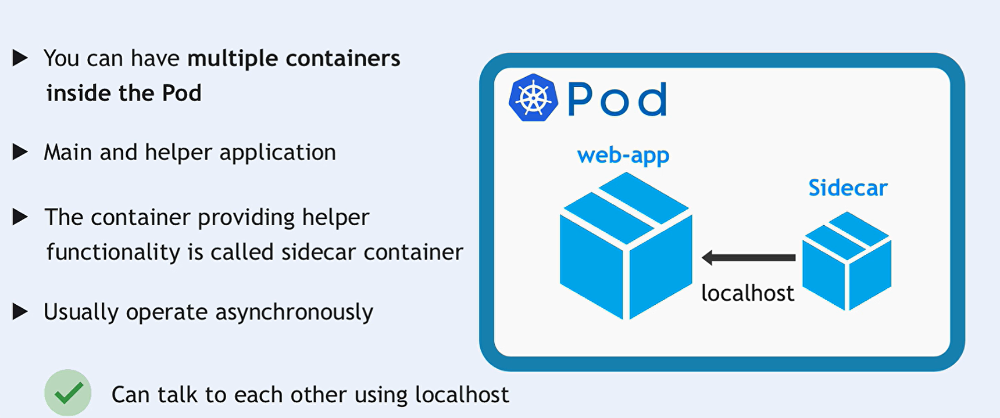

# Multi-Container Deployments in Kubernetes

Managing multiple containers within a single Kubernetes Deployment enables the implementation of various design patterns that enhance the functionality, scalability, and maintainability of your applications. This guide explores **Multi-Container Deployments**, focusing on common patterns like **Sidecar**, **Adapter**, and **Ambassador**, accompanied by practical Deployment examples.


## Table of Contents

1. [Introduction to Multi-Container Deployments](#introduction-to-multi-container-deployments)
2. [Common Multi-Container Patterns](#common-multi-container-patterns)
   - [Sidecar Pattern](#sidecar-pattern)
   - [Adapter Pattern](#adapter-pattern)
   - [Ambassador Pattern](#ambassador-pattern)
3. [Examples of Each Pattern](#examples-of-each-pattern)
   - [Sidecar Deployment Example](#sidecar-deployment-example)
   - [Adapter Deployment Example](#adapter-deployment-example)
   - [Ambassador Deployment Example](#ambassador-deployment-example)
4. [Best Practices](#best-practices)
5. [Conclusion](#conclusion)

## Introduction to Multi-Container Deployments

In Kubernetes, a **Deployment** manages a set of identical Pods, ensuring that the desired number of Pods are running and updated as specified. By incorporating multiple containers within these Pods, you can implement patterns that promote modularity, separation of concerns, and efficient resource utilization.

### Why Use Multi-Container Deployments?

- **Modularity**: Break down complex applications into smaller, manageable components.
- **Separation of Concerns**: Isolate different functionalities (e.g., logging, monitoring) from the main application logic.
- **Efficiency**: Reduce resource overhead by sharing the same network and storage resources.
- **Scalability**: Leverage Kubernetes’ scaling capabilities to manage multi-container applications seamlessly.

## Common Multi-Container Patterns

Kubernetes supports several design patterns for organizing multiple containers within a Deployment. The most prevalent patterns include:

### Sidecar Pattern

**Sidecar Containers** extend or enhance the functionality of the main application container. They run alongside the main container, providing supplementary services such as logging, monitoring, proxying, or configuration updates.



#### Characteristics:

- **Extension**: Adds additional capabilities without modifying the main application.
- **Coupled Lifecycle**: Shares the same lifecycle as the main container.
- **Communication**: Communicates with the main container via shared volumes or `localhost`.

### Adapter Pattern

**Adapter Containers** transform or adapt data between different services or components within the Pod. They act as translators, ensuring compatibility between disparate systems.

#### Characteristics:

- **Data Transformation**: Modifies data formats or protocols to match the needs of different containers.
- **Isolation**: Encapsulates the transformation logic, keeping the main application clean.
- **Flexibility**: Allows integration with various external systems without altering the main application code.

### Ambassador Pattern

**Ambassador Containers** act as proxies or intermediaries between the main application and external services. They handle tasks such as routing, load balancing, authentication, or API gateway functionalities.

#### Characteristics:

- **Proxy Functionality**: Manages communication between the Pod and external networks.
- **Decoupling**: Separates network concerns from the main application logic.
- **Scalability**: Facilitates easy scaling and management of external interactions.

## Examples of Each Pattern

To illustrate these patterns, let's explore practical Kubernetes Deployment configurations for each.

### Sidecar Deployment Example

**Use Case**: Collecting and forwarding logs from the main application to a centralized logging service.

```yaml
apiVersion: apps/v1
kind: Deployment
metadata:
  name: sidecar-deployment
spec:
  replicas: 3
  selector:
    matchLabels:
      app: sidecar-example
  template:
    metadata:
      labels:
        app: sidecar-example
    spec:
      containers:
        - name: main-app
          image: myapp:latest
          ports:
            - containerPort: 8080
          volumeMounts:
            - name: log-volume
              mountPath: /var/log/myapp
        - name: log-collector
          image: fluentd:latest
          args: ["fluentd", "-c", "/fluentd/etc/fluent.conf"]
          volumeMounts:
            - name: log-volume
              mountPath: /var/log/myapp
      volumes:
        - name: log-volume
          emptyDir: {}
```

**Explanation**:

- **Deployment (`sidecar-deployment`)**: Manages three replicas of the Pod.
- **Main Container (`main-app`)**:
  - Runs the primary application.
  - Writes logs to `/var/log/myapp` on a shared volume.
- **Sidecar Container (`log-collector`)**:
  - Runs Fluentd to collect and forward logs from the shared volume to a logging service.
- **Shared Volume (`log-volume`)**:
  - An `emptyDir` volume that both containers mount, enabling log sharing.

### Adapter Deployment Example

**Use Case**: Converting messages from a proprietary format to JSON before processing by the main application.

```yaml
apiVersion: apps/v1
kind: Deployment
metadata:
  name: adapter-deployment
spec:
  replicas: 2
  selector:
    matchLabels:
      app: adapter-example
  template:
    metadata:
      labels:
        app: adapter-example
    spec:
      containers:
        - name: main-app
          image: myapp:latest
          ports:
            - containerPort: 8080
        - name: message-adapter
          image: custom-adapter:latest
          command: ["./adapter"]
          ports:
            - containerPort: 9090
          env:
            - name: MAIN_APP_URL
              value: "http://localhost:8080"
```

**Explanation**:

- **Deployment (`adapter-deployment`)**: Manages two replicas of the Pod.
- **Main Container (`main-app`)**:
  - Processes messages in JSON format.
  - Exposes port `8080`.
- **Adapter Container (`message-adapter`)**:
  - Listens on port `9090` for incoming proprietary messages.
  - Converts messages to JSON and forwards them to the main application via `http://localhost:8080`.
- **Environment Variable (`MAIN_APP_URL`)**:
  - Specifies the URL of the main application for the adapter to forward transformed messages.

### Ambassador Deployment Example

**Use Case**: Managing external API requests, handling authentication, and routing to the main application.

```yaml
apiVersion: apps/v1
kind: Deployment
metadata:
  name: ambassador-deployment
spec:
  replicas: 3
  selector:
    matchLabels:
      app: ambassador-example
  template:
    metadata:
      labels:
        app: ambassador-example
    spec:
      containers:
        - name: main-app
          image: myapp:latest
          ports:
            - containerPort: 8080
        - name: ambassador
          image: ambassador:latest
          ports:
            - containerPort: 80
          args:
            - "--service=myapp:8080"
          env:
            - name: AMBASSADOR_ENV
              value: "production"
```

**Explanation**:

- **Deployment (`ambassador-deployment`)**: Manages three replicas of the Pod.
- **Main Container (`main-app`)**:
  - Hosts the primary application on port `8080`.
- **Ambassador Container (`ambassador`)**:
  - Listens on port `80` for incoming API requests.
  - Handles authentication and routes valid requests to the main application (`myapp:8080`).
- **Environment Variable (`AMBASSADOR_ENV`)**:
  - Specifies the environment configuration for the Ambassador proxy.

## Best Practices

When designing multi-container Deployments, consider the following best practices to ensure efficiency, maintainability, and scalability:

1. **Clear Separation of Concerns**:

   - Assign distinct responsibilities to each container to promote modularity and ease of maintenance.

2. **Use Lightweight Images**:

   - Choose minimal images (like `busybox`, `alpine`, or lightweight proxies) for auxiliary containers to reduce resource consumption and improve startup times.

3. **Leverage Shared Volumes for Data Exchange**:

   - Utilize shared volumes (`emptyDir`, `hostPath`, etc.) for efficient data sharing between containers.

4. **Proper Lifecycle Management**:

   - Ensure that auxiliary containers (e.g., sidecars) handle graceful shutdowns and restarts to maintain Pod stability.

5. **Security Considerations**:

   - Implement least privilege principles by restricting container permissions and access to sensitive data.
   - Use Kubernetes [Security Contexts](https://kubernetes.io/docs/tasks/configure-pod-container/security-context/) to define security attributes for each container.

6. **Monitoring and Logging**:

   - Monitor the health and performance of all containers within the Deployment.
   - Centralize logging to facilitate troubleshooting and analysis.

7. **Consistent Configuration Management**:

   - Use ConfigMaps and Secrets to manage configuration data and sensitive information across containers.

8. **Scalability**:

   - Design Deployments to handle scaling appropriately, ensuring that auxiliary containers scale alongside the main application.

9. **Resource Allocation**:

   - Define resource requests and limits for each container to ensure optimal performance and prevent resource contention.

   ```yaml
   resources:
     requests:
       memory: "64Mi"
       cpu: "250m"
     limits:
       memory: "128Mi"
       cpu: "500m"
   ```

10. **Version Compatibility**:
    - Ensure that all containers within a Pod are compatible in terms of networking, data formats, and communication protocols.

## Conclusion

**Multi-Container Deployments** in Kubernetes offer a robust framework for building scalable, maintainable, and efficient applications by leveraging patterns like **Sidecar**, **Adapter**, and **Ambassador**. By thoughtfully implementing these patterns within Deployments, you can enhance your application's capabilities, streamline operations, and ensure seamless collaboration between different components.

Adopting these patterns promotes best practices in Kubernetes application design, ensuring that each container serves a clear purpose and contributes to the overall functionality and reliability of your deployments.
