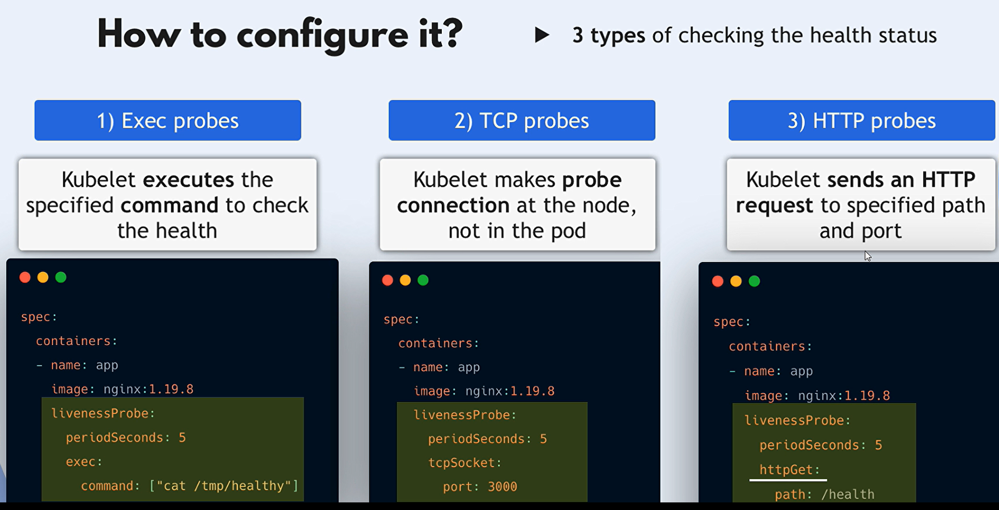

# Kubernetes Probes: Readiness and Liveness Probes

## Table of Contents

1. [Introduction](#introduction)
2. [Understanding Probes](#understanding-probes)
   - [What Are Probes?](#what-are-probes)
   - [Types of Probes](#types-of-probes)
3. [Readiness Probes](#readiness-probes)
   - [Purpose](#purpose-1)
   - [How Readiness Probes Work](#how-readiness-probes-work)
   - [Example: Configuring a Readiness Probe](#example-configuring-a-readiness-probe)
4. [Liveness Probes](#liveness-probes)
   - [Purpose](#purpose)
   - [How Liveness Probes Work](#how-liveness-probes-work)
   - [Example: Configuring a Liveness Probe](#example-configuring-a-liveness-probe)
5. [Differences Between Readiness and Liveness Probes](#differences-between-readiness-and-liveness-probes)
6. [Best Practices](#best-practices)
7. [Common Pitfalls](#common-pitfalls)
8. [Conclusion](#conclusion)

## Introduction

In Kubernetes, **Probes** are diagnostic tools that Kubernetes uses to check the health and status of containers within Pods. Specifically, **Liveness Probes** determine if a container is running, while **Readiness Probes** determine if a container is ready to handle requests. Properly configuring these probes ensures that your applications are both reliable and resilient.

## Understanding Probes

### What Are Probes?

Probes are periodic checks performed by the Kubernetes **kubelet** on containers to assess their health and readiness. Based on the probe results, Kubernetes can take actions such as restarting containers or removing them from service endpoints.

### Types of Probes

Kubernetes supports three types of probes:

1. **HTTP Probe**: Sends an HTTP request to a specified endpoint and checks for a successful response (status code 200-399).
2. **TCP Probe**: Attempts to establish a TCP connection on a specified port.
3. **Exec Probe**: Executes a specified command inside the container and checks for a successful exit status (0).

## Readiness Probes

### Purpose

**Readiness Probes** determine if a container is ready to handle traffic. If a readiness probe fails, Kubernetes removes the Pod from the Service endpoints, preventing it from receiving new traffic. This is useful during startup, shutdown, or when the application is temporarily unable to serve requests.

### How Readiness Probes Work

- **Configuration**: Defined within the Pod specification.
- **Execution**: Periodically checks the container's readiness based on the probe type.
- **Failure Handling**: On failure, Kubernetes stops routing traffic to the Pod but does not restart it.

### Example: Configuring a Readiness Probe

Here's how to configure a **TCP Readiness Probe** for a container:

```yaml
apiVersion: apps/v1
kind: Deployment
metadata:
  name: db-deployment
spec:
  replicas: 2
  selector:
    matchLabels:
      app: database
  template:
    metadata:
      labels:
        app: database
    spec:
      containers:
        - name: db-container
          image: mydatabase:latest
          ports:
            - containerPort: 5432
          readinessProbe:
            tcpSocket:
              port: 5432
            initialDelaySeconds: 10
            periodSeconds: 15
            failureThreshold: 2
```

**Explanation**:

- **`tcpSocket`**: Kubernetes attempts to establish a TCP connection on port `5432`.
- **`initialDelaySeconds`**: Waits 10 seconds before performing the first probe.
- **`periodSeconds`**: Performs the probe every 15 seconds.
- **`failureThreshold`**: After 2 consecutive failures, Kubernetes marks the Pod as not ready.

## Liveness Probes

### Purpose

**Liveness Probes** determine if a container is still running. If a liveness probe fails, Kubernetes assumes the container is unhealthy and restarts it. This helps in recovering from situations where an application is running but unable to make progress (e.g., deadlocks).

### How Liveness Probes Work

- **Configuration**: Defined within the Pod specification.
- **Execution**: Periodically checks the container's state based on the probe type.
- **Failure Handling**: On failure, Kubernetes restarts the container based on the Pod's restart policy.

### Example: Configuring a Liveness Probe

Here's how to configure a **HTTP Liveness Probe** for a container running a web application:

```yaml
apiVersion: apps/v1
kind: Deployment
metadata:
  name: webapp-deployment
spec:
  replicas: 3
  selector:
    matchLabels:
      app: webapp
  template:
    metadata:
      labels:
        app: webapp
    spec:
      containers:
        - name: webapp-container
          image: mywebapp:latest
          ports:
            - containerPort: 8080
          livenessProbe:
            httpGet:
              path: /healthz
              port: 8080
            initialDelaySeconds: 15
            periodSeconds: 20
            failureThreshold: 3
```

**Explanation**:

- **`httpGet`**: Kubernetes sends an HTTP GET request to `/healthz` on port `8080`.
- **`initialDelaySeconds`**: Waits 15 seconds before performing the first probe.
- **`periodSeconds`**: Performs the probe every 20 seconds.
- **`failureThreshold`**: After 3 consecutive failures, Kubernetes restarts the container.

## Differences Between Readiness and Liveness Probes

| Feature                   | **Readiness Probe**                                       | **Liveness Probe**                                     |
| ------------------------- | --------------------------------------------------------- | ------------------------------------------------------ |
| **Purpose**               | Indicates if a Pod is ready to receive traffic            | Indicates if a Pod is alive and should be restarted    |
| **Effect of Failure**     | Pod is removed from Service endpoints                     | Pod is restarted                                       |
| **Use Cases**             | - Application initialization<br>- Temporary outages       | - Detecting deadlocks<br>- Recovering from crashes     |
| **Lifecycle Impact**      | Does not affect the Pod's lifecycle                       | Can trigger Pod restarts                               |
| **Typical Configuration** | Checks application readiness (e.g., database connections) | Checks overall container health (e.g., responsiveness) |

**Summary**:

- **Readiness Probes** manage whether a Pod should receive traffic.
- **Liveness Probes** manage whether a Pod should continue running.

## Health Checks



### 1. **HTTP Health Check**

This type of probe checks the health of the application by sending an HTTP GET request to a specific endpoint.

```yaml
readinessProbe:
  httpGet:
    path: /healthz
    port: 8080
  initialDelaySeconds: 5
  periodSeconds: 10

livenessProbe:
  httpGet:
    path: /healthz
    port: 8080
  initialDelaySeconds: 10
  periodSeconds: 15
```

- **`httpGet`**: The probe sends an HTTP GET request to the `/healthz` endpoint on port 8080.
- **Readiness Probe**: Starts after 5 seconds and runs every 10 seconds.
- **Liveness Probe**: Starts after 10 seconds and runs every 15 seconds.

### 2. **TCP Socket Health Check**

This probe checks the health by attempting to establish a TCP connection to a specific port.

```yaml
readinessProbe:
  tcpSocket:
    port: 3306
  initialDelaySeconds: 10
  periodSeconds: 20

livenessProbe:
  tcpSocket:
    port: 3306
  initialDelaySeconds: 15
  periodSeconds: 30
```

- **`tcpSocket`**: The probe checks if it can establish a TCP connection to port 3306 (often used by MySQL).
- **Readiness Probe**: Starts after 10 seconds and runs every 20 seconds.
- **Liveness Probe**: Starts after 15 seconds and runs every 30 seconds.

### 3. **Command-Based Health Check**

This probe executes a command inside the container to determine its health.

```yaml
readinessProbe:
  exec:
    command:
      - cat
      - /tmp/ready
  initialDelaySeconds: 5
  periodSeconds: 10

livenessProbe:
  exec:
    command:
      - cat
      - /tmp/live
  initialDelaySeconds: 15
  periodSeconds: 20
```

- **`exec`**: The probe runs the `cat /tmp/ready` command for readiness and `cat /tmp/live` for liveness.
- **Readiness Probe**: Checks if the file `/tmp/ready` exists and is readable after 5 seconds, and then every 10 seconds.
- **Liveness Probe**: Checks if the file `/tmp/live` exists and is readable after 15 seconds, and then every 20 seconds.

### Summary:

1. **HTTP Health Check**: Validates that a specific HTTP endpoint is accessible and returns a successful status code.
2. **TCP Socket Health Check**: Verifies that the application can accept TCP connections on a specific port.
3. **Command-Based Health Check**: Executes a command within the container to check for the existence or state of specific files or processes.

## Best Practices

1. **Set Appropriate `initialDelaySeconds`**:

   - Ensure that probes start after the application has had sufficient time to initialize.

2. **Choose the Right Probe Type**:

   - Use **HTTP Probes** for web applications.
   - Use **TCP Probes** for services listening on specific ports.
   - Use **Exec Probes** for custom health checks.

3. **Configure Timeouts and Thresholds Wisely**:

   - Balance between sensitivity and avoiding unnecessary restarts or traffic blacklisting.

4. **Monitor Probe Failures**:

   - Regularly check probe metrics and logs to identify and resolve underlying issues.

5. **Combine Probes for Comprehensive Health Checks**:

   - Use both Readiness and Liveness Probes to manage traffic routing and container lifecycle effectively.

6. **Avoid Heavy Operations in Exec Probes**:

   - Ensure that commands run in Exec Probes are lightweight to prevent probe delays.

7. **Secure Probe Endpoints**:
   - Ensure that HTTP endpoints used for probes are secured and do not expose sensitive information.

## Common Pitfalls

1. **Too Short `initialDelaySeconds`**:

   - Probes may fail if the application hasn't fully started, leading to unnecessary restarts or traffic removal.

2. **Inappropriate Probe Types**:

   - Using TCP Probes for applications that require HTTP-based health checks can miss critical application-level issues.

3. **Overly Aggressive Failure Thresholds**:

   - Setting too low thresholds can cause Pods to restart or be marked unready for transient issues.

4. **Ignoring Probe Results**:

   - Not monitoring probe outcomes can leave issues undetected, affecting application reliability.

5. **Resource Intensive Exec Probes**:
   - Heavy commands can delay probe responses, leading to false negatives.

## Conclusion

**Readiness** and **Liveness Probes** are indispensable tools in Kubernetes for maintaining the health and availability of your applications. By effectively configuring these probes, you can ensure that your Pods are only serving traffic when they're ready and that any unhealthy containers are promptly restarted to maintain overall system reliability.

- **Readiness Probes** control traffic routing based on Pod readiness.
- **Liveness Probes** ensure that unresponsive or crashed Pods are detected and restarted.
