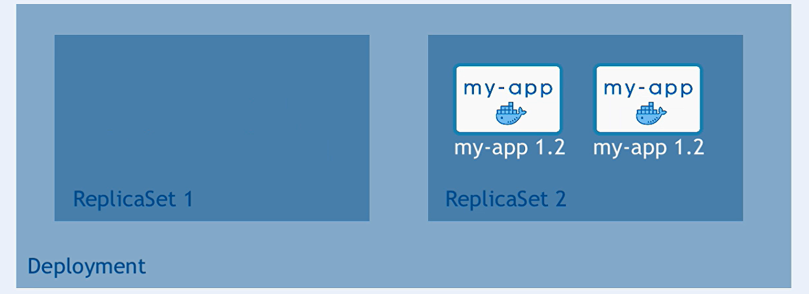
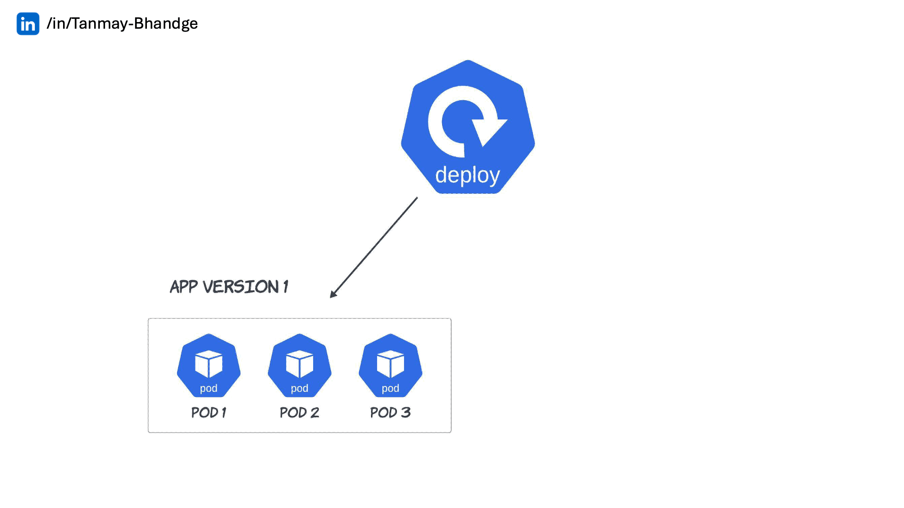

# Application Update Version Strategies in Kubernetes: Rolling Updates

## Table of Contents

1. [Introduction](#introduction)
2. [Understanding Application Update Strategies](#understanding-application-update-strategies)
   - [What Are Update Strategies?](#what-are-update-strategies)
   - [Common Update Strategies in Kubernetes](#common-update-strategies-in-kubernetes)
3. [Rolling Update Strategy](#rolling-update-strategy)
   - [What Is a Rolling Update?](#what-is-a-rolling-update)
   - [How Rolling Updates Work in Kubernetes](#how-rolling-updates-work-in-kubernetes)
   - [Advantages of Rolling Updates](#advantages-of-rolling-updates)
4. [Implementing Rolling Updates](#implementing-rolling-updates)
   - [Configuring Rolling Updates in a Deployment](#configuring-rolling-updates-in-a-deployment)
   - [Example: Rolling Update with Deployment](#example-rolling-update-with-deployment)
   - [Monitoring Rolling Updates](#monitoring-rolling-updates)
5. [Best Practices for Rolling Updates](#best-practices-for-rolling-updates)
6. [Alternative Update Strategies](#alternative-update-strategies)
   - [Recreate Strategy](#recreate-strategy)
   - [Blue-Green Deployment](#blue-green-deployment)
   - [Canary Deployment](#canary-deployment)
7. [Conclusion](#conclusion)

## Introduction

In the dynamic landscape of software development, deploying updates to applications without disrupting service is paramount. Kubernetes, a leading container orchestration platform, offers various strategies to manage application updates efficiently. Understanding these strategies, especially **Rolling Updates**, empowers DevOps teams to maintain application stability, ensure high availability, and provide a seamless user experience during deployments.



## Understanding Application Update Strategies

### What Are Update Strategies?

**Update Strategies** in Kubernetes define how updates to applications (typically managed by Deployments) are rolled out to the cluster. They determine the manner and pace at which new versions of applications replace old ones, balancing the need for swift deployments with the requirement for application availability and reliability.

### Common Update Strategies in Kubernetes

1. **Rolling Update**
2. **Recreate**
3. **Blue-Green Deployment**
4. **Canary Deployment**

This guide focuses primarily on the **Rolling Update** strategy, the default and most commonly used method in Kubernetes.

## Rolling Update Strategy


### What Is a Rolling Update?

A **Rolling Update** is a deployment strategy that incrementally updates Pods instances with new versions of an application without downtime. It ensures that some instances of the application remain available during the update process, providing a smooth transition from the old version to the new one.

### How Rolling Updates Work in Kubernetes

Kubernetes manages Rolling Updates through the **Deployment** resource. Here's a step-by-step breakdown:

1. **Initiate Update**: A new version of the application is specified in the Deployment's Pod template.
2. **Calculate Changes**: Kubernetes determines the difference between the current and desired state.
3. **Incremental Replacement**:
   - **Create New Pods**: New Pods with the updated version are created.
   - **Gradual Scaling**: The number of new Pods is gradually increased while old Pods are decreased.
4. **Maintain Availability**: Kubernetes ensures that a minimum number of Pods remain available during the update, preventing service disruption.
5. **Completion**: Once all old Pods are replaced with new ones, the update is complete.

### Advantages of Rolling Updates

- **Zero Downtime**: Maintains application availability throughout the update process.
- **Gradual Transition**: Allows for monitoring and rollback if issues arise during the update.
- **Resource Efficiency**: Utilizes existing infrastructure without the need for duplicate environments.

## Rollout Commands

### Creating a Deployment

Start by creating a simple deployment. In this example, we create an `nginx` deployment using the `nginx:1.16` image.

**Command:**

```bash
kubectl create deployment nginx --image=nginx:1.16
```

**Output:**

```ini
deployment.apps/nginx created
```

---

### Checking Rollout Status

After creating the deployment, monitor its rollout status to ensure that the desired number of replicas are up and running.

**Command:**

```bash
kubectl rollout status deployment nginx
```

**Output:**

```ini
Waiting for deployment "nginx" rollout to finish: 0 of 1 updated replicas are available...
deployment "nginx" successfully rolled out
```

---

### Viewing Rollout History

Inspect the rollout history of a deployment to see the different revisions.

**Command:**

```bash
kubectl rollout history deployment nginx
```

**Output:**

```ini
deployment.apps/nginx
REVISION  CHANGE-CAUSE
1         <none>
```

---

### Using the `--revision` Flag

Each deployment revision is numbered sequentially. View the details of a specific revision using the `--revision` flag.

**Example: Viewing Revision 1**

**Command:**

```bash
kubectl rollout history deployment nginx --revision=1
```

**Output:**

```ini
deployment.apps/nginx with revision #1
Pod Template:
  Labels:       app=nginx
  pod-template-hash=78449c65d4
  Containers:
    nginx:
      Image:      nginx:1.16
      Port:       <none>
      Host Port:  <none>
      Environment: <none>
      Mounts:      <none>
  Volumes:
```

---

### Using the `--record` Flag

The `--record` flag records the command that was used to create or update a deployment, which is useful for tracking changes over time.

> **Note:** The `--record` flag is deprecated and will be removed in future releases. It's recommended to use annotations or other methods to track changes.

**Example: Updating Deployment with `--record`**

**Command:**

```bash
kubectl set image deployment nginx nginx=nginx:1.17 --record
```

**Output:**

```ini
Flag --record has been deprecated, --record will be removed in the future
deployment.apps/nginx image updated
```

**Viewing Updated Rollout History**

**Command:**

```bash
kubectl rollout history deployment nginx
```

**Output:**

```ini
deployment.apps/nginx
REVISION  CHANGE-CAUSE
1         <none>
2         kubectl set image deployment nginx nginx=nginx:1.17 --record=true
```

---

### Making Further Changes

Continue updating the deployment to create new revisions. For example, changing the image from `nginx:1.17` to `nginx:latest`.

**Example: Editing Deployment to Use `nginx:latest`**

**Command:**

```bash
kubectl edit deployments.apps nginx --record
```

**Output:**

```ini
Flag --record has been deprecated, --record will be removed in the future
deployment.apps/nginx edited
```

**Updated Rollout History**

**Command:**

```bash
kubectl rollout history deployment nginx
```

**Output:**

```ini
deployment.apps/nginx
REVISION  CHANGE-CAUSE
1         <none>
2         kubectl set image deployment nginx nginx=nginx:1.17 --record=true
3         kubectl edit deployments.apps nginx --record=true
```

**Viewing Revision 3 Details**

**Command:**

```bash
kubectl rollout history deployment nginx --revision=3
```

**Output:**

```ini
deployment.apps/nginx with revision #3
Pod Template:
  Labels:       app=nginx
  pod-template-hash=787f54657b
  Annotations:  kubernetes.io/change-cause: kubectl edit deployments.apps nginx --record=true
  Containers:
    nginx:
      Image:      nginx
      Port:       <none>
      Host Port:  <none>
      Environment: <none>
      Mounts:      <none>
  Volumes:
```

---

### Undoing a Change

If you need to rollback to a previous revision, use the `rollout undo` command with the `--to-revision` flag.

**Viewing Rollout History Before Rollback**

**Command:**

```bash
kubectl rollout history deployment nginx
```

**Output:**

```ini
deployment.apps/nginx
REVISION  CHANGE-CAUSE
1
3         kubectl edit deployments.apps nginx --record=true
4         kubectl set image deployment nginx nginx=nginx:1.17 --record=true
```

**Rolling Back to Revision 3**

**Command:**

```bash
kubectl rollout undo deployment nginx --to-revision=3
```

**Output:**

```ini
deployment.apps/nginx rolled back
```

**Verifying the Rollback**

**Command:**

```bash
kubectl describe deployments nginx | grep -i image:
```

**Output:**

```ini
    Image:        nginx:1.17
```

**Final Rollout History After Rollback**

**Command:**

```bash
kubectl rollout history deployment nginx --revision=1
```

**Output:**

```ini
deployment.apps/nginx with revision #1
Pod Template:
  Labels:       app=nginx
  pod-template-hash=78449c65d4
  Containers:
    nginx:
      Image:      nginx:1.16
      Port:       <none>
      Host Port:  <none>
      Environment: <none>
      Mounts:      <none>
  Volumes:
```

## Implementing Rolling Updates

### Configuring Rolling Updates in a Deployment

In Kubernetes, Rolling Updates are configured using the **Deployment** resource by specifying the `strategy` field. The `RollingUpdate` strategy can be customized with parameters like `maxUnavailable` and `maxSurge` to control the update pace and resource usage.

- **`maxUnavailable`**: The maximum number of Pods that can be unavailable during the update.
- **`maxSurge`**: The maximum number of additional Pods that can be created during the update.

By default, Kubernetes sets `maxUnavailable` to 25% and `maxSurge` to 25%.

### Example: Rolling Update with Deployment

Let's walk through an example of performing a Rolling Update using a Kubernetes Deployment.

1. **Initial Deployment**:

   Deploy an application with version `v1`.

   ```yaml
   apiVersion: apps/v1
   kind: Deployment
   metadata:
     name: myapp-deployment
   spec:
     replicas: 3
     selector:
       matchLabels:
         app: myapp
     strategy:
       type: RollingUpdate
       rollingUpdate:
         maxUnavailable: 1
         maxSurge: 1
     template:
       metadata:
         labels:
           app: myapp
       spec:
         containers:
           - name: myapp-container
             image: myapp:1.0
             ports:
               - containerPort: 80
   ```

   **Explanation**:

   - **Replicas**: 3 Pods running `myapp:1.0`.
   - **Strategy**: RollingUpdate with `maxUnavailable: 1` and `maxSurge: 1`.

2. **Updating the Deployment**:

   Update the Deployment to version `v2`.

   ```yaml
   apiVersion: apps/v1
   kind: Deployment
   metadata:
     name: myapp-deployment
   spec:
     replicas: 3
     selector:
       matchLabels:
         app: myapp
     strategy:
       type: RollingUpdate
       rollingUpdate:
         maxUnavailable: 1
         maxSurge: 1
     template:
       metadata:
         labels:
           app: myapp
       spec:
         containers:
           - name: myapp-container
             image: myapp:2.0
             ports:
               - containerPort: 80
   ```

   Apply the update using `kubectl`:

   ```bash
   kubectl apply -f myapp-deployment.yaml
   ```

3. **Kubernetes Update Process**:

   - **Step 1**: Kubernetes creates one new Pod with `myapp:2.0` (due to `maxSurge: 1`).
   - **Step 2**: Once the new Pod is ready, Kubernetes deletes one old Pod with `myapp:1.0` (respecting `maxUnavailable: 1`).
   - **Step 3**: This process repeats until all old Pods are replaced with new ones.

4. **Monitoring the Update**:

   Check the status of the Deployment:

   ```bash
   kubectl rollout status deployment/myapp-deployment
   ```

   **Expected Output**:

   ```ini
   deployment "myapp-deployment" successfully rolled out
   ```

5. **Verifying the Update**:

   List the Pods to confirm the new version is running.

   ```bash
   kubectl get pods -l app=myapp
   ```

   **Example Output**:

   ```ini
   NAME                                READY   STATUS    RESTARTS   AGE
   myapp-deployment-6b8d9d5f7f-abcde   1/1     Running   0          5m
   myapp-deployment-6b8d9d5f7f-fghij   1/1     Running   0          2m
   myapp-deployment-6b8d9d5f7f-klmno   1/1     Running   0          3m
   ```

   Ensure that all Pods are running `myapp:2.0`.

### Monitoring Rolling Updates

Monitoring the update process is crucial to ensure that the deployment proceeds smoothly and to identify any issues promptly.

- **Check Deployment Status**:

  ```bash
  kubectl rollout status deployment/myapp-deployment
  ```

- **View Rollout History**:

  ```bash
  kubectl rollout history deployment/myapp-deployment
  ```

- **Rollback if Necessary**:

  If an issue is detected during the update, you can rollback to the previous version.

  ```bash
  kubectl rollout undo deployment/myapp-deployment
  ```

---

## Best Practices for Rolling Updates

1. **Set Appropriate `maxUnavailable` and `maxSurge` Values**:

   - Balance between update speed and application availability.
   - For critical applications, keep `maxUnavailable` low to maintain high availability.

2. **Use Health Probes**:

   - Implement **Readiness** and **Liveness Probes** to ensure Pods are healthy before and after updates.
   - Prevent Kubernetes from routing traffic to unhealthy Pods during updates.

3. **Monitor Resource Usage**:

   - Ensure that your cluster has sufficient resources to handle additional Pods during the update (`maxSurge`).

4. **Test Updates in Staging Environments**:

   - Validate the update process in non-production environments to identify potential issues.

5. **Automate Rollbacks**:

   - Use tools and scripts to automatically rollback deployments if certain failure conditions are met.

6. **Leverage Canary Deployments**:

   - Gradually roll out updates to a subset of users before a full-scale deployment, allowing for safer updates.

7. **Version Tagging**:

   - Use specific version tags (e.g., `myapp:2.0`) instead of `latest` to ensure predictable deployments.

8. **Documentation and Change Management**:
   - Keep detailed records of deployments, updates, and configurations for troubleshooting and auditing purposes.

## Alternative Update Strategies

While **Rolling Updates** are the default and most commonly used strategy in Kubernetes, there are alternative strategies that may be suitable depending on your application's requirements.

### Recreate Strategy



- **Description**: Terminates all existing Pods before creating new ones.
- **Use Case**: Suitable for applications that cannot handle multiple versions running simultaneously or require downtime during updates.
- **Configuration**:

  ```yaml
  strategy:
    type: Recreate
  ```

### Blue-Green Deployment

- **Description**: Maintains two separate environments (Blue and Green). The Blue environment runs the current version, while the Green environment deploys the new version. Traffic is switched from Blue to Green once the new version is verified.
- **Use Case**: Allows for easy rollback and testing of the new version in a production-like environment before full deployment.
- **Implementation**: Typically managed outside of Kubernetes or using additional tools like Flagger.

### Canary Deployment

- **Description**: Gradually rolls out the new version to a small subset of users before scaling up to the entire user base.
- **Use Case**: Minimizes risk by limiting exposure to potential issues in the new version.
- **Implementation**: Managed using Kubernetes Deployment strategies or service mesh tools like Istio.

## Conclusion

**Application Update Version Strategies** are integral to maintaining robust, reliable, and high-availability applications in Kubernetes. **Rolling Updates** stand out as the default and most versatile strategy, offering a balanced approach between deployment speed and application uptime. By understanding and implementing Rolling Updates effectively, along with complementary practices and alternative strategies when necessary, you can ensure that your applications remain resilient and performant throughout their lifecycle.

Embrace these strategies to streamline your deployment processes, reduce downtime, and enhance the overall stability of your Kubernetes-managed applications.
