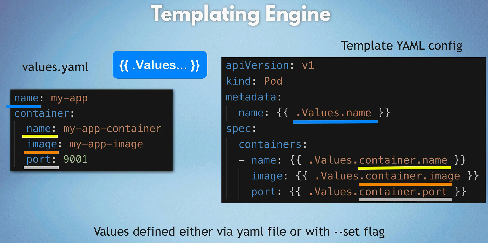

# Helm

Helm is a package manager for Kubernetes that simplifies the deployment and management of applications. It enables users to define, install, and upgrade even the most complex Kubernetes applications. Think of Helm as the "apt" or "yum" for Kubernetes.

## Core Helm Information

### What is Helm?

Helm is a package manager for Kubernetes that simplifies the deployment and management of applications through "charts," which are packages of pre-configured Kubernetes resources.

### Helm Components

1. **Helm CLI**: Command-line interface for managing Helm charts and releases.
2. **Helm Chart**: A collection of files that describe a related set of Kubernetes resources.
3. **Chart Repository**: A location where charts can be stored and shared.
4. **Helm Release**: An instance of a chart running in a Kubernetes cluster.

### Benefits of Using Helm

1. **Simplifies Deployment and Management**:

   - Packages all Kubernetes resources into a single chart.
   - Ensures consistent deployment across different environments.

2. **Versioning and Rollbacks**:

   - Tracks changes with versioned charts.
   - Easily upgrades and reverts applications to previous versions.

3. **Reusability and Sharing**:

   - Reusable charts promote standardization.
   - Store and share charts in repositories for easy distribution and collaboration.

4. **Configuration Management**:

   - Separate configuration values from templates using values files.
   - Override values for flexible and environment-specific configurations.

5. **Powerful Templating Engine**:

   - Use variables and conditionals in resource definitions for dynamic configuration.

6. **Dependency Management**:

   - Specify and manage dependencies between charts.
   - Organize complex applications with subcharts.

7. **Community and Ecosystem**:
   - Access a large community with pre-built charts for common applications.
   - Integrate with CI/CD tools and cloud providers for enhanced capabilities.

### Installing Helm

**Download and Install Helm**: Follow the installation instructions from the [official Helm website](https://helm.sh/docs/intro/install/).

```sh
brew install helm
```

## Deploy releases from Helm Charts (Online or Local)

### Deploy releases from Online Helm Chart

```sh
# Add Helm Chart Repository
helm repo add bitnami https://charts.bitnami.com/bitnami
helm repo update

# Deploy a Releases
helm install myApp bitnami/nginx -f app-values.yaml
```

### Deploy releases From Local Helm Chart

```sh
# App1 Release
helm install myApp1 <./chartDirPath> -f app1-values.yaml
# App2 Release
helm install myApp2 <./chartDirPath> -f app2-values.yaml
```

### Overriding Default Values




1. **Using `--set` Flag**:

   ```sh
   helm install myrelease bitnami/nginx --set service.type=LoadBalancer
   ```

2. **Using a Custom values.yaml File**:

   ```sh
   # custom-values.yaml
   service:
     type: LoadBalancer
   ```

   ```sh
   helm install myrelease bitnami/nginx -f custom-values.yaml
   ```

3. **Combining `--set` and Custom values.yaml**:

   ```sh
   helm install myrelease bitnami/nginx -f custom-values.yaml --set service.port=8080
   ```

### Best Practices

1. **Version Control**: Store your Helm charts in a version-controlled repository.
2. **Environment-Specific Values**: Use different `values.yaml` files for different environments.
3. **Template Simplicity**: Keep your templates simple and manageable.
4. **Security**: Regularly scan Helm charts for vulnerabilities.
5. **Automation**: Use CI/CD pipelines to automate Helm operations like testing, linting, and deployment.

## Creating Your Own Helm Chart

### Step-by-Step Process

1. **Create a New Chart**:

   ```sh
   helm create myapp
   ```

2. **Directory Structure**:

   ```text
   myapp/
   ├── Chart.yaml
   ├── values.yaml
   ├── charts/
   ├── templates/
   └── ...
   ```

   

3. **Edit Chart.yaml**: Define metadata about your chart.

   ```yaml
   apiVersion: v2
   name: myapp
   description: A Helm chart for Kubernetes
   version: 0.1.0
   ```

4. **Define Values in values.yaml**: Store default configuration values.

   ```yaml
   replicaCount: 2

   image:
     repository: nginx
     tag: stable

   service:
     type: ClusterIP
     port: 80
   ```

5. **Create Kubernetes Manifests in templates/**: Use templates to define your Kubernetes resources.

   ```yaml
   # templates/deployment.yaml
   apiVersion: apps/v1
   kind: Deployment
   metadata:
     name: {{ .Release.Name }}-deployment
   spec:
     replicas: {{ .Values.replicaCount }}
     selector:
       matchLabels:
         app: {{ .Release.Name }}
     template:
       metadata:
         labels:
           app: {{ .Release.Name }}
       spec:
         containers:
           - name: {{ .Release.Name }}
             image: "{{ .Values.image.repository }}:{{ .Values.image.tag }}"
             ports:
               - containerPort: 80
   ```

6. **Deploy the Chart**:

   ```sh
   helm install myapp ./myapp
   ```

---

## Helm Chart Commands

### **Create a New Chart**

```sh
# Used to create a new Helm chart:
helm create myapp
```

### **Lint a Chart**

```sh
# Used to check the syntax of a Helm chart:
helm lint myapp
```

### **Package a Chart**

```sh
# Used to package a Helm chart:
helm package myapp
```

### **Install a Chart**

```sh
# Used to install a Helm chart:
helm install myapp ./myapp
```

### **Upgrade a Release**

```sh
# Used to upgrade a Helm release:
helm upgrade myapp ./myapp
```

### **List Releases**

```sh
# Used to list all Helm releases
helm list
```

### **Uninstall a Release**

```sh
# Used to uninstall a Helm release
helm uninstall myapp
```

### **Fetch a Chart**

```sh
# Used to fetch a Helm chart
# helm add repo vs helm fetch bitnami/nginx is different as it fetches the chart without adding it to the repo list
helm fetch bitnami/nginx
```

### **Show Chart Information**

```sh
# Used to show information about a Helm chart
helm show chart bitnami/nginx
```

### **Show Chart Values**

```sh
# Used to show values of a Helm chart
helm show values bitnami/nginx
```

### **Show Chart Templates**

```sh
# Used to show templates of a Helm chart
helm template myapp ./myapp
```

### **Search for Charts**

```sh
# Used to search for Helm charts in repositories
helm search repo nginx
```

### **Update Repositories**

```sh
# Used to update Helm repositories
helm repo update
```

### **Remove a Repository**

```sh
# Used to remove a Helm repository
helm repo remove bitnami
```

### **Inspect a Release**

```sh
# Used to inspect a Helm release
helm get all myapp
```

### **Rollback a Release**

```sh
# Used to rollback a Helm release
helm rollback myapp 1
```

### **Test a Release**

```sh
# Used to test a Helm release
helm test myapp
```

### **Verify a Chart**

```sh
# Used to verify a Helm chart
helm verify myapp
```

### **Debug a Release**

```sh
# Used to debug a Helm release
helm install --debug --dry-run myapp ./myapp
```

### **Check Chart Dependencies**

```sh
# Used to check the dependencies of a Helm chart
helm dependency list ./myapp
```

### **Update Dependencies**

```sh
# Used to update the dependencies of a Helm chart
helm dependency update ./myapp
```
