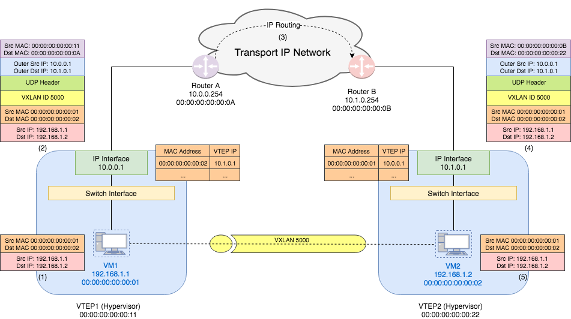

# How VXLAN Works



## Setup

1. **Container A on Node 1:**

   - IP: 10.1.1.2
   - Node 1 IP: 192.168.1.1

2. **Container B on Node 2:**

   - IP: 10.1.1.3
   - Node 2 IP: 192.168.2.1

## Lifecycle of a Packet from Container A to Container B

1. **Packet Creation:**

   - Container A wants to send data to Container B.
   - Original packet:

     ```txt
     Source IP: 10.1.1.2
     Destination IP: 10.1.1.3
     ```

2. **VTEP on Node 1 Encapsulates the Packet:**

   - Node 1's VTEP recognizes that the destination IP (10.1.1.3) is not on the same node.
   - It looks up the VXLAN forwarding table to find the corresponding VTEP IP for 10.1.1.3.
   - Encapsulates the original packet with a VXLAN header and an outer IP header:

     ```txt
     Outer IP Header:
       Source IP: 192.168.1.1
       Destination IP: 192.168.2.1
     VXLAN Header: VNI 1001
     Original Packet:
       Source IP: 10.1.1.2
       Destination IP: 10.1.1.3
     ```

3. **Transmission Over the Physical Network:**

   - The encapsulated packet is sent from Node 1 to Node 2 over the physical network.

4. **VTEP on Node 2 Receives and Decapsulate the Packet:**

   - Node 2's VTEP receives the VXLAN-encapsulated packet.
   - It identifies the packet as a VXLAN packet using the VXLAN header.
   - Decapsulate the packet by removing the outer IP header and VXLAN header:

     ```txt
     Original Packet:
       Source IP: 10.1.1.2
       Destination IP: 10.1.1.3
     ```

5. **Delivery to Container B:**
   - The decapsulate packet is forwarded to Container B (10.1.1.3).

## Forwarding Table

The process of looking up the VXLAN forwarding table to find the corresponding VTEP IP for a given destination IP (e.g., 10.1.1.3) involves maintaining and querying a table that maps IP addresses to VTEP IP addresses and VNIs. Here's a detailed breakdown:

### VXLAN Forwarding Table Structure

The VXLAN forwarding table (often referred to as the MAC-VTEP mapping table) typically contains entries that map MAC addresses to VTEP IP addresses and VNIs. It can also map IP addresses directly to VTEP IPs, especially when dealing with overlay networks.

The table might look something like this:

```md
| MAC Address       | IP Address | VTEP IP     | VNI  |
| ----------------- | ---------- | ----------- | ---- |
| aa:bb:cc:dd:ee:ff | 10.1.1.3   | 192.168.2.1 | 1001 |
| aa:bb:cc:dd:ee:11 | 10.1.1.4   | 192.168.2.2 | 1001 |
| aa:bb:cc:dd:ee:22 | 10.1.2.3   | 192.168.3.1 | 1002 |
| ...               | ...        | ...         | ...  |
```

### Where is the VXLAN Forwarding Table Stored?

- **In-Memory on Each VTEP**: The forwarding table is usually stored in memory on each VTEP. This allows for quick lookups and updates.
- **Distributed Databases/Controllers**: In more complex deployments, a distributed database or a centralized controller (like an SDN controller) may manage and distribute the forwarding tables to each VTEP.

### How the VTEP Populates the Forwarding Table

There are a few methods by which a VTEP learns and populates its forwarding table:

- **Dynamic Learning via ARP Requests**: When a container sends an ARP request, the VTEP can capture this request, learn the IP-to-MAC and IP-to-VTEP mapping, and update its forwarding table.
- **Control Plane Protocols (like BGP EVPN)**: BGP EVPN is commonly used in larger deployments to distribute MAC-to-VTEP mappings. The VTEPs use BGP to share and receive information about where IP addresses and MAC addresses are located within the network.
- **Static Configuration**: In some cases, static mappings can be configured, though this is less common in dynamic environments like Kubernetes.

Sure! Let's dive into the details of **Dynamic Learning via ARP Requests** and **Learning via Control Plane Protocols (like BGP EVPN)** to understand how they populate the VXLAN forwarding table.

### 1. Dynamic Learning via ARP Requests

Dynamic learning is a method used by network devices, including VTEPs (VXLAN Tunnel Endpoints), to automatically learn and update their forwarding tables based on the traffic they observe. This approach leverages ARP (Address Resolution Protocol) to map IP addresses to MAC addresses and ultimately to VTEP IPs.

#### How Dynamic Learning via ARP Works

1. **ARP Request Broadcast**:

   - When a container (e.g., Container A with IP 10.1.1.2) wants to communicate with another container (e.g., Container B with IP 10.1.1.3), it first needs to know the MAC address associated with the destination IP address.
   - Container A sends an ARP request asking, "Who has IP 10.1.1.3? Please tell 10.1.1.2."
   - This ARP request is broadcasted on the network.

2. **VTEP Interception**:

   - The VTEP on the same node as Container A (Node 1) intercepts this ARP request.
   - If the destination IP (10.1.1.3) is on a different node, the VTEP forwards this ARP request across the VXLAN network to other VTEPs.

3. **ARP Reply**:

   - The VTEP on Node 2 receives the ARP request and forwards it to Container B.
   - Container B responds with an ARP reply, "`IP 10.1.1.3 is at MAC aa:bb:cc:dd:ee:ff`."
   - The VTEP on Node 2 encapsulates this ARP reply in a VXLAN packet and sends it back to Node 1's VTEP.

4. **Learning and Table Update**:

   - When Node 1's VTEP receives the ARP reply, it learns the mapping:
     - `IP 10.1.1.3 is associated with MAC aa:bb:cc:dd:ee:ff`.
     - `MAC aa:bb:cc:dd:ee:ff is located behind VTEP IP 192.168.2.1`.
   - This information is used to update the VXLAN forwarding table on Node 1:

     ```md
     | IP Address | MAC Address       | VTEP IP     | VNI  |
     | ---------- | ----------------- | ----------- | ---- |
     | 10.1.1.3   | aa:bb:cc:dd:ee:ff | 192.168.2.1 | 1001 |
     ```

   - Now, when Container A wants to send a packet to Container B, the VTEP on Node 1 can encapsulate the packet and send it directly to Node 2.

5. **Ongoing Learning**:
   - As traffic flows through the network, VTEPs continue to learn and update their forwarding tables based on the ARP requests and replies they see.
   - If a VTEP receives traffic for an IP address that it hasn't learned yet, it may flood the packet to all VTEPs, prompting them to respond with their mappings.

### 2. Learning via Control Plane Protocols (like BGP EVPN)

In larger or more complex networks, relying solely on dynamic learning via ARP requests might not be sufficient or efficient. This is where control plane protocols like BGP EVPN (Border Gateway Protocol Ethernet VPN) come into play. BGP EVPN is a control plane mechanism that distributes MAC-to-VTEP mappings across the network, allowing for more scalable and robust operation.

#### How BGP EVPN Works

1. **Establishing BGP Sessions**:

   - VTEPs establish BGP sessions with each other, forming a BGP peering relationship. These BGP sessions can be within a single data center or across multiple data centers.
   - Through these sessions, VTEPs can exchange routing information, including MAC addresses and associated IP addresses.

2. **MAC/IP Advertisement**:

   - When a new container (e.g., Container B) is created on a node (Node 2), the VTEP on Node 2 learns its MAC address and IP address.
   - The VTEP on Node 2 advertises this MAC/IP mapping to its BGP peers (other VTEPs in the network) using BGP EVPN routes. The advertisement typically looks like this:

     ```ini
     Route Type: MAC/IP Advertisement Route
     MAC Address: aa:bb:cc:dd:ee:ff
     IP Address: 10.1.1.3
     VTEP IP: 192.168.2.1
     VNI: 1001
     ```

3. **Distributing MAC/IP Mappings**:

   - Each VTEP receives these BGP EVPN advertisements and updates its local VXLAN forwarding table accordingly.
   - This means that all VTEPs now know where to route packets destined for IP 10.1.1.3.

4. **Centralized Control**:

   - BGP EVPN acts as a centralized control plane, ensuring that all VTEPs have a consistent view of the network.
   - Unlike dynamic learning, which relies on observing traffic, BGP EVPN proactively distributes information, reducing the need for ARP flooding and enhancing network efficiency.

5. **Lookup and Forwarding**:

   - When a packet arrives at a VTEP (e.g., Node 1) destined for IP 10.1.1.3, the VTEP can immediately look up its VXLAN forwarding table, find the corresponding VTEP IP (192.168.2.1), and encapsulate the packet for delivery to Node 2.

6. **Scalability**:
   - BGP EVPN is highly scalable and is well-suited for large data center environments where there are many nodes and containers.
   - It also supports advanced features like multi-tenancy, traffic engineering, and seamless VM mobility.
