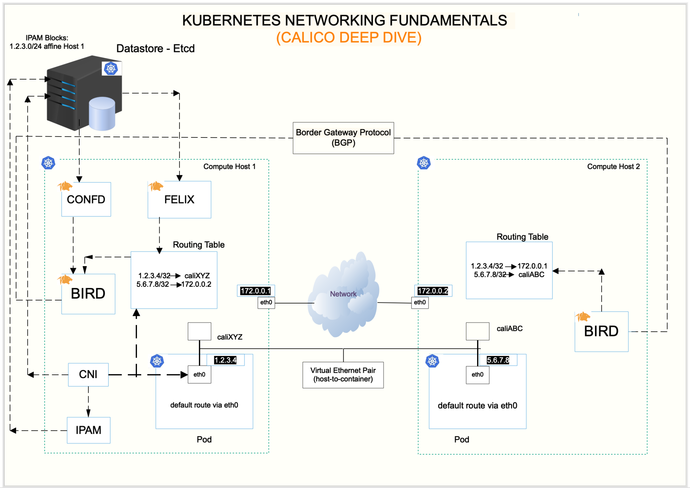

# Calico CNI

Calico is a feature-rich CNI plugin that is well-suited for environments requiring advanced networking features, strong security controls, and high performance. It excels in large-scale, complex, and hybrid cloud deployments where Layer 3 routing and network policies are critical. While it can be more complex to configure and manage, its flexibility and capabilities make it a preferred choice for production-grade Kubernetes clusters where networking and security are top priorities.





## Overview of Calico

- **Layer 3 Networking:** Unlike some other CNI plugins that rely on Layer 2 overlay networks, Calico operates primarily at Layer 3 (the network layer). It routes traffic between pods using standard IP routing protocols.
- **Built-in Security Features:** Calico provides robust network security features, including support for Kubernetes Network Policies and its own more advanced network policy framework.
- **BGP for Routing:** Calico uses Border Gateway Protocol (BGP) to distribute routing information between nodes, allowing for efficient and scalable routing of traffic within large and complex Kubernetes clusters.

## Architecture

- Calico uses a distributed architecture with a **control plane** and **data plane**. The **control plane** consists of the **Calico API server**, which stores configuration data and distributes it to the nodes. The **data plane** consists of the **Calico node agent**, which runs on each node and is responsible for programming the Linux kernel with routes and policies.

- Calico uses **BGP** to distribute routes for pods across the cluster. Each node advertises the routes for the pods running on that node, and the routes are propagated to all other nodes in the cluster. This allows pods to communicate with each other directly, without the need for an overlay network.

- **Native IP Routing**: Calico relies on native IP routing within the cluster. It programs routes into the kernel’s routing table, which allows traffic to be routed directly between pods without additional encapsulation.

- Calico also supports Kubernetes network policies, which allow you to define rules for how pods can communicate with each other. Network policies are enforced by the Calico node agent, which programs the Linux kernel with iptables rules to enforce the policies.

## Features

1. **IP Address Management (IPAM):**

   - **IP Allocation:** Calico provides a sophisticated IP Address Management (IPAM) system that allocates IP addresses to pods from a predefined pool. It supports different allocation modes, including assigning IP addresses based on the node’s subnet or using a global IP pool.
   - **Flexible IPAM:** Calico’s IPAM allows for more advanced configurations, such as custom IP pools for specific namespaces or even overlapping IP pools in different environments.

2. **Routing:**

   - **Layer 3 Routing:** Calico uses Layer 3 routing to manage pod-to-pod communication across nodes. Each node in the cluster functions as a router, with the calico-node agent programming routes that direct traffic to the appropriate pods.
   - **BGP (Border Gateway Protocol):** In larger or more complex setups, Calico uses BGP to exchange routing information between nodes. This allows for efficient routing and is particularly useful in multi-cloud or hybrid cloud environments where different networks need to be connected.

3. **Network Policies:**

   - **Kubernetes Network Policies:** Calico fully supports Kubernetes Network Policies, allowing administrators to define rules about which pods can communicate with each other.
   - **Calico Network Policies:** Beyond Kubernetes Network Policies, Calico offers its own policy framework that provides more advanced features, such as policies based on application layer protocols, DNS-based policies, and global policies that apply across namespaces.
   - **Policy Enforcement:** Calico’s network policies are enforced at the kernel level by the Felix agent, ensuring high performance and low latency in policy enforcement.

4. **Security Features:**
   - **Traffic Encryption:** Calico can encrypt traffic between nodes using IPsec, providing an additional layer of security, particularly in environments where network traffic might traverse untrusted networks.
   - **Microsegmentation:** Calico supports microsegmentation, which allows you to create fine-grained security zones within your cluster, restricting traffic between different applications or services.

## Components

### 1. **Calico CNI plugin:**

the CNI plugin that is responsible for assigning IP addresses to pods and setting up the network interfaces.

### 2. **Calico Node Daemon:**

This is the core component of Calico running on every node in the cluster. It handles IP address management, routing, and enforcement of network policies. It consists of the following:

- **Felix:** Felix is the primary Calico agent that enforces network policies on each node. It programs routes, ACLs (Access Control Lists), and security rules into the Linux kernel.
- **BIRD:** In setups using BGP, BIRD is a BGP daemon that distributes routing information between nodes. This ensures that each node knows how to reach pods on other nodes.

### 3. **Etcd (Optional):**

- **Distributed Key-Value Store:** Calico can use etcd as a backend to store network configuration data, IP address allocations, and policy definitions. In Kubernetes, this is often integrated with the existing etcd cluster used by Kubernetes itself.
- **Flexibility:** While etcd is the default backend for Calico, newer versions also support using Kubernetes API server as a datastore, simplifying the deployment.

### 4. **Typha (Optional):**

- **Scalability:** Typha is an optional component used to scale Calico in large clusters. It aggregates and optimizes the communication between calico-node agents and the datastore (e.g., etcd), reducing the load on etcd.

## Installation

Calico can be installed using the following command:

```bash
kubectl apply -f https://docs.projectcalico.org/manifests/calico.yaml
```

## **Understand Packet Life Cycle in Calico**

When using Calico as the CNI (Container Network Interface) in Kubernetes, the communication between containers (pods) across different nodes is handled through a series of networking steps. Here's a detailed explanation of how a packet travels from `Container1` on `Node1` to `Container2` on `Node2` using Calico.

### 1. **Initial Setup and IP Address Allocation:**

- **Pod Creation:** When `Container1` is created on `Node1`, it is assigned an IP address from Calico's IPAM (IP Address Management) system. Similarly, `Container2` on `Node2` receives its own IP address from the same IPAM pool.
- **Routing Table Update:** When a pod is created, Calico updates the node's routing table with routes to ensure that traffic destined for other pods on the same node is handled locally, while traffic to pods on other nodes is routed correctly.

### 2. **Sending a Packet:**

- **Packet Origin:** `Container1` needs to send a packet to `Container2`. The packet is created within the networking stack of `Container1`, with the source IP being the IP of `Container1` and the destination IP being the IP of `Container2`.
- **Veth Pair:** Each pod in Kubernetes is connected to the network namespace of the node via a virtual Ethernet pair (veth pair). The packet from `Container1` is first transmitted through this veth pair to the host network namespace of `Node1`.

### 3. **Calico's Felix Agent and Network Policies:**

- **Policy Enforcement:** As the packet leaves `Container1`, it is intercepted by the Calico Felix agent running on `Node1`. Felix enforces any applicable network policies that have been defined for the cluster.
- **Network Policy Check:** Felix checks if the packet is allowed based on the defined Calico network policies. These policies can include rules about which pods or namespaces are allowed to communicate with each other, based on source and destination IPs, ports, and protocols.
- **Policy Decision:** If the packet is allowed by the network policies, it proceeds to the next stage. If not, the packet is dropped.

### 4. **Routing the Packet on Node1:**

- **Routing Table Lookup:** The packet is then processed by the routing table on `Node1`. Since the destination IP belongs to a pod on `Node2`, the routing table directs the packet to the correct interface that leads to `Node2`.
- **BGP (If Used):** If Calico is configured with BGP, the routing information is distributed across the nodes using BGP. This ensures that each node knows the IP ranges of other nodes and can route traffic directly to them without needing an overlay network.

### 5. **Packet Transmission to Node2:**

- **Direct Routing:** In the simplest case, the packet is routed directly from `Node1` to `Node2` over the underlying network (often the same physical or virtual network connecting the Kubernetes nodes). The packet travels as a standard IP packet over the network.
- **Encapsulation (Optional):** If Calico is configured to use an overlay network (e.g., VXLAN or IP-in-IP), the packet might be encapsulated before it is sent over the network. Encapsulation is used to handle more complex network topologies, such as when nodes are in different subnets or require NAT traversal.

### 6. **Arrival at Node2:**

- **Decapsulation (If Used):** If the packet was encapsulated, it is decapsulated when it arrives at `Node2`, revealing the original packet with the source IP of `Container1` and the destination IP of `Container2`.
- **Routing to the Pod:** The packet arrives at `Node2`, where the routing table again comes into play. The routing table on `Node2` directs the packet to the specific veth pair that connects to `Container2`.

### 7. **Calico's Felix Agent on Node2:**

- **Policy Enforcement (Again):** Before the packet reaches `Container2`, the Calico Felix agent on `Node2` checks the packet against any ingress network policies defined for `Container2`. If the policies allow the packet, it continues; otherwise, it is dropped.

### 8. **Packet Delivery:**

- **Delivery to Container2:** If the packet passes all policy checks, it is finally delivered to `Container2` through the veth pair, completing the journey.
- **Response Traffic:** If `Container2` needs to respond to `Container1`, the entire process is repeated in reverse.

### Key Concepts in Calico’s Packet Lifecycle:\*\*

1. **Direct Routing:** Calico uses direct IP routing for pod-to-pod communication, avoiding the need for an overlay network in most cases. This makes communication more efficient and reduces overhead.
2. **Network Policies:** Calico enforces network policies at both the source and destination nodes, providing security and control over pod communication.
3. **BGP Integration:** In environments where BGP is used, Calico leverages BGP to distribute routing information, ensuring that each node knows how to reach other nodes' pods efficiently.
4. **Optional Encapsulation:** While Calico prefers direct routing, it can use encapsulation methods like VXLAN or IP-in-IP to handle more complex networking scenarios, such as when nodes are in different subnets or when traffic needs to traverse NAT.

### **Summary:**

In Calico, when `Container1` on `Node1` communicates with `Container2` on `Node2`, the packet is routed using standard IP routing mechanisms. Calico ensures that the packet is correctly routed across nodes, enforces network policies, and optionally encapsulates the packet if needed. This process provides a scalable, efficient, and secure way to manage pod-to-pod communication across a Kubernetes cluster.

## **Understanding How Calico Uses IP-IP Protocol**

The key to understanding why **Node2** knows it should decapsulate the packet and why other nodes do not involves understanding the nature of **IP-in-IP encapsulation**, **routing decisions**, and **how Calico manages network traffic** in a Kubernetes cluster.

### 1. **IP-in-IP Encapsulation Recap:**

- **Outer IP Header:** When a packet is sent from `Container1` on **Node1** to `Container2` on \*\*Node2`, Calico encapsulates the original packet (which has a source IP`10.0.1.2`and destination IP`10.0.2.3`) into another IP packet.
- **Encapsulation Details:**
  - **Outer Source IP:** `192.168.1.1` (Node1's host IP)
  - **Outer Destination IP:** `192.168.2.1` (Node2's host IP)
- The encapsulated packet is then routed across the underlying network using the outer IP header.

### 2. **Routing Decision in the Underlying Network:**

- **Standard IP Routing:** The underlying network (e.g., your physical or virtual network infrastructure) routes the packet based on the outer IP header. Routers in the network see the packet as destined for `192.168.2.1` (Node2's host IP).
- **No Interference from Other Nodes:** Other nodes on the network, including routers or switches, see this packet as destined for `192.168.2.1` and do not attempt to process it themselves. This is standard behavior for IP networks, where routers forward packets based on the destination IP without examining the packet's payload.

### 3. **Arrival at Node2 and Decapsulation:**

- **Destination IP Matching:** When the packet reaches **Node2**, its network stack recognizes that the packet’s outer destination IP (`192.168.2.1`) matches its own host IP.
- **Calico's Role:** Calico is configured on **Node2** to manage traffic for pods. Since **Node2** knows it has received a packet with its own IP as the outer destination, it understands that this packet is encapsulated and should be decapsulated to access the original content.

### 4. **Decapsulation Process on Node2:**

- **Decapsulation:** **Node2** removes the outer IP header, revealing the original packet with:
  - **Source IP:** `10.0.1.2` (Container1's IP)
  - **Destination IP:** `10.0.2.3` (Container2's IP)
- **Internal Routing:** After decapsulation, **Node2** checks its internal routing table to determine which pod the packet is intended for, based on the destination IP `10.0.2.3`.

### 5. **Why Other Nodes Do Not Decapsulate:**

- **Routing to Specific Host IP:** Only **Node2** sees the packet because the outer IP header directs the packet to **Node2’s** specific IP address (`192.168.2.1`). Other nodes (e.g., `Node3`, `Node4`) with different IP addresses (e.g., `192.168.3.1`, `192.168.4.1`) simply forward the packet according to their routing rules.
- **Encapsulation Transparency:** The encapsulation and decapsulation process is transparent to other nodes and network devices. They treat the encapsulated packet as any other IP packet and route it based on the outer header without inspecting the payload.
- **Host-Specific Handling:** Only the node with a matching outer destination IP (`Node2` in this case) will process the packet further by decapsulating it and routing it internally to the correct pod.

---

### Conclusion

- **Node2 knows to decapsulate the packet** because the outer IP header specifies Node2's host IP as the destination. The Calico agent on Node2 is responsible for handling this encapsulation and decapsulation process.
- **Other nodes** do not decapsulate or interfere with the packet because the outer IP header does not match their IP addresses, and they follow standard IP routing rules, forwarding the packet towards its destination.

---

## **Understand How Calico Assigns IP Addresses to Pods:**

Calico assigns IP addresses to pods using its IP Address Management (IPAM) system, it is a distributed function that is integrated into the Calico components running on each node in the Kubernetes cluster.

```bash
sudo calicoctl node status
sudo calicoctl get ippool
sudo calicoctl get ippool default-ipv4-ippool -o yaml
```

1. **Central IP Pools:**

   - Calico has a pool of IP addresses (like `10.0.0.0/16`) that it can use to assign IPs to pods in your Kubernetes cluster.

2. **Block Allocation:**

   - Instead of giving out IPs one by one from the central pool, Calico divides this pool into smaller chunks called "blocks" (like `10.0.1.0/26`).
   - Each node in your cluster gets one or more of these blocks, so it has a bunch of IPs ready to assign to pods on that node.

3. **Local IP Assignment:**
   - When a new pod is created on a node, the node picks an IP from its block and assigns it to the pod.
   - Since each node has its own block of IPs, there's no risk of two nodes giving out the same IP to different pods.

### **How This Works with Kubernetes Services:**

1. **Separate Management:**

   - Kubernetes manages Service IPs (like those for ClusterIP services) separately from the IPs that Calico gives to pods.
   - These Service IPs are used to route traffic to the right set of pods, but they don’t interfere with the IPs that Calico assigns.

2. **Routing Traffic:**
   - When a service (like a ClusterIP service) receives traffic, Kubernetes looks up which pods should handle that traffic and uses the IPs that Calico assigned to those pods.
   - Traffic flows directly to the pod’s IP without extra layers or complexity.

### **Key Points:**

- **No IP Conflicts:** Because each node gets its own block of IPs, there's no chance of two pods in the cluster getting the same IP.
- **Simple Integration:** Calico works smoothly with Kubernetes services, making sure that traffic gets where it needs to go, using the IPs that have been assigned to the pods.

This system keeps IP management simple and efficient, even in large clusters.

## **Understanding How Calico Uses BGP**

Calico’s use of BGP (Border Gateway Protocol) is one of its key features that allows it to scale efficiently and manage routing within large, complex Kubernetes clusters. Here’s how it works and how Calico uses BGP to announce pod IPs across the cluster.

### 1. **Introduction to BGP in Calico:**

- **What is BGP?** BGP is a standard exterior gateway protocol used to exchange routing information between different networks (autonomous systems) on the internet. In the context of a Kubernetes cluster using Calico, BGP is used internally to distribute routing information between nodes.
- **Why Use BGP?** By using BGP, Calico can ensure that each node in the cluster is aware of the IP addresses of all pods, regardless of which node they are running on. This allows for efficient, direct routing of traffic without needing an overlay network.

### 2. **Pod IP Announcement with BGP:**

#### **a. Pod Creation and IP Assignment:**

- **IP Assignment:** When a new pod is created on a node, Calico’s IPAM assigns it an IP address from the available pool.
- **Local Routing Table Update:** The node where the pod is running updates its local routing table to direct traffic for the pod’s IP to the correct network interface (i.e., the veth pair associated with the pod).

#### **b. BGP Configuration in Calico:**

- **BGP Daemon (BIRD):** On each node, Calico runs a BGP daemon called **BIRD** (or a similar BGP implementation) that manages BGP sessions with other nodes.
- **BGP Peers:** Each node in the cluster establishes BGP peerings with other nodes. These peerings allow the nodes to exchange routing information directly with each other.

#### **c. Announcing Pod IPs:**

- **BGP Announcement:** When a new pod is created and assigned an IP address, the node that hosts the pod announces the IP address to its BGP peers. This announcement includes information about the IP address (or a block of addresses) and the next hop, which is the node’s own IP address.
- **Propagation of Routes:** The BGP peers (other nodes) receive this routing information and update their routing tables to include a route to the new pod’s IP, specifying that traffic for this IP should be routed via the announcing node.

### 3. **Routing Traffic Using BGP:**

#### **a. Direct Routing:**

- **Routing Across Nodes:** Once all nodes have the routing information, any node that needs to send traffic to the pod can look up the destination IP in its routing table and see that it should forward the traffic to the node that announced the route.
- **Efficient Path Selection:** BGP ensures that traffic is routed efficiently within the cluster, potentially taking the shortest path between nodes based on the cluster’s network topology.

#### **b. Avoiding Overlays:**

- **No Encapsulation Needed:** Because BGP distributes the routing information for all pod IPs, there is no need for an overlay network to encapsulate traffic. The nodes can route traffic directly to the destination pod without additional encapsulation, reducing overhead and improving performance.

### 4. **BGP in Multi-Node and Multi-Region Clusters:**

#### **a. Multi-Node Clusters:**

- **Scaling with BGP:** As the cluster grows and more nodes are added, BGP continues to distribute routing information efficiently. Each node only needs to maintain a routing table with routes to the pods on other nodes, which BGP dynamically updates as the cluster changes.

#### **b. Multi-Region or Multi-Cloud Setups:**

- **Cross-Region Routing:** In more complex environments, such as multi-region or multi-cloud setups, BGP can be used to connect different clusters or regions. By establishing BGP peerings across regions, Calico ensures that traffic can be routed seamlessly between pods in different geographic locations.

### 5. **Example: How It Works in Practice:**

Let’s walk through a concrete example to illustrate how BGP works with Calico.

- **Scenario:** A new pod (Pod A) is created on Node1 with IP `10.0.1.5`.
- **BGP Announcement:**
  - **Step 1:** Node1’s BGP daemon announces the route for `10.0.1.5/32` (a specific route to Pod A) to its BGP peers (e.g., Node2, Node3).
  - **Step 2:** The BGP peers (Node2, Node3) receive this route announcement and update their routing tables to indicate that traffic for `10.0.1.5` should be sent to Node1’s IP address.
- **Routing Traffic:**
  - **Step 3:** If a pod on Node2 (Pod B) needs to communicate with Pod A on Node1, it sends the traffic destined for `10.0.1.5`.
  - **Step 4:** Node2’s routing table directs the traffic to Node1, based on the BGP-learned route. The traffic is then routed directly to Pod A without any encapsulation.

### 6. **Advantages of Using BGP with Calico:**

- **Scalability:** BGP scales well in large environments, as it’s designed to handle large amounts of routing information efficiently.
- **Performance:** By using direct routing instead of overlays, BGP reduces the overhead associated with encapsulation, leading to better network performance.
- **Flexibility:** BGP allows Calico to integrate with existing network infrastructure, making it suitable for complex environments like hybrid clouds and multi-region clusters.

### **How BGP Sessions Work Between Nodes:**

- BGP sessions are established over **TCP** (Transport Layer Protocol), which operates at Layer 4. The TCP connection allows BGP peers (nodes) to communicate regardless of the underlying Layer 2 network configuration. This is why BGP can work across different regions, even if the nodes are not on the same subnet or VLAN.

- BGP uses TCP **port 179** to establish and maintain the session, which means it can traverse routers, firewalls, and NAT devices as long as the necessary routes and ports are open and accessible.

#### 1. **Establishing BGP Sessions:**

- **BGP Peering:** To establish a BGP session, nodes (or routers) first need to form a **BGP peering** relationship. In the context of Calico, each node in the Kubernetes cluster is configured to peer with other nodes.
- **TCP Connection:** BGP sessions are established over a persistent TCP connection, typically using **port 179**. This connection is used to exchange BGP messages between peers.

#### 2. **Types of BGP Messages:**

- **Open:** The initial message sent between BGP peers to establish the session. It includes information such as the Autonomous System Number (ASN), BGP version, and hold time.
- **Update:** These messages are used to advertise new routes or withdraw previously advertised routes. When a new pod is created on a node, an Update message is sent to other peers announcing the route to the pod's IP.
- **Keepalive:** Periodic messages sent between BGP peers to maintain the session. If Keepalive messages are not received within a certain timeframe (defined by the hold time), the BGP session is considered down.
- **Notification:** Used to indicate errors or to close a BGP session.

#### 3. **Maintaining the BGP Session:**

- **Persistent Connection:** Once a BGP session is established, the nodes maintain a persistent TCP connection for the duration of the session. This connection is used to continuously exchange routing information and keep the session alive.
- **Routing Updates:** As changes occur in the cluster, such as pods being added, deleted, or moved, the nodes send BGP Update messages to inform their peers about these changes. This ensures that all nodes have up-to-date routing information.

#### 4. **Session Monitoring:**

- **Keepalive and Hold Time:** The Keepalive and Hold time parameters ensure that the BGP session remains active and that both peers are aware of each other's status. If a peer fails to send Keepalive messages within the hold time, the session is terminated, and routes learned from that peer are withdrawn.
- **Error Handling:** If any issues occur (e.g., misconfigurations, connection failures), BGP peers can send Notification messages to signal the problem and possibly terminate the session.

#### **BGP Session Lifecycle:**

In Calico, BGP sessions between nodes are established using persistent TCP connections over port 179. These sessions allow nodes to exchange routing information efficiently, ensuring that all nodes in the cluster know how to route traffic to any pod. This system is highly efficient and scalable, making it suitable for large, complex Kubernetes environments where direct, dynamic routing is needed. BGP operates independently of higher-level protocols like HTTP, focusing solely on the network layer to manage routing across the cluster.

1. **Session Establishment:**

   - Nodes in the cluster are configured with each other's IP addresses and ASNs (Autonomous System Numbers).
   - A TCP connection is established over port 179, and the nodes exchange BGP Open messages to establish the session.

2. **Route Exchange:**

   - Once the session is established, the nodes exchange BGP Update messages to share routing information. This includes routes to pod IPs and any network changes.

3. **Session Maintenance:**

   - The nodes send Keepalive messages at regular intervals to maintain the session. If the session remains idle (i.e., no new routes to share), Keepalive messages ensure that the connection is still active.
   - If either node detects a problem (e.g., missing Keepalive messages or a network error), it can send a Notification message to terminate the session.

4. **Session Termination:**
   - The session can be terminated explicitly by one of the peers, or it may be automatically terminated if Keepalive messages are not received within the hold time.
   - Once terminated, the routes advertised by that peer are removed from the routing table.

### **Summary:**

When Calico is configured to use BGP, it allows nodes in a Kubernetes cluster to exchange routing information about pod IP addresses. Each node announces the IP addresses of the pods running on it to its BGP peers, ensuring that all nodes in the cluster know how to route traffic to any pod. This direct routing approach eliminates the need for an overlay network, improving performance and scalability, particularly in large and complex Kubernetes environments.

Sure! Let's break it down into simpler terms:

## Configuration

Calico can be configured using the following command:

```bash
sudo calicoctl get ippool default-ipv4-ippool -o yaml > calico-config.yaml
sudo calicoctl apply -f calico-config.yaml
```

---

## Deployment Scenarios

1. **Single-Cluster Deployment:**

   - **Typical Setup:** In a standard Kubernetes cluster, Calico manages pod networking, routing, and network policy enforcement across all nodes.
   - **IP Routing:** Calico sets up IP routes between nodes to ensure that pod traffic can be efficiently routed without needing overlay networks, making it suitable for environments with flat networking.

2. **Multi-Cluster or Multi-Cloud Deployment:**

   - **Cross-Region Routing:** Calico can be used to connect multiple Kubernetes clusters across different regions or cloud providers. By using BGP or IPsec tunnels, Calico can route traffic between clusters securely and efficiently.
   - **Hybrid Cloud:** Calico’s flexible networking and policy features make it ideal for hybrid cloud deployments, where workloads are spread across on-premises data centers and public cloud environments.

3. **Service Mesh Integration:**
   - **Service Mesh:** Calico integrates with service meshes like Istio, providing enhanced security and observability. It can enforce network policies at the service mesh layer, providing an additional layer of security and control.

## Advantages of Calico

1. **Scalability:**

   - **Efficient Routing:** Calico’s use of Layer 3 routing and BGP allows it to scale efficiently in large, complex environments. It can handle thousands of nodes and tens of thousands of pods with minimal overhead.
   - **Flexible IPAM:** Calico’s flexible IPAM supports advanced IP allocation strategies, making it suitable for large and diverse environments.

2. **Security and Policy Control:**

   - **Advanced Network Policies:** Calico offers powerful network policy capabilities, including support for both Kubernetes and Calico-specific policies. This allows for fine-grained control over traffic flows within the cluster.
   - **Encryption:** Calico’s support for IPsec encryption ensures that traffic between nodes can be securely encrypted, which is essential for compliance in sensitive environments.

3. **Performance:**
   - **Kernel-Level Enforcement:** By enforcing network policies at the kernel level, Calico ensures high performance and low latency. This makes it suitable for high-throughput, low-latency applications.
   - **No Overlay Overhead:** Calico’s use of native routing avoids the overhead associated with overlay networks, making it more efficient in environments where direct routing is possible.

## Limitations of Calico

1. **Complexity:**

   - **Advanced Configuration:** While Calico offers powerful features, it can be complex to configure, particularly in environments where BGP is used or in multi-cluster setups. This may require more networking expertise compared to simpler CNI plugins like Flannel.
   - **Learning Curve:** Administrators new to networking or Kubernetes may find Calico’s advanced features and configurations to have a steeper learning curve.

2. **Overlay Network Support:**

   - **Limited Overlay Network Options:** While Calico can use VXLAN for overlay networking, it’s not its primary mode of operation. If your environment requires heavy use of overlay networks, other plugins like Flannel or Weave may be more straightforward to use.

3. **Resource Consumption:**
   - **Resource Intensive:** Calico, especially when using advanced features like BGP, IPsec, or large-scale network policies, can consume more resources (CPU and memory) on each node compared to simpler CNI plugins.

## references

<https://docs.tigera.io/calico/latest/reference/architecture/overview>
