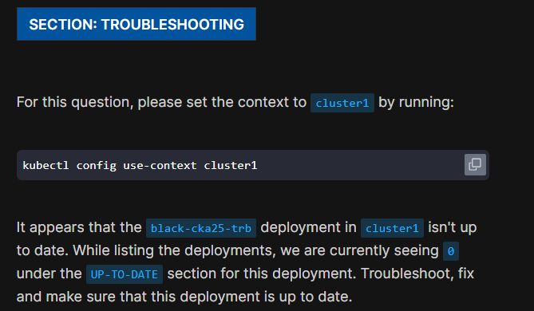
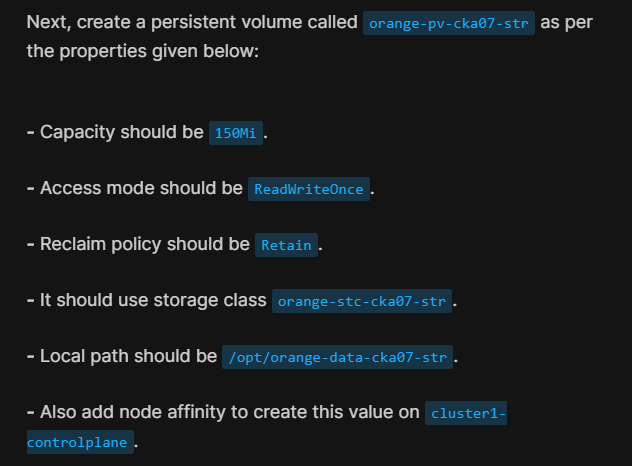

# CKA Mock Exams

## 🟢 Mock Exam 1 [0 Questions]

### 🟢 Q4

cronjob failure

### 🟢 Q16

There is a script located at `/root/pod-cka26-arch.sh` on the student-node. Update this script to add a command to filter/display the label with value `component` of the pod called`kube-apiserver-cluster1-controlplane` (on `cluster1`) using jsonpath.

- my sol

```bash
k get po -n kube-system kube-apiserver-cluster1-controlplane --context=cluster1 -o=jsonpath={.metadata.labels}
```

### 🟢 Q18



#### Solution

```bash
k get describe deploy black-cka25-trb
```

```ini
Conditions:
  Type           Status   Reason
  ----           ------   ------
  Available      True     MinimumReplicasAvailable
  Progressing    Unknown  DeploymentPaused
```

```bash
kubectl rollout resume deployment black-cka25-trb
```

## 🔴 Mock Exam 2 [0 Questions]

### 🟢 Q3



## 🔴 Mock Exam 3 [0 Questions]

## 🔴 Mock Exam 4 [0 Questions]

## 🔴 Mock Exam 5 [0 Questions]
