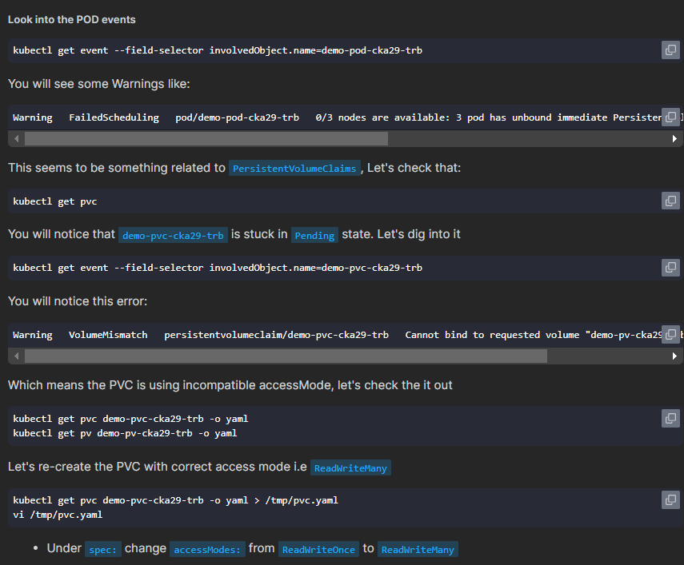

# Exams Notes

## When Creating SVC and service port not specified then make it same as target port (pod port)

`When Creating SVC and service port not specified then make it same as target port (pod port)`

## Static Pod file must be in the specific node not controlPlane always

```md
Create a static pod on node01 called nginx-critical with image nginx and make sure that it is recreated/restarted automatically in case of a failure.

Use /etc/kubernetes/manifests as the Static Pod path for example.
```

```md
Solution
To create a static pod called nginx-critical by using below command:

kubectl run nginx-critical --image=nginx --dry-run=client -o yaml > static.yaml

Copy the contents of this file or use scp command to transfer this file from controlplane to node01 node.

root@controlplane:~# scp static.yaml node01:/root/

To know the IP Address of the node01 node:

root@controlplane:~# kubectl get nodes -o wide

# Perform SSH

root@controlplane:~# ssh node01
OR
root@controlplane:~# ssh <IP of node01>

On node01 node:

Check if static pod directory is present which is /etc/kubernetes/manifests, if it's not present then create it.

root@node01:~# mkdir -p /etc/kubernetes/manifests

Add that complete path to the staticPodPath field in the kubelet config.yaml file.

root@node01:~# vi /var/lib/kubelet/config.yaml

now, move/copy the static.yaml to path /etc/kubernetes/manifests/.

root@node01:~# cp /root/static.yaml /etc/kubernetes/manifests/

Go back to the controlplane node and check the status of static pod:

root@node01:~# exit
logout
root@controlplane:~# kubectl get pods
```

## Best way to get info from pod to external node is to use -- commands

```md
Create a nginx pod called nginx-resolver using image nginx, expose it internally with a service called nginx-resolver-service. Test that you are able to look up the service and pod names from within the cluster. Use the image: busybox:1.28 for dns lookup. Record results in /root/CKA/nginx.svc and /root/CKA/nginx.pod
```

```md
Solution
Use the command kubectl run and create a nginx pod and busybox pod. Resolve it, nginx service and its pod name from busybox pod.

To create a pod nginx-resolver and expose it internally:

kubectl run nginx-resolver --image=nginx
kubectl expose pod nginx-resolver --name=nginx-resolver-service --port=80 --target-port=80 --type=ClusterIP

To create a pod test-nslookup. Test that you are able to look up the service and pod names from within the cluster:

kubectl run test-nslookup --image=busybox:1.28 --rm -it --restart=Never -- nslookup nginx-resolver-service
kubectl run test-nslookup --image=busybox:1.28 --rm -it --restart=Never -- nslookup nginx-resolver-service > /root/CKA/nginx.svc

Get the IP of the nginx-resolver pod and replace the dots(.) with hyphon(-) which will be used below.

kubectl get pod nginx-resolver -o wide
kubectl run test-nslookup --image=busybox:1.28 --rm -it --restart=Never -- nslookup <P-O-D-I-P.default.pod> > /root/CKA/nginx.pod
```

## Take Care of How set env for containers `-_-`

```yaml
---
apiVersion: v1
kind: Pod
metadata:
  name: multi-pod
spec:
  containers:
    - image: nginx
      name: alpha
      env:
        - name: name
          value: alpha
    - image: busybox
      name: beta
      command: ["sleep", "4800"]
      env:
        - name: name
          value: beta
```

> Here is the record of env set by `name`:<you-env-name> , `value`:<your-env-value>

## How to test service account RBAC

```bash
kubectl auth can-i list pv --as=system:serviceaccount:default:pvviewer
```

## NetworkPolicy: Applied to All sources (Incoming traffic from all pods)?

```yaml
---
apiVersion: networking.k8s.io/v1
kind: NetworkPolicy
metadata:
  name: ingress-to-nptest
  namespace: default
spec:
  podSelector:
    matchLabels:
      run: np-test-1
  policyTypes:
    - Ingress
  ingress:
    - ports:
        - protocol: TCP
          port: 80
```

## Review Command Section under pod definition

you have problem of execution order for command parameters in k8s pod definition

## you need to focus which nodes to save your answers

`PUT YOU ANSWER IN CORRECT PLACE BITCH 🥴`

## kubectl top node

```bash
kubectl top node --context cluster1 --no-headers | sort -nr -k2 | head -1
```

### **Purpose**

Identify **which Kubernetes node** in the **`cluster1`** context is **currently using the most CPU resources**.

### **Breakdown of Each Component**

#### **1. `kubectl top node`**

- **Function:**  
  Retrieves **real-time resource usage** metrics (CPU and memory) for all nodes in the Kubernetes cluster.

- **Output Example:**

  ```ini
  NAME        CPU(cores)   CPU%   MEMORY(bytes)   MEMORY%
  node-1      500m         25%    2Gi             50%
  node-2      750m         37.5%  3Gi             75%
  node-3      250m         12.5%  1Gi             25%
  ```

#### **2. `--context cluster1`**

- **Function:**  
  Specifies the **Kubernetes cluster context** to target. This is useful when managing multiple clusters.

- **Usage:**  
  Targets the cluster configuration named **`cluster1`** from your Kubernetes configuration file (typically located at `~/.kube/config`).

#### **3. `--no-headers`**

- **Function:**  
  **Excludes** the **header row** from the output, providing only the data lines.

- **Benefit:**  
  Simplifies the output for further processing with other command-line tools.

#### **4. `|` (Pipe Operator)**

- **Function:**  
  Passes the **output** of the command on the **left** (`kubectl top node ...`) as **input** to the command on the **right** (`sort ...`).

- **Usage:**  
  Enables chaining of commands to process data sequentially.

#### **5. `sort -nr -k2`**

- **Function:**  
  Sorts the input data **numerically** and in **descending** order based on the **second column**.

- **Parameters:**
  - **`-n`:**  
    Sorts the data **numerically** instead of lexicographically.
  - **`-r`:**  
    Sorts the data in **reverse (descending)** order.
  - **`-k2`:**  
    Specifies that the **second field (column)** is the key for sorting. In the `kubectl top node` output, the second column represents **CPU usage in cores**.

#### **6. `head -1`**

- **Function:**  
  **Displays only the first line** of the input it receives.

- **Usage:**  
  After sorting, it selects the **top entry**, which corresponds to the node with the **highest CPU usage**.

## VIP Flags

1. `--sort-by=.status.podIP`
1. `--no-header`
1. `k top node --context=cluster1 --no-headers | sort -nr -k4 | head -1`
1. `k top po -A --context=cluster1 --no-headers | sort -nr -k4 | head -1`

## Take you time reading the pod logs

1. `may problem in Memory`
   - Initializing buffer pool, size = 128.0M
     Killed

## to execute script inside po you can use

```yaml
apiVersion: v1
kind: Pod
metadata:
  name: looper-cka16-arch
spec:
  containers:
    - name: busybox
      image: busybox
      command: ["/bin/sh", "-c", "while true; do echo hello; sleep 10;done"]
```

## use event for troubleshooting

```bash
kubectl get event --field-selector involvedObject.name=demo-pod-cka29-trb
```

```bash
kubectl get event --field-selector involvedObject.name=demo-pvc-cka29-trb
```

## Make sure the pvc is mounted to pv



## Please specific the container to get logs from

```bash
kubectl logs blue-dp-cka09-trb-xxxx -c init-container
```

## Using subPath in Volumes

In Kubernetes, the `subPath` field allows you to **specify a specific path within a volume** to mount into your container, rather than mounting the entire volume. This is useful when you want to mount only part of the volume to your container or when multiple containers need access to different parts of the same volume.

### **Why use `subPath`?**

- **Selective mounting**: If a volume contains multiple directories/files and you only need one of them.
- **Avoid conflicts**: When multiple containers share the same volume but need isolated subdirectories.
- **Data persistence per container**: For containers that write to different directories within the same volume (for example, logs).

### **Example Use Case of `subPath`:**

Let’s say you have a volume containing multiple configuration files. You only need a specific file to be mounted inside your container.

```yaml
apiVersion: v1
kind: Pod
metadata:
  name: subpath-example
spec:
  containers:
    - name: busybox-container
      image: busybox
      command: ["/bin/sh", "-c", "cat /config/app-config.yaml && sleep 3600"]
      volumeMounts:
        - name: config-volume
          mountPath: /config/app-config.yaml
          subPath: app-config.yaml # Mount only this file
  volumes:
    - name: config-volume
      configMap:
        name: my-config
```

> 1. **Volume (`config-volume`)**: This volume is backed by a ConfigMap, which contains multiple files, including `app-config.yaml`.
> 2. **Mount Path (`/config/app-config.yaml`)**: Instead of mounting the entire volume, only the **`app-config.yaml`** file is mounted at this path.
> 3. **`subPath`**: The `subPath` ensures that only this specific file from the volume is available in the container.

> Without `subPath`, the whole volume would be mounted, including other files or directories that the container may not need.

### **When to Use `subPath`?**

1. **Log separation**: Different containers writing logs to different directories inside a shared volume.
2. **Configuration management**: Mounting individual configuration files instead of the entire ConfigMap or volume.
3. **Persistent storage**: Each container using a different subdirectory of a volume for its data.

## Focus on question specefication

## Read about annotations for ingress

```yaml
# key annotations
apiVersion: networking.k8s.io/v1
kind: Ingress
metadata:
  name: nginx-ingress-cka04-svcn
  annotations:
    nginx.ingress.kubernetes.io/ssl-redirect: "false"
spec:
  rules:
    - http:
        paths:
          - path: /
            pathType: Prefix
            backend:
              service:
                name: nginx-service-cka04-svcn
                port:
                  number: 80
```

## How to Create PV into specific node

```yaml
apiVersion: v1
kind: PersistentVolume
metadata:
  name: coconut-pv-cka01-str
  labels:
    storage-tier: gold
spec:
  capacity:
    storage: 100Mi
  accessModes:
    - ReadWriteMany
  hostPath:
    path: /opt/coconut-stc-cka01-str
  storageClassName: coconut-stc-cka01-str
  nodeAffinity:
    required:
      nodeSelectorTerms:
        - matchExpressions:
            - key: kubernetes.io/hostname
              operator: In
              values:
                - cluster1-node01
```

## Please test every fucked question you solve

## Please Focus which namespace you are going to create the resources
