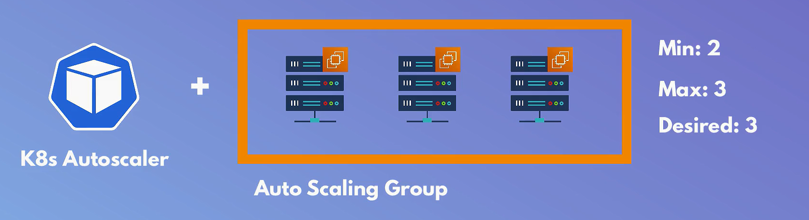
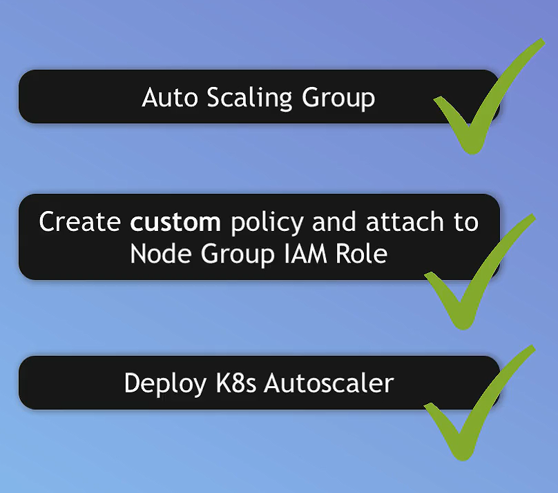

# Configure AutoScale for EKS Cluster

To configure autoscaling for your EKS cluster, you'll need to set up the Kubernetes Cluster AutoScaler. This tool automatically adjusts the number of nodes in your EKS cluster based on the demands of your workloads.

- AWS doesn't automatically scale our resources, so we need to set up the Cluster Autoscaler to manage the number of nodes in our EKS cluster.



## Prerequisites

1. **EKS Cluster**: Ensure you have an existing EKS cluster.
2. **IAM Role with Autoscaler Permissions**: The IAM role associated with your node group must have the required permissions for the autoscaler.

## Step-by-Step Configuration



### 1. Add Auto Scailing Group

it is created by default when you create a node group.

### 2. Create IAM Policy for the Cluster Autoscaler

1. **Open the IAM Console**:
   - Navigate to the [IAM console](https://console.aws.amazon.com/iam/).

2. **Create Policy**:
   - Click on **Policies** in the left-hand menu, then click **Create policy**.

3. **JSON Policy**:
   - Switch to the **JSON** tab and paste the following policy document:

     ```json
     {
       "Version": "2012-10-17",
       "Statement": [
         {
           "Effect": "Allow",
           "Action": [
             "autoscaling:DescribeAutoScalingGroups",
             "autoscaling:DescribeAutoScalingInstances",
             "autoscaling:DescribeLaunchConfigurations",
             "autoscaling:DescribeTags",
             "autoscaling:SetDesiredCapacity",
             "autoscaling:TerminateInstanceInAutoScalingGroup",
             "ec2:DescribeLaunchTemplateVersions"
           ],
           "Resource": "*"
         }
       ]
     }
     ```

   - Click **Next: Tags**, then **Next: Review**.

4. **Name and Create**:
   - Give your policy a name (e.g., `EKSClusterAutoscalerPolicy`) and click **Create policy**.

### 3. Attach the Policy to Your Node Instance Role

1. **Open the IAM Console**:
   - Navigate to the [IAM console](https://console.aws.amazon.com/iam/).

2. **Find the Node Instance Role**:
   - Click on **Roles** in the left-hand menu and find the role used by your EKS worker nodes.

3. **Attach Policy**:
   - Click on the role, then click **Attach policies**.
   - Search for the policy you created (`EKSClusterAutoscalerPolicy`), select it, and click **Attach policy**.

### 4. Deploy the Cluster Autoscaler

1. **Download the Cluster Autoscaler Manifest**:
   - Download the recommended Cluster Autoscaler deployment manifest:

     ```sh
     curl -O https://raw.githubusercontent.com/kubernetes/autoscaler/master/cluster-autoscaler/cloudprovider/aws/examples/cluster-autoscaler-one-asg.yaml
     ```

2. **Edit the Deployment Manifest**:
   - Open the downloaded file and make the following modifications:
     - **Cluster Name**: Replace `<YOUR CLUSTER NAME>` with the name of your EKS cluster.
     - **AWS Region**: If needed, add the `--aws-region=<YOUR AWS REGION>` argument to the Cluster Autoscaler container command.
     - **Node Group**: Ensure the `nodeSelector` and `tolerations` fields match your node group configuration if applicable.

3. **Deploy the Cluster Autoscaler**:
   - Apply the modified manifest to your cluster:

     ```sh
     kubectl apply -f cluster-autoscaler-one-asg.yaml
     ```

4. **Add Permissions to Cluster Autoscaler Deployment**:
   - Edit the Cluster Autoscaler deployment to add necessary permissions by patching the deployment:

     ```sh
     kubectl annotate serviceaccount cluster-autoscaler -n kube-system "eks.amazonaws.com/role-arn=arn:aws:iam::<ACCOUNT_ID>:role/<YOUR-EKS-NODE-IAM-ROLE>"
     ```

   - Replace `<ACCOUNT_ID>` with your AWS account ID and `<YOUR-EKS-NODE-IAM-ROLE>` with your EKS node IAM role.

5. **Update the Cluster Autoscaler Image**:
   - Update the Cluster Autoscaler deployment to use the latest image:

     ```sh
     kubectl set image deployment/cluster-autoscaler \
     -n kube-system cluster-autoscaler=k8s.gcr.io/cluster-autoscaler:v1.21.0
     ```

6. **Verify the Deployment**:
   - Ensure the Cluster Autoscaler is running correctly:

     ```sh
     kubectl get pods -n kube-system -l "app.kubernetes.io/name=cluster-autoscaler"
     ```

## Additional Configurations

1. **Cluster Autoscaler Logs**:
   - Monitor the Cluster Autoscaler logs to ensure it is working correctly:

     ```sh
     kubectl logs -f deployment/cluster-autoscaler -n kube-system
     ```

2. **Custom Metrics**:
   - If you want to use custom metrics for scaling, you can install and configure the Metrics Server.

By following these steps, you can configure autoscaling for your EKS cluster to automatically adjust the number of nodes based on workload demands.
