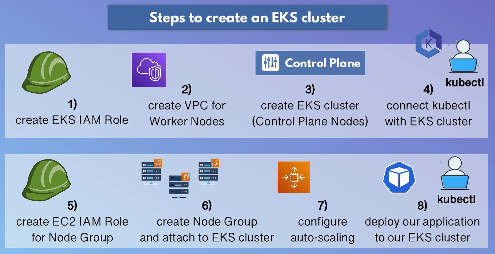
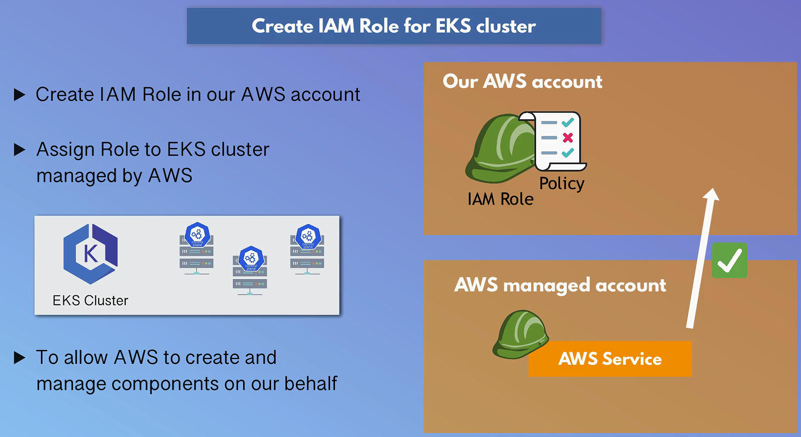
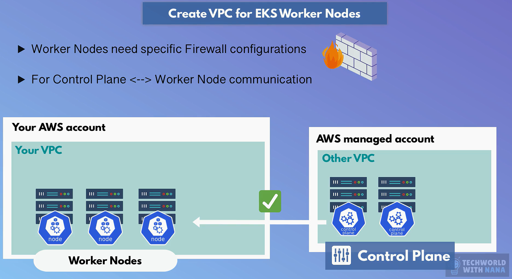
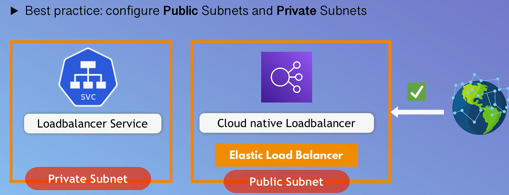
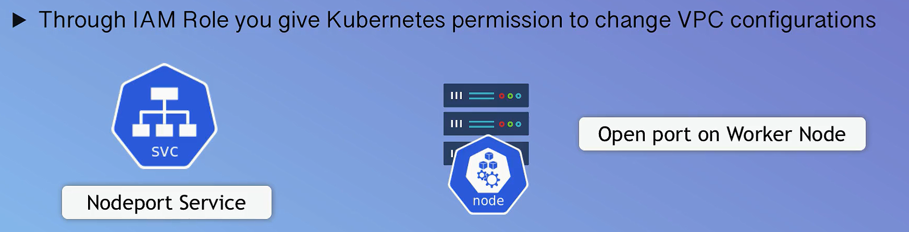
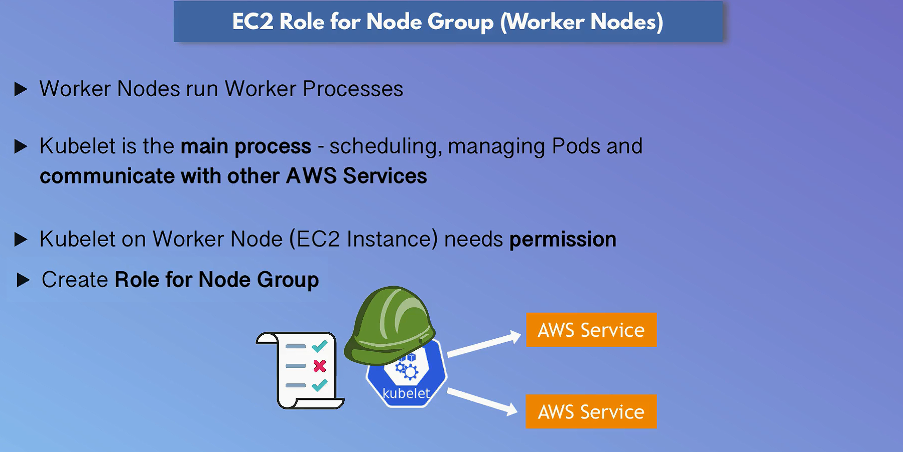
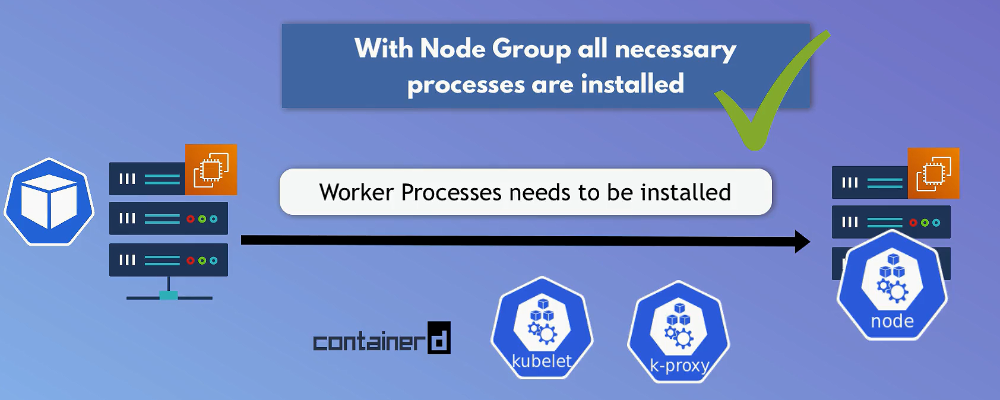

# Amazon Elastic Kubernetes Service (Amazon EKS)


## Components of EKS

### Managed by AWS

1. **Control Plane**: AWS manages the Kubernetes control plane, which includes:
   - **API Server**: Manages API requests and communicates with worker nodes.
   - **Etcd**: Key-value store for cluster data.
   - **Scheduler**: Assigns pods to nodes based on resource availability.
   - **Controller Manager**: Ensures the desired state of the cluster is maintained.

### Managed by You

1. **Worker Nodes**: You need to manage the EC2 instances (or Fargate profiles) where your Kubernetes pods run:
   - **Provision and Configure Nodes**: Launch EC2 instances or set up Fargate profiles.
   - **Node Maintenance**: Patch, update, and manage the lifecycle of your nodes.
   - **Node Autoscaling**: Configure the Kubernetes Cluster Autoscaler if needed.

2. **Networking**: Configure VPC, subnets, security groups, and IAM roles/policies.
3. **Kubernetes Resources**: Deploy and manage Kubernetes resources such as:
   - **Pods**: Basic unit of deployment in Kubernetes.
   - **Deployments**: Define and manage the desired state of your pods.
   - **Services**: Networking components to expose your applications.
   - **ConfigMaps and Secrets**: Manage configuration and sensitive information.
   - **Persistent Volumes**: Manage storage for your stateful applications.

## Cost Considerations

- **Control Plane**: Fixed hourly charge for the EKS control plane.
- **Worker Nodes**: Costs associated with EC2 instances or Fargate profiles used for worker nodes.
- **Additional Costs**: Storage, networking, and additional Kubernetes resources (e.g., EBS volumes for Persistent Volumes).

## When to Use

- You need the full capabilities of Kubernetes.
- You have existing Kubernetes workloads or expertise.
- You require advanced Kubernetes features for scaling and orchestration.
- You plan to use a multi-cloud strategy or need portability across different environments.

## Setup an EKS Cluster from the AWS Console



### Prerequisites

1. **AWS Account**: Ensure you have an AWS account.
2. **IAM Permissions**: Ensure your IAM user has the necessary permissions to create and manage EKS clusters, VPCs, subnets, security groups, and EC2 instances.
3. **kubectl**: Install the Kubernetes command-line tool.
4. **AWS CLI**: Install and configure the AWS CLI.
5. **aws-iam-authenticator**: Install the IAM authenticator for Kubernetes.

### Step-by-Step Setup

#### 1. Create EKS IAM Role



1. **Open the IAM Console**:
   - Navigate to the [IAM console](https://console.aws.amazon.com/iam/).

2. **Create Role**:
   - Click on **Roles** in the left-hand menu, then click **Create role**.
   - Choose **EKS** from the list of services and select **EKS - Cluster**.

3. **Attach Policies**:
   - Attach the policies `AmazonEKSClusterPolicy` and `AmazonEKSServicePolicy`.

4. **Name and Create**:
   - Give your role a name (e.g., `eksClusterRole`) and click **Create role**.

#### 1. Create VPC for Worker Nodes





1. **Open the CloudFormation Console**:
   - Navigate to the [CloudFormation console](https://console.aws.amazon.com/cloudformation/).

2. **Create Stack**:
   - Click on **Create stack** and choose **With new resources (standard)**.

3. **Specify Template**:
   - Under **Specify template**, select **Amazon S3 URL** and enter the URL of the CloudFormation template provided by AWS for creating a VPC for EKS:

     ```link
     https://amazon-eks.s3.us-west-2.amazonaws.com/cloudformation/2020-06-10/amazon-eks-vpc-sample.yaml
     ```

4. **Configure Stack**:
   - Provide a stack name (e.g., `eks-vpc-stack`) and review the parameters. Adjust as necessary.

5. **Create Stack**:
   - Click **Create stack** and wait for the creation to complete.

#### 1. Create an EKS Cluster

1. **Open the EKS Console**:
   - Navigate to the [EKS console](https://console.aws.amazon.com/eks/home).

2. **Create Cluster**:
   - Click on **Add cluster** and then **Create**.

3. **Cluster Configuration**:
   - **Name**: Enter a name for your cluster.
   - **Kubernetes Version**: Select the desired Kubernetes version.
   - **Role ARN**: Select the IAM role created earlier (e.g., `eksClusterRole`).

4. **Networking**:
   - **VPC**: Select the VPC created using CloudFormation.
   - **Subnets**: Select the subnets created in the VPC.
   - **Security Groups**: Choose the default security group.

5. **Cluster Endpoint Access**:
   - Choose the endpoint access type (Public, Private, or Public and Private).

6. **Review and Create**:
   - Review the configuration and click **Create**. Wait for the cluster creation to complete.

#### 1. Connect kubectl with EKS cluster

1. **Update kubeconfig**:
   - Use the AWS CLI to update your kubeconfig file to include your new EKS cluster.

   ```sh
   aws eks --region <region-name> update-kubeconfig --name <cluster-name>
   ```

   Replace `<region-name>` with your AWS region (e.g., `us-west-2`) and `<cluster-name>` with your EKS cluster name.

2. **Verify Configuration**:
   - Ensure `kubectl` is configured correctly by listing the nodes (there may be none initially):

   ```sh
   kubectl get nodes
   ```

#### 1. Create Node Group

1. Create EC2 Role for Node Group

 
 

1. **Open Node Group Section**:

   - In the EKS console, navigate to your cluster and click on the **Compute** tab, then click **Add node group**.

2. **Node Group Configuration**:
   - **Name**: Enter a name for your node group.
   - **Node IAM Role**: Create or select an existing IAM role with `AmazonEKSWorkerNodePolicy`, `AmazonEKS_CNI_Policy`, and `AmazonEC2ContainerRegistryReadOnly` policies attached.

3. **Node Group Details**:
   - **Subnets**: Select the subnets where your worker nodes will be launched.
   - **Instance Type**: Choose the instance type for your worker nodes (e.g., `t3.medium`).
   - **Scaling Configuration**: Set the desired, minimum, and maximum number of nodes.

4. **Review and Create**:
   - Review the node group settings and click **Create**.

### Additional Configurations

1. **Cluster Autoscaler**:
   - Deploy the Kubernetes Cluster Autoscaler to automatically adjust the number of nodes in your cluster based on the demands of your workloads.

   ```sh
   kubectl apply -f https://github.com/kubernetes/autoscaler/releases/download/cluster-autoscaler-<version>/cluster-autoscaler-autodiscover.yaml
   ```

   Replace `<version>` with the desired version of the Cluster Autoscaler.

2. **Set Up Ingress Controller**:
   - Deploy an ingress controller (e.g., ALB Ingress Controller) to manage external access to your services.

   ```sh
   kubectl apply -f https://raw.githubusercontent.com/kubernetes-sigs/aws-alb-ingress-controller/main/docs/examples/alb-ingress-controller.yaml
   ```

3. **Configure Persistent Storage**:
   - Create Persistent Volumes (PVs) and Persistent Volume Claims (PVCs) for stateful applications.
