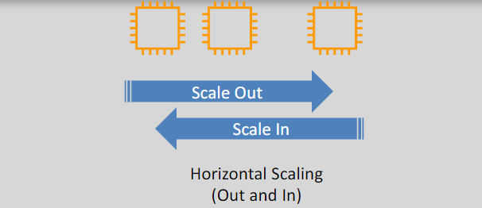
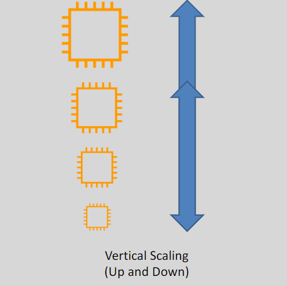

# **Elasticity and Scalability** 🌱

In cloud computing, **Elasticity** and **Scalability** are two essential concepts that help applications handle varying workloads efficiently. Let's break down both terms and explore how they work.

## **Horizontal Scaling vs Vertical Scaling** 🔄

### **Horizontal Scaling (Scale Out/In)** 🌐

- **Horizontal scaling** involves adding more instances (or resources) to distribute the load across multiple systems.
- **Scale out**: Add more servers to handle increased demand.
- **Scale in**: Remove servers when the demand decreases.

**Example**: If your website gets more traffic, you add more EC2 instances to handle the load.

### **Vertical Scaling (Scale Up/Down)** ⬆️⬇️

- **Vertical scaling** means adding more power (CPU, RAM, storage) to an existing instance.
- **Scale up**: Increase resources for a single server to handle more load.
- **Scale down**: Reduce resources when they are no longer needed.

**Example**: If an application needs more memory, you increase the instance size of an EC2 server.

## **Elasticity** 🏗️

**Elasticity** refers to the ability of a system to **automatically** adjust resources according to changes in workload.

- Elasticity ensures that resources are provisioned **and deprovisioned** based on real-time needs, helping optimize costs.
- **Scale out** to meet increased demand and **scale in** when demand decreases, saving costs.
- For example, **Auto Scaling groups** can automatically add or remove EC2 instances to handle changes in traffic.

## **Scalability** 📈

**Scalability** is the system’s ability to handle an increasing amount of work by adding resources, either horizontally (more servers) or vertically (more power to servers).

- **Horizontal Scaling (Scale Out/In)**: Adding or removing servers based on workload demands.
- **Vertical Scaling (Scale Up/Down)**: Increasing or decreasing the size of an individual server (e.g., CPU, RAM).

## **Conclusion** 📚

- **Elasticity** helps adjust resources automatically based on workload changes, ensuring efficient use of resources.
- **Scalability** enables the system to grow by adding more resources, either horizontally (more servers) or vertically (more power to servers).
