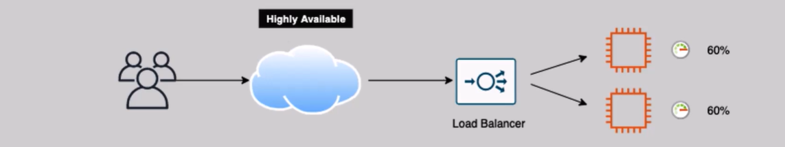
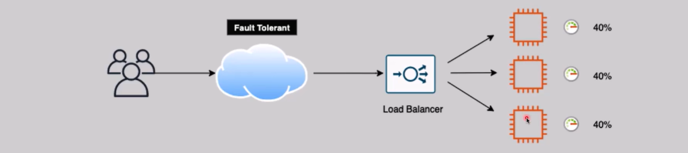
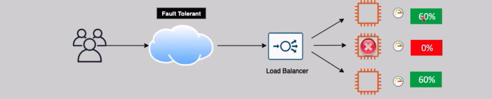

# **High Availability 🆚 Fault Tolerance**

Both **High Availability (HA)** and **Fault Tolerance (FT)** are key concepts in designing resilient systems. While they share the goal of minimizing downtime, they differ in their approach to handling failures and ensuring service continuity.

## **High Availability (HA)** 🌍

**High Availability (HA)** refers to the system’s ability to remain operational and accessible even during some level of failure. The primary goal is to reduce **downtime** and ensure that the service is available, though performance may be affected.

- **Impact on Performance**: There may be **brief interruptions** in service during failover or recovery, but the service will continue to be **available**.

**Example**: In case of a failure, traffic is rerouted to another instance or server, ensuring availability but possibly with a slight delay.

### **High Availability Ideal Case:**

- In normal operation, the system performs as expected without any downtime.
  

### **High Availability Failure Case:**

- If one server or resource fails, the system **fails over** to another healthy resource, maintaining availability, but there might be a **temporary degradation in performance**.
  

## **Fault Tolerance (FT)** 🚀

**Fault Tolerance (FT)** takes availability to the next level by ensuring that the system can continue to operate without any performance degradation, even in the event of **multiple failures**. The goal is to provide **zero interruption** to users and maintain **high performance**.

- **Impact on Performance**: Users experience **no interruptions**, and service is continuously **available** without any degradation, even during failures.

**Example**: The system seamlessly continues to operate by switching to backup resources, and no performance drop is noticed.

### **Fault Tolerance Ideal Case:**

- The system operates without any interruptions, providing optimal performance without any service degradation.
  

### **Fault Tolerance Failure Case:**

- Even if multiple components fail, the system automatically shifts workloads or resources without impacting user experience or performance.
  

## **Key Differences Between High Availability and Fault Tolerance** ⚖️

| **Aspect**             | **High Availability (HA)**                                        | **Fault Tolerance (FT)**                                                             |
| ---------------------- | ----------------------------------------------------------------- | ------------------------------------------------------------------------------------ |
| **Primary Goal**       | Ensure service remains available with minimal downtime            | Ensure continuous availability without performance degradation                       |
| **Performance Impact** | Possible **temporary degradation** in performance during failover | **No performance degradation** during failures                                       |
| **System Behavior**    | **Failover** to another instance in case of failure               | **Seamless operation** with multiple redundancies                                    |
| **Complexity**         | Easier to implement but requires careful planning for failover    | More complex as it requires redundancy and real-time adjustments to ensure no impact |

## **Conclusion** 📚

- **High Availability** aims to minimize downtime, ensuring the service stays available even during failures, but may experience performance degradation during failovers.
- **Fault Tolerance** ensures that there is **no impact** on performance during failures, providing **continuous availability** without interruption.
