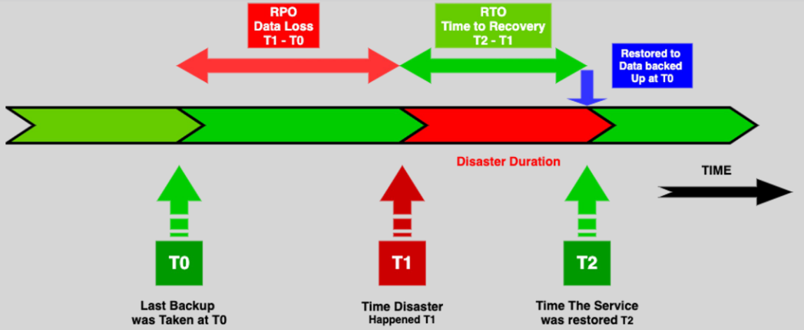

# **Disaster Recovery (DR) in AWS** 💥

**Disasters** can strike unexpectedly, whether due to **natural events**, **system failures**, or **cyber-attacks**. **Disaster Recovery (DR)** is about ensuring that your business can continue to operate and quickly recover from such disruptions.

**AWS** provides powerful tools and services to plan, test, and implement effective disaster recovery strategies, ensuring minimal downtime and data loss.

## **What is Disaster Recovery?** 💡

A **disaster** is any event that causes interruptions to a business's operations, data, or finances.

**Disaster Recovery (DR)** is about being **prepared** for disasters and ensuring that you can recover quickly and effectively. It involves having a solid strategy in place to ensure business continuity during unexpected events.

To create a strong DR strategy, you must:

- **Identify the risks** to your business.
- **Prepare for recovery** by implementing tools and processes.
- **Test** the strategy regularly.

## **Key Terms: RTO and RPO** ⏱️

Before implementing DR, it's important to understand two essential metrics:

### **Recovery Point Objective (RPO) 📉:**

- How much **data loss** is acceptable? For example, "I can lose **1 hour** of data if my system fails."
- It’s the maximum amount of time between backups (e.g., if you back up every hour, your RPO is 1 hour).
  These metrics help set the **recovery goals** and guide you to select the most suitable DR strategy.

### **Recovery Time Objective (RTO) ⏳:**

- How **quickly** do you need to recover your services after an incident? For example, "My website must be up and running within **1 hour** after a failure."
- A shorter RTO means faster recovery from a disaster.

## **Disaster Recovery Strategy Questions** 🧐

When deciding on a DR approach, consider the following key questions to help define your strategy:

1. **What RTO/RPO is acceptable for my business?**

   - **RTO**: How fast do you need to get back online after a failure?
   - **RPO**: How much data loss can your business tolerate?

2. **What resources need to be available at the DR site?**

   - Decide what infrastructure, services, or data must be replicated or stored at the disaster recovery site.

3. **How will I bring up the DR site during a disaster?**

   - Do you have automation in place to quickly scale up your DR resources when needed?

4. **How will failover occur?**
   - Establish a process for switching from your primary environment to the disaster recovery site, whether manually or automatically.

These questions help ensure your DR strategy is **effective** and tailored to your needs.

## **Disaster Recovery Approaches** 🚀

AWS offers different DR strategies based on how fast you want to recover and how much you're willing to spend. Here’s a breakdown:

### **1. Backup and Restore** 🔄

- **What is it?**: Backup your data regularly and store it in AWS. When disaster strikes, restore the data.
- **Pros**: Cheapest option.
- **Cons**: Slow recovery time (can take hours or even days).

### **2. Pilot Light** 🛫

- **What is it?**: Keep a minimal, basic version of your infrastructure running in AWS. Scale it up when needed during a disaster.
- **Pros**: Faster recovery than Backup and Restore.
- **Cons**: Takes time to scale up to full capacity.

### **3. Warm Standby** 🌡️

- **What is it?**: Keep a smaller, scaled-down version of your infrastructure in AWS. When disaster strikes, scale it up to full capacity.
- **Pros**: Faster recovery than Pilot Light.
- **Cons**: More expensive than Pilot Light.

### **4. Multi-Site** 🌍

- **What is it?**: Have a full duplicate of your infrastructure running at all times in AWS. Both sites are **active** and can handle traffic. If one site fails, traffic is directed to the other.
- **Pros**: Fastest recovery, no downtime.
- **Cons**: Most expensive option.

### **Comparison of AWS Disaster Recovery Approaches**

| **DR Approach**                | **Description**                                                                                      | **Cost**                | **Recovery Time**                          | **Data Retention**                          | **Scalability**                             | **Examples of Use Case**                                                |
| ------------------------------ | ---------------------------------------------------------------------------------------------------- | ----------------------- | ------------------------------------------ | ------------------------------------------- | ------------------------------------------- | ----------------------------------------------------------------------- |
| **Backup and Restore**         | Back up data to S3 or another storage service; restore from backups when disaster strikes.           | Cheapest                | Slowest (can take hours or days)           | Backup frequency determines retention       | Manual scaling; not automated               | Archiving, non-critical applications                                    |
| **Pilot Light**                | Maintain a minimal version of the infrastructure in AWS, scale up when needed.                       | Moderate                | Moderate (quicker than Backup and Restore) | Ongoing data replication                    | Faster than Backup and Restore              | Small-scale applications, cost-sensitive DR                             |
| **Warm Standby**               | Keep a scaled-down version of the environment running in AWS. Scale it up during a disaster.         | Higher than Pilot Light | Faster than Pilot Light (minutes)          | Ongoing data replication, always ready      | Automated scaling, quicker than Pilot Light | Web apps, services with moderate uptime requirements                    |
| **Multi-Site (Active/Active)** | Full-scale replica of the infrastructure running in AWS, both sites active and running concurrently. | Most expensive          | Fastest (zero downtime)                    | Full replication and real-time data syncing | Fully automated, no failover needed         | Critical apps with zero tolerance for downtime, high availability needs |

### **Key Takeaways**

- **Backup and Restore** is **cheapest** but offers the **slowest recovery** and **longer downtime**.
- **Pilot Light** is a **moderate-cost** solution with **faster recovery** than Backup and Restore.
- **Warm Standby** offers **fast recovery** and **automated scaling** but is **more expensive**.
- **Multi-Site (Active/Active)** is the **fastest** solution with **zero downtime** but comes with the **highest cost**.

## **AWS Services for Disaster Recovery** ⚙️

AWS provides several powerful services that make disaster recovery easier and more effective:

- **Amazon S3**: For backup and storage across regions.
- **Amazon EC2**: To launch your infrastructure in the DR site.
- **AWS Lambda**: Automate tasks during recovery.
- **Amazon Route 53**: For DNS failover, redirecting traffic to the backup site.
- **AWS CloudFormation**: Automates infrastructure setup and scaling.

## **Summary** 📚

- **Disaster Recovery (DR)** is about being prepared and recovering quickly after a disaster to minimize downtime and data loss.
- AWS offers several DR approaches based on the **speed of recovery** and **cost**, including **Backup and Restore**, **Pilot Light**, **Warm Standby**, and **Multi-Site**.
- Key metrics like **RTO** (how fast you need to recover) and **RPO** (how much data loss is acceptable) help determine which DR approach is right for your business.
- AWS services such as **S3**, **EC2**, **Lambda**, and **Route 53** can help automate and streamline your disaster recovery process.
