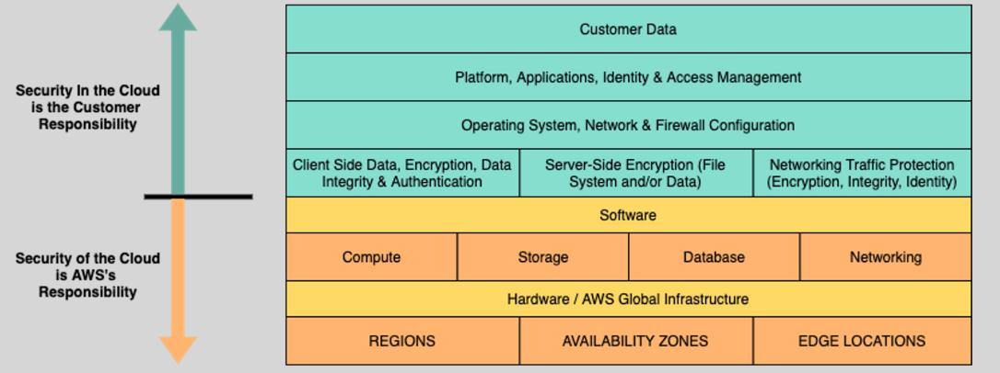
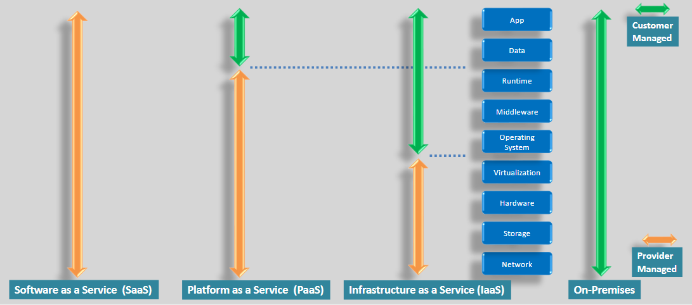

# **AWS Shared Responsibility Model** 🛠️

The **AWS Shared Responsibility Model** defines the **division of security responsibilities** between AWS and the customer. Understanding this model is crucial to know which security tasks AWS handles and which ones you are responsible for.

## **AWS vs. Customer Responsibilities** ⚖️

### **1. AWS Responsibilities** 🏢

AWS handles the **underlying infrastructure** and **physical security** of the cloud. Here's what AWS is responsible for:

- **Maintaining physical data centers** and the infrastructure (servers, storage devices).
- **Patching the infrastructure** and maintaining physical security (firewalls, devices).
- **Protecting the cloud infrastructure** against security threats like **IP spoofing** and **packet sniffing**.
- **Decommissioning** old hardware and ensuring the physical security of their data centers.

### **2. Customer Responsibilities** 👤

You, as the customer, are responsible for securing and managing your **data** and **applications** in the cloud. Here’s what you manage:

- **Operating system management** (updating and securing the OS on EC2 instances).
- **Installing and securing your applications** on AWS instances.
- **Configuring security groups** and other network controls for your instances.
- **Managing EBS volume encryption** and securing **data in-transit**.
- **Ensuring data integrity** and applying proper authentication controls.

## **Vary Based on Cloud Services** 🌐

The **shared responsibility** model changes slightly depending on the service. Here’s how it works for a few AWS services:

### **For Amazon S3** (Storage Service)

- **AWS is responsible** for:

  - The infrastructure layer (hardware, servers).
  - Physical and environmental security of data.
  - Managing the platform.

- **You (the customer) are responsible** for:
  - Storing and retrieving data.
  - Managing security, encryption, and access control to your data.

### **For Amazon RDS** (Database Service):

- **AWS is responsible** for:

  - The infrastructure layer (hardware, OS patching, compute capacity).
  - Backup management and replacement of failed database instances.

- **You (the customer) are responsible** for:
  - Managing access controls, data security, and encryption.
  - Configuring database security (e.g., user roles and permissions).

## **Shared Responsibilities** 🛡️

While AWS handles the infrastructure and physical security, there are areas where AWS and the customer share responsibilities:

- **Patch Management**: Both parties need to ensure software is updated and secure.
- **Configuration Management**: You configure your systems, and AWS manages the physical infrastructure configurations.
- **Training and Awareness**: Both AWS and customers need to ensure that proper security measures are implemented and staff are trained.

## **Summary** 📚

- **AWS is responsible for** the security **of** the cloud infrastructure (hardware, data centers).
- **You are responsible for** the security **in** the cloud (data, applications, and configuration).
- Some services like **S3** and **RDS** have shared responsibilities, where AWS handles most infrastructure, but customers are responsible for securing their data and configurations.
