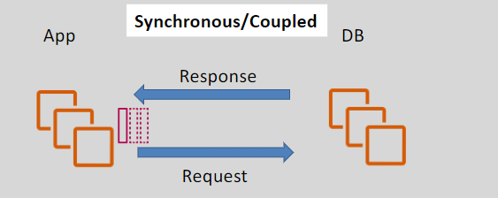
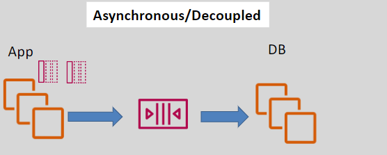

# **Prerequisite of SQS and SNS** 🛠️

Before diving into the details of **Amazon SQS** (Simple Queue Service) and **Amazon SNS** (Simple Notification Service), it’s important to understand the fundamental concepts that make these services so effective for modern, distributed architectures. In this section, we’ll cover:

- **Asynchronous vs. Synchronous Application Integration**
- **Pull vs. Push Mechanisms**
- **Message Queues**

These concepts form the backbone of how communication works in microservices and serverless applications, and understanding them will give you a better foundation for working with **SQS** and **SNS**.

## **Asynchronous vs. Synchronous Application Integration** 🔄

### **Synchronous (Coupled) Communication** ⏳

- **Synchronous communication** occurs when the **sender** of a message or request waits for a **response** before proceeding.
- This creates a **tight coupling** between systems because the sender cannot move forward until the response is received.

**Example**: A web server sends a request to a database for user data and waits until it gets the response before it can continue processing other requests.

### **Asynchronous (Decoupled) Communication** 📬

- **Asynchronous communication** enables the **sender** to send a message or request and then continue processing without waiting for an immediate response.
- This leads to a **decoupling** of components, allowing them to operate independently and scale based on demand.

**Example**: A web server sends a message to an **SQS queue**, and instead of waiting for a reply, it moves on to handle other requests. A background worker consumes the message from the queue later, independent of the server’s activity.

## **Pull vs. Push Mechanisms** 🔄📤

The way messages are delivered between producers and consumers plays a key role in how **SQS** and **SNS** operate. These services follow **different communication mechanisms** to deliver messages to consumers.

### **Pull Mechanism (SQS)** 🪝

- **SQS** operates on a **pull-based mechanism**.
- **Consumers** actively **poll** the queue for messages and **pull** them when they are ready to process.
- The consumer controls when to retrieve messages and how often, offering **flexibility** in how they process data.

**How it Works in SQS**:

1. The **producer** places messages in the queue.
2. The **consumer** periodically pulls messages from the queue and processes them.
3. If no messages are available, the consumer waits or checks again later.

### **Push Mechanism (SNS)** 📲

- **SNS** uses a **push-based mechanism**.
- When a **publisher** sends a message to an SNS topic, the message is **pushed** immediately to all **subscribed endpoints** (e.g., Lambda, SQS, HTTP, email).
- Subscribers **do not need to poll** for messages; they receive the message automatically as soon as it's published.

**How it Works in SNS**:

1. The **publisher** sends messages to an SNS topic.
2. The **subscribers** receive the message immediately without having to check for new messages.

## **Message Queues** 📬

Understanding message queues is vital before exploring **SQS**. A message queue is a communication method that temporarily stores messages sent between different components of a system.

### **What is a Message Queue?**

A **message queue** is a temporary storage area for messages that need to be processed. Messages are stored in the queue until they are consumed by the system. This ensures **reliable** delivery, even if the consumer isn't ready to process the message immediately.

### **Why Use Message Queues?**

1. **Decoupling**: Allows different components to work independently, reducing interdependence.
2. **Scalability**: Producers and consumers can scale independently, accommodating fluctuating workloads.
3. **Reliability**: SQS guarantees that messages are stored reliably until they are processed.

## **Summary of Prerequisite Concepts** 📚

- **Synchronous communication** requires waiting for a response before continuing, leading to tight coupling between components.
- **Asynchronous communication** allows decoupled systems to work independently, improving scalability and flexibility.
- **Pull-based mechanisms** (SQS) involve consumers fetching messages, while **push-based mechanisms** (SNS) automatically deliver messages to subscribers.
- **Message queues** are vital for decoupling, scalability, and reliable message delivery between components.
