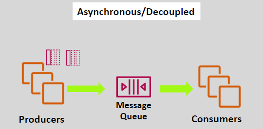
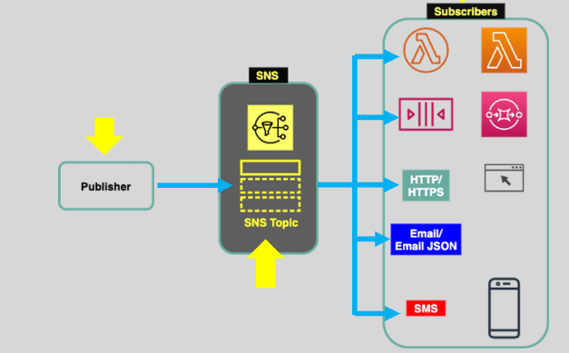

# **Basics of SQS and SNS** 🛠️

In modern cloud architectures, especially in **microservices** or **serverless applications**, communication between components must be **asynchronous** and **decoupled**. **Amazon SQS** (Simple Queue Service) and **Amazon SNS** (Simple Notification Service) are two AWS services that enable efficient and scalable communication. Let’s dive into how both services work and when to use them!

## **Amazon Simple Queue Service (SQS)** 🗣️

**Amazon SQS** is a fully managed message queue service that decouples application components by storing messages temporarily until they can be processed.

### **Key Features of SQS**:

- **Fully Managed**: AWS manages scaling, infrastructure, and reliability.
- **Asynchronous Communication**: SQS allows components to communicate without waiting for immediate responses.
- **Scalability**: You can scale producers, queues, and consumers independently, based on traffic and processing needs.
- **Reliable**: Messages are stored safely in the queue until they are consumed and then deleted.

**Common Use Case**:

- An e-commerce website where the **payment processing** system produces payment requests, and a separate service consumes those requests for processing.

### **How SQS Works** 🛠️

1. **Producer** sends a message to the **SQS Queue**.
2. **Consumer** retrieves the message from the queue and processes it asynchronously.
3. Once the consumer successfully processes the message, it is deleted from the queue.

**Example**:

- A **payment service** places payment tasks into an SQS queue.
- A **backend worker** fetches the payment tasks and processes them when available.

## **Amazon Simple Notification Service (SNS) 101** 📢

While SQS is a **point-to-point** service, **SNS** is a **pub/sub (publish/subscribe)** messaging service designed for **broadcasting messages** to multiple endpoints.

### **What is SNS?**

SNS is a fully managed **pub/sub** service that enables you to send messages to multiple subscribers simultaneously. It supports various communication protocols such as **SMS**, **email**, and **HTTP**, and can trigger actions like **Lambda functions**.

#### **Key Features of SNS**:

- **Publisher-Subscriber Model**: Publishers send messages to an SNS topic, and subscribers receive those messages.
- **Fully Managed**: AWS handles scaling, availability, and infrastructure for SNS.
- **Flexible**: SNS supports multiple communication protocols like **SMS**, **email**, **HTTP**, and **Lambda**.
- **Reliable**: SNS stores messages across multiple availability zones (AZs) to ensure durability.

**Common Use Case**:

- A **news website** uses SNS to send notifications to subscribers when a new article is published.

### **How SNS Works** 📨

1. **Publisher** sends a message to the **SNS Topic**.
2. **Subscribers** receive messages from the SNS topic through various protocols (e.g., SMS, Lambda, HTTP).
3. Messages are delivered to all subscribers immediately after being published.

**Example**:

- A **stock price service** publishes a price update to an SNS topic.
- Multiple consumers, such as **email subscribers** and **real-time monitoring systems**, are subscribed to the SNS topic and immediately receive the update.

## **SQS vs SNS Comparison** 📊

| Feature                 | **Amazon SQS**                                    | **Amazon SNS**                                    |
| ----------------------- | ------------------------------------------------- | ------------------------------------------------- |
| **Communication Style** | Point-to-Point (Queue-based)                      | Pub/Sub (Broadcasting messages)                   |
| **Use Case**            | Decoupling microservices, event-driven apps       | Broadcasting notifications to multiple endpoints  |
| **Message Retention**   | Messages are retained in the queue until consumed | Messages are immediately pushed to subscribers    |
| **Consumers**           | One consumer per message (one-to-one)             | Multiple subscribers per message (one-to-many)    |
| **Protocols Supported** | HTTP, HTTPS, SQS, Lambda                          | Email, SMS, HTTP, HTTPS, SQS, Lambda, Mobile Push |
| **Message Processing**  | Messages are processed once and deleted           | Messages are pushed to subscribers immediately    |
| **Use Case Example**    | Task queue for payment processing                 | Sending notifications to users or systems         |

## **When to Use SQS and SNS** 🧐

### **Use SQS When:**

- You need **reliable message storage** for decoupling services.
- Your application needs **asynchronous processing** and message retention.
- You want to **queue tasks** for later processing, where the timing of consumer activity is less predictable.

### **Use SNS When:**

- You need to **broadcast** messages to multiple endpoints at once.
- You require **real-time** delivery of messages across different types of recipients.
- You want to push messages to multiple subscribers simultaneously, without polling.

## **Best Practices for Using SQS and SNS** 🎯

1. **Use SQS to Decouple Services**: Let your services communicate asynchronously via queues to increase system resilience.
2. **Use SNS for Real-Time Notifications**: Use SNS to notify multiple endpoints (e.g., apps, Lambda, email, etc.) of critical events in real-time.
3. **Combine SQS and SNS**: You can combine both services for **complex workflows**:
   - Use **SNS** to send real-time notifications to many consumers.
   - Use **SQS** for tasks that require **delayed processing** or need to be **handled sequentially**.

## **Summary** 📚

- **Amazon SQS** and **Amazon SNS** are both core components for building scalable, decoupled, and **asynchronous communication** in AWS applications.
- **SQS** provides a **message queue** to decouple components and allows reliable **message storage** and **task processing**.
- **SNS** is a **pub/sub service** designed for broadcasting messages to multiple subscribers (e.g., email, SMS, HTTP endpoints).
- Both services use **different mechanisms** for communication: **SQS uses a pull mechanism**, while **SNS uses a push mechanism**.
