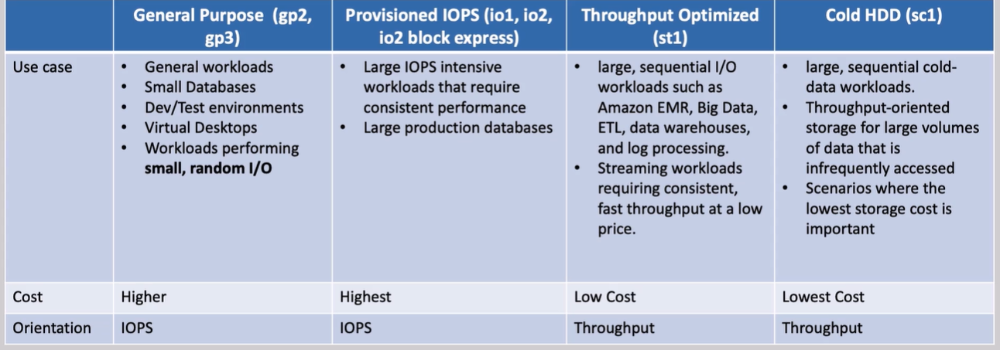

# **Amazon EBS (Elastic Block Store) 📦**

Amazon Elastic Block Store (EBS) provides highly available and reliable block-level storage for use with EC2 instances. It offers persistent storage that is independent of EC2 instance lifecycles. EBS volumes behave like raw, unformatted block devices that can be attached to a running instance, providing a simple solution for **storing data**, **operating systems**, and **applications**.

## **Key Features of EBS** 🔑

- **Persistent Storage**: Data is retained even if the EC2 instance is stopped or terminated.
- **Replicated for Durability**: EBS volumes are automatically replicated across multiple servers within the same Availability Zone (AZ) to protect against hardware failures.
- **Single Instance Attachment**: By default, each EBS volume is attached to a single EC2 instance in a specific AZ, ensuring low-latency and high-performance data access.
- **Same AZ Requirement**: Both the EC2 instance and the EBS volume must reside in the same Availability Zone (AZ).
- **Multi-Attach**: Certain volume types, like **io1** and **io2**, support **multi-attach** to multiple instances within the same AZ for higher application availability (e.g., for clustered environments).

## **Types of EBS Volumes 🏅**

EBS provides different types of volumes that are optimized for various workloads. Here’s an overview of the most commonly used EBS volume types:

### **1. SSD-backed Volumes 🚅 (For Random I/Os)**

- **General Purpose SSD (gp3 and gp2)**: 💻

  - **Use Case**: Suitable for a wide range of transactional and random I/O applications like databases, development environments, and boot volumes.
  - **Key Feature**: Provides a balance between price and performance.
  - **Performance**: Up to 16,000 IOPS (for gp3), and 3,000 IOPS by default (for gp2).

- **Provisioned IOPS SSD (io1 and io2)**: ⚙️
  - **Use Case**: Ideal for mission-critical applications requiring high performance and low-latency access, such as high-performance databases.
  - **Key Feature**: Can be configured to provide guaranteed IOPS with up to 64,000 IOPS for each volume (on supported EC2 instance types).
  - **Performance**: Supports up to 64,000 IOPS per volume.

### **2. HDD-backed Volumes 🐌 (For Sequential I/Os)**

- **Throughput Optimized HDD (st1)**: 🚌

  - **Use Case**: Suitable for large, sequential I/O workloads like big data analytics, log processing, or media workflows.
  - **Key Feature**: Provides high throughput at a lower cost compared to SSD volumes.
  - **Performance**: Up to 500 MB/s throughput and 500 IOPS.

- **Cold HDD (sc1)**: ❄️
  - **Use Case**: Best suited for infrequently accessed data such as archival storage.
  - **Key Feature**: Low-cost storage designed for workloads with infrequent access.
  - **Performance**: Lower throughput and IOPS than st1.

## **Multi-Attach for EBS Volumes 🔗**

The **Multi-Attach** feature allows a provisioned IOPS SSD (io1 or io2) EBS volume to be attached to multiple EC2 instances (up to 16 in the same AZ). This capability is useful for high-availability applications where multiple EC2 instances need to access the same volume concurrently.

- **Key Feature**: Multiple EC2 instances have **full read and write** access to the volume.
- **Use Case**: Commonly used in clustered environments or applications that require simultaneous access to the same data, such as clustered databases or shared file systems.
- **Limitations**: Cannot be used as a boot volume, and both instances must be in the same AZ.

- **Write Operations**: When using Multi-Attach, it is crucial to manage concurrent write operations carefully to prevent data corruption or inconsistency. While EBS allows multiple instances to write to the volume, the application managing the writes must ensure that write conflicts (such as writing to the same file at the same time) are prevented. **EBS** itself does **not** handle synchronization of writes between instances, so applications must implement mechanisms like **distributed locks** or **application-level concurrency control** to avoid conflicts.

## **Modifying EBS Volume Attributes 🔧**

With **Elastic Volumes**, you can modify the size, performance, and type of your EBS volumes dynamically without detaching them from the EC2 instance. This feature is particularly useful for scaling storage without downtime.

- **Size Modifications**: You can increase the size of your volume but **cannot decrease** it.
- **Performance and Type Modifications**: You can switch between volume types (e.g., from gp2 to io1) and modify performance parameters like IOPS and throughput.

## **Instance Store Volumes 🔲**

In addition to EBS, AWS EC2 instances may have **instance store volumes**, which provide temporary block-level storage. These volumes are ideal for use cases like caching and temporary data storage, where data persistence is not critical.

- **Key Feature**: Data stored in instance stores is **temporary** and lost when the instance is stopped or terminated.
- **Performance**: Instance stores can provide high throughput and low-latency access with up to **millions of IOPS** for high-performance workloads.
- **Use Case**: Suitable for **buffering**, **caching**, **scratch data**, or **high IOPS OLTP databases**, **relational DBs** and **Non-relational DBs** (on certain instance types like **i3**).

## **Comparison of EBS Volume Types 🆚**

| Volume Type                        | Use Case                   | Performance Characteristics                         |
| ---------------------------------- | -------------------------- | --------------------------------------------------- |
| **General Purpose SSD (gp3)**      | General-purpose workloads  | Balanced price and performance, up to 16,000 IOPS   |
| **Provisioned IOPS SSD (io1/io2)** | Mission-critical databases | High IOPS (up to 64,000), low-latency performance   |
| **Throughput Optimized HDD (st1)** | Big data, data warehousing | High throughput (500 MB/s) for sequential workloads |
| **Cold HDD (sc1)**                 | Archival storage           | Low cost for infrequent access data                 |

## **Conclusion 🚀**

EBS provides a variety of volume types optimized for different use cases, from high-performance databases to low-cost archival storage. With features like **Multi-Attach** and **Elastic Volumes**, EBS offers flexibility and scalability, making it ideal for a wide range of applications in the AWS cloud. Understanding the different volume types and their use cases helps you select the right storage solution for your workload’s needs.
