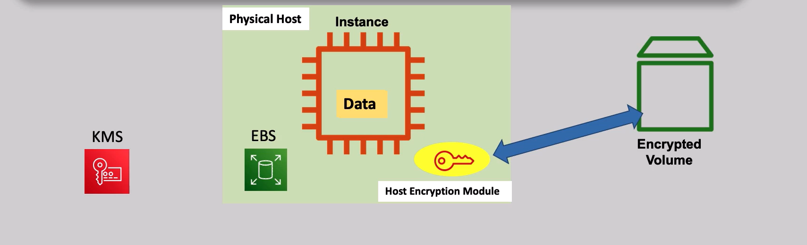
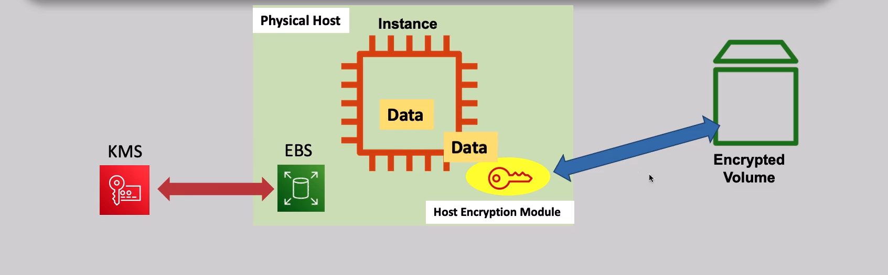
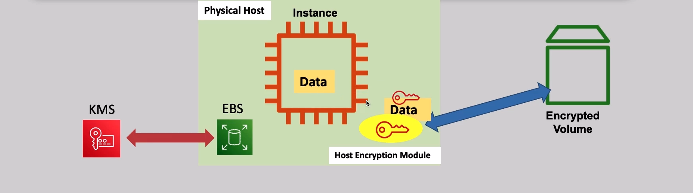
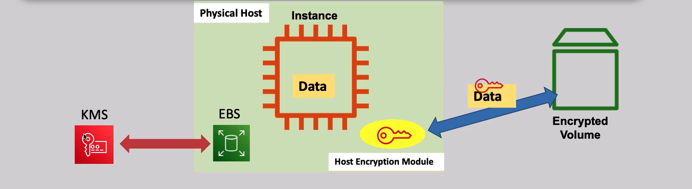
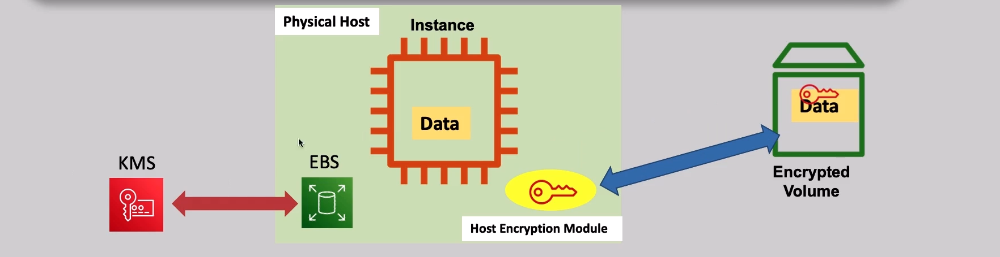

# EBS Encryption

## Encryption Lifecycle

- KMS stores key that encrypt data key
- physical host contain separate components which
  1.  ebs: responsible for communicate with ebs volume
  1.  instance : you separated instance that generate data and send it to host encryption to encrypt it and reviece decreptead data from it
  1.  host encryption module: responsible for encrypt and decrypt the data from instance to ebs volume
- ebs volume

**steps:**

