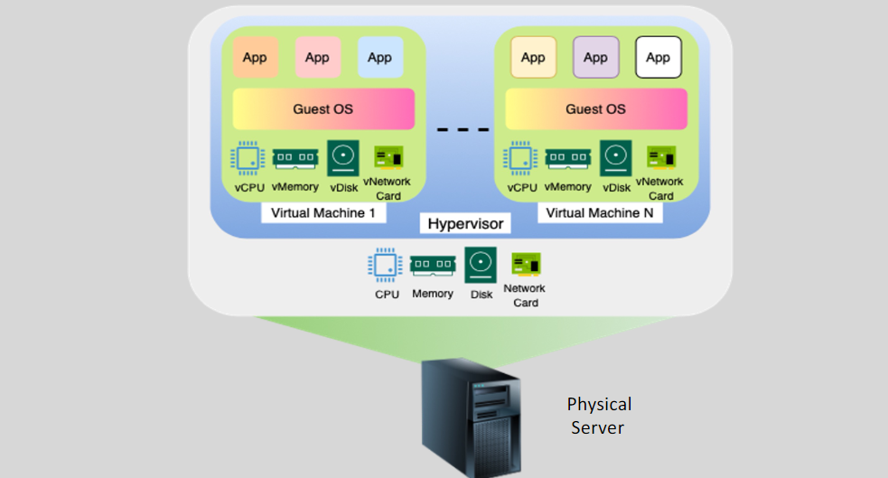

# **Hypervisors** 🖥️

## **What is a Hypervisor?** 🤔

A **hypervisor** is **software** that allows multiple **virtual machines (VMs)** to run simultaneously on a **single physical machine**. The hypervisor does this by abstracting the hardware resources (such as CPU, memory, and storage) and allocating them to each VM. Hypervisors are essential for **virtualization**, enabling the efficient use of physical resources.

In the context of **AWS**, the **hypervisor** plays a central role in running virtual instances (like EC2 instances), ensuring that each instance gets its share of CPU, memory, and storage from the physical hardware.

---

## **Types of Hypervisors** 🔧

There are two primary types of hypervisors, and AWS uses a combination of these depending on the instance and the underlying hardware.

1. **Type 1 Hypervisor (Bare Metal)** 🏗️

   - **Runs directly on the physical hardware** without an underlying operating system.
   - Examples: **Xen**, **AWS Nitro**.

2. **Type 2 Hypervisor (Hosted)** 🖱️
   - **Runs on top of an existing operating system**, using the host OS to manage hardware resources.
   - Examples: VMware **Workstation**, **VirtualBox** (not used in AWS).

In AWS, **Type 1 hypervisors** are used for their production environments, including **Xen** and **Nitro**.

---

## **AWS Hypervisors: Xen vs Nitro** ⚔️

Amazon Web Services (AWS) uses two primary hypervisors to manage EC2 instances: **Xen** and **Nitro**. The transition from Xen to Nitro represents a significant leap forward in terms of **performance**, **security**, and **scalability**. Here’s a deep dive into the differences between the two and how they impact your EC2 workloads.

---

### **1. Xen Hypervisor in AWS:** 💻

- **Xen** was the original hypervisor used by AWS for managing EC2 instances. It powered many of the earlier EC2 instance types and is still used for some legacy workloads.

#### **Key Features**:

- **Open-source**: Xen is an open-source hypervisor widely adopted in the industry. It’s used not only by AWS but also in many other cloud providers and virtualization platforms.
- **Domain-based architecture**: Xen uses a **domain-based architecture**, where each EC2 instance (or "domain") operates in a virtualized environment with its own virtual CPU, memory, and network interfaces.
- **Security**: Provides strong isolation between virtual machines (VMs) using its domain architecture, ensuring that each instance is isolated from the others.
- **Resource Management**: Xen uses the **host machine's resources** (CPU, memory) to manage multiple EC2 instances. It operates as a **Type-1 hypervisor**, running directly on the hardware (bare metal), with other software instances running on top.

#### **Performance Considerations**:

- While effective, Xen introduces some **overhead** due to the **virtualization layer** and its resource management model. This overhead can impact performance in workloads requiring high IOPS (Input/Output Operations Per Second), low latency, or fast network throughput.
- **Legacy EC2 Instance Types**: Older instance types like **m3** and **c3** use Xen as the underlying hypervisor.

---

### **2. AWS Nitro Hypervisor:** 🚀

AWS introduced the **Nitro System** as the next-generation hypervisor designed to address the limitations of Xen. It offers **better performance**, **enhanced security**, and **improved scalability**.

#### **Key Features**:

- **Lightweight Hypervisor**: The Nitro hypervisor is much lighter than Xen, with most of the resource management being offloaded to dedicated **hardware** components known as **Nitro Cards**. This results in minimal overhead.
- **Dedicated Hardware**: The Nitro system offloads functions like networking, storage, and security to **dedicated hardware**, enabling the hypervisor to focus solely on CPU and memory management.
- **Security**: Nitro enhances security with **hardware root of trust**, which ensures that only trusted code runs on the system. This is especially important in high-security environments where data isolation and integrity are paramount.
- **Performance**: By offloading networking and storage functions to specialized hardware, the Nitro system provides **lower latency**, **higher throughput**, and **better overall performance** compared to Xen.

#### **Resource Management**:

- **CPU and Memory**: The Nitro hypervisor allocates CPU and memory resources to EC2 instances, but much of the resource management is handled by dedicated **Nitro Cards**, reducing the load on the hypervisor itself.
- **Storage**: The Nitro system integrates tightly with **Elastic Block Store (EBS)** for persistent storage, providing **faster disk I/O**.
- **Networking**: Nitro uses **Elastic Network Adapter (ENA)**, a high-performance network interface that supports **low-latency** and **high-throughput networking**.

#### **Performance Considerations**:

- **Higher Performance**: Nitro-based instances, such as **C5**, **M5**, and **R5** series, deliver better performance with significantly reduced latency and faster networking speeds compared to Xen.
- **Lower Overhead**: With fewer resources devoted to the hypervisor itself, Nitro instances can provide closer to **bare-metal performance** for EC2 workloads.

---

### **Comparison: Xen vs AWS Nitro** 🔍

| **Feature**                       | **Xen Hypervisor**                             | **AWS Nitro Hypervisor**                                                                                           |
| --------------------------------- | ---------------------------------------------- | ------------------------------------------------------------------------------------------------------------------ |
| **Hypervisor Type**               | Type 1 (Bare Metal)                            | Type 1 (Bare Metal)                                                                                                |
| **Security**                      | Strong isolation between VMs                   | Enhanced isolation with **hardware root of trust** and stronger instance isolation                                 |
| **Performance**                   | Moderate overhead                              | Low overhead, hardware-accelerated network and storage                                                             |
| **Resource Management**           | Managed by Xen hypervisor                      | Offloads network, storage, and security to dedicated hardware                                                      |
| **Scalability**                   | Supports large-scale deployments               | Optimized for **dynamic scaling** with **faster instance provisioning**                                            |
| **Use Cases**                     | Older EC2 instance types                       | Newer EC2 instance types, high-performance workloads like **AI**, **machine learning**, and **big data analytics** |
| **Networking**                    | Standard performance                           | **High-speed ENA** for **low-latency**, **high-throughput** networking                                             |
| **Storage**                       | Standard EBS performance                       | Enhanced EBS performance with **high IOPS** and **high-speed storage**                                             |
| **Support for Instance Families** | Limited to older instance families like M3, C3 | Support for the latest generation instance types like **C5**, **M5**, **R5**                                       |

---

### **Additional Enhancements in Nitro:**

1. **Instance Provisioning Speed**:

   - Nitro offers **faster instance provisioning** than Xen. Because of its simplified hypervisor architecture, Nitro instances can be launched more quickly, providing better **dynamic scaling** for workloads with fluctuating demand.

2. **Lower Latency**:

   - The Nitro system reduces latency significantly by offloading most of the management tasks to dedicated hardware components. This is particularly useful for **real-time applications** such as **high-frequency trading** or **live streaming**.

3. **Better Support for Modern Workloads**:

   - Nitro is built with modern workloads in mind. **Machine Learning (ML)**, **big data processing**, and **AI applications** benefit greatly from Nitro’s ability to deliver higher performance, more compute power, and enhanced scalability.

4. **Future-Proof Architecture**:
   - Nitro is a forward-thinking platform designed to scale with future EC2 innovations. By separating hardware and software duties, it allows AWS to incorporate more advanced hardware features without significant changes to the hypervisor itself.

---

## **Typical Physical Server for Hypervisors** 🖥️💾

| **Component** | **Typical Size for Hypervisor Host**         |
| ------------- | -------------------------------------------- |
| **CPU**       | **16–64 cores** (e.g., Intel Xeon, AMD EPYC) |
| **RAM**       | **64GB–512GB** (e.g., DDR4 memory)           |
| **Storage**   | **1TB–10TB** (combination of SSDs and HDDs)  |
| **Network**   | **1GbE–40GbE NICs**                          |
| **GPU**       | **Optional** (for AI/graphics workloads)     |

---

## **Why AWS Uses Both Xen and Nitro** 🔄

- AWS uses **Xen** for older EC2 instances and **Nitro** for newer, high-performance instances.
- **Xen** is still in use for **legacy support**, while **Nitro** offers better **performance**, **security**, and **scalability** for **modern workloads**.

---

## **Conclusion** 🌟

- **Xen** and **AWS Nitro** are the main hypervisors used in **AWS EC2 instances**.
- **Xen** has been the backbone of AWS's virtualization, but **Nitro** is a newer, more efficient, and secure system that reduces overhead, improves performance, and enhances scalability.
- The **physical hardware** (servers) running these hypervisors must be powerful enough to handle **multiple VMs** with large resource allocations (CPU, RAM, and storage).

AWS's adoption of the **Nitro system** shows its commitment to improving **performance**, **security**, and **efficiency** in its cloud infrastructure. The **lightweight design** of Nitro ensures that the **hypervisor** uses minimal resources, allowing EC2 instances to run faster and with **better isolation**.

This **virtualization** system is the foundation for all **AWS cloud services** like EC2, enabling **scalable**, **cost-effective**, and **secure** cloud environments.
