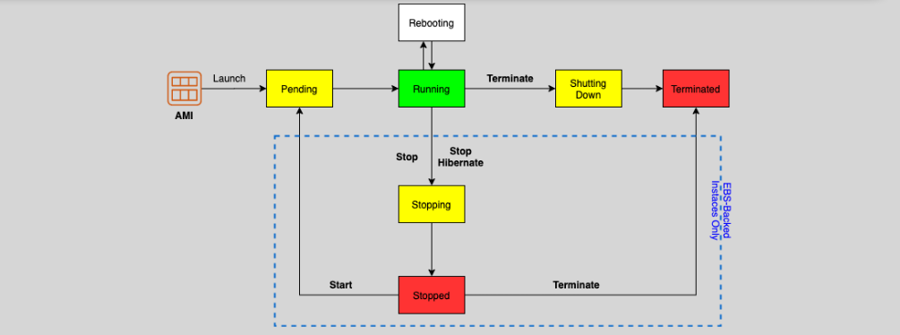

# EC2 Instance Lifecycle 🚀

Understanding the lifecycle of an **EC2 instance** is crucial for managing your cloud resources efficiently. Here’s a breakdown of the **EC2 instance lifecycle** and its various states:

## **1. Launching (Pending) 🔄**

When you launch an EC2 instance, it starts in the **Pending** state. In this state, the instance is being initialized by AWS. The instance is not yet running, and AWS is provisioning the resources.

- **Billing**: The instance is not billed yet in the Pending state.

## **2. Running 🟢**

Once the instance is successfully initialized, it transitions to the **Running** state. This is the state where your instance is active and fully functional. You can start interacting with it and connect to it via SSH (for Linux instances) or RDP (for Windows instances).

- **Billing**: Your instance is **billed** while it is in the Running state.

## **3. Rebooting 🔄**

The **Rebooting** state happens when you restart the instance. This is different from terminating or stopping the instance, as the instance remains **running** but is temporarily rebooted. The system is rebooted, but the underlying instance continues to exist without being stopped or terminated.

- **Billing**: The instance is still **billed** in this state, as it remains running.

## **4. Stopping 🟡**

If you stop an instance (using the **Stop** option), it moves into the **Stopping** state, and then into the **Stopped** state after the operation is complete. Stopping an instance shuts it down and releases the resources, but the instance is still available in your EC2 console.

- **Billing**: You **are not billed** for instance usage while it is in the **Stopped** state. However, you may still incur charges for **EBS storage** (if using EBS-backed instances). If you're using an **instance store** instead of EBS, stopping the instance deletes all data on the instance store.

## **5. Hibernate 🟡**

In the **Hibernate** state, EC2 saves the instance’s memory contents (RAM) to the **EBS root volume** before stopping. When you restart the instance, it will resume from where it left off, including all running processes, network connections, and application states. This feature is useful for workloads that require quick restarts.

- **Billing**: Hibernate incurs the same billing as stopping but adds an **EBS storage charge** for saving the memory state. Since the instance is not running, no compute charges are incurred while it is hibernated.

- **Key Benefit**: Unlike a stop, the instance **resumes exactly where it left off**, which is a time-saver for workloads that require quick restarts.

- `Hibernate enabled at launch`
  - disabled by default
  - additional details > stop - hibernate behavior > enabled

## **6. Stopped 🟥**

When the instance has been successfully stopped, it enters the **Stopped** state. The instance is no longer running and can be started again at a later time. Any **EBS volumes** attached to the instance remain, but the instance itself does not incur compute charges.

- **Billing**: You are **not billed** for compute usage, but **EBS storage charges** may apply. **Note**: If you're using an **EBS-backed root volume**, the storage is preserved, and you’ll incur storage costs. However, if the instance uses an **instance store**, it will lose all data upon stopping.

## **7. Terminating (Terminated) ❌**

When an EC2 instance is terminated, it is completely deleted, and the instance is permanently removed. Once the instance is in the **Terminated** state, you cannot restart it, and it is no longer available in your account.

- **Billing**: **No billing** applies for terminated instances, and you stop incurring charges once the termination is complete.

## **Detailed Lifecycle Process**

1. **Launch (Pending)** → EC2 instance starts its provisioning process.
2. **Running** → Instance is ready for use.
3. **Reboot** → Restarts the instance without terminating it.
4. **Stop (Stopping → Stopped)** → Temporarily halts the instance (but does not delete it).
5. **Hibernate** → Suspends instance memory to disk before stopping.
6. **Terminate (Terminated)** → The instance is permanently deleted and no longer billed.

## **Billing Considerations** 💰

- **Running & Rebooting States**: The instance incurs compute charges.
- **Stopped State**: You don’t incur compute charges but will continue to incur charges for **EBS storage** (whether using EBS or instance store).
- **Terminated**: No charges unless resources (like EBS volumes) are still attached to the instance.

## **Notes** ⚠️

- **EBS-Backed Instances**: Hibernation only works with **EBS-backed instances**. **Instance store volumes** do not support hibernation, so when an instance with an instance store is stopped, the data is lost, and the instance is effectively reset.
