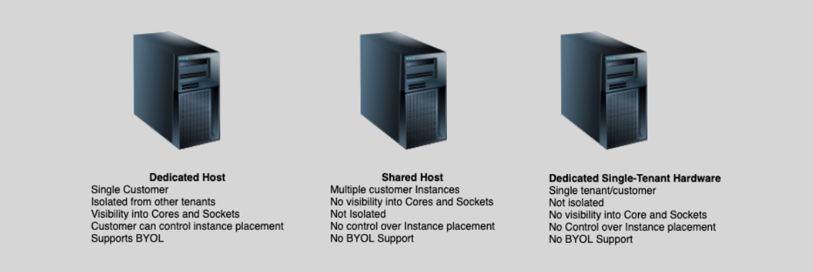

# **Dedicated Hosts** 🆚 **Dedicated Instances**, and **Shared Hosts**

## **Dedicated Hosts 🏗️**

A **Dedicated Host** is a physical server dedicated to running EC2 instances for your exclusive use. It provides full control over the physical hardware and is typically used for compliance, licensing, or security reasons.

### **Key Features:**

- **Full Control Over Hardware**: You have complete visibility and control over the underlying physical server, including CPU, memory, and networking configurations.
- **Single-Tenant**: The server is exclusively used by your account, with no other customers sharing the physical hardware.
- **Visibility and Control**: You get detailed insights into the hardware’s physical characteristics, which is useful for meeting compliance requirements or regulatory needs.
- **BYOL (Bring Your Own License)**: You can use your own software licenses (such as for Windows Server or SQL Server) and apply them to the Dedicated Host.
- **Pricing**: You can choose between **On-demand** (pay-as-you-go) or **Reserved** (commitment for 1-3 years) pricing options.

### **Use Case:**

- **Highly Regulated Workloads**: Needed when compliance regulations or licensing requirements demand physical isolation.
- **Full Control**: If you need to control how your EC2 instances run on specific physical servers, such as for legacy or custom applications.

## **Dedicated Instances 🏠**

**Dedicated Instances** run on **single-tenant hardware** but do not provide the same level of control over the physical server as **Dedicated Hosts**. Dedicated Instances are isolated at the **virtualization** level but share physical hardware with other instances in the same AWS account.

### **Key Features:**

- **Single-Tenant Hardware**: Your instances run on hardware that is dedicated to your account, but the hardware may still be shared with other instances from your account.
- **Isolation**: The instances are isolated from other AWS accounts, but they share physical resources like CPU and memory.
- **Limited Control**: Unlike **Dedicated Hosts**, you don’t have full control over the physical hardware. You cannot specify which physical server the instance runs on.
- **Pricing**: You pay by the hour for Dedicated Instances running on isolated hardware.

### **Use Case:**

- **Compliance and Regulatory Needs**: Useful for scenarios where instances need to be isolated from other accounts but don’t require complete control over the underlying physical server.
- **Dedicated Hardware, Minimal Control**: When isolation is required, but full control over the hardware (as in Dedicated Hosts) is not necessary.

## **Shared Hosts 🖥️**

**Shared Hosts** refer to the regular EC2 instances where multiple AWS customers share the same physical hardware. This is the most common instance type in AWS and is used for workloads that do not require dedicated hardware.

### **Key Features:**

- **Multi-Tenant Hardware**: Multiple customers share the same physical server, and resources like CPU and memory are allocated dynamically among the instances.
- **No Control Over Hardware**: You do not have control over the physical server, and your instances share hardware resources with other AWS customers.
- **Cost-Effective**: Since the physical hardware is shared, the cost is much lower than using Dedicated Hosts or Dedicated Instances.
- **Scalability**: Shared Hosts are highly scalable, and you can easily scale up or down without worrying about physical hardware limitations.

### **Use Case:**

- **General-Purpose Workloads**: Ideal for workloads that do not have stringent compliance needs and can tolerate multi-tenancy, such as **web servers**, **development environments**, or **data processing**.
- **Cost-Efficient**: Suitable for applications that don’t require dedicated hardware, offering the best price-to-performance ratio.

## **Comparison Table:**

| **Feature**                       | **Dedicated Hosts**                               | **Dedicated Instances**                             | **Shared Hosts**                       |
| --------------------------------- | ------------------------------------------------- | --------------------------------------------------- | -------------------------------------- |
| **Isolation**                     | Full isolation (single-tenant hardware)           | Isolation at the virtualization level               | Multi-tenant hardware                  |
| **Control Over Hardware**         | Full control over physical hardware               | Limited control (no hardware control)               | No control over physical hardware      |
| **Cost**                          | More expensive (dedicated hardware)               | Cheaper than Dedicated Hosts                        | Least expensive (shared resources)     |
| **BYOL (Bring Your Own License)** | Yes (full control for licensing)                  | Not supported                                       | Not applicable                         |
| **Use Case**                      | Compliance-heavy workloads, custom configurations | Workloads needing isolation but no physical control | General-purpose workloads              |
| **Pricing**                       | On-demand or Reserved                             | Pay by hour (on-demand)                             | Pay-as-you-go                          |
| **Regulatory Compliance**         | Ideal for regulatory needs                        | Suitable for some compliance needs                  | Not suitable for high compliance needs |

## **Conclusion**

- **Dedicated Hosts** offer the most control, full visibility, and are ideal for compliance-heavy or BYOL scenarios where physical isolation and hardware control are necessary.
- **Dedicated Instances** provide isolation but do not give full control over the physical hardware, making them suitable for regulatory needs without requiring full hardware management.
- **Shared Hosts** are the most cost-effective option and ideal for general-purpose workloads that don’t require dedicated hardware.
